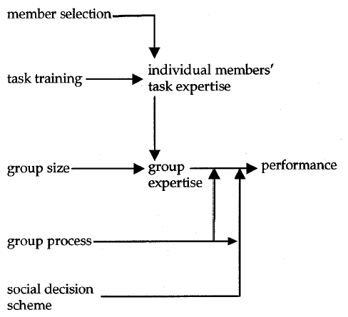

# Empirische SWT
Das experimentelle Vorgehen ist die methodische Grundlage aller Wissenschaften.
#### Falsifikation
* Widerlegung von Hypothesen durch empirische Aussagen.
* Koennen nicht zeigen, dass etwas stimmt, aber widerlegen.

#### Empirie
* griechisch 'Erfahrung'
* auf methodischem Wege (durch systematisch angestellte Beobachtungen, Versuche und Befragungen) gewonnene Erfahrung
* Gegensatz: Logik und Mathematik operieren im konzeptuellen Raum

* Empirische Studien: Unterschiede zw. techniken beobachtbar
* Korrelationsstudien: Zusammenhaenge zw. Variablen
* Vorhersage- und Optimierungsmodelle: Machen Relation praktisch nutzbar (Kostenschaetzung...)
* Experiment: Testet Hypothesen

Platon: Rein geistig, Aristoteles: Praxis auch wichtig

Rolle der Empirie
* Empirie beobachtet/interpretiert Phänomene
* Empirie testet Vorhersagen von Theorien
* Empirie regt neue/verbesserte Theorien an

Rolle der Theorie
* Erklärt Phaenomene
* Sagt Phaenomene vorher
* Formuliert testbare Hypothesen
* Kern der Wissenschaft
* qualitativ oder quantitiv

Methodik: 
1. Experiment
1. Phaenomen
1. Theorie 
1. goto 1

### Softwareforschung, Forschungsmethoden
Technik vs. Theorie vs. Empirie

* Deskriptiv
  * Quantitativ
    * Umfrage
      * subjektive oder objektive Sachverhalte
      * schriftlich oder muendlich
      * Antwort *immer* subjektiv
      * kostenguenstig
      * Kontakt zu Zielgruppe noetig
      * Ergebnisse zu diskutieren
      * Represaentativitaet der Stichprobe
      * Anreize schaffen (Verlosung)
    * Korrelationsstudie
      * ermittelt Wechselbeziehung zwischen zwei oder mehreren Variablen
      * funktionaler Zusammenhang => Kenntnis einer Variable macht andere ermittelbar
      * Bsp: Untersuche OSS-Projektdaten. Vorhersage von Fehleranfaelligkeit?
      * Problem: Verborgene 3. Variablen (Schuhgroesse <-> Gehalt)
    * Ex post facto Studie
      * Variablen nicht beeinflussbar
      * Gruppen bereits nach Variable unterschieden (Geschlecht, Alter...)
      * Auswerten der Verhalten der Gruppenmitglieder
      * Probleme: 3. Variablen und fehlende Randomisierung
      * Bsp. Untersuchung Repositories
    * Langzeit/Querschnitt Studie
      * Langzeit: Verfolge Gruppe von Teilnehmern ueber laengere Zeit
      * Querschnitt: Stichprobe einer Population zu bestimmter Zeit
    * Naturalistische Beobachtung
      * Beobachtung in nat. Umgebung
      * Beobachter darf nicht auffallen wegen moegl. Verhaltensaenderung
      * Vorteil: Hypothesen fuer Laborexperiment aufstellen
      * Nachteil: Langwierig
    * Meta-Studie
      * Studie ueber Studien
      * Nicht nur Zusammenfassung, sondern auch Vergleich und Analyse
      * Bietet Orientierung, verfestigt/ueberprueft "Wissen"
      * Geringer Aufwand
      * Benoetigt vorhandenes Material
      * Kann Studien nicht korrigieren / Luecken fuellen (arbeiten mit dem, was da ist), aber aufdecken
      * Kann weiter Forschung leiten, z.B. Leerraeume aufzeigen
      * Spezialfall Meta-Analyse: Kombiniere Einzelergebnisse => Neuer Effekt?
  * Qualitativ
    * Fallstudie, z.B. Absturzursache Ariane 5, Existenzbeweise
    * Ethnographie, selbst Teil werden. Achtung: Experimentatoreffekt/Assimilation
    * Phaenomenologie, Erlebnis+Interpretation erkennen. Z.B. Tiefeninterview
* Experimentell
  * Laborexperiment
    * Planmäßige Manipulation von unabhängigen Variablen
    * Objektive Beobachtung der abhängigen Variablen
    * Störvariablen werden konstant gehalten
    * Kausalität beobachtbar
    * **Wiederholbarkeit**
  * Feldexperiment: Wiss. Experiment, das in einer realen Umgebung
    * wenn Labor nicht realistisch
    * Menge an Daten nur in Praxis erreichbar
    * Beobachtung ueber langen Zeitraum
    * realistischer Ergebnisse
    * Uebertragbarkeit?
    * Teuer
    * Abhaengigkeit von Management
  * (Quasi Experiment: Nicht alle Stoervariablen unter Kontrolle)
  * Simulation
  
### Interne Validitaet
* **H**istorie
* **I**nstrumentierung
* **R**eihenfolge
* **R**eife
* **S**ubjekt
* **S**elektion
* **S**terblichkeit
* **E**xperimentator

## Experimente
### Nagappan, Murphy, Basilli
|Autor|Titel|Typ|Ort/Context|Aufbau|
|---|---|---|---|---|
|Nagappan, Murphy, Basilli|Influence of Org. Structure on SW Quality|Fallstudie|Microsoft/Vista|2/3 als Trainingsdaten, 1/3 zur Auswertung, 50x Kreuzvalidierung|

|Unabh. Variablen|Abh. Variablen|Ergebnis|Validitaet|sonstiges|
|---|---|---|---|---|
|#of Engineers, #of Ex-Engineers, Edit Freq., Depth of Masater Ownership, %of Org contributing, Level of Org Code Ownership, Overall Org Ownership, Org. Intersection Factor|ist fehleranfaellig?|Praezision: 86.2%, Ausbeute: 84%|Schlecht auf kleinere Projekte/andere Unternehmen uebertragbar|VCS ueber 7 Jahre, 3404 libs, 50mio LOC, 250 Devs|
* Metriken ueberschneidungsfrei?: Analyse ueber Step-wise Regression/Principal Component
* Vorhersagemodell (Logistische Regression)
* **Praezision**: Wie viel von unseren Klassifizierungen stimmt?
* **Ausbeute**: Wie viel vom Ganzen machen unsere korrekt klassifizierten Dinge aus?
*Konkurrierende Metriken:
  * Codefluktuation (churn)
  * Code-Komplexitaet (zyklomatisch, Fan-in, Fan-out)
  * Dependencies: direkt, indirekt, Entfernung zu Hardware/Kernel
  * Testueberdeckung
  * Fehler vor Erstauslieferung
  

### Müller u. Hagner
|Autor|Titel|Typ|Ort/Context|Aufbau|
|---|---|---|---|---|
|Müller u. Hagner|Experiment about Test-first Programming|Feldexperiment|KIT, XP Praktikum|2 Gruppen (Test first vs nicht), jUnit, rand. Zuordnung, Akzeptanztest zur QA, Abschlusstest mit Goldstandard|

|Unabh. Variablen|Abh. Variablen|Ergebnis|Validitaet|sonstiges|
|---|---|---|---|---|
|Testtechnik|Entwicklungsdauer und Programmkorrektheit|Zeit: Gleich, Korrekt vor QA: Control Group signifikant besser, nach QA: Test-firs leicht besser|Studenten, neue Technik XP, keine Ueberpruefung, ob Test-First korrekt benutzt, Enge Aufgabenstellung, wenige Teilnehmer|20 Akzeptanztestfaelle, Zufallstest: randomisierter Graph, 720k Ops, 7.5m Asserts|

* Test-first verleitet zu falscher Sicherheit

### Knight & Leveson
|Autor|Titel|Typ|Ort/Context|Aufbau|
|---|---|---|---|---|
|Knight & Leveson|Exp. Eval of the assumption of independence in multi-version progr.|(Falsifikations)Experiment|University of Virginia, University of California at Irvine, 1984|Anti-missile System, 15 vorgegebene Tests, 200-Mindestqualitaets-Tests, Gold-Standard Test|

|Unabh. Variablen|Abh. Variablen|Ergebnis|Validitaet|sonstiges|
|---|---|---|---|---|
||Reading time, design time, debug time, (common) Test-Fehler|Programm-Fehleranfaelligkeit: 98%. Wahrscheinlichkeit Mehrfachversager: 0.012%.  Trotzdem Haeufung von Mehrfachversagern|Sehr gute Spezifikation|27 Versionen, 99/9% zuverlaessig, 100 random Akzeptanztests, 1m random Tests (sehr hardware-fordernd damals!), 14 BA, 8 MA, 4 Doktor Studenten (nicht zwangslaeufig Informatik)|

* Programmierer machen an gleichen Stellen Fehler
* Verifikation ist 2-Versions Programmierung
* Mit Redundanz immer noch besser als ohne

### Molokken, Jorgensen
|Autor|Titel|Typ|Ort/Context|Aufbau|
|---|---|---|---|---|
|Molokken, Jorgensen|Survey on SW Estimation in Norwegian Industry|Umfrage|Norwegen, Kostenschaetzung|30-70min strukturierte Interviews, aufgezeichnet, nachtr. ausgewertet|

|Unabh. Variablen|Abh. Variablen|Ergebnis|Validitaet|sonstiges|
|---|---|---|---|---|
|Schaetzmethode|Schaetzpraezision, Abweichungsgroesse|Expertenschaetzung dominant, Stand wie vor 20 Jahren|Valide|18 Firmen, 52 Projekte, zw. 180-14000h (avg 3124h)|

* Projektleiter ueberschaetzen Genauigkeit: geschaetzt 45% im Rahmen, real: 10%
* Wenn Kostenerhoehung 25% noch akzeptabel => 43% akzeptabel

### Zimmermann, Nagappan
|Autor|Titel|Typ|Ort/Context|Aufbau|
|---|---|---|---|---|
|Zimmermann, Nagappan|Cross-project Defect Prediction|Microsoft (Netherlands)|Ex-Post-Facto Studie|Regressionsmodell erstellen, Welch t-Test|

|Unabh. Variablen|Abh. Variablen|Ergebnis|Validitaet|sonstiges|
|---|---|---|---|---|
|Project Characteristics: LOC, Team size, open vs. closed, local vs. distributed, C vs. CPP, Tools, desktop vs mobile|Defekt-Vorhersage-Übereinstimmung|Firefox -> IE: 76% Precision, 81% Recall, umgekehrt 4.1% Recall, nur 3.4% aller 622 Projektpaare gut. Projektcharacteristiken keine guten Vorhersager|Nicht ohne weiteres übertragbar|40 Characteristics, 28 Projekte|

* Varianzen nicht gleich => Welch t-Test
* Bonferroni: Tabelle UP|DOWN|-: Characteristik verbessert oder verschlechtert Regressionsmodell
* Entscheidungsbaum: Wähle Projekt nach Kriterien zum Vergleich

### Nagappan
|Autor|Titel|Typ|Ort/Context|Aufbau|
|---|---|---|---|---|
|Nagappan|Mining Metrics to Predict Component Failures|Ex-Post-Facto|Microsoft, Fehlerdatenbanken minen|Randomisierte Projektnamen A,B,C..., Vorhersager bauen mit Principal Component Analysis|

|Unabh. Variablen|Abh. Variablen|Ergebnis|Validitaet|sonstiges|
|---|---|---|---|---|
|Code-Metriken|Post-Release Defekte|Korrelation da, aber nicht 1 für alle Projekte|Nur Microsoft|5 Projekte, >1m LOC|
* Projekte
  * Internet Explorer 6
  * IIS Server
  * Windows Process Messaging
  * DirectX
  * NetMeeting
* Metriken, u.a.
  * LOC
  * Globale Variablen
  * Fan-In/Fan-Out
  * #Classes
  * #BLocks
  * Zyklomatische Komplexitaet
* Nur relevant, wenn man zu selbem Projekt Historie auswertet für zukünftige Voraussagen 

### Sobel
|Autor|Titel|Typ|Ort/Context|Aufbau|
|---|---|---|---|---|
|Sobel|Formal Methods Application|Quasi-Laborexperiment|Uni Ohio, Uni Miami|2 Gruppen Formal, nicht-Formal, Vortest, Projekt|

|Unabh. Variablen|Abh. Variablen|Ergebnis|Validitaet|sonstiges|
|---|---|---|---|---|
|Formale Methoden?|Correctness, Concisenex, Complexity|Nicht statistsisch signifikant, "Better Correctness", "complex problem solving skills"|Nein|Fehlerhafter Projektaufbau, Nachtest mit motivierten Formale-Methoden Studis, 6 manuell Testfaelle, Programme avg. 130 Zeilen|

* Vortest (ACT) => Gleiche Gruppenstaerke
* Aufzugssystem nur manuell getestet, unzureichend spezifiziert
* Programmqualität auch manuell festgestellt (Experimentatoreffekt)
* Testgruppe hat Treatment, Control Group nicht
* Probanden haben Treatment freiwillig ("self-selected", höhere Motivation)
* C++
* 13 Kontrollteams
  * Code musste nicht abgegeben werden (9 von 13)
* 6 nutzen Formale Methoden
  * 100% korrekt vs 5/11 bei nicht-formalen-Methoden
* Keine Acceptance Tests
* \[Formal Group\] formed a fraternal bond
* Eine klare Hypothese ist nicht formuliert worden.

Probleme
* Experimentatoreffekt
* Subjekteffekt

#### Hawthorne-Effekt
Anderes Verhalten im Experiment
#### Neuigkeitseffekt
Anderes Verhalten bei Neuem/Ungewöhnlichem

### Pfleeger & Hatton
|Autor|Titel|Typ|Ort/Context|Aufbau|
|---|---|---|---|---|
|Pfleeger & Hatton|Investigating the Influence of Formal Methods|Fallstudie|1990 -1992, Flugsicherungs-Informationssystem CDIS|3000 Defekte während Entwicklung und 147 nach Auslieferung|

|Unabh. Variablen|Abh. Variablen|Ergebnis|Validitaet|sonstiges|
|---|---|---|---|---|
|Verwendetes Entwurfsverfahren (Formal or not)|Wie viele Moduländerungen pro Fehler|Formale Methoden (mit anderen Techniken kombiniert) führen zu weniger Defects/KLOC. Einzeln fraglich|Ja, weil industrielles Umfeld|200.000 LOC|

* Verschiedene Spezifikationsmethoden:
  * Entity-Relationship Modelle
  * strukturierte Analyse: Pseudocode füë UI, 4 Devs
  * VDM: 10 Devs
  * VDM+CCS: 2 Devs
  * FSM: Nebenläufigkeit, 1 Dev
* 

### Müller, Typke, Hagner
|Autor|Titel|Typ|Ort/Context|Aufbau|
|---|---|---|---|---|
|Müller, Typke, Hagner|2 Controlled Experiments Concerning Usefulness of Assertions|Laborexperiment|1999/2000, Diplomstudenten, Personal Software process|Training, Gegenbalancierter Experimententwurf, wenige Daten, nicht normalverteilt => Wilcoxon Rangsumme, 2 Gruppen|

|Unabh. Variablen|Abh. Variablen|Ergebnis|Validitaet|sonstiges|
|---|---|---|---|---|
|Assertions oder nicht|Zuverlässigkeit, Programmieraufwand (Time), Wiederverwendung|Mehr Zeit, nicht sign., Code reuse tend. höher, nicht sign, tend. zuverlässiger, nicht sign.||22 Stduenten, 9 C, 13 Java|
* APP (Annotation Preprocessor)
* jContract
* Aufgaben Exp1:
  * Kettenregel
  * String Funktionen
* Aufgabe Exp2
  * "GraphBase", randomisierte Tests über Goldstandard
* Phasen:
  1. Web Course
  1. Implementation
  1. Correction
* Geringe Güte (41%, 52%)
* Exp1: 2 Faktoriell, Exp2: 1 Faktor, Inter Subjekt

### Porter, Siy
|Autor|Titel|Typ|Ort/Context|Aufbau|
|---|---|---|---|---|
|Porter, Siy|Cost-Benefits of Code Inspections in Large Scale Software Development|(Langzeit) Feldexperiment|Lucent Technologies (Bell), reales Softwareprojekt, 1994/1995|Inspektionsstruktur faktoriell|

|Unabh. Variablen|Abh. Variablen|Ergebnis|Validitaet|sonstiges|
|---|---|---|---|---|
|Inspektoren, Sessions, direkte Reparatur|Effektivität, Gesamtdauer, Kosten|Aufwand: Kein Einfluss, Effektivität: 1p schlecht, 2p so gut wie 4p, mehrere Durchgänge bringen nichts, Reparatur zw. Durchgängen bringt nichts||s.u.|

* Projekt: Übersetzer bauen
* 55 KLOC neuer Code
* 6+11 Entwickler
  * 5 Jahre bei Lucent
  * Vergleichbare Erfahrung
* Gruppierung: 1s1pR: 1 Session 1 Person Repair oder non Repair
* Terminplanungen
* 88 Inspektionen
* Teuere Inspektionstypen konnten nicht bis zum Ende gemacht werden
* Messe Effektivität über Fehler gefunden/geschätzet Anzahl gesamt
* 1sX4p ist Standard bei Lucent
* Lesetechnik frei wählbar
* Inspektion über etwa 300 Zeilen
* Inspektionen werden beantragt, Experimentator wählt zufällig
* Durchführung:
  * Inspektoren untersuchen den Code
  * Gruppensitzung (vom Autor organisiert)
  * Autor klassifiziert und behebt die Defekte
  * IQE spricht mit dem Autor die Defektliste durch (wenn nötig)
  * IQE wertet alle Inspektionsformulare aus
* im Schnitt waren nur ein Fünftel der gesammelten Schwachpunkte echte Defekte, nur Defekte werden berücksichtigt
* Lesetechniken nicht kontrolliert

### Laitenberger und DeBaud
#### Lesetechniken (12):
* Ad-Hoc
* Prueflisten
  * Hoechtens 1 Seite
  * Praezise Fragen
  * Typische Defekte
  * Nachteil: Nicht alle Arten von Defekten abgedeckt
* Perspective-Based Reading
  * Geringe Ueberlappung zwischen Inspektoren
  
|Autor|Titel|Typ|Ort/Context|Aufbau|
|---|---|---|---|---|
|Laitenberger und DeBaud|Perspective-based Reading of Code Documents at Bosch|Feldexperiment|1997, Fraunhofer IESE, C als Sprache|Baue 10-15 **reale** Defekte in 200-300 LOC ein, Faktoriell: Dokumenttyp (generisch vs Bosch), Perspektive (3x) => 2x3, jeder macht alle 6, zufaellige Nummerierung der Subjekte|

|Unabh. Variablen|Abh. Variablen|Ergebnis|Validitaet|sonstiges|
|---|---|---|---|---|
|Perspektive, Dokumenttyp - spaeter auch C- und Domaenen-Erfahrung|Erkennungsrate|Rollen aehnlich gut, Meeting besser als einzelne => geringe Rollen-Ueberlappung, Gruppensitzung nicht notwendig (+6%)|Extern: gut|11 prof. Devs, avg. 19 Monate Erfahrung (verzerrt: Ausreisser 10 Jahre)|
* Perspektiven:
  * Analytiker
  * Modultester
    * Arbeitet auf Control Flow Graph
  * Integrationstester
* Ablauf
  * Tag 1: 
    * Schulung
    * Generische Dokumente je 2h alleine
    * Gruppensitzung
  * Tag 2:
    * Bosch Dokumente
    * Gruppensitzung
    * Fragebogen
* Probleme
  * Sterblichkeit: Urspruenglich 15 Teilnehmer
  * Reifung: Ganztaegig
  * Historie: 1 Tag Pause zwischendrin
  * Wenige Datenpunkte
  
<!--  -->

### Laitenberger, El Emam und Harbich
|Autor|Titel|Typ|Ort/Context|Aufbau|
|---|---|---|---|---|
|Laitenberger, El Emam und Harbich|Internally Replicated Quasi-Experimental Comparison of Checklist and PBR|Quasi-Feldexperiment|1998, Bosch, Fraunhofer IESE|6 Bosch-Dokumente (400-900LOC), 8-16 eingebaute Fehler, 3x mit 20 Teilnehmern: 2 Gruppen, 5 Teams/Gruppe, 2 Personen/Inspektion => 2x2 faktoriell weil gegenbalanciert. Fragebogen|

|Unabh. Variablen|Abh. Variablen|Ergebnis|Validitaet|sonstiges|
|---|---|---|---|---|
|Checkliste vs PBR|Effectiveness, Zeit fuer Suche => Kosten/Defekt|alpha = 0.1: PBR effektiver, PBR guenstiger. PBR erhoeht Codeverstaendnis|Intern: Nicht echt-random, Extern: echter Code, nur Bosch, keine Vorkenntnisse, echte Devs|60 Devs, C, avg "rather experienced"|
* Rollen
  * Merge Tester aus vorherigem Experiment; minimale Teamgroesse nach Porter
  * => Analytiker + Tester
* Prueflisten
  * 27 Fragen
  * Generische C Fragen
* Jeder macht alles, aber Gegenbalanciert (erst Checklist, dann PBR und umgekehrt)
* Gruppenzuweisung nach Terminkalender (=> Quasi-Experiment)
* 6 Tage: 3 Tage pro 10er Gruppe  
  
* Statistische Analyse:
  * keine Uebertragungseffekte nachweisbar => Datenpunkte koennen getrennt analysisert werden
  * t-Test fuer jeden Durchlauf
  * Homogenitaetstest fuer jeden Durchlauf => Homogen => Kombiniere alle Punkte
* Regel: Vorgehen mit Anleitung (praeskriptiv) weniger Reihenfolge-anfaellig als ohne Arbeitsvorschrift

### Chong, Hurlbutt
|Autor|Titel|Typ|Ort/Context|Aufbau|
|---|---|---|---|---|
|Chong, Hurlbutt|Social Dynamics of Pair Programming|Nat./Ethno. Studie|San Fran, Startups (2-4 Jahre)|Beobachtet (Aufnahme) und analysiert|

|Unabh. Variablen|Abh. Variablen|Ergebnis|Validitaet|sonstiges|
|---|---|---|---|---|
|1 Startup Driver/Navigator, das andere shared control. B wechselt Teams täglich. Erfahrungsunterschied in Paar|Eingebundenheit (Zeit zw. Control-Wechseln)|Forschungsfrage: Driver/Navigator besser als synchrone Paare?|%|Weekly 2005-2006, 1.5-3h. 6-9 Devs vs 9-10 Devs|
* Move beyond Driver/Navigator
* Help Devs stay focused/engaged
* Consider different Dev experiences/knowledge
* Avoid pair rotation late in task

### Müller
|Autor|Titel|Typ|Ort/Context|Aufbau|
|---|---|---|---|---|
|Müller|Are Reviews an Alternative to Pair Programming?|2004, KIT, XP-Praktikum, Java|Einführung PP/Reviews, Schiebepuzzle+Nullstellen|Gegenbalanciert+Intra-Subjekt, Skill-Matching (-> Vortest). 1. Impl (ohne execution) 2. Review 3. QA mit Acceptance-Test|

|Unabh. Variablen|Abh. Variablen|Ergebnis|Validitaet|sonstiges|
|---|---|---|---|---|
|Technik: Pair Programming vs Review|Kosten, Korrektheit|PP tendenziell besser als Rev bei Korrektheit, aber nicht signifikant. Paare 7% teurer bei gleicher Korrektheit (nicht sign. Ergebnisse)|Sterblichkeit (3/20), 2*Reifung: Als Reviewer von anderem gelernt|20 Studenten, 6.5 Jahre Prog. Exp. Randomisierte Tests (Goldstandard)|
* Review = Durchsicht
* vs. Inspektion: Vorbereitungsphase (nicht praeskriptiv: Inspektionen haben Arbeitsvorscriften)
* Vorteile PP:
  * Kürzere Entwicklungszeiten
  * Höhere Produktqualität
  * Lernen während der Arbeit
  * Bessere Lösungen
* H0 so gewählt, dass "PP ist *nicht* besser als Reviews"
* 81% Güte t-Test
* Aber Wilcoxon Test: Daher Güte 70%

### Arisholm, Gallis, Dyba
|Autor|Titel|Typ|Ort/Context|Aufbau|
|---|---|---|---|---|
|Arisholm, Gallis, Dyba|Pair Programming with Respect to System Complexity and Programmer Expertise|Laborexperiment|Norwegen, 2004/2005, Java Consultants, Büro oder Labor|2x2x3 Faktoriell. Individual Training, Ind. Pretest (ATM), Tasks 2-5: Coffee Machine, 5: Time Sink|

|Unabh. Variablen|Abh. Variablen|Ergebnis|Validitaet|sonstiges|
|---|---|---|---|---|
|Pair Programming, System-Complexity, Expertise|Duration: Task 2-4, Effort: Person Minutes, Correctness: Binäre Functional Correctness, Abweichung expected output|Für Juniors bringt PP viel: 74% bessere Correctness. Sonst: 84% mehr Effort, 7% mehr Correctness. Komplexität ist starker Einflussfaktor bzgl. PP/EP|Selektion: Wenige echte Juniors. Nonrandomized: Wie buchbar. Correctness: Wurde manuell ermittelt. Störvariable IDE nicht vorgegeben. Incorrekte Datenpunkte entfernt (mehr EP als PP)|300 Devs!!!|
* 2 Phasen: Einzelprogrammierer
* Phasen nicht direkt vergleichbar: Viel Zeit vergangen, andere Programmierer-Kompetenzen
  * Analysis of Covariance: ANCOVA
* Driver/Navigator (single Keyboard), allerdings nicht enforced: Effizienz im Vordergrund
* Am Anfang: Nur 5h bezahlt. Wenn nicht fertig: Bezahlt für max 8h.
* Validität:
  * Kleine Aufgaben
  * Nur Wartungsaufgaben
  * Komplexität selbst ermittelt
  * PP-Teams nur homogen  
  

#### Construct Validity
* gewünschte Sachverhalte mit geeigneten Indikatoren erschlossen

### Systematic Literature Review
|Autor|Titel|Typ|Ort/Context|
|---|---|---|---|---|
|Kitchenham|Guidelines for Performing Systematic Literature Reviews|Guide||

* Motivation
  * Kein Bias
  * Nachvollziehbar
  * Aber aufwändiger
* Vorgehen:
  * Planung
    * identifizieren
    * Welches Thema?
    * Welche Quellen?
    * Wie wird gefiltert?
    * Standardisierte Schlüsselworte
  * Durchführung
    * bewerten
    * Verwerfen von schlechten Papern
  * Reporten
    * interpretieren
* Gründe
  * Zusammenfassen
  * Lücken aufdecken
  * Neue Forschungsrichtungen erarbeiten
  * Neue Theorien bilden
  

|Autor|Titel|Typ|Ort/Context|Aufbau|
|---|---|---|---|---|
|Jorgensen, Sheppard|Systematic Review of Software Development Cost Estimation Studies|Meta-Studie|Cost-Estimation, 2005|nur Journals, Vortest mit 30 Papern|

|Unabh. Variablen|Abh. Variablen|Ergebnis|Validitaet|sonstiges|
|---|---|---|---|---|
|304 Paper, 76 Zeitschriften, Google Scholar|Themen, Schätzmethoden, Forschungsmethoden|Top-10 enthalten 2/3, Scholar: 30%, Inspec: 60%, G+I: 70%, manuell: 100%|

* Paper sollen standardisierte Schlüsselworte nutzen
* Eval immer noch mit Kostenschätzer von vor 20 Jahren
* Wenige Studien "im Feld"

### Dzidek, Arisholm, Briand (UML)
|Autor|Titel|Typ|Ort/Context|Aufbau|
|---|---|---|---|---|
|Dzidek, Arisholm, Briand|A Realistic Empirical Evaluation of the Costs and Benefits of UML in Software Maintenance|Laborexperiment|Norwegen, Consultants|Wartungsaufgaben mit Teilaufgaben (Teilaufgaben Akzeptanztest), Inter-Subjekt (10 UML, 10 nicht), Akzeptanztest (Experimentator)|

|Unabh. Variablen|Abh. Variablen|Ergebnis|Validitaet|sonstiges|
|---|---|---|---|---|
|Technik: UML vs nicht|Änderungszeit, Zeit+UML Update, Anzahl Abgaben, Entwurfsqualität|UML ohne Update unbedeutend schneller (1.4%), sonst 14% langsamer. Korrektheit signifikant besser. Entwurfsqualität besser|Prof Devs, Zeit für QA nicht erfasst, Falsche Abgaben unnötig gezählt (manche geben einfahch mehr ab). Nur Wartung.|20 Consultants, 5 Aufgaben, 1-2 Wochen, kein Zeitlimit, BESTWeb System: 6 Packages, 50 Klassen, 2900 LOC, Vererbungstiefe 3|

* Abhängige Variablen
  * `T`: Zeit für Änderung ohne UML Anpassung
  * `T'`: Änderung + UML Anpassung
  * `C`: Abgegebene Lösungen mit Fehlern
  * `C'`: Abgaben, die Sachen kaputt gemacht haben
  * `C''`: Abgaben mit Fehlern wegen fehlendem Gesamtsystemwissen
  * `Q`: Entwurfsqualität
* UML:
  * Klassendiagramme (pro Paket)
  * Anwendungsfälle (Sequenzdiagramm)
  * Zustandsdiagramme
* Acceptance:
  * Duplication
  * Code an falscher Stelle
  * Code unnötig verteilt
  * Try/Catch für anderes außer Fehler

## Statistik

### Skalen
* Nominal: Keine (Zahlen)Reihenfolge sondern Merkmale wie Groesse, Religion, Geschlecht
* Ordinal: Rangordnung, aber Abstaende nicht Quantifizierbar (z.B. Gueteklassen)
* Intervall: Abstaende vorhanden, aber absoluter Nullpunkt willkuerlich (keine Quotientenbildung). Bsp: Temperatur 
* Verhaeltnisskala: Abs. Nullpunkt vorhanden. Bsp: Koerpergroesse, Alter...

### Korrelation
* Allgemein: stochastische Abhängigkeit zw. 2 Zufallsvariablen
* Korrelationsanalyse
* Erwartungswert E(x)

* Pearsons Korrelationskoeffizient  
    
(unabh. wenn 0)
* Pearsons 2. Korrelationskoeffizient  
    
  "empirischer Korrelationskoeffizient", Schaetzung fuer `r`
* "BLUE" Eigenschaft (Best Linear Unbiased Estimator)
* Spearman ???

### Regression
Wichtige Annahmen:
* `en` ist normalverteilt
* Erwartungswert `E(en) = 0`
* `Var(en) = sigma^2`
* `cov(em,en) = 0` wenn m != n

"Kleinste Quadrate" Methode
* yi = b0 + b1*xi  
    
  
#### Mehrdimensionale Regression
* Variablenselektion: Zu viele Vars sind schlecht

#### Lineare logistische Regression
* Binäre Messwerte/abh. Variablen
* Mappe Ergebnisse auf Wahrscheinlichkeiten, um von diskret auf kontinuierlich zu kommen
* P(Y = 1) / (1 - P(Y=1)) => logit(p) = ln(p/1-p) = b0 + b1 * X = z

  
* e^bi < 1: negativer Zusammenhang
* e^bi > 1: positiver Zusammenhang

### Schaetzverfahren
Punkteschätzung: Stichprobe -> ein einziger Schätzwert  
Intervallschätzung: Stichprobe -> Konfidenzintervall  
Allgemein:
* Erwartungstreue: Erwartungswert stimmt mit Parameter ueberein
* Effizienz: Varianz ist am kleinsten
* Konsistenz: Je groesser Stichprobe, desto besser die Schaetzung
* Suffizienz: Alle Infos werden benutzt

### Tests
Hypothesen:
* Parameterhypothesen:
  * unbekannte Parameter einer Grundgesamtheit
  * => Parametertests
* Verteilungshypothesen:
  * unbekannte Verteilungsform einer Grundgesamtheit
  * => Verteilungstests
* Forschungshypothese: Was in Experiment ueberprueft werden soll
* Nullhypothese H0: Gegen was getestet wird, üblicherweise das Gegenteil der Forschungshypothese
* Alternativhypothese HA: Hyp., die akzeptiert wird wenn H0 verworfen wird

Vokabular:
* Signifikanzniveau alpha: Wahrscheinlichkeit, mit der H0 verworfen wird obwohl wahr
* Ablehnungsbereich: Ergebnisbereich der zur Ablehnung von H0 führt
* Annahmebereich: H0 wird nicht zur Abgelehnt
* Kritischer Wert c: Trennwert Annahmebereich -> Ablehnungsbereich
* Einseitiger Test
* Zweiseitiger Test (rechts-, linksseitig)

Testverfahren:
1. Aufstellung H0, HA, Signifikanzniveau
1. Feststellung geeignete Prüfgröße, Bestimmung Testverteilung falls H0 gueltig
1. Bestimmung des kritischen Bereichs (Ablehnungsbreich für H0)
1. Berechnung des Wertes der Prüfgröße (sog. Teststatistik)
1. Entscheidung und Interpretation

Fehlerarten:
1. Art: H0 abgelehnt, obwohl wahr
1. Art: H0 beibehalten, obwohl falsch

#### t-Test
* T = (X_ - u0) / S * sqrt(n)
* u0: Erwarteter Mittelwert
* X_: Stichprobenmittelwert
* S: Stichprobenstandardabweichung
* n: Stichprobengroesse
* sigma: Standardabweichung
* Braucht Normalverteilung

#### Wilcoxon-Rangsummen Test (Mann-Whitney-U Test)
* Ordinales Messniveau: Beobachtungen müssen sortiert werden können
1. Kombiniere Stichproben x (Größe m), y (Größe n) (Control Group, Testgruppe)
1. Sortieren
1. Ränge vergeben
1. Ränge der kleineren Stichprobe addieren => Rangsumme W_s (s = n + m)

* `R`: Whitney-U-Test, aber W_s = U + m*(m+1)/2

### Güteanalyse
* Effektgröße ES: (u_x - u_y) / sigma
* Cohens Konvention: klein 0.2, mittel 0.5, groß 0.8
* Overpowered: Jegliche (kleine?) Effekte messbar, aber auch gewünschter Effekt?

1. Signifikanzniveau alpha
1. Güte 1-beta
1. Effektgröße ES
1. Stichprobengröße n

Jedes durch anderes ausdrückbar

#### Vorgehen
* Pilotstudie
* Power-t-Test
  * delta: u_0 - u_1
  * power = Güte
  * alternative: two.sided
  * sig.level: alpha
  * sd: Standardabweichung
  * n

Nach Auswertung:
1. H0 abgelehnt: Keine Betrachtung der Güte
1. H0 beibehalten
  * War Effekt nicht vorhanden oder zu klein?
  * Güte zu gering?

Wilcoxon braucht für selbe Güte mehr Datenpunkte (1/0.864)

## Experimentplanung
* Forschungsfrage
* Randomisierung
* Angleichung (Matching)
  * wenn Randomisierung zu insensitiv
* Generalisierbarkeit
* Störvariablen kontrollieren

### Experimentklassen
* **Inter-Subjekt-Experiment** mit Nachtest
  * Versuchs- und Kontrollgruppe
* **Faktorielles Experiment**
  * Bei mehreren unabh. Variablen
  * Verschiedene Reihenfolgen der Tests
  * wegen Interaktionseffekten
* **Intra-Subjekt-Experiment** mit Nachtest
  * Alle Teilnehmer machen alle Tests
  * Gut: ALle Störvariablen konstant
  * Schlecht: Reihenfolge-Effekt
  * Daher: Kombiniere mit Faktoriellem Design 
* **Gegenbalanciertes Experiment**
  * Man hat **Behandlungen**, die evtl. zu Reihenfolge-Effekten führen
  * Überprüfe Reihenfolgeeffekt durch Reihenfolge-Tausch
* **Quasi-Experiment**
  * Gefährdungen: Selektion, Historie, Reifung

### Theorie von Sauer

Eingriffe haben nur positiven Effekt, wenn vorher nicht optimal
#### Forschunsfragen
* Wie muss Training aussehen?
* Defektklassifiezierung durch Expertenpaar statt Gruppensitzung?
* Warum manche Defekte nur in Gruppensitzung?
* Wie viele Inspektoren nötig?
