# Sprachverarbeitung in der SWT
Foliensatz 2015/2016
## Rechnerlinguistik
* Anwendung von Theorien und Modellen über Sprache
* untersucht Sprache mithilfe von Algorithmen
* Bereiche
  * Phonetik
  * Syntax
  * Semantik
  * Pragmatik
  
### Ziele allgemein
* Fehlerkorrektur
* Spracherkennung und -steuerung
* Sprachsynthese
* Übersetzung
* Faktensuche in Dokumenten
* Bewertung von Texten
* Rechercheunterstuetzung
* Marketinganalysen (allgemein: Freitext-Datamining)

* Problemstellungen
  * Word Sense Disambiguation (WSD)
  * Information Extraction (IE)
  * Word Similarity (WS)

### Ziele SWT
* Anforderungsdokumente
* Dokumentation
* Code-Comments
* Fehlermeldungen
* Nutzerbewertungen

### Grundlagenforschung
* Sprache und Kommunikation beschreiben
* Sprechen und Verstehen auf Computern nachbilden
* Theorien und Modellen menschlichen Sprachverhaltens
* Über Wörter
* Über Sätze

## Historie
* 1957-1970: 2 Lager
  * Symbolisches Paradigma
  * Stochastisches Paradigma
* 1970-1983
  * Stochastisches Paradigma
  * Stochastisches Paradigma
  * Natural Language Understanding
  * Diskursmodellierung
* 1983-1993
  * Endliche Automaten
  * Probabilistische Modelle
  * Datengetriebene Ansaetze
* 1994-2008
  * Kommerzialisierbarkeit durch schnelle Computer
  * Maschinelles Lernen (brauchen teuer Korpora)

## Korpora
Typen:
* Sprachkorpora
* Text- und Diskurskorpora

## Hintergründe zum Zerteilen und Etikettieren
### Tagging
* Tokens kleinste Einheit
* `tag set` alle vorgesehenen Tags
* Part of Speech (POS)
  * Det (Artikel)
  * NN (Nomen, S singular, P plural)
  * Adj (Adjektiv)
  * Prp (Praeposition)
  * V (Verb)
  * CC (Konjunktion)
* Ergebnisse aus linguistischer Analyse "abspeichern"
* Strategien:
  * Lexikon
  * morphologischer Analyse (-ung ist Nomen...)
  * syntaktische Struktur (kleines Window/Frame reicht)
  * Brill-Tagging
    * Hidden-Markov-Modell
    * 94-97% Genauigkeit, 90% bei naiv
    * Phase 1: Initialisierung mit Startmarkierungen
    * Phase 2: Training. Fehler zaehlen, daraus neue Regeln, "beste Regel" anwenden/speichern
    * So lange, bis Verbesserung > Schellwert
    * `prev(1or2or3)Tag`, `next(1or2or3)Tag`, `sourroundTag`, `prev/nextBigram`, `prev/nextWord`
* Guete
  * Paezision, Ausbeute
  * Genauigkeit: (wahr korrekt + falsch korrekt) / alle
  * Harmonisches Mittel (Fbeta Mass): (1+beta^2) Precision*Recall/(Precision+Recall), haeufig beta=1
* Menschen 3000 Woerter/h
* Stanford log-linear Tagger: 15000 Woerter/s
* Tagger am Anfang: Fehler pflanzen sich nach spaeter fort

### Grammatiken/Zerteilen (Parsen)
#### Treebank
Parsebaum zu Text (z.B. Penn Treebank): Braucht keine Grammatik weil ggf. manuell erstellt

#### Syntaxbaum vs. Abhaengigkeitsbaeume
1. Syntaxtree **ueber** Satz. Reihenfolge bleibt, Verschachtelung
  * Knoten sind Konstituenten
1. Abhaengigkeitsbaum: Woerter = Knoten, Kanten = Beziehungen
  * naeher an der Semantik
  * aehnlicher Inhalt => aehnlicher Baum
  * kodieren Praedikat-Argument Strukturen
  
Grammatiken *kontextfrei* (CFG)

### Zerteilen
* Bootom-up vs Top-down
* Backtracking

#### Left corner parsing
* Beginne mit einem top-down-Schritt
* Wende bottom-up und top-down-Vorgehen abwechselnd an
* Wähle beim left-corner-Schritt (dem ehemalige bottom-up-Schritt) die Regel aus, deren linke Ecke auf das zuletzt erkannte Symbol passt

#### Cocke-Younger-Kasami (CYK)
* Chomsky Normalform

#### Probabilistische Grammatiken
* Nutze CYK mit Wahrscheinlichkeiten an Regeln
* Maximiere Wahrscheinlichkeit ueber gesamten Baum

## Ontologien
* shared conceptualization: Wissen ueber Gegenstandsbereich
* alles explizit
* Domaene fast immer eingeschraenkt
* Mache implizites Wisse von Menschen fuer Systeme nutzbar
* Lexikonbasierte Ontologien

### Wissensarten
* Deklaratives Wissen
  * Faktenwissen (propositional)
    * Paris ist die Hauptstadt von Frankreich
  * Faktenwissen (als „Bild“, als „Film“, ...)
  * Wissen über den situativen Kontext
    * Wer ist Sprecher, wer ist Hörer? Wo?
  * Wissen über Regeln
    * Wenn man eine Telefonnummer nicht weiß, kann man die Auskunft anrufen
* Prozedurales Wissen
  * Wissen über die Anwendung von Regelwissen
    * Beachten von Verkehrsregeln im Straßenverkehr
  * Implizites Wissen über das Ausführen von Handlungen
    * Wie man mit dem Fahrrad fährt
* Explizit vs implizit

#### ResearchCyc
* 500,000+ concepts
* 5,000,000 assertions
* 26,000+ relations

#### Bestandteile
* Konzepte
* Instanzen 
* Relationen Tier <- Katze
* Partitionen [Mann|Frau], disjunkt mit `d`, erschöpfend (muss sein)

## Relationsextraktion | Aufbau von Ontologien
* Informationsextraktion (IE) = segmentieren + klassifizieren + verbinden + zusammenfassen
* Maschinenlesbare Zusammenfassung von Texten
* Named Entity Recognition, NER

### Hearst Pattern
* `NPx and other NPy` => NPx `is a` NPy
* Praezision ~55-60%

### Supervised  IE
1. Identifiziere Named Entities
1. Entscheide, ob 2 Benennungen Beziehung haben
1. Falls ja => Relation

#### Automatic Content Extraction (ACE) 2008
* NIST
  * User-Owner-Inventor-Manufacturer
  * Citizen-Resident-Religion-Ethnicity
  * Org-Location-Origin
  * Employment
  * Owner
  * Founder, Membership, Sports-Affiliation, Shareholder
  * Geo
  * Subsidiary
  * Business
  * Family
  * Lasting
  * Located
  * Total precision: 76%, recall: 42%

### Bootstrapping
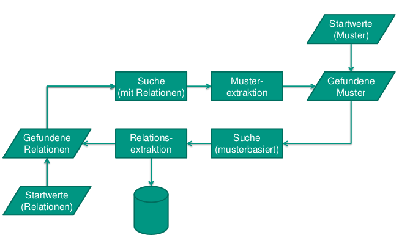
* Startwerte benoetigt
* Startwerte beeinflussen Qualitaet
* Praezision nicht besonders hoch

### Unueberwachte Methoden
#### KnowItAll
* Eingabe: Praedikat, Klassen-Markierungen, Relations-Markierungen
* Bilde Hearst-Muster aus Markierungen
* PMI-basierter Klassifizierer
  * PMI(Instance, Discriminator) = |Hits(D+I)|/|Hits(I)|
  
#### Naïve-Bayes-Klassifizierer
* Wahrscheinlichkeitsbasierte Zuordnung eines Objektes zu einer Klasse
* Satz von Bayes: P(B|A) = P(A|B)*(PB)/P(A)  
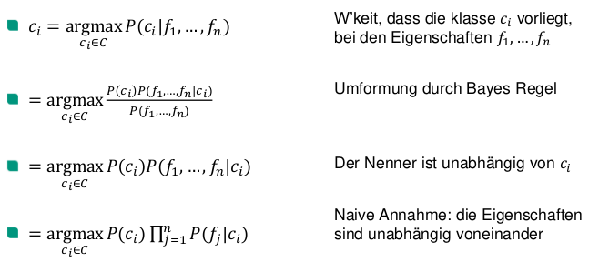
* Training: Schaetze Wahrscheinlichkeiten

#### TextRunner (wurde zu ReVerb)
* Single-Pass extractor
* Schritt 1: Self-Supervised Learner
* Schritt 2: Single-Pass Extractor
* Schritt 3: Redundanzbasierte Bewertung
* Demo: Open Information Extraction
* Precision: 88.1%

### Distant Supervision / Mintz 2009
* Finde bekannte Relationen (Freebase) in Text -> Umgebene Saetze als Relationsmuster
* Mintz: Kreuzvalidierung mit Wikipedia, 50% Freebase als Goldstandard
* Manuelle Evaluation mit mechanical Turk

## Ontologieaufbau
### manuell
* Phase 1: Die Machbarkeitsstudie
* Phase 2: Start/Vorbereitung
  * Identifikation der problemrelevanten Elemente
  * Identifikation von Konzepten und Instanzen
  * Ermitteln der Attribute der Konzepte
  * Aufbau eines Netzwerks zwischen Konzepten mithilfe von Relationen
* Phase 3: Aufbau/Verfeinerung
* Phase 4: Evaluation
* Phase 5: Applikationen und Evolution

### automatisch (domänenspezifisch)
#### KOF 2005 (a/b)
* Idee: Warenkorbanalyse (wenn X in Warenkorb, Y wird wahrscheinlich auch gekauft)
* Steps:
  * Term Extraction
  * Term Clustering
  * Association Mining/Taxonomy building
* Concrete Steps:
  1. Format the text (one sentence per line)
  2. Tag each word (Part-of-Speech)
  3. Parse the tagged text
  4. Extract predicates and their arguments
  5. Build concept clusters
  6. Look for cluster intersection and build a taxonomy Interactive
    * Apriori Algorithmus
  7. Tansfer the taxonomy to the associations mining tool
  8. Look for the potential associations
  9. Decide which associations are sensible
    * Anzahl von Belegen (Unterstütztung) > sigma (Schwellwert, 2-10%)
    * Konfidenz: Unterstützung(A und B)/Unterstützung(A) (70-90%)
* Nicht alle Schritte voll-automatisch
* Problemstellen nicht automatisch identifiziert
* Eval:
  * Dampfkessel-Spezifikation
  * Am Anfang zu viele Mehrdeutigkeiten. Synonyme als Probleme
  * "enter a state" - state zu allgemein

#### Autofocus
* Ontologie mit Meta-Modell verbinden
* Komponenten in Relation setzen
* Oberklassen finden

#### Daimler-Crysler Fallstudie
* 80 Seiten Anforderung
* Ganz viel manuelle Vorformatierung
* Als Verben erkannte Rechenoperatoren: if x = y
* Problem: Falsche Clusterüberschneidungen (z.B. bei `denote`)
* Insgesamt 5 Tage

## Lexikalische Relationen
* Lex. semantik: *einzelne* Worbedeutungen
* Formale Semantik: Waehle Wortbedeutungen um Satz Sinn zu entlocken
* Diskurs oder Pragmatik: Kombination formaler Semantik verschiedener Saetze zu Text/Diskurs mit Sinn

### Terminologie
* Wortbeziehungen
  * Homonyme: Gleiche Aussprache, unterschiedliche Bedeutungen (bow: Pfeil und Bogen, Geigenbogen, biegen, bowtie (Fliege), Londoner Viertel), `modern` (Zombie)
  * Polyseme: Selbes Wort, unterschiedliche aber verwandte Bedeutungen (Bank -gebaeude/-instition)
  * Synonyme: Unterschiedliche Worte, gleiche Bedeutung. `Perfekt`: **Ueberall** sinnerhaltend austauschbar
  * Antonyme: Gegensaetzliche Bedeutung
  * Hyperonyme und Hyponyme: Uberbegriff, Unterbegriff
  * Meronyme und Holonyme: Ganzes/Teil (Hand,, Finger)
  * Troponymie: Bedeutungsverwandte Worte mit Unterschieden bei Konnotationen (`schleichen` vs. `stolpern` vs. `schreiten`: `gehen`, aber auf untersch. Art und Weise)
* Lexem: Tupel (Bedeutung, Form)
* Lemma/Leitform: Nach was suche ich in Woerterbuch danach?
* Wortform: z.B. Plural, Konjugationen

### Wortaehnlichkeiten
#### Thesaurus
* Sammlungen von nach Aehnlichkeit gruppierten Woertern

##### Wordnet
* "Ontologie fuer Englisch"
* **Synsets**: Menge von (beinahe-)Synonymen
* Problem: Hauptsaechlich Nomen

##### Medical Subject Headings (MeSH)
* Graph, nicht Baum
* Indiziert 5000 Journale, >18m Artikel

##### Pfadbasierte Ähnlichkeit
* Operationen im Thesaurusgraphen:
  * `senses`: Anzahl Bedeutungsknoten
  * `pathlen`
  * `similarity`: log(`pathlen` / (2D)) wobei `D` = Breite/Höhe des Graphen
  * `wordsim`: höchste `similarity` zwischen Bedeutungen
* Kurze Pfade in Thesaurus = groessere Aehnlichkeit
* Alternativ: +Kantengewichte
* Resniks Methode:
  * Informationsgehalt IC(c) = -log(P(c))
  * Lowest Common Subsumer (LCS)
  * sim_Resnik(c1, c2) = -log(P(LCS(c1, c2)))
* Dekang Lins Methode
  * 2 log P(LCS(c1, c2)) / (log(P(c1)) + log(P(c2))

#### Verteilungsbasiert
##### Kontext-/Featurevektor
* Definition: 
  * Nachbarschaftsfenster
  * Tupel (syntaktische Abh., *Wort*), z.B. tangerine -> (subject-of, *eat*)
* Gewichtung Zaehlwerte:
  * Nicht nur Binaerwerte moeglich, auch Wahrscheinlichkeiten
  * *KEINE* Haeufigkeiten: `Drink it` *viel* haeufiger als `drink wine`, aber:
  * Pointwise mutual Information: Wie oft tatsaechlich zusammen vgl. mit falls statistisch unabh.
    * P(X,Y) / (P(X) * P(Y))
    * PMI(x, y) = log2(P(X,Y) / (P(X) * P(Y))), assoc = PMI(w, f)
* Normalisierung der Vektoren (Minkowski, Euklid, Cos, Manhattan, Jaccard, Dice)

##### Evaluation
* Intrinsisch
  * Korrelation mit Menschen-Ergebnissen
  * Gold-Standard
* Extrinsisch
  * In groesserem Gesamtsystem, z.B.
    * Plagiatsuche
    * Rechtschreibpruefung
    * Text-Bewertung
* Probleme
  * Domänenspezifische Wörter
  * Neue Woerter
  * Neue Bedeutungen
  * Viele Nomen
  * Wenige Werben
  * Keine Adjektive/Adverben

### Word Sense Disambiguation (WSD)
* Identifiziere den gewollten Sinn eines Wortes in seinem Kontext
* `Lexical sample task`: WSD für eine kleine, feste Menge an Wörtern
* `All-words task`: WSD für alle Inhaltswörter eines Textes
* Im Gegensatz dazu: `Word Sense Discrimination`
  * Unbekanntem Wort Bedeutung zuordnen
* Ganz fruehe Disziplin des maschinellen Lernens (1949)

#### Überwachte WSD
* Beginne mit vorgetaggtem Trainingstext (also mit Bedeutungen annotiert)
* Extrahiere Eigenschaften, die den Kontext der Wörter beschreiben
* Trainiere einen Klassifizierer (bel. Verfahren zum masch. Lernen)
* Nutze den Klassifizierer bei unmarkierten Texten

Nachteil: Manuelles Markieren ist arbeitsaufwändig, teuer und unzuverlässig

##### Beispiel-Korpora
Lexical sample task
* **line-hard-serve** Korpus (4000 Beispiele)
* **interest Korpus** (2400 Beispiele)
* **SENSEVAL** Korpora (mit 34, 73 bzw. 57 Beispielen)
* **DSO**: 192K Sätze aus Brown & WSJ (121 Nomen, 70 Verben)

All-words task
* **SemCor**: 234K Wörter aus dem Brown Korpus markiert mit WordNet-Bedeutungen
* **SENSEVAL** 3: 2081Wörter

##### Umgebungsbasiertes WSD
* Satz
  * Markieren der Wortarten
  * Lemmatisierung: Grundformen bilden
  * Syntaktisches Parsen
* Direkte Umgebung (+-3 Woerter)
* Allgemeine Nachbarschaft
* Naïve-Bayes:
  gesuchter sense = sense S, der das Produkt aller Wahrscheinlichkeiten von Features in Abh. von S maximiert  
  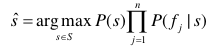  
  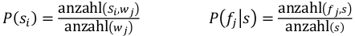

##### Gale, Church, & Yarowsky 92
* Precision 90%
* Kontext kann versetzt (entfernt) sein (10, 100, 1000 Woerter), und ist immer noch informativ

##### Entscheidungslisten
* Regeln -> Bedeutung
* switch/case: 1. passendes matched
* Daher Training mit Wahrscheinlichkeiten fuer Sortierung

#### Evaluation
* Intrinsisch
  * z.B. Korpora aufteilen (Kreuzvalidierung), Korpus = Goldstandard
  * Most-Frequent-Sense Basislinie
    * 50-60% Precision
    
#### Wörterbuchbasierte Ansätze
* Lesk (1986): Waehle Bedeutung nach groesster Ueberlappung mit Lexikon-Beschreibung
* Mihalcea 2007: Wikipedia!
  * Wird besser mit der Zeit
  * 200 Sprachen
  * Betrachtet \[\[Link-Text|Artikel\]\] Links, wo Link-Text = Bedeutung zu Artikel-Wort
  * Ignoriere Disambiguation pages
  * Ignoriere gross geschriebene Texte (Named Entities)
  * Bilde Markierungen auf WordNet-Synsets ab -> Vergleichbarkeit mit anderen Ansaetzen
    * manuell
  * Featurebasiertes WSD mit Naive-Bayes Classifier
  * Precision: 84.7% vs. 72.6% MFS vs. 78% Lesk
  * Hauptsaechlich Nomen

#### Allgemeine Tipps
* Domaene einschraenken
* Mit kleinen Datensaetzen entwickeln
* Kreativitaet: Clever Datenquellen anzapfen/verknuepfen

## Verbesserung von Anforderungen
Fabbrini Qualitaetsmodell:
* Eindeutigkeit
  * Unklahrheit
  * Subjektivitaet
  * Unbestimmtheit (Optionales)
  * Schwache Verben
* Vollständigkeit
  * Unterspezifiziertheit
* Konsistenz
  * Referenzfehler
* Verständlichkeit
  * Multiplizitäten: Mehr als eine Sache pro Satz
  * Implizites
  * Unerklaerte Akronyme

### QUARS
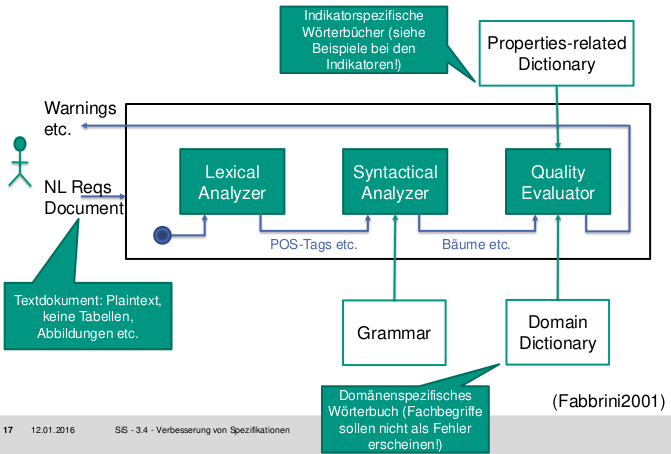

### RESI (Requirements Engineering Specification Improver)
* Ansatz:
  * NLP-Werkzeuge zum Vorbereiten
  * Ontologien zum Anwenden des gesunden Menschenverstands
* Text muss erst in XML-Form sein (Graph), wird auch zur Persistirung benutzt
* Lemmatisierung z.B. über WordNet
* Betrachtete Fehlertypen
  * Nominalisierung
  * Unvollst. spezifizierte Prozesswörter
  * Nomen ohne Bezugsindex
  * Unvollständig spezifizierte Bedingungen
  * Modalverben der Notwendigkeit
* Ontologien:
  * ResearchCyc
  * WordNet
  * ConceptNet
  * YAGO,
  
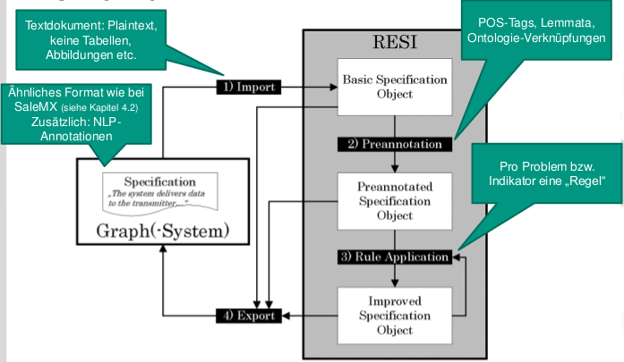

||ABC Video Rental||Monitoring Pressure||
|---|---|---|---|---|
||Manuell|RESI|Manuell|RESI|
|Summe|47.3|62.2|24.3|45.8|
|Recall|14%|18%|26%|48%|
|Precision|100%|100%|100%|100%|

## Etikettieren: Semantische bzw. thematische Rollen
* Anwendungen:
  * PropBank
    * Fuer jedes Verb ein Rollensatz (Arg0, Arg1...) (anstrengend!)
    * Arg0 is Agent
    * Arg1 is Patient
    * Rest dynamisch pro Verb (uneinheitlich!)
  * FrameNet
    * Grundidee: Verstehe Wortbedeutungen durch sem. Strukturen, in denen sie vorkommen
    * Rollen pro *Frame*
    * Verschiedene Frame-Typen
    * Target words (als Repraesentanten des Vorgangs(?))
    * Kein Goldstandard vorhanden
* Rollen:
  * Agens, Patiens, Actus
  * Creator, Opus
  * Possessor, Recipiens, Habitum
  * Locus, Origo, Destinatio
  * Status, Transitus
* SRL = Semantic Role Labeling (???)
  * Identifikation
  * Klassifikation

## Automatische Modellierung
* OO-Analyse Vorgehen:
  * Betrachte die Realität
  * Modelliere den Ausschnitt
  * Mache das Modell lauffähig (Programmieren)
  * Simuliere den gewählten Ausschnitt (Fuehre Programm aus)
* Modelle aus nat. Sprache
  * Verben zu Methoden oder Beziehungen
  * Oberflaechliche Analyse
    * "ein bisschen NLP", z.B. um fuer Nomen Klassen vorzuschlagen
  * Tiefe Analyse
    * Existiert noch nicht
    * Viel Hintergrundwissen noetig
    
### Class Model (CM) Builder
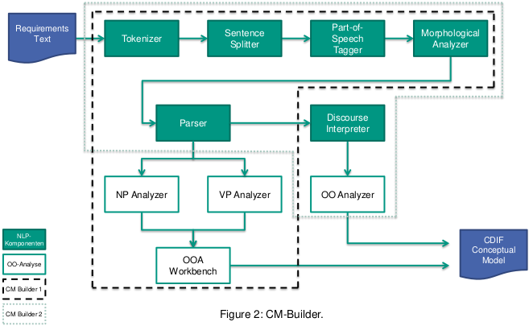
* Anreichern eines initialen Welt-Modells (Ontologie)

#### Evaluationstechnik
* 3 Ergebniswerte:
  * korrekt: In Musterloesung
  * falsch: Macht keinen Sinn
  * extra: Macht Sinn, aber nicht in Musterloesung
* => neue Masse:
  * Ausbeute = korrekt / musterloesung
  * Praezision = korrekt / (korrekt + falsch)
  * Ueber-Spec: extra / musterloesung
* Ergebnisse:
  * 73% Recall
  * 66% Precision
  * 62% Overspec
  
### SaleMX
* Nutzt Thematische Rollen und den davon aufgespannten Graph
* Nutzt Graph-Muster

#### Eval
* Uberspezifiziert (29 Klassen statt 8)
* Keine Attribute

### Ausblick
* Entwurfsmuster verwenden (u.U. komplizierte semantische Muster)
* Aktivitätsdiagramme
* Zustandsdiagramme

## API-Erschließung (Petrosyan2015)
### Context
* Tutorials als Datenquelle
* Open Source APIs
* Bekannte Domaenen
* Korrektes Englisch
* Projekte (unterschiedlich groß):
  * JodaTime
  * Apache Commons Math
  * Java Collections Framework
  * Smack API
* MaxEnt Classifier (Alternative: Cos, mehr Recall, weniger Precision) 
  
### Implementierung
1. Texte fragmentieren
  * 100-150 Woerter
  * Nutze html Tags
1. Text -> API Verknuepfung
  * Recodoc
  * Code-like Terms
  * Ausbeute 96%, Präzision 96%
1. Text-Verarbeitung
  * Vorbereiten & Zerteilen (Punkte einfuegen, Stanford-Parser)
  * Aufraeumen: Multi-Word-Terms (haeufige Sequenzen aus JDK-Docs)
1. Trainingsdaten erstellen
  * 2 Autoren erstellen Tupel (Abschnitt, Klasse) wenn Abschnitt Klasse erklaert
  * Inter-Annotator-Uebereinstimmung gering, aber alles resolvable im Gespraech
1. Trainieren mit Betrachtung von NLP-Textfeatures
  * MaxEnt Classifier
  * Unterschiedliche Feature-Kombinationen unterschiedlich gut (weniger teils besser)
  * Real-valued features
  * Tutorial-level features
  * Section-level features
  * Sentence-level features
  * Dependency-based features  
  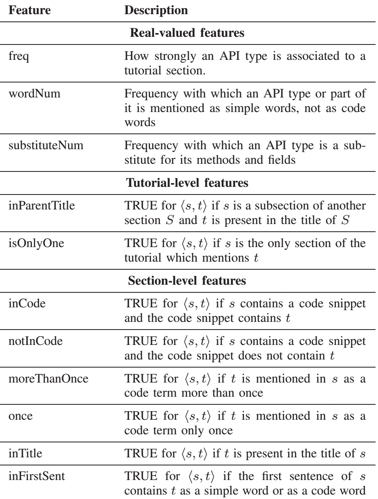  

### Eval
  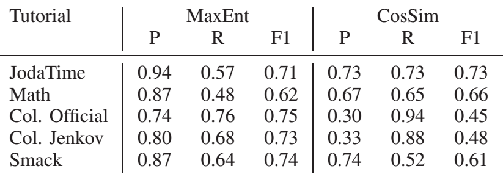  
  
## Beantworten von Fragen (Question Answering) | IBM Watson
* Sprache schwieriger als Schach
* Jeopardy Gewinnerwolke: % beantwortete Fragen (~50-80%) vs. % richtig (> 85%)  
  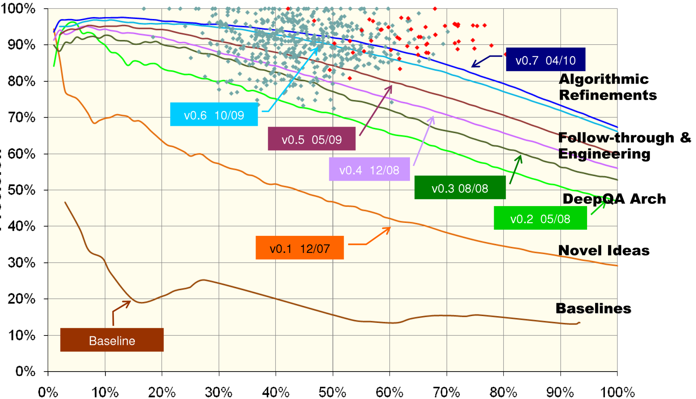

### Anforderungen
* Geschwindigkeit
  * Maximal 3 Sekunden
* Geospatial Reasoning
  * Wo liegt Toronto?

### Aufbau Wissensdatenbank
* Quellen Zerteilen in NLP Syntax-Frames (Subjekt, Objekt...), Syntax nach Semantik-Frames (patent(inventor, invention))
* Wikipedia, Time, NY Time, Encarta, Oxford University, IMDB, IBM Dictionary, Ontologien wie YAGO...
  * Gesamt: 500GB
  * Woechentliches Update
* Hadoop
  
### Hardware
* PC: 2h
* 10 Rack, 750 Server, 2280 Core, 15 TB RAM, 80 TFLOP/s, Linux,

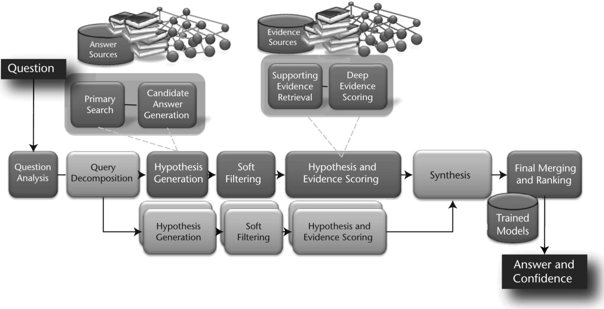
