<!-- Written to be compatible with https://github.com/yaniswang/markdownReader -->

# Sprachtechnologie und Compiler
## Einführung
### Aufbau
1. Lexikalische Analyse (Lexer -> Tokens)
1. Syntaktische Analyse (Parser -> Ast)
1. Semantische Analyse
1. Transformation (IR)
1. Analyse & Optimierung
1. Codeerzeugung ( -> Assembler/Maschinencode)
   1. Befehlsauswahl
   1. Befehlsanordnung
   1. Registerallokation

### Zwischensprachen
* n Eingabesprachen, k Ausgabesprachen => n + k Module statt n*k

### Anforderungen beim Übersetzerbau
* Korrektheit
* Minimaler Ressourcenverbrauch des Kompilats:
   * Rechenzeit, Speicher, Energie
* Kompatibilität mit anderen Übersetzern
* Übersetzungsgeschwindigkeit
* Unterstützung des Programmierers: Fehlermeldungen, Warnungen, Zusammenspiel mit Debugger...
   
### Anforderungsanalyse
* Festlegung der Quellsprache
* Festlegung des Niveaus
   * Abstrakte Maschine definieren
   * Abgrenzung Hardware/Laufzeitsystem
   * Entwurf Laufzeitsystem
* Systemeinbettung
* Formales Modell der Semantik

### Laufzeitumgebungen
* Reiner Interpretierer
* Zwischencode Interpretierer
* Vollständige Übersetzung
* JIT

* Fließbandarchitektur
   * Historisch: wegen Resourcenbeschränkung
   * Heute: Aus SWT-Gründen, klare Schnittstellen

## Lexer
* Informationskompression
* Prinzip des längsten Musters
### Edliche Automaten
* Endliche Automaten: Zustände + Symbole + Übergänge + Anfangszustand + Endzustand
* Mit Epsilon Übergängen: Closures bilden
* Nichtdeterministisch (Mehrere ausgehende Kanten mit selbem Übergangssymbol): Teilmengen- bzw. Potenzmengenkonstruktion
* Minimaler Automat
* Faktorautomat
* Zusammengefasst:
   * Deterministischmachen in der Praxis linear, aber worst-case exponentiell
   * Minimierung quadratisch, auch wenn n log(n) möglich (nicht praxistauglich)
* Codierung 
   1. als Datenstruktur:
      * Adjazenzmatrix für Übergänge in O(1)
   1. als Programm
      * handgeschrieben
         - [x] flexibel
         - [x] wartungsfreundlich
         - [x] einfach einzufügender Aktionscode
         - [ ] fehleranfällig
      * systematisch
         - [x] performant
         - [x] kompakt
         - [x] weniger fehleranfällig
         - [ ] Code für Aktionen umständlich einzufügen
         - [ ] neue DSL zu erlernen
         - [ ] neues externes Werkzeug
         - [ ] mühsame Fehlersuche in maschinengeneriertem Code
### Flex
1. Regexe für verschiedene Tokentypen angeben
1. Aktionen für gefundene Tokentypen definieren

### Implementierungsdetails
* Token: Key, Value (z.B. String- oder Floatliteral), Position
* Lexer-Typen
   * Pull-Parser: Parser ruft Lexer auf um Token zu erhalten (verbreitet, da Lexer wenig Zustand halten muss)
   * Push-Parser: Parse-Funktion wird nach erkanntem Token aufgerufen
   * Buffering: Vorberechnung des Tokenstroms
* Stringtabelle
   * Stringvergleiche vermeiden
   * Platzsparend
   * Zusätzliche Informationen können angehängt werden (z.B. `isKeyword`)
* Einlesen
   * Char-Weise
   * Gepuffert
   * memory-mapped
   * Puffer-Paare
      * Erlauben lookahead fester größe
      * `begin` und `forward` Zeiger
      * Flippe Buffer und fülle ersten Buffer weiter auf wenn von `begin` verlassen
* Sonderfälle
   * Fortran WTF: 
      * Whitespace komplett insignifikant
      * Variablenzuweisung DO10I = 1.5
      * Zählschleife DO10I = 1,5
   * ">>" bei Java/C++ und Templates
   * "(A)*B" in C++: Cast von Deref oder Multiplikation, je nach Typ
   * Kommentare erhalten für Dokumentierungstools?
   * Pragmas mit eigener Syntax?

## Syntaktische Analyse
* Grammatik ist kontextfrei
   * **deterministisch** kontextfrei für Parse-Aufwand in O(n) statt O(n³)
* Ziel: Phasentrennung
   * Keine Rückkopplung zwischen Lexer und Parser

### Kontextfreie Grammatiken
* Grammatik G = (T, N, P, S)
   * Terminale
   * Nichtterminale
   * Produktionen
   * Startzustand
* Kontextfrei $$\Leftrightarrow \forall A \rightarrow \alpha \in P: A \in N$$
* Begriffe
   * Ableitung
   * Satz
   * Sprache
   * Linksableitung/Rechtsableitung
   * *erreichbare* Nichtterminale
   * *reduzierte* Grammatik: Alle Nichtterminale erreichbar
* $$\epsilon$$ Produktionen lassen sich immer beseitigen (wieder über Closures)
* Nichtdeterministisch ist echt mächtiger als deterministisch

#### Darstellungen (akademisch, EBNF)
* Erweiterte Backus Naur Form
   * ::= statt $$\rightarrow$$
   * \[\] für optionale Teile
   * \+ und * für Wiederholungen
* Stackmaschine

#### Grammar Engineering
* Deterministische Grammatik: Nur ein Syntaxbaum für jede Eingabe
* Operatorprioritäten berücksichtigen
* Faustregeln
   * Ein Nichtterminal pro Pioritätsebene für Operatorprioritäten
   * Nicht 2 mal selbes Nichtterminal auf rechter Seite: Mehrdeutigkeiten!
   * Links- und Rechtsassoziativität über Links-/Rechtsrekursive Regeln

### LL-Parser
* Namensgebung LL/LR:
   * L: Liest nur 1 Mal von **L**inks nach rechts
   * L/R: Baut **L**inks oder **R**echtsableitung auf
* First- und Followmengen
   * k-Präfix: 
      * k erste Zeichen einer Zeichensequenz
      * Mit # aufgefüllt falls k größer Sequenzlänge
      * Kurzschreibweise "k : x"
   * $$First_k(x)$$ Menge
      * $$x \in V^*$$
      * k-Präfixe aller möglichen Ableitungen von x
   * $$Follow_k(X)$$ Menge
      * $$X \in N$$
      * Angenommen $$S \Rightarrow^{ * } mXy$$
      * Dann ist $$Follow_k(X) \supseteq First_k(y)$$
   * Berechnung: Fixpunktiteration bis stabil
   * Hinweis: Die im Folgenden gegebenen Namen sind von mir ausgedacht und dienen lediglich als Eselsbrücke, um den Regelinhalt kurz zu beschreiben
   * First:
      1. Falls nur Terminale $$\gamma$$: Erstes Zeichen bzw. $$1 : \gamma$$ (Terminale)
         * Beachte: $$\epsilon$$ ist auch ein Terminal, und $$1 : \epsilon = \lbrace $$#$$ \rbrace$$
      1. Wenn nach $$\alpha$$ ableitbar: Enthält auch $$First_k(\alpha)$$ (Regel-Dekomposition, Inversion)
      1. Wenn $$X = \alpha\beta$$ und $$\alpha \rightarrow^{ * }\epsilon$$: Enthält auch $$First_k(\beta)$$ (Epsilon-Elimination)
      1. Wenn $$X = \alpha\beta$$: Enthält $$First_k(\alpha) \setminus$$ { # } (Prefix-Inklusion)
   * Follow:
      1. # ist immer in Follow(S) (Startzustand)
      1. Wenn $$ X \rightarrow^{ * } \alpha Y \beta$$, dann ist $$First(\beta) \subseteq Follow(Y)$$ (Regel-Kontext)
      1. Wenn $$ X \rightarrow^{ * } \alpha$$, dann ist $$Follow(X) \subseteq Follow(\alpha)$$ (Regel-Vererbung)
      1. Wenn $$ \beta \rightarrow^{ * } \epsilon $$, dann ist $$Follow(\alpha) \subseteq Follow(\alpha\beta)$$ (Epsilon-Elimination)
      1. $$Follow(\alpha\beta) \subseteq Follow(\beta)$$ (Prefix-Inklusion)
   * LL(k)-Kriterium
      * Für alle Ableitungspaare gilt
      * 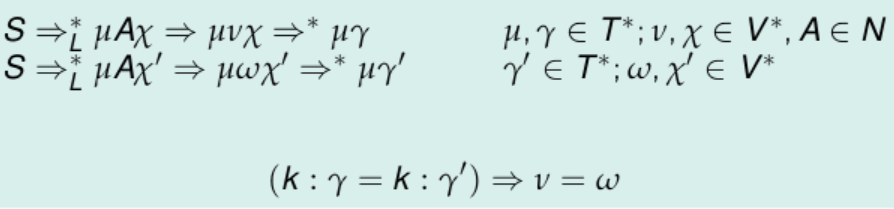
      * Stack-Inhalt ist für die Erkennung bekannt (siehe $$\mu$$ in beiden Ableitungen gleich)
   * SLL(k)-Kriterium
      * 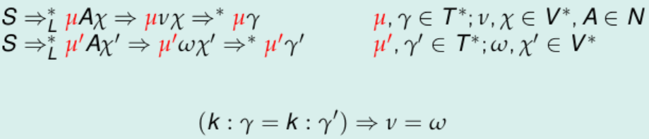
      * 
   * Jede SLL(k) Grammatik ist auch ein LL(k) Grammatik
   * SLL(1) $$\Leftrightarrow$$ LL(1)
   * Reparieren von Grammatiken um LL(k) zu erhalten: Linksfaktorisierung
   * Linksrekursion: Eine linksrekursive kfG ist für kein k LL(k)
      * Beispiel: $$ S \rightarrow Sx \mid y$$
   * Für jede linksrekursive kfG gibt es eine Grammatik ohne linksrekursive Produktionen
#### Tabellenbasierte Implementierung
* 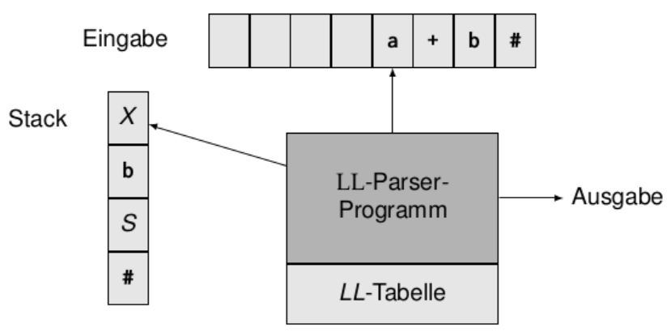
* 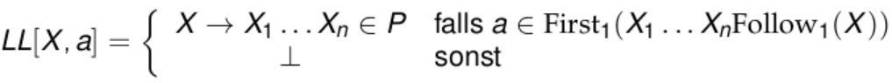
* 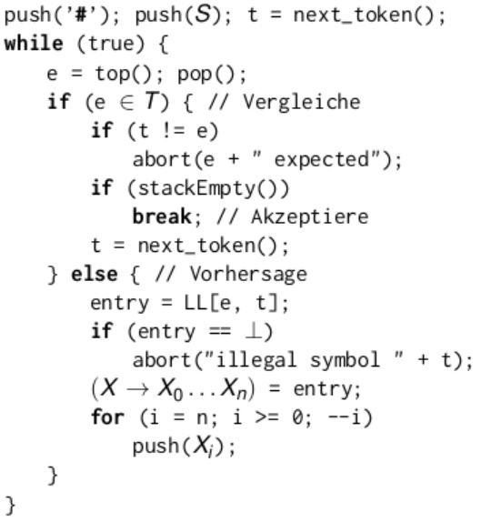

#### Rekursiver Abstieg
* `next_token`: Liest nächstes Zeichen (in den globalen Zeichenzustand t in den Folien)
* `parseX()` Methoden, wobei X für alle Nichtterminale implmentiert ist
* `expect(char)` um ein Terminalsymbol einzufordern
* Kann algorithmisch aus EBNF gewonnen werden
   * Erweiterte First() Syntax/Definition für EBNF Zeichen \[\], +, *
* Leicht um AST-Aufbau erweiterbar:
   * `parseX` Methode geben geparsten Teilbaum zurück
   * Bisweilen müssen Teilbäume weitergereicht werden
* Fehlerbehandlung
   * Begriffe:
      * Fehler
      * Fehlersymptom: Verletzung der Sprachdefinition
      * Diagnose
      * Position
   * Klassifikation
      * Symbolfehler: Unzulässige Eingabezeichen (im Lexer)
      * Syntaxfehler: Eingabe gehört nicht zur Parserdefinitierten Sprache
      * Semantische Fehler: Z.B. Typfehler
   * Parserdefinierte Fehlerstelle: Erstes Token, dass nicht zur Sprache gehört
      * $$t$$ sodass $$\forall \beta \in T^*: \alpha t \beta \notin L(G)$$ und $$\exists \alpha' : \alpha \alpha' \in L(G)$$
   * Panik-Modus
      * Überliest bis Ankermengenzeichen
      * Überliest potentiell sehr viel (inklusive weiteren Fehlern)
   * Korrektur
      * z.B. Komma durch Semikolon ersetzen
      * Kompliziert
   * Ankermengen
      * naive Ankermengen zu schlecht
      * Annäherung: Ank(A) = Follow(A)
         * Problem: Follow(A) ist ggf. zu klein
         * Beispiel: wenn A=`a+b;` eine Expression, dann sind Follow(A) auch nur Expressions
      * Verbesserung: Follow-Mengen von übergeordneten Strukturen auch aufnehmen
         * Im Beispiel: Follow(Statement) zusätzlich zu Follow(Expression)
      * Weitere Verbesserung: Kontextsensitive Ankermengen
         * Beispiel: `else` ohne passendes `if`
      * Problem: Weiterparsen bis zum nächsten sicheren Zeichen kann weitere störende Folgefehler liefern
         * Lösung: Globaler Error-Mode in dem Fehlermeldungen unterdrückt werden
      * 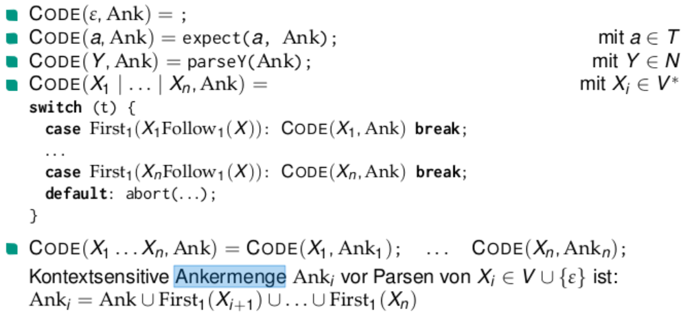
### LR-Parser
* Bottom-Up Parser
* Shift und Reduce Aktionen
* 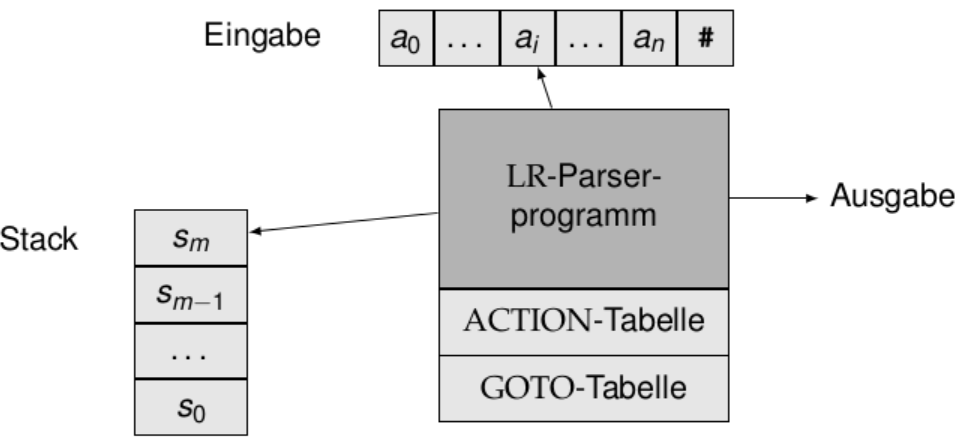
* 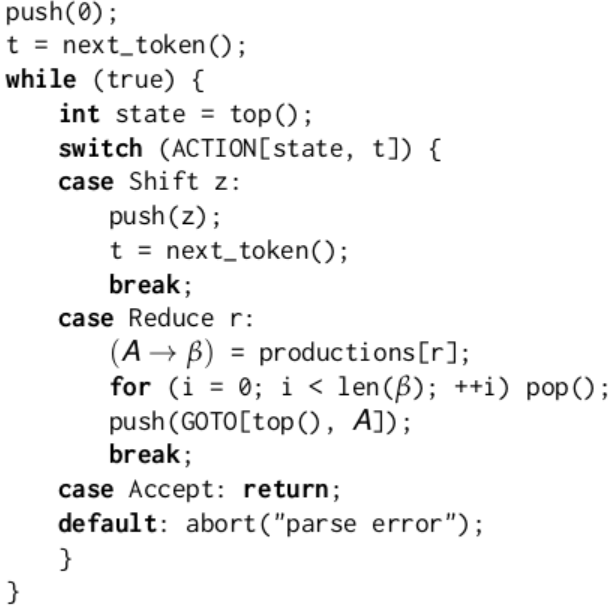
* Erweiterung der Grammatik um # Symbol($$\omega \in L(G) \Longleftrightarrow \omega$$#$$\in L(G)$$
* Situation: ($$\cdot$$), gibt Position des Parsers an
   * Englisch: `item`
* 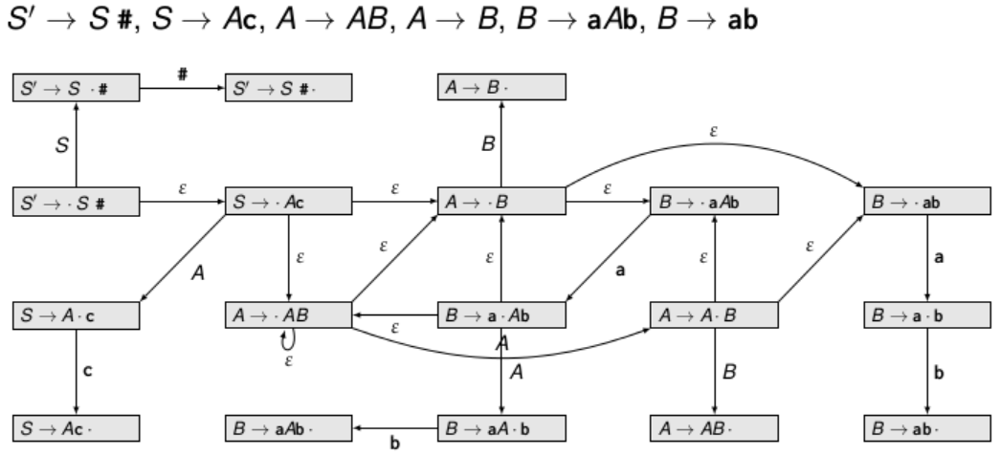
* Deterministischmachen -> LR(0) Automat
* Closures: Hüllenberechnung über Fixpunktiteration
   * Für alle $$X \rightarrow \alpha \cdot Y \beta$$ in bisherigem Closure
   * Für alle $$Y \rightarrow \gamma \in P$$
   * Füge $$Y \rightarrow \cdot \gamma$$ zu Closure hinzu
   * Solange bis nichts mehr hinzugefügt wird
* Dyck-Sprache:
   1. $$S' \rightarrow S$$#
   1. $$S \rightarrow S(S)$$
   1. $$S \rightarrow \epsilon$$
* Expression Grammatik:
   1. $$E \rightarrow T E'$$
   1. $$E' \rightarrow + T E' \mid - T E' \mid \epsilon$$
   1. $$T \rightarrow F T'$$
   1. $$T' \rightarrow * F T' \mid / F T' \mid \epsilon$$
   1. $$F \rightarrow (E) \mid number$$
* LL(2) aber nicht SLL(2)
   1. $$S \rightarrow aAab \mid bAbb$$
   1. $$A \rightarrow a \mid \epsilon$$
* LR(1) aber nicht LALR(1)
   1. $$S' \rightarrow S$$#
   1. $$S \rightarrow aAd \mid aBe \mid bAe \mid bBd$$
   1. $$A \rightarrow c$$
   1. $$B \rightarrow c$$
* GOTO Funktion: Sagt zu einem Symbol (Terminal oder Variable) und einem Zustand X in welchen Zustand Y übergegangen wird
* Situationsmenge berechnet mittels Fixpunktiteration über Closures und GOTO-Werten mit allen Symbolen
* Shift: Lies ein Zeichen aus der Eingabe, mache den Übergang im Automat durch auf den Stack legen des neuen Zustands
* Reduce: Entferne so viele Elemente vom Stack wie Regel Symbole rechts hat (gehe zurück zu dem Zustand der jetzt oben auf dem Stack liegt)
* Push: Nach einem Reduce mache Übergang mit dem Symbol links in der Regel (die erkannte Produktion)

#### SLR
* Entscheidung Shift oder Reduce nicht immer eindeutig treffbar (Konflikt)
   * Shift-Reduce Konflikt
   * Reduce-Reduce Konflikt
* Idee: Nur reduce, wenn Eingabesymbol in Follow-Menge des Nichtterminals auf das reduziert wird
* Grammatik ist SLR(1) gdw. SLR(1) Zustände Konflikt-frei

#### LR(k)
* Definition
   * 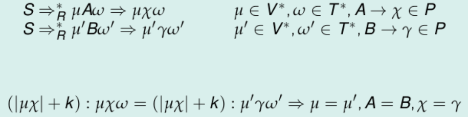
* Berechnung der Closures inklusive Rechtskontexte
   * 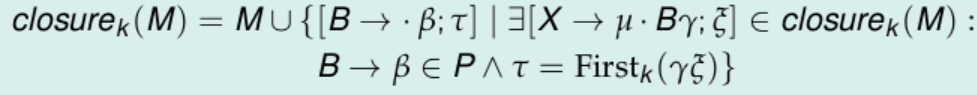
* 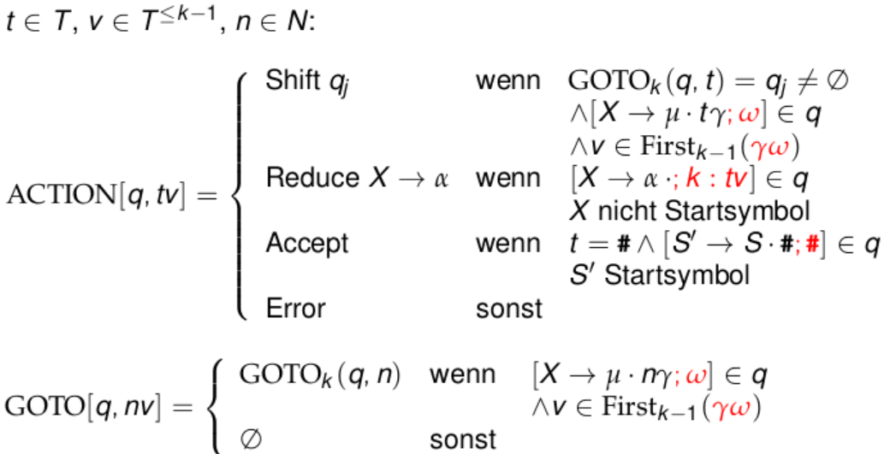
* Testen auf LR(1) Eigenschaft nur durch Konstruktion des Automaten möglich

#### LALR(k)
* Look Ahead LR
* Definition `Kern` eines Automatenzustands: Regeln ohne Rechtskontexte
* Verschmelze alle Zustände, bei denen Kern gleich
* Konstruktion allerdings direkt aus LR(0) Automat mit ergänzten Rechtskontexten
* Satz: Jeder SLR(k) und LALR(K) Automat hat die selbe Anzahl Zustände wie der LR(0) automat zur gleichen Grammatik
* LR aber nicht LALR
   * 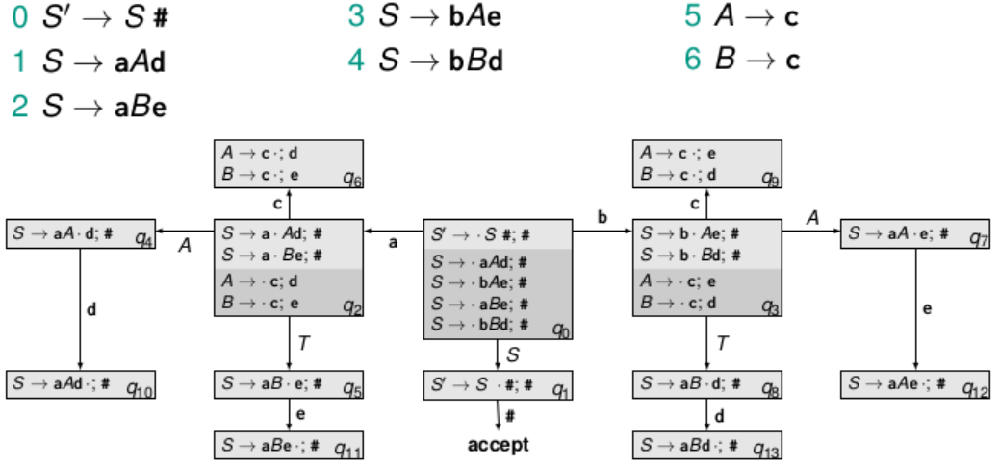

#### Fehlerbehebung
* Manuell Fehlerroutinen in Action-Tabelle eintragen
* Panik-Modus
   * Ankermengenberechung
      * Rechtskontexte in nicht-rekursiven Nicht-Closure-Items
      * Evtl. Terminale in Nicht-Closure-Items rechts vom Punkt
      * Manuelles Feintuning
   * Recovery
      * Überspringe Eingabe bis Token in Ankermenge
      * Mache Automatenübergänge in einen Reduktionszustand q , der Ankermenge als Rechtskontext hat
      * Normal fortfahren, also reduzieren

* AST-Aufbau nach Syntaxfehler nicht möglich

### Tabellenoptimierung
* Reduktionszustände (wo auf jeden Fall reduziert wird) in Vorgängerzustand übertragen und dort bereits reduzieren
* Don't care Fehlerübergänge eliminieren
* Fehlerübergänge in eigene Fehlermatrix ausfaktorisieren
* Kompression
   * Graphenfärben
   * Indexzugriffsmethoden (konstant viele Indizierungen)
   * Listensuche (Variable Anzahl Indizierungen)

### Generatoren für Parser
* Yacc, Bison, Happy, Jay, antlr
* Bison:
   * %union
   * %token
   * %left, %right (?)
   * Produktionen: `Kopf: Rumpf1 {Aktion} | Rumpf2 {Aktion}...;`
* Konfliktbehebung
   * Automatische Auflösung bei Generatoren:
      * Shift-Reduce: Shift bevorzugt
      * Reduce-Reduce: Erste Reduktion bevorzugt (häufig fehlerbehaftet)
      * Reduce-Reduce: Spezifikation von Präzedenzen
   * Automatische Auflösung überprüfen
   * Faktorisieren
   * Präzedenzen
   * Sprache vergrößern und in semantischer Analyse wieder einschränken
   * Beispiele zum Lernen
   * Größeres k, mächtigerer Grammatik-Typ (in der Regel selten hilfreich)

### Spezialfälle
#### Typabhängiges Parsen
* In Typtabelle nachschauen
* In handgeschriebenem Parser leichter zu integrieren
* Wenn Typ erst später definiert: Mehrfacher Durchlauf
* Java: Aufruf von geerischen Methoden nehmen <T> VOR dem Aufruf
   * Verhindert `g(o.m<T,S>(c))` als `g(o.m < T, S > c)` zu parsen

### Sätze über kontextfreie Grammatiken
* Zu jeder LR(k) Grammatik gibt es eine LR(1) Grammatik, die die selbe Sprache akzeptiert
   * Beweis über Rechtsfaktorisierung
* Jede LL(k) Grammatik ist auch LR(k)
* Es ist entscheidbar, ob für eine LR(k) Grammatik G ein k' existiert, sodass G in LL(k')
* Zu einer beliebigen Sprache L lässt sich nicht entscheiden, ob es eine LL(1) oder LL(k) oder LR(k) Grammatik dazu gibt

### Earley Parser
* Dynamische Programmierung
* Erzeugt alle möglichen Parsebäume
* Laufzeit
   * O(n³) i.A.
   * O(n²) wenn Sprache eindeutig
   * O(n) wenn Grammatik LR(k)
* Situationen bzw items haben Tokenposition des linken Nichterminals (statt Rechtskontext)
* Situationsmengen $$S_i$$ zu jeder Tokenposition i
   * $$S_0 = $${$$[S' \rightarrow \cdot S$$#$$]$$}
* Algorithmus
   * Prediction
      * Ergänze Situationen, die sich durch Anwendung von Produktionen auf bestehende Situationen ergeben
      * Also zu jedem $$[X \rightarrow \alpha \cdot A \beta] \in S_i$$ und jeder dazu passenden Produktion $$A \rightarrow \gamma$$, füge $$[A \rightarrow \cdot \gamma, i] \in S_i$$ ein
      * Vergleichbar zu Closure Operation
   * Completion
      * Für jede sich am Ende befindende Situation, nimm an dass Nichtterminal erkannt und verschiebe andere Situationen um das erkannte Nichtterminal
      * Also für jedes $$[A \rightarrow \gamma \cdot, j] \in S_i$$ und $$[X \rightarrow \alpha \cdot A \beta, k] \in S_j$$ füge $$[X \rightarrow \alpha A \cdot \beta, k] \in S_i$$ ein
      * Vergleichbar zur Reduce Operation
   * Scanning
      * Nimm das nächste Token und schiebe passende Situationen nach vorne für nächste Situationsmenge
      * Also wenn **a** das nächste Token ist, füge für jedes $$[X \rightarrow \alpha \cdot a \beta, j]$$ in $$S_i$$ die Situation $$[X \rightarrow \alpha a \cdot \beta, j]$$ in $$S_{i+1}$$ ein
      * Vergleichbar mit Shift Operation
* Ergibt Syntaxbaum mit Auswahlmöglichkeiten
   * Achtung: Nicht alle Kombinationen entsprechen Eingabe $$\Rightarrow$$ konkrete Auswahl muss mit Eingabe verglichen werden!

## Semantische Analyse
* Aufgaben
   * Namensanalyse
   * Typanalyse
   * Operatoridentifikation (z.B. Multiplikation oder Dereferenzierung?)
   * Konsistenzprüfung (Sichtbarkeiten public/private...)
### Attributgrammatiken
* AG = (G, A, R, B)
   * reduzierte, kontextfreie Grammatik
   * Attribute
   * Attributierungsregeln R(p), $$p \in P$$ (zu Produktion `p` gehörende Attributierungsregeln)
      * Form: `Var.prop = SomeFunction(... OtherVar.otherProp, ...)`
   * Bedingungen
      * Können als Attribut von X in syn-Produktionen aufgefasst werden
      * Außerdem verundet man dann noch mit den Bedingungen der restlichen vorkommenden Nichtterminale => Wenn die Wurzelbedingung stimmt, stimmt auch die Attributierung
   * Anmerkungen: Mehrfach in Produktionen vorkommende Nichtterminale werden durchnummeriert, um auf konkrete Vorkommen in Attributirregeln Bezug nehmen zu können
* Menge der in p definierten Attribute `AF` (die Attribute `X.a` zu der eine Attributierregel `X.a := ...` in p existiert)
* Synthetisierte Attribute $$syn(X)$$: Attribute, die direkt durch Attributierungsregeln auf `X`-Produktion gesetzt werden
* Ererbte Attribute: $$inh(X)$$: Attribute, die durch Attributierungsregeln auf Produktionen gesetzt werden, wo `X` nur rechtsseitig vorkommt
* Vollständigkeit von AGs
   * Zu jeder Produktion mit X linksseitig gibt es Attributierregeln zu allen synthetisierten Attributen
   * Zu jeder Produktion mit X rechtsseitig gibt es Attributierregeln zu allen ererbten Attributen
   * Jedes Attribut in A(X) wird entweder synthetisiert oder ererbt
   * Das Startsymbol erbt keine Attribute
* Korrekte Attributierung
   * Wenn Attributierregeln eingehalten sind und
   * Alle Bedingungen den Wert wahr haben
* Direkte Attributabhängigkeiten DDP(p): Zwischen X.a und Y.b wenn sich Y.b aus einer Funktion von X.a ableitet in Regeln zu Produktion p
* Lokal azyklische AG
   * Wenn DDP für alle p azyklisch ist
* Wohldefiniertheit
   * vollständig
   * Attribute nicht zyklisch voneinander abhängig
   * garantiert eindeutige Berechenbarkeit der Attribute
   * Formale Definition
      * Baumabhängigkeiten azyklisch
      * Baumabhängigkeit: Betrachte zu Knoten die zugrundeliegende Produktion und übertrage dort definierte DDPs auf die Baumknoten
      * vollständig
#### LAG(1)
* für jede Produktion $$p : X_0 \rightarrow X_1 \ldots X_n \in P$$ können die Attribute in der Reihenfolge $$inh(X_0), inh(X_1), syn(X_1), inh(X_2), \ldots, syn(X_n), syn(X_0)$$
berechnet werden
* Informell: LAG(1) Reihenfolge entspricht Tiefensuche
* LAG(1) ist während LL-Parsen auswertbar

#### LAG(k)
* Entspricht intuitive mehrere Übersetzerpässen
* Definition: Für jede Produktion lassen sich Attribute so in Gruppen zerlegen, dass die Gruppen einzeln nach LAG(1) berechenbar sind

#### OAG
* Mehrmals auf- und absteigen zur Attributberechnung, aber nur lokal statt kompletten Baum abzulaufen.
* Beispiel Methodensammeln

### Namensanalyse
* Grobe Klassifikation
   1. Globale Deklaration
   1. Modul/Klassen/Objekt/Rekord Deklaration
   1. Lokale Deklaration
   1. Sonderfälle
* Herausforderungen
   * Verschachtelte Namensräume
   * Benannte Namensräume
* Umgebungsattribut umg

### Typanalyse
* Typäquivalenz
   * Namensgeichheit: Gleiche Typdeklaration
   * Strukturgleichheit: Gleicher Typkonstruktor
* A-Priori und A-Posteriori Typen:
   * Vor-Typ für Erkennung des Typs daraus zusammengesetzer Ausdrücke
   * Nach-Typ für implizite Casts

### Namens-Typanalyse
* Wenn beides voneinander abhängt und somit gleichzeitig erledigt werden muss
* Implizite Upcasts
* Überladung

### Praxis
* Üblicherweise Implementierung von Hand
* Visitor Pattern
   * Modular vs Flexibel: Bei Modular gibt Knoten `accept` die Besuchsreihenfolge vor
* Vorteil AG vs. manuell: Statische Konsitenzprüfung

#### Symboltabelle
* Effiziente Implementierung von `umg`

## Transformation zu Zwischensprachen
### Instruktionsklassen
* Arithmetik
* Speicher lesen/schreiben
   * Lokale Variable (Register) vs. Adresse vs. Objektfeld
* Sprünge
* Methodenaufrufe
* Objekterzeugung auf dem Heap

### Stackcode
* Operanden auf Stack
* Einfachere Erzeugung
* Gut für Interpretation
* Umgekehrt Polnische Notation als natürliche Darstellung
   * 7 ∗ 4 $$\Longleftrightarrow$$ 74 ∗
   * a = a + 1 $$\Longleftrightarrow$$ aa 1 + =
   * 2 ∗ ( 2 + 3 ) $$\Longleftrightarrow$$ 223 + ∗
   * 5 + y + 3 ∗ 5 $$\Longleftrightarrow$$ 5 y + 35 ∗ +
   * Ergibt sich per Postfixordnung bei Tiefensuche (also erst Kindknoten besuchen, dann eigenen Knoten ausgeben)
* Deskriptoren nach festgelegtem Namensschema
* Konstantenpool pro Klasse für Deskriptoren von Feldern/Methoden/Konstanten
* Objekte erzeugen/initialisieren: Konstruktoren

### Registercode
* Operanden in (unbeschränkt vielen) Registern
* Schwierigere Erzeugung
* RISC-Maschine
* Nur load/store als Speicherzugriffsoperationen
* Grundblöcke, Kontrollflussgraph (CFG)

### Kontrollfluss
* Switch Umsetzung
   1. If-Kaskade
   1. Sprungtabelle
      * Bei großen Differenzen zwischen min-Case und max-Case: Paare-Tabelle und Binärsuche
* Kurzauswertung
   * `newLabel()`
   * `loc` Attr
   * `code` Attr
   * `then` Attr
   * `true` Attr
   * `false` Attr
   * `fall` Attr

### Typabbildung
* Größe, inklusive 1-Bit als Sonderfall
* Alignment
   * auf x86 nicht ausgerichtet erlaubt, aber langsam
   * auf ARM etc. verboten
* 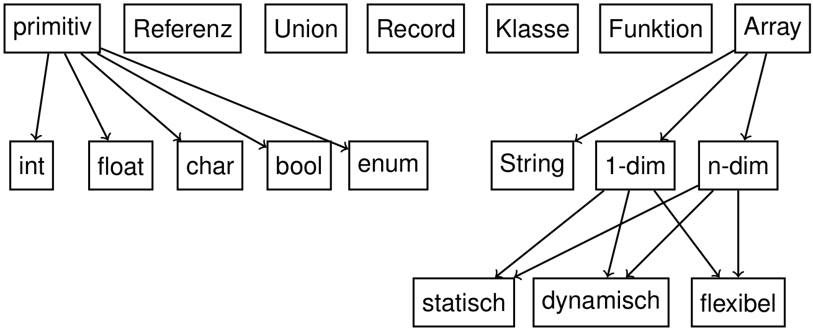
* Primitive Datentypen: IR orientiert sich an Zielplattform (z.B. doubles auf 32 Bit Systemen vermeiden)
* Arrays
   * Statisch: Größe statisch fest (int[16])
   * Dynamisch: Größe bei Deklaration bestimmt (int[n])
   * Flexibel: Größe änderbar durch Zuweisung (int[])
   * Bestehend aus Deskriptor (Startadresse + Länge) und Datensatz
   * Indizierung:
      * 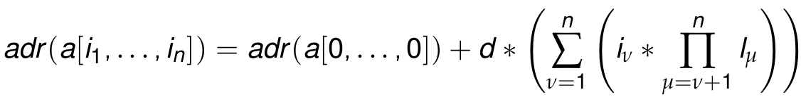
      * d ist Array-Elementbreite
      * Codegen: Ausrollen der Multiplikation, $$I_k$$ kann entweder statisch oder dynamisch sein
* (Unicode) Strings
* Structs: Speicherlayout / Alignments von Feldern
   * `align(offset, alignment)` Funktion
```C++
void layout(Record rec) {
   unsigned offset = 0;
   rec.setAlignment(1);
   for (Field f : rec.getFields()) {
      unsigned alignment = f.getAlignment();
      unsigned recAlignment = rec.getAlignment();
      rec.setAlignment(kgV(recAlignment, alignment));
      offset = align(offset, alignment);
      f.setOffset(offset);
      offset += f.getByteSize();
   }
   rec.setByteSize(offset);
}
```
* Unions

### Speicherorganisation und Funktionsaufruf
* Fortran77: Keine Rekursion weil Variablen nur an einem einzigen, immer gleichen Ort abgelegt wurden
* Activation Record (aka Stack Frame, Call Frame):
   1. Funktionsargumente
   1. Rückgabewert
   1. Dynamischen Vorgänger (Dynamic Link): Verweis auf Activation-Record des Aufrufers
   1. Statischen Vorgänger (Static Link): Verweis auf Activation-Record der umschließenden Funktion (benötigt für geschachtelte Funktionen)
   1. Rücksprungadresse
   1. Lokale Variablen
* Ziel: Möglichst viel von AR-Vorbereitung in aufgerufener Funktion erledigen

### Funktionsaufrufe
* Ablauf Funktionsaufruf:
   1. Stack- und Baseptr "normal"
   1. Argumente ablegen
   1. Platz für Rückgabewert reservieren
   1. Dynamic-Link = Baseptr
   1. Static-Link eintragen (weiß der Compiler)
   1. Rücksprungadresse = Program-Counter + 1
   1. Jump zu Aufgerufenem
   1. Afgerufener setzt Baseptr = Stackptr
   1. Execution
* Ablauf Rückgabe
   1. Rückgabewert eintragen
   1. Stackptr = Baseptr
   1. Baseptr = Dyn-Link
   1. Rücksprung
   1. Aufrufer weiß wo Return-Wert liegt
   1. Abbau des Aufruf-Platzes (Returnwert und Argumente) durch Stackptr rücksetzen
* Realität:
   * Hardwaregestützte Aufrufe
   * Argumente in Registern übergeben
   * Caller-save und Callee-save Unterteilung
   * Baseptr Register sparen wenn möglich
      * Wenn die größe des AR statisch bekannt kann relativ zu Stackptr adressiert werden
      * Komplizierter den AR im Debugger zu erkennen. Moderne Debugger/Debuginformationen können das aber
* Parameterübergabe
   * Call-by-Value (Wertaufruf)
   * Call-by-Reference (Referenzaufruf)
   * Call-by-Name (Namensaufruf)
      * Thunks: Wert und Modifikator-Code
      * Jensen's Device
   * Call-by-Value-Result (Wert-Ergebnis-Aufruf)
      * Parameter, die als Reference übergeben werden, werden erst lokal geändert und zum Schluss zurückgeschrieben
      * Es gibt also für jeden Parameter ein Paar (lokaler Wert, Rückschreibeadresse)
      * Vermeidet Aliasing Probleme: Wenn zwei Parameter z.B. den selben Speicher referenzieren, führt eine Modifikation des einen nicht automatisch zur Änderung des anderen
   * Unterscheiden sich in
      * Zeitpunkt der Parameter-Auswertung
      * Häufigkeit der Parameter-Auswertung
      * Sichtbarkeit von Parameteränderungen
* Niklaus Wirth: Software is getting slower more rapidly than hardware is getting faster

### Geschachtelete Funktionen
* Prinzip der statischen Variablenbindung
   * Für Variablen gilt Deklaration in textueller Umgebung und nicht z.B. Deklaration in Vorgängerprozedur 
* Vorteile:
   * Programme lesbarer
   * Symboltabelle als Stack organisierbar
   * Effiziente Adressierung mit Activation-Records auch bei geschachtelten Funktionen
* Bestimmung static Link:
   * 3 Fälle, wenn Funktion `q` Funktion `p` aufruft:
   1. `p` ist in `q` definiert: Static link ist zu `q`
   1. `p` und `q` sind im selben Kontext definiert: Static Link von `q` ist auch static Link von `p`
   1. `p` ist weiter oben in der Verschachtelungshierarchie als `q`: in `q` muss der static Link so oft rückverfolgt werden, bis der gemeinsame Parent-Scope von `p` und `q` erreicht wird
* Funktionspointer auf geschachtelte Funktionen: Lösung mittels *Closures*
   * D.h. nicht der Funktionspointer direkt wird genutzt, sondern Tupel <Einsprungadresse, static Link>
   * Problem: Static Link kann dann auf Activation Records verweisen, die nicht mehr vorhanden sind (Parent ist returned in Zwischenzeit)
* Anmerkung: Lambda in Java 8
* Problem mit Verfolgung vieler static Links: *Displays*!
   * $$d_i = adr(AR_i)$$
   * $$AR_i =$$ Activation Record des letzten Aufrufs mit statischer Tiefe $$i$$
   * Einträge werden zuerst in Registern abgelegt, nur darüberhinausgehend muss mit static Links weiter zurückverfolgt werden
   * Notwendige Annahme:
      * Eine benötige, nichtlokale Variablen liegt im neuesten AR einer Funktion.
      * = Most-Recent-Korrektheit
      * in vielen Programmiersprachen (z. B. Pascal) im Allgemeinen falsch
   * Deswegen: Closures auch bei Displays notwendig

## Analyse & Optimierung
* Unoptimiert häufig besser lesbar
* *Semantikerhaltende Transformationen*, optimieren gegen *Kostenmodell*
* Überblick
   * Datenflussanalyse
   * Gemeinsame Teilausdrücke vereinigen
   * Copy Propagation (Werte, die einfach nur Umbenennungen anderer Variablen sind, entfernen)
   * Konstantenfaltung
   * Unerreichbarer Code
   * Toter Code: Kann entfernt werden, ohne Programmverhalten zu ändern (toter Code kann erreichbar sein)
   * Codeverschiebung (z.B. schleifeninvariante Berechnungen)
   * Induktionsvariablen + Strength Reduction (verringere Aufwand von Berechnungen mit billigeren Instruktionen, z.B. in Abhängigkeit zur IndVar)
   * Load-Store Optimierung: Weniger RAM-Zugriffe wenn Register zur Verfügung stehen
      * Achtung: Aliasing, Threads
   * Arithmetische Vereinfachung
      * Möglicherweise Kommutativität/Assoziativität nicht anwendbar (Überläufe)
   * Loop Unrolling
   * If conversion: `if (a) x = i; else x = j` $$\rightarrow$$ `x = a ? i : j` (keine Sprünge mehr)
   * Inlining
* Optimierung läuft mehrstufig ab
* Kostenmodell:
   * Laufzeit (schwer abschätzbar)
   * Binary-Size
   * Energieverbrauch

### Verbandstheorie
* Halbordnung:
   * reflexiv $$x \le x$$
   * transitiv $$x \le y \land y \le z \Longrightarrow x \le z$$ 
   * antisymmetrisch $$x \le y \land y \le x \Longrightarrow x = y$$
* Hasse Diagramme
* Alle Elemente vergleichbar: *total*
* Obere Schranke, untere Schranke
* kleinste obere Schranke = Supremum, $$\sqcup$$
   * $$\forall m \in M: x \leq m \land y \leq m \Longrightarrow x \sqcup y \leq m$$
* größte untere Schranke = Infimum, $$\sqcap$$
   * $$\forall m \in M: m \leq x \land m \leq y \Longrightarrow m \leq x \sqcap y$$
* Schreibweise $$\sqcap$$ oder $$\sqcup$$ über Menge
   * Definition leicht übertragbar
   * Konkret ausrechnen z.B. als Schnitt paarweiser Supremum-/Infimum-Mengen
* Infimum und Supremum immer eindeutig (Antisymmetrie)
* Verband (Definition)
   1. Ordnungsstruktur: Sei (M, $$\le$$) eine Halbordnung. Für 2 Elemente $$x, y \in M$$ existiert stets das Infimum $$x \sqcap y$$ und das Supremum $$x \sqcup y$$
   1. Algebra:
      * $$\sqcap, \sqcup$$ kommutativ
      * $$\sqcap, \sqcup$$ assoziativ
      * $$\sqcap, \sqcup$$ gegenseitige inverse
         * $$(x \sqcup y) \sqcap x = x$$
      * $$\sqcap, \sqcup$$ reflexiv
* 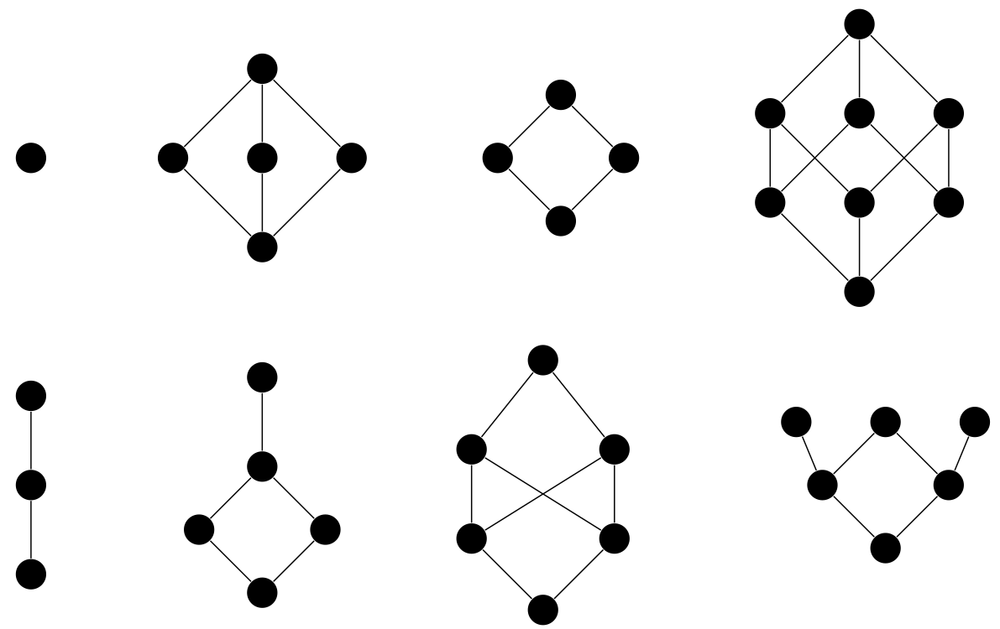
* Dualer Verband: Tausche $$\sqcap$$ und $$\sqcup$$
* Distributiver Verband
   * $$x \sqcap (y \sqcup z) = (x \sqcap y) \sqcup (x \sqcap z)$$
   * $$x \sqcup (y \sqcap z) = (x \sqcup y) \sqcap (x \sqcup z)$$
* Vollständiger Verband: Für jede Teilmenge existieren $$\sqcap, \sqcup$$ immer noch
   * Dann existieren auch Minimum $$\bot$$ (kleinstes Element) und Maximum $$\top$$ (größtes Element)
   * Endliche Verbände sind automatisch vollständig
* *Höhe* von Verbänden
   * Verbände endlicher Höhe müssen nicht endlich sein
   * Besitzen immer $$\top, \bot$$
* Kombinieren von Verbänden
   * Produkt
      * karthesiches Produkt der einzelnen Mengen
      * $$\sqcap, \sqcup$$ komponentenweise
      * Resultierende Höhe ist $$(\sum_{i = 1}^{n}{H(V_n) - 1}) + 1$$
   * Summe
      * Verbinde Verbände lediglich durch neues $$\top, \bot$$
      * Neue Höhe also $$max_i(H(V_i))$$
* Monotone Funktionen
   * In Verbänden hat jede monotone Funktion `f` einen *kleinsten* Fixpunkt
   * Zu `f` existiert außerdem ein k für das $$f^k(\bot) = f^{k+1}(\bot)$$
   * Dann ist außerdem $$f^k(\bot)$$ der kleinste Fixpunkt von `f`
* Fixpunktberechnung
   * Kostenfaktoren:
      1. Verbandshöhe
      1. Berechnungskomplexität `f`
      1. Komplexität Gleichheitsvergleich
   * z.B. für das Lösen von Gleichungssystemen über monotonen Funktionen
* Algorithmen
   * Naiv
   * Chaotic Iteration
      * Ähnlich wie naiv, aber da man die $$x_i$$ hintereinander berechnet, können zur Berechnung eines bestimmten $$x_i$$ bereits die $$x_1, ..., x_{i-1}$$ benutzt werden
   * Worklist
      * 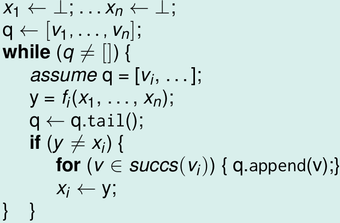
      * `q` ist alse eine Queue, es wird immer der Head angeschaut und wenn dieser sich ändert werden alle Nachfolger des Head-Knotens wieder in die Queue gepusht
      * Verbesserungen: Topologische Sortierung, innere Schleifen zuerst stabilisieren
* Galois Verbindung
   * Definition
      1. $$\alpha: P \longrightarrow Q$$
      1. $$\gamma: Q \longrightarrow P$$
      1. $$x \le y \Longrightarrow \alpha(x) \ge \alpha(y)$$
      1. $$u \le v \Longrightarrow \gamma(u) \ge \gamma(v)$$
      1. $$x \le \gamma(\alpha(x)) \land u \le \alpha(\gamma(u))$$
   * Lemma:
      * $$(\alpha, \gamma)$$ Galois-Verbindung gdw $$x \le \gamma(u) \Longleftrightarrow u \le \alpha(x)$$
   * Lemma:
      * $$\alpha(x) = \alpha(\gamma(\alpha(x)))$$ und $$\gamma(u) = \gamma(\alpha(\gamma(u)))$$
      * $$\alpha \circ \gamma$$ und $$\gamma \circ \alpha$$ sind also Identitäten auf den Bildern von $$\alpha$$ bzw $$\gamma$$
   * Korollar: $$\alpha \circ \gamma$$ und $$\gamma \circ \alpha$$ sind Hüllenoperatoren

### Dominanz
* Programmanalyse ist
   * Sicher: Semantik bleibt erhalten
   * Effizient: gute Geschwindigkeit/wenig Resourcenbedarf
   * Approximation!
      * Genaue Menge unentscheidbar
      * Err on the safe side
* Korrektheitsbedingung Kontrollflussgraph
   * Enthält alle Pfade von **Start** zu **Ende**, die ein Programm bei der Ausführung durch die Grundblöcke nehmen kann
   * Kann auch mehr Pfade enthalten: Überapproximation
* Dominanz/Postdominanz
   * Dominanz $$\preceq$$
      * $$X \preceq Y$$: Alle Wege von **Start** zu **Y** enthalten **X**
      * Reflexiv, transitiv, antisymmetrisch: $$\preceq$$ ist Halbordnung
      * Strikte Dominanz $$X \prec Y$$: $$X \neq Y$$
      * Direkte (immediate) Dominanz $$X idom Y$$: Es gibt kein Z zwischen X und Y sodass $$X \preceq Z \land Z \preceq Y$$
   * Postdominanz **postdom**
      * $$Y postdom X$$: Alle Wege von **X** zu **Ende** enthalten **Y**
* Kontrollflussregion: Bereich zwischen X und Y, die immer zusammen ausgeführt werden
* Strukturiertes Programm: Konstrukte haben genau einen Eintritts- und Austrittspunkt
* Dominanzbaum: liefert Schachtelung von Schleifen/Ifs etc.
* $$dom(X) = \lbrace X\rbrace \cup \bigcap_{Y \in pred(X)}{dom(Y)}$$ 
* Dominatoren berechnen über Fixpunktiteration (O(n²) bis O(n³))
   * Verband: Potenzmengenverband der Grundblöcke
   * $$f_i(z_1, z_2, \ldots z_n) = \lbrace x_i \rbrace \cup \bigcap_{x_j \in pred(x_i)}{z_j}$$

### Datenflussanalyse
* Sichtbare Definitionen
   * Gesucht: $$in(B) = \lbrace d \in D \mid d\ erreicht\ B\rbrace$$
   * Gen/Kill Mengen
   * Kill: $$kill(B) = \bigcup_{x \in Vars}{D_x \setminus (gen(B) \cap D_x)}$$
   * Effekt jedes Grundblocks: Transferfunktion $$f_B(X) = gen(B) \cup (X \setminus kill(B))$$
   * $$in(B) = \bigcup_{C \in pred(B)}{out(C)}$$
   * $$out(B) = f_B(in(B))$$
   * Damit Gleichungssystem aufstellen über die Mengen und Fixpunktiteration
      * Darstellung mittels Bitvektoren: Von in nach out durch Veroderung mit $$gen()$$ und Verundung mit $$\lnot kill()$$
* Verband der Abstrakten Werte ???
   * Transferfunktionen
      * Zu jedem Grundblock B, die die Wirkung von B beschreibt
      * Forderungen
         * Es lässt sich eine Identität / neutrale Transferfunktion angeben für einen Grundblock
         * Alle Tranferfunktionen zu Blöcken sind monoton
         * Transferfunktionen sind unter Verknüpfung ($$\circ$$) abgeschlossen
         * $$f_B \sqcup f_{B'} \in F$$ (Punktweises Supremum) ???
         * evtl $$f_B(x \sqcup y) = f_B(x) \sqcup f_B(y)$$ (Distributivität, bzw. eher Linearität ???)
      * z.B. Beweis wieso "Sichtbare Definitionen" Transferfunktionen monoton und distributiv sind
* Verband für Konstantenpropagation
   1. `undefined` = $$\bot$$
   1. Bekannter Wert
   1. Mehrere mögliche Werte `noconst` = $$\top$$
   * 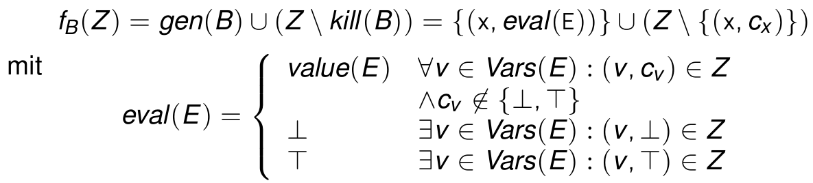
   * $$X \sqcup Y = \lbrace (v, a \sqcup b) \mid (v, a) \in X, (v, b) \in Y\rbrace \cup \lbrace (v, a) \in X \mid (v, a) \notin Y\rbrace \cup \lbrace (v, b) \in Y \mid (v, b) \notin X\rbrace$$
   * Nicht distributiv
* Korrektheit Fixpunktiteration (Kam, Ullman, 77) (Koinzidenztheorem ???)
   * Seien $$P_1, P_2, \ldots$$ alle Pfade von **Start** zu s
   * Seien Transferfunktionen $$f_B \in F$$ distributiv
   * Sei $$fix(s) \in L$$ der durch Fixpunktiteration für $$out(s)$$ berechnete Wert
   * Dann ist $$fix(s) = \bigsqcup_i{f_{P_i}(\bot)}$$
   * Einfacher gesagt:
      * Das richtige Ergebnis einer Verbandsanalyse für ein Programm finden wir, in dem wir uns alle möglichen Ausführungspfade anschauen und diese "zusammenlegen" (= Supremum bilden)
      * In der Praxis ist das natürlich nicht möglich (Turingvollständigkeit)
      * Wenn der Verband distributiv ist, dann findet die Fixpunktiteration uns aber genau diesen Wert
   * Falls nicht distributiv gilt nur $$\geq$$, d.h. Fixpunkt ist eine konservative Approximation
      * Beispiel sichtbare Definitionen: Weniger Definitionen als tatsächlich sichtbar ist falsch. Mehr Defitionen finden ist dagegen in Ordnung aber nur noch eine Approximation
   * Verallgemeinerung auf interprozedurale Analyse möglich
#### Interprozedural
* Call-Graphen
* Verbindung von Prozeduren
   * Call- und Ret-Extraknoten
   * Dazwischen CFG von augerufener Prozedur verbinden
* Kontextsesitivität
   1. Call Strings ??? !!!
      * Wie abgespeckter Activation-Record aus Aufrufstelle beziehen
      * Beschränkung auf Tiefe 1 oder 2, wegen Performanz und möglicher endlos-Rekursion
   1. Funktional ???
      * Nur endlich, falls Verband endlich
      * Präzise wie Call-Strings beliebiger Tiefe
   1. desweiteren Objekte, Assumption Sets, Kombinationen
   
#### Programmabhängigkeitsgraph (Program Dependency Graph, PDG)
* Datenabhängigkeit
   * `var(y)` und `uses(y)` Mengen
   * $$\exists d \in gen(x) : d \in in(y) \land var(d) \in uses(y)$$
* Kontrollabhängigkeit $$X \rightarrow Y$$
   * $$\exists$$ Pfad P von X nach Y in CFG, $$\forall Z \in P, Z \neq X, Z \neq Y : Y postdom Z \land \neg (Y postdom X)$$
* Konventionen:
   * Fett oder gestrichelt: Kontrollabhängigkeiten
   * Dünn bzw. durchgehend: Datenabhängikeiten
* Program Slicing
   * Rückwärtsslice $$BS(x) = \lbrace y \mid y \rightarrow^* x\rbrace$$
   * Slicing Theorem: Wenn es keinen Pfad $$x \rightarrow^* y$$ im PDG gibt, so kann *x* garantiert nicht *y* beeinflussen
* PDG interprozedural
   * Funktionaler Ansatz üblich (Call Strings möglich)
   * Summary-Kanten, falls möglicher Pfad in aufgerufener Funktion
* 2-Phasen-Slicing ???
   1. Aufsteigen, nicht absteigen. Merke ret-Knoten
   1. Absteigen, nicht aufsteigen

### Statische Einmalzuweisung (SSA, Static Single Assignment)
* Mehrfachzuweisungen durchnummerieren und nach Sichtbarkeit richtige Nummer auswählen
* $$\phi(\alpha_0, \alpha_1, \ldots)$$ Funktion wenn Pfade im CFG zusammenlaufen
   * ein Operand pro Vorgänger
   * wählt $$\alpha_k$$ aus, wenn G über k-te Kante betreten wird
   * Müssen am Anfang des Grundblocks stehen
   * Gleichzeitige Auswertung aller $$\phi$$-Funktionen
   * Rein theoretisch => In CodeGen wieder eliminieren
      * Zuweisung einfach zurück in die jeweiligen Blöcke ziehen (dann halt nicht mehr SSA)
      * Danach Copy-Propagation angebracht
      * ALternativ: Registerzuteilung, dann Registerpermutation
* Eigenschaften
   * Eine Zuweisung pro Variable, mehrfach ausführbar
   * Nur für aliasfreie lokale Variablen
   * Transformation praktisch linear (theoretisch quadratisch)
* Vorteile
   * Def-Use Analyse entfällt
   * Variablenfreie Darstellung möglich
   * Aus syntaktischer Gleichheit wird Wertgleichheit (bei arith. Ausdrücken)
      * gleiche Teilbäume vereinigen
   * Viele Analysen vereinfachen sich drastisch
* Dominanzgrenze
   * $$DG(X) := \lbrace Y \mid \exists P \in pred(Y) : X dom P \land \neg(X dom Y)\rbrace$$
      * Also die Menge an Zuständen Y, die einen Vorgänger P haben, der von X dominiert wird, die aber selbst nicht mehr von X dominiert werden
   * Dominanzgrenze von einer Menge M von Blöcken
      $$DG(M) := \bigcup_{X \in  M}{DG(X)}$$
   * Iterierte Dominanzgrenze $$DG^+(M)$$
      * $$DG_0 := DG(M)$$
      * $$DG_{i+1} := DG(M \cup DG_i)$$
   * Platzierung von $$\phi$$ an Dominanzgrenze
#### SSA Konstruktion
1. Naiv: Benutzte Variablen in jedem Grundblock mit $$\phi$$ "reinholen"
   * O(n²), n = Anzahl Variablen
   * Für praktisch alle Programme aber nur linear viele $$\phi$$ notwendig
1. Platzierung vorberechnen (Cytron)
   * Kontrollflussgraph und iterierte Dominanzgrenzen berechnen
   1. Dominanzgrenzen berechnen
   1. Für jede Variable v
      * Für jede Definition in einem Block B: Platziere $$\phi$$-Funktionen in Dominanzgrenze von B
      * Rekursion $$\Rightarrow$$ Iterierte Dominanzgrenzen
   1. Variablen umbenennen $$x \rightarrow x_i$$
      * Reihenfolge der Nummern entsprechend Ablauf des Dominatorbaums
      * Implizite Definition $$x_0$$ im Startblock
1. On-the-Fly (Click)
   * On-The-Fly Abhängigkeitsgraphen aufbauen
   * Keine Vorstufe zur Kontrollflussgraph- bzw. Dominanzgrenzenberechnung
   * Trick: Vorläufige $$\phi'$$-Funktionen, wenn noch nicht alle Vorgänger besucht
* Problem: Lost Copy
   * Kritische Kante: $$B_i \rightarrow B_j$$ kritisch, falls $$B_i$$ mehrere Ausgehende und $$B_j$$ mehrere eingehende Kanten hat
   * Wenn man blind $$\phi$$s durch in den vorherigen Block ziehen auflöst kann es sein, dass man dadurch den ursprünglich dort an einen anderen Nachfolger weitergegebenen Wert überschreibt
   * In diesem Fall bei kritischen Kanten einen extra BB dazwischenschalten, in dem die Zuweisung passiert
   * 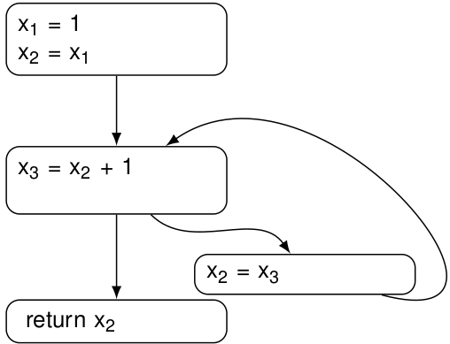
* Problem: Swaps
   * Wenn die SSA Form aufgelöst wird, können Schreiboperationen in $$\phi$$s deren Werte beeinflussen
   * 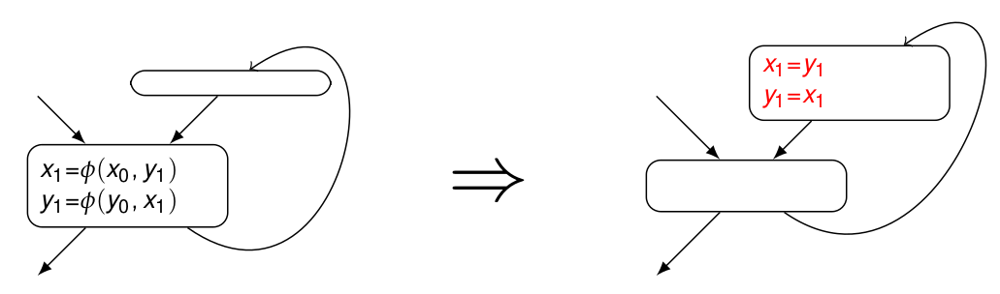
   
### Beispiele zu Optimierungen
* Beschreibung Datenflussanalyse
   * Verband
   * Richtung (Start -> End oder End -> Start)
   * Transferfunktion bzw. Gen/Kill Funktionen
   * Supremumoperation $$\sqcup$$:
      * May: $$\cup$$
      * Must: $$\cap$$
   * Initialisierung
      * May: $$\bot = \varnothing$$
      * Must: $$\bot = M$$
* Available Expression Analysis und Common Subexpression Elimination
   * Mit Verbandsangabe
* Loop Invariant Detection / Invariant Code Motion
* Sichtbare Definitionen
   * Mit Verbandsangabe
* Induktionsvariablen und Strength Reduction
* Copy Propagation
* Live Variables Analysis, Dead Code Elimination
   * Mit Verbandsangabe

## IFC (Information Flow Control)
* Safety (ungewollte Ereignisse) vs. Security (Angreifer)
* CIA: Confidentiality, Integrity, Availability
* Traditionelle Softwaresicherheit: Zertifikate, Zugriffskontrolle
* IFC: Ergänzung dazu. Prüft Quell-/Bytecode auf
   * Vertraulichkeit
   * Integrität
* Annahmen: Compiler, Betriebssystem, Hardware, ... sind sicher. IFC prüft nur Anwendungscode
* Angreifermodell

|kann|kann nicht|
|---|---|
|Programmcode lesen                  | Programmcode ändern               |
|öffentliche Ein-Ausgaben beobachten | geheime Ein-/Ausgaben beobachten  |
|öffentliche Eingaben tätigen        | geheime Eingaben tätigen          |
|beliebige Berechnungen durchführen  | physikalische Seitenkanäle nutzen |

* Deklassifikation
   * notwendig z.B. wenn Zuordnung Passwort -> korrekt für Nutzer
* Spezifikation
   * endliche Menge $$L$$ von Sicherheitsstufen
   * Relation $$\le \subset L \times L; l_1 \le l_2$$ besagt, dass Informationsfluss von $$l_1$$ nach $$l_2$$ erlaubt ist
   * Annotation $$lvl: Var \rightarrow L$$ weist vorkommender Variable Sicherheitsstufe zu
* Verband
   * $$(L, \le)$$ endlicher Verband
   * Insb. $$\bot := \sqcap L$$ und $$\top := \bigsqcup L$$
   * $$\bot$$ wird low genannt, $$\top$$ high.
* 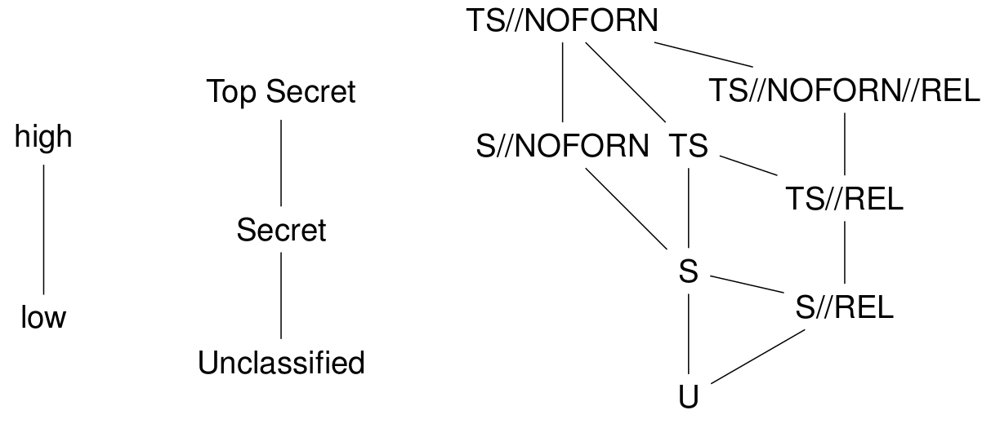
* Sequenzielle Nichtinterferenz
   * Notation:
      * `Var`: Variablenmenge
      * `Val`: Wertemenge
      * $$\Sigma = Var \rightarrow Val$$: Zustandsmenge
      * $$\sigma, \sigma', \ldots$$: Zustände
      * P, P`,...: (sequentielle) Programme
      * ⟦ P ⟧$$: \Sigma \rightarrow_p \Sigma$$: Semantik eines Programms (⟦ P ⟧$$(\sigma)$$: Zustand in dem P endet wenn es in Zustand $$\sigma$$ startet)
   * *l-Äquivalenz* $$\sim_l$$: $$\forall x \in Var : lvl(x) \le l \Rightarrow \sigma(x) = \sigma'(x)$$
      * Wenn alle Einträge im Zustand mit Sicherheitsstufen unter und gleich l den gleichen Wert haben
   * *l-Nichtinterferenz*: c ist l-nichtinterferent gdw. $$\forall \sigma, \sigma': \sigma \sim_l \sigma' \Rightarrow$$ ⟦ c ⟧$$(\sigma) \sim_l$$⟦ c ⟧$$(\sigma')$$
      * Intuitiv: Wenn man nur Zugriff auf Zustandseinträge mit niedrigen Sicherheitsstufen hat, sieht man bei gleichen Werten mit solchen Stufen als Eingabe auch die gleiche Ausgabe bei Werten dieser Stufe
   * *Sicherheit*: c heißt sicher falls c l-nichtinterferent für alle $$l \in L$$
   * *low-Äquivalenz* $$\sim_{low}$$: Wenn $$\forall \sigma, \sigma': lvl(x) = low \Rightarrow \sigma(x) = \sigma'(x)$$
      * Deswegen alternative Definition Sicherheit: $$\sigma \sim_{low} \sigma' \Rightarrow$$⟦ c ⟧$$(\sigma) \sim_{low}$$⟦ c ⟧$$(\sigma')$$
* Qualitätsanforderungen
   * Korrektheit: Analyse sagt, es gibt keine Lecks $$\Rightarrow$$ es gibt keine Lecks
      * In der Praxis nur schwer erreichbar (Reflection, Callbacks...)
   * Präzision
      * Wenig falsche Alarme
      * Satz von Rice: Falsche Alarme nicht vermeidbar
   * Skalierbarkeit (Gerschwindigkeit, Resourcenverbrauch)
   * Benutzbarkeit
      * Benutzer soll wenig annotieren müssen
   * Volle SPrachunterstützung
      * In der Praxis genutze Programmiersprachen sollen möglichst voll unterstützt werden

### Typsysteme
* Valpano-Smith
   * Syntax
      * x: integer Variablen
      * n: integer Literale
      * e: Expressions im Allgemeinen
         * $$e ::= a \mid b$$
      * a: Arithmetische Ausdrücke
         * $$a ::= x \mid n \mid a + a' \mid a - a'$$
      * b: bool Ausdrücke
         * $$b ::= true \mid false \mid a$$<$$a'\mid b \land b' \mid b \lor b' \mid \neg b$$
      * c: Programme
         * $$c ::= x := e \mid c;c' \mid if\ b\ then\ c_{true}\ else\ c_{false} \mid while\ b\ do\ c_{true}$$
      * p: Programmphasen
         * $$p ::= e \mid c$$
   * Typen
      * $$lvl \vdash x : \tau\ var$$: x hat Sicherheitsstufe $$\tau$$.
      * $$lvl \vdash e : \tau$$: e enthält nur Variablen der Sicherheitsstufe $$\geq \tau$$.
      * $$lvl \vdash c : \tau\ cmd$$: c ist sicher und schreibt nur Variablen der Sicherheitsstufe $$\le \tau$$
   * Typ-Regeln
      * 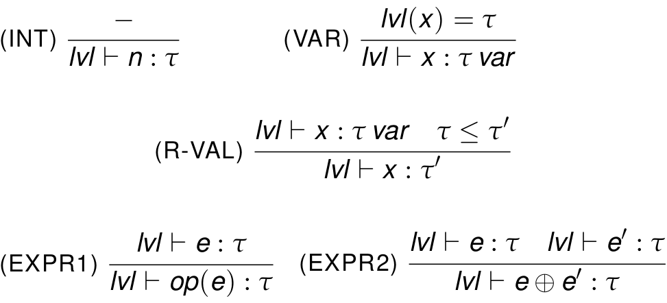
      * Intuitiv: $$lvl \vdash e : \tau \Rightarrow$$ e enthält nur Variablen der Sicherheitsstufe $$\le \tau$$
      * 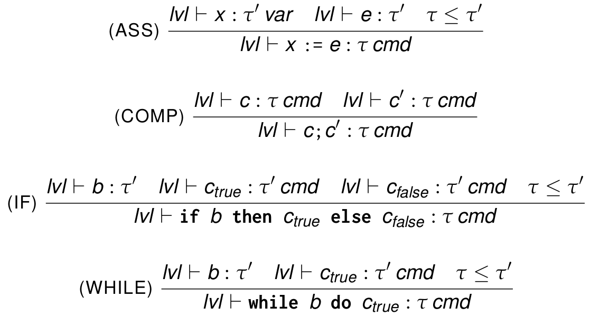
      * Intuitiv: $$lvl \vdash c : \tau \Rightarrow$$ c ist sicher und schreibt nur Variablen mit Sicherheitsstufe $$\le \tau$$
   * Eigenschaften des Typsystems
      * Notation:
         * $$fv(e)$$: In e vorgekommene freie Variablen
         * $$lhs(c)$$: In c zugewiesende Variablen
      * Satz (Simple Security)
         * $$lvl \vdash e : \tau \Rightarrow \forall x \in fv(e) : lvl(x) \le \tau$$
            * Insb. wenn ein Ausdruck eine high-Variable enthält, so ist sein Sicherheitstyp auch high
      * Satz (Confinement)
         * $$lvl \vdash c : \tau\ cmd \Rightarrow \forall x \in lhs(c) : lvl(x) \ge \tau$$
            * Insb. wenn c vom Typ *high cmd* ist, so kommen in c keine Zuweisungen an low-Variablen vor ("no write down")
   * Korrektheit
      * Satz (Typisierbarkeit garantiert Nichtinterferenz)
         * Angenommen $$lvl \vdash c : \tau_0 \ cmd$$
         * Angenommen $$c terminiert \sigma_1, \sigma_2$$
         * $$\forall \tau : \sigma_1 \sim_\tau \sigma_2 \Rightarrow$$⟦ c ⟧$$(\sigma_1) \sim_\tau$$⟦ c ⟧$$(\sigma_2)$$
         * Kurz: Lässt sich c im Volpano-Smith-Typsystem irgendwie typisieren, so ist c $$\tau$$-nichtinterferent für jedes $$\tau$$.
         * Beweis über Induktion nach dem Aufbau von c
            * Freie Variablen Lemma: Wenn zwei Zustände l-Äquivalent ist auch die Auswertung eines Ausdrucks damit l-Äquivalent
            * Lemma 42: Ein Ausdruck einer niedrigen Sicherheitsstufe $$\tau'$$ wertet für alle $$\tau$$-äquivalenten Zuständen gleich aus wenn $$\tau' \le \tau$$
               * Beweis "Ausdruck fasst ja nichts $$> \tau'$$ an"
            * Nur-Lese-Lemma: Wenn x von c nicht geschrieben wird ist ⟦ c ⟧$$(\sigma)(x) = \sigma(x)$$
   * 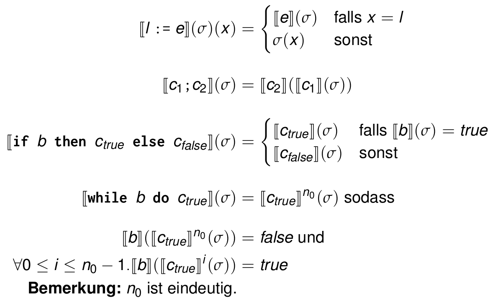
### PDG-basierter IFC-Check
* c: Programm
* G = $$(N, \rightarrow)$$ ein PDG
* $$(L, \le)$$ ein Sicherheitsverband
* $$P, R: N \rightarrow L$$ Annotationen mit Sicherheitsstufen
   * R ("Required): wie vertraulich dürfen in n fließende Informationen höchstens sein?
   * P ("Provided"): Wie vertraulich sind aus n herausfliesende Informationen mindestens?
* (P, R)-Sicherheit:
   * $$\forall n \in N, \forall a \in N: a \in BS(n) \setminus \lbrace n \rbrace \Longrightarrow P(a) \le R(n)$$
   * Anweisung soll a nur dann beeinflussen können, wenn $$P(a) \le R(n)$$, d.h. wenn die Informationen, die a verlassen, höchstens so vertraulich sind, wie n es erwartet!
* Beobachtung:
   * $$\forall n \in N: \bigsqcup_{a \in BS(n)} P(a) \le R(n)$$
* Daher:
   1. Berechne $$S(n) := \bigsqcup_{a \in BS(n)} P(a)$$ für jedes $$n\in N$$
   1. Prüfe $$S(n) \le R(n)$$ für jedes $$n \in N$$
* Berechnung von S
   * Es gilt $$BS(n) = \lbrace n \rbrace \cup \bigcup_{n' \rightarrow n} BS(n')$$
   * Daraus folgt für S
      1. $$S(n) \ge P(n)$$
      1. $$S(n) \ge \bigsqcup_{n' \rightarrow n} S(n')$$
   * S ist die kleinste Lösung des durch (1) und (2) definierten Ungleichungssystems $$\Rightarrow$$ Lösung durch Fixpunktiteration
* Trick: Im PDG werden Knoten (Anweisungen/Ausdrücke) annotiert, bei normaler IFC-Spezifikation aber Variablen
   * In anderen Worten: In IFC-Spezifikationen gibt es die Funktion, die Variablen initiale Sicherheitsstufen zuweist `lvl(x)`
   * Im PDG wird diese Information als eigene Knoten $$n^l_{init}, l \in L$$ repräsentiert mit Datenflusskanten in Nutzer der Variablen
   * Außerdem fügen wir noch Knoten $$n^l_{final}, l \in L$$ ein, durch die für jede Variable die letzte Zuweisung nochmal mit dem entsprechenden Sicherheitslevel annotiert wird
* Satz
   * $$(\forall l_1, l_2 \in L: l_1 \nleq l_2 \Rightarrow n^{l_1}_ {init} \notin BS(n^{l_2}_ {final}) \Longrightarrow$$ c ist nichtinterferent
   * 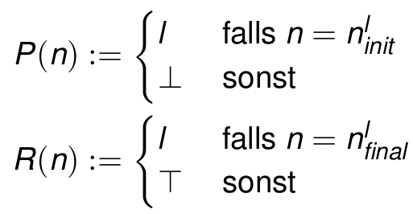
   * Ist c (P, R)-sicher, so gilt $$\forall l_1, l_2 \in L: l_1 \nleq l_2 \Longrightarrow n^{l_1}_ {init} \notin BS(n^{l_2}_ {final})$$
      * Nach Satz von vorhin impliziert dies, dass c nichtinterferent ist
* Ausblick
   * Bisherige Flussgleichungen zu unpräzise: Deswegen 2-Phasen Slicer
   * objekt-sensitiv: Objekte von selber Klasse unterscheiden
   * IFC für nebenläufige Programme
      * Manchmal Konflikte nur bei bestimmte Ausführungsreihenfolgen (interleavings)
      * Thread-Verzögerung (und damit Ausführungsreihenfolge) von geheimem Wert abhängig => Leak

## x86
* Programmiermodell
   * CPU: Register, MMU
   * RAM
   * Interrupt-Controller
   * Peripherie
* Register
   * 8 General-Purpose Register A, B, C, D, SI, DI, BP, SP
      * Für 32-Bit mit E-X erweitert, also EAX, EBX, ECX, EDX, ESI, EDI, EBP, ESP
      * 16-Bit ohne E
      * 8-Bit mit H oder L als Suffix
   * Flags
      * CF: Carry
      * ZF: Zero
      * SF: Sign (höchstwertiges But im Ergebnis ist gesetzt/negativer Wert)  
      * OF: Overflow
   * Sementregister CS, DS, SS, ES, FS, GS
   * Instruction Pointer (EIP)
   * x87 Register ST0-ST7 als Stack
   * weitere...
   * Erweiterung MMX: MM0-MM7 (64 Bit) als 8/16/32/64 Bit Integrer-Vector
   * Erweiterung SSE: XMM0-XMM7 (128 Bit) als 32 oder 64 Bit float Vector oder 8/16/32/64-Bit Vector
   * x86-64: Insgesamt 16 General Purpose Register
      * RAX, RBX, RCX, RDX, RBP, RSI, RDI, RSP, R8-R18
      * Auch als 32/16/8-Bit Formen
      * 16 SSE-Register
   * Erweiterung AVX: YMM0-YMM15 (256 Bit)
   * Erweiterung AVX-512: ZMM0-ZMM31 (512 Bit)
* Vergleichsoperatoren

|Operator|Unsigned|Signed|
|---|---|---|
|$$<$$   |B |L |
|$$\leq$$|BE|LE|
|$$=$$   |E |E |
|$$\neq$$|NE|NE|
|$$>$$   |A |G |
|$$\geq$$|AE|GE|

* CISC vs RISC
   * x86 ist CISC
   * 2-Adress-Code: Ziel ist gleich einem der Quelloperanden
   * Intern Übersetzung nach RISC-Code
* Mögliche Adressberechnungen
   * `addr = Const + Base + Index * Scale`
* Syntax:
   * Literale: `$123`
   * Register: `%rax`
   * Addresse (maximal): `Const(Base,Index,Scale)`
   * Befehlssuffixe für Wortbreiten: b, w, l, q
      * `b`yte (8Bit)
      * `w`ord (16Bit)
      * `l`ong (32Bit)
      * `q`uadword (64Bit)
   * Beispiel: `xorq %rax, %rax`
* Direktiven
   * Labels `name:`
   * Export/Import (Linker löst auf): `.globl name`
   * Daten/Code Segment: `.data`, `.text`
   * Datenwerte: `.byte`, `.word`, `.long`

### Grundlegende Befehle
* `mov`: Kopieren
* `add`
* `sub`
* `neg`
* `inc`
* `dec`
* `imul`
* `mul`: unsigned Multiplikation nach RAX:RDX
* `div`: Eregebnis in RAX:RDX
* `and`
* `or`
* `xor`
* `not`
* `shl`: Linksshift
* `shr`: Rechtsschift
* `sar`: signed Rechtsshift
* `jmp`
* `cmp`
* `jCC`: Bedingter Sprung
* `setCC`: Register abhängig von Testergebnis setzen
* `call`: Unterfunktion aufrufen
* `ret`: Aus Funktion zurückkehren
* `push`: Auf den Stack legen, RSP vermindern
* `pop`: Vom Stack nehmen, RSP erhöhen
* `int`: Interruptroutine aufrufen (z.B. für Syscalls)
* `lea`: Eigentlich für Adressrechnung
   * Da Argument 1 eine Adressberechnung mit beliebigen Werten sein kann und Argument 2 das Ausgaberegister darstellt, wird es häufig als mächtiges `add` verwendet (oder `mul` mit Konstante)
   
### Funktionsaufruf
* RSP Stackpointer, RBP Basepointer
* System V ABI
* call: Rücksprungadresse auf den Stack, springt zu Ziel
* 16-Bit Alignment für RSP+8 beim Funktionseintritt
* Argumente: Erste 6 in Register, dann Stack
* Rückgabewert in RAX (XMM0)
* Aufrufer räumt Argumente weg
### Optimierungsmöglichkeiten
* Registerallokation (!)
* Ausnutzen von Adressierungsmodi
* Alignment von Funktionen, Schleifen (auf Cachezeilen)
* Zugriffe mit kleinen Bitbreiten vermeiden
* SSE
   * Nachteil: Code läuft nur auf modernen Prozessoren

## Codeerzeugung
### ... für Ausdrucksbäume
* Historisch: Keine Phasentrennung
#### Ershov-Verfahren
* Zur direkten Erzeugung von Code mit minimalem Registerverbrauch bei homogenem Registersatz
* Traversierung des AST in Postfix-Ordnung zur Registercodeerzeugung
   * Beobachtung: Unterschiedliche Befehlsfolgen mit gleicher Semantik haben unterschiedlichen Registerbedarf
* Ershov-Prinzip: Wenn immer Operand mit **größtem Register-/Stackbedarf** berechnet wird, ist Register-/Stackbedarf minimal
* Ershov-Zahlen: Geben Register/Stackhöhe an, die zur Auswertung eines Ausdrucks benötigt wird
   1. Für Blätter $$E \leftarrow 1$$
   1. Bei 2 Kindern mit $$E_1, E_2$$:
      1. $$E \leftarrow E_1$$, falls $$E_1 = E_2$$
      1. $$E \leftarrow max(E_1, E_2)$$, sonst
* Codeerzeugung:
   * 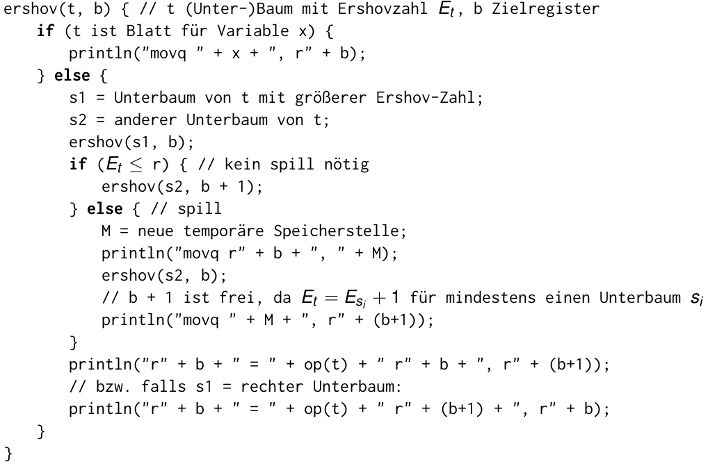
   * ??? Was passiert wenn `b` größer `r` wächst?
   * Optimierungsmöglichkeit auf x86: Speicherladeoperationen vermeiden durch angabe der Adressen direkt als Operanden
* Optimalität der Postfixform
   * Normalform von Programmen wenn
      1. abwechselnd Speicheroperationen `S` und Befehlsfolgen ganz ohne Speicheroperationen `P` passieren
      1. alle Register nach Speicheroperationen frei sind
   * Starke Normalform: Wenn in jede Anweisung in einem P Operanden für eine nachfolgende Anweisung bereitstellt
   * Starkes Normalformtheorem
      * Wenn die Größe aller Operanden und Zwischenergebnisse eines Ausdrucks der Registergröße entspricht, gibt es ein optimales Programm in starker Normalform, das diesen Ausdruck berechnet
      * Ershov-Code ist immer in starker Normalform
      * Probleme mit Fließkommazahlen:
         1. Multiplikation kann doppelt so breite Ergebnisse berechnen wie Operanden breit sind
         1. Division berechnet typischerweise sowohl Ergebnis als auch Rest und kann extrabreite (zusammengesetzte Register) Operanden benutzen
#### Algebraische Vereinfachungen
1. Von Blättern zur Wurzel zu allen Knoten die Kosten für verschiedene Darstellungen berechnen
   * Einmal als positives und einmal als negatives Ergebnis, um mehr Auswahl an algebraischen Alternativen zu erhalten
   * Operanden-Vertauschung auch zu beachten wenn angebracht
1. Von Wurzel zu Blättern die günstigesten Darstellungen wählen und entsprechenden Code (auch für Operanden) erzeugen
* ??? Ich habe hier irgendwie schon Baumersetzung beschrieben. Parallelen?
   * Traversierung nach unten abgesehen von CodeGen notwendig?
* Tabelle für Algorithmus
   * 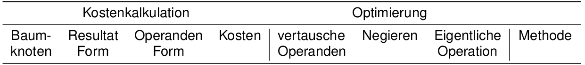

### Befehlsauswahl
#### Makrosubstitution
* Erstes Makro aus Liste wird angewandt
* Makros können Argumente untersuchen
* Ungeeignet für Ausnutzung komplexerer Maschineneigenschaften
* Entscheidungstabelle
   * Strukturierte Möglichkeit, Ersetzungsregeln anzugeben
#### Baumersetzungsverfahren (BUPM)
* Bottom-Up Pattern Matching (BUPM)
* Annotationen: ( # Regel , Kosten )
* Knotenkosten: 1 + Summe der Kosten der Kinder
* Regeln:
   1. $$R_i \leftarrow C_a;$$`movq $a, Ri`
   1. $$R_i \leftarrow M_x;$$`movq x, Ri`
   1. $$M \leftarrow =(M_x, R_i);$$`movq Ri, x`
   1. $$M \leftarrow =(ind(R_i), R_j)$$;`movq Rj, 0(Ri)`
   1. $$R_i \leftarrow ind(+(C_a, R_j));$$`movq a(Rj), Ri`
   1. $$R_i \leftarrow +(R_i, ind(+(C_a, R_j)));$$`addq a(Rj), Ri`
* Vorteile
   * O(n * Anzahl Regeln * Matching einer Regel)
   * Leicht auf andere Zielplattformen übertragbar
#### Kontextfreie Grammatiken
* Idee: Termersetzung mit kontextfreien Grammatiken
* Eingabe: Aiusdrucksbaum in Präfixform
* Mit jeder Produktion eine Codeerzeugungsaktion verknüpfen
* Dann parsen des Baums mit SLR(1)-Parser
   * Problem: (gewollt) hochgradig mehrdeutig
   * Shift vor reduce => große Muster bevorzugen
   * Weitere Konflikte mit Kostenfunktion auflösen
#### Termersetzungssystem (TES)
* Allgemeiner als kfGs
* Termalgebra $$T = (V, \Sigma)$$ mit V: Variablen und $$\Sigma$$: Funktionssymbolen
* $$TES \subseteq T \times T$$
* Grundtermersetzungssystem GTES
   * In Regeln kommen keine Variablen vor
   * ABleitung $$t \Rightarrow^* t'$$ effizient berechenbar
   * kann aus TES erzeugt vor
      * Ersetze in TES-Regeln alle Variablen durch Grundterme
      * GTES heißt dann *Instanz* des TES
   * Definiere $$L(TES, Z) = \lbrace t\mid t \Rightarrow^* Z\rbrace$$
      * Gesucht GTES mit L(GTES, Z) = L(TES, Z) für alle Z
      * unentscheidbar, aber berechenbar (Knuth-Bendix Algorithmus)
      * Test auf Vollständigkeit L(GTES) = L(TES) effizient möglich
   * Konstruktion
      * Prinzip: ersetze Regel $$l \rightarrow r$$ durch  potentiell unendlich viele Regeln $$l\sigma \rightarrow r\sigma$$ für alle benötigten Substitutionen $$\sigma$$
   * BUPM ist ein GTES
      * Nachteil: Viele fast duplizierte (ähnliche) Regeln notwendig
#### Bottom-Up Rewrite System (BURS)
* ALternative: Backend Generator (BEG)
   * Spec in TES
   * Kompaktere Spec durch polymorphe Regeln
   * Suche nach globalem Optimum NP-vollständig => Heuristik
   * Generierung von GTES
   * Kompakte Spec und hohe Effizienz
#### DAG- und Graphersetzungsverfahren
* In IR-Tripelcode häufig keine Bäume sondern DAGs
   * z.B. durch Common Subexpression Elimination
* DAGs nicht so effizient zu verarbeiten wie Bäume
* Grundsätzlich wie BUPM:
   1. Regeln mit Kosten
   1. Muster suchen
   1. Überdeckung mit minimalen Kosten berechnen
   1. Befehle nach gewählten Regeln auswählen
* Erweiterung: graphbasiert (mit Zykeln!)
   * nützlich für Schleifen
#### Peephole-Optimierungen
* Schiebe Fenster über bereits generierten Code
* Falls Fenster einem Muster, zu dem es eine günstigere Entsprechung gibt, entspricht, ersetze durch die günstigere Variante
* Unabhängig von der Befehlsauswahl (gut für Phasentrennung)
   
### Registerzuteilung
* Registerklassen
   * Einteilung von Registern in Klassen mit ähnlichen Beschränkungen
      * Integer, Float, Spezial
   * Klasse separat betrachten
* Wann?
   * Nach Befehlsauswahl
      * Befehlsauswahl-Kosten von Registerzuteilung abhängig
      * Spill-Code von Zuteilung abhängig
      * Bestimmter Code nur mit bestimmten Registern auswählbar
   * Vor der Befehlsauswahl
      * Befehle definieren Anzahl benötigte Register
      * Befehlsauswahl kann Hilfsvariablen oft droppen (z.B. `lea`) - diese wären vorher Registerverschwendung
   * 3-Stufig: Auswahl - Zuteilung - Auswahl
   * On-the-Fly
* Wo?
   * Ausdrücke
   * Grundblöcke
   * Schleifen
   * Funktionen
   * Programme
* Aufgaben
   * Zuteilen
   * Auslagern
   * Verschmelzen
   * Beschränkungen einhalten
* Lebendigkeit
   * Von Einlesen bis zur letzten Nutzung (auch vor Neuzuweisung)
* Interferenz
   * Wenn 2 Variablen gleichzeitig lebendig sind
   * Dann müssen sie in unterschiedlichen Registern leben
* Auslagern
   * Nach Definition sichern
   * Vor Verwendung laden
   * => Minimale Lebenszeit in Registern
* Auswahl Auslagerung: Kostenmaß
   * Neuberechnung möglich?
   * Seltene Nutzung?
   * Interferenz mit vielen anderen?

#### Mit Freiliste (On-the-Fly)
* Hilfsfunktionen `allocReg` und `freeReg`
1. Basicblock von Anfang bis Ende durchlaufen
1. Falls Register benötigt: `allocReg`
1. Nach letzter Verwendung: `freeReg`
1. `Store` für alle Variablen am Ende des Grundblocks
* Exceptions wenn kein Register mehr frei
* Separate Implementierung für jede Registerklasse
* Kombination mit globalen Methoden
   * Basicblock-lokale Variablen erst lokal zuteilen
   * Übrige Variablen mit globalem Verfahren zuweisen
   * Lokales Verfahren mit Befehlsauswahl kombinieren
* Daraus entstehende Vorteile:
   * Gutes Lokalitätsverhalten von Grundblöcken ???
   * Keine reduntanten `store`s und `load`s mehr an Basicblock Grenzen
#### Linear-Scan
* Erweiterung von on-the-fly
* Übernimmt selbst die Anordnung der Grundblöcke
* Umgekehrte Postfixordnung ergibt topologische Sortierung
* Grundidee: Längste Lebendigkeit hat meiste Interferenzen => Auslagern!
   * Lebenslinien an topologische Sortierung malen: Auch auf Blöcke, die lediglich eine Rücksprung zu einem Block haben, der eine Verwendung bewirkt
   * Beachte: Wegen 2-Register-Code kann ein Register schon während der letzten Nutzung des aktuellen Wertes als Operand frei werden 
* Verbesserungen:
   * Mehrere Intervalle pro Variablen: Ausnutzen von Lücken in den Lebenszeiten
   * Register-Limitations behandeln
   * Kein Freihalten von Registern für Reloads; stattdessen neue Intervalle erzeugen
   * Zusätzliches Splitten von Intervallen, z.B. vor und nach Schleifen
#### Graphfärben (Chaitin 1981)
* Interferenzgraph
   * Knoten: Variablen des Programms
   * Kante falls Variablen interferieren
* Färben mit minimaler Farbanzahl (chromatische Zahl $$\chi(G)$$
   * Liefert gleichzeitig minimale Registerzahl und Registerzuteilung
* NP-vollständig
* Lineare Heuristik
   1. Wähle Knoten mit n mit $$Grad(n) < r$$
   1. Wenn nicht möglich, unsicher ob k-Färbbarkeit gegeben -> Auslagern
   1. Sonst n und seine Kanten eliminieren
   1. Wenn alles wegeliminiert: Knoten in umgekehrter Eliminierungsreihenfolge färben
* Wenn kein Knoten mit $$Grad(n) < k$$ existiert:
   * So lange Knoten entfernen, bis es einen gibt
   * Entfernte Knoten werden in Speicher ausgelagert
   * Anschließend nochmal versuchen, Graph aufzubauen
   * 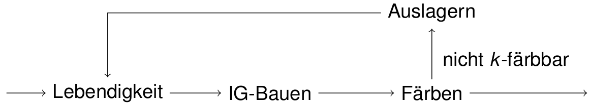
* Verbesserung: Optimistisches Färben (Briggs)
   * Beispiel: Quadrat (2-Färbbar, aber ohne Knoten mit Grad < 2)
   * Nicht direkt auslagern, sondern erst nur eliminieren und erst am Ende, wenn keine Farbe verfügbar, auslagern
* Weitere Verfahren (Zusatz ???)
   * Chaitin/Briggs
   * Hack/Goos
      * Teilgraph vs. Untergraph (<- mit induzierten Kanten)
      * Chordale Graphen: Enthält keine Zyklen > 3 als Untergraph / Jeder Zyklus länger 3 hat eine Sehne
      * Chordale Graphen sind perfekt, d.h. größte Clique = Anzahl benötigte Farben
      * SSA-IGs sind chordal
      * { jetzt viel geskippt: Perfektes Eliminationsschema PES, Dominanz, ... }
      * $$\chi(IG)$$ ist exakt durch Anzahl lebendiger Werte an Programmstellen festgelegt
         * Reduktion der Anzahl lebendiger Werte auf k macht k-färbbar
         * Auslagern also vor Färben durchführbar und Färbung gelingt danach stets
* Was auslagern?
   * NP-vollständig
   * Weder vor noch zwischen $$\phi$$ Auslagern möglich
      * daher in vorausgehenden Blöcken auslagern
      * $$\phi$$s mit nur ausgelagerten Werten brauchen kein Register
   * Belady-Heuristik: Bevorzuge Werte deren Benutzung am weitesten in der Zukunft
      * Metrik für "weit in der Zukunft"?

#### SSA Abbau (Zusatz ???)
* Klassisch: In den Predecessor ziehen (siehe vorher)
* Hier aber anders:
* Betrachte als *parallele Kopierinstruktion* pro eingehende Kante
   * Dadurch ergibt sich eine Art Permutations-Schema auf Variablen des Predecessors
* Permutationen realisierbar über
   * Kopien (benötigt Hilfsregister)
   * Transpositionen
      * Eigener Befehl
      * 3 `xor` Anweisungen
* Sequentielle Kopien vs. parallel (wie $$\phi$$ in der Theorie)
   * Lebenszeiten überlagern sich bei sequenziellen Kopien
* Kopierinstruktionen minimieren: Verschmelzung
   * Problem: Nicht-chordale Graphen
   * Finde k-Färbung, die so vielen $$\phi$$-Operanden wie möglich die gleiche Farbe zuweist
      * NP-vollständig
      * Lösung über Greedy-Heuristik oder Integer Linear Programming (ILP)
      * {skip}
* Schlussfolgerung
   * SSA-Aufbau erzeugt Kopien ($$\phi$$-Funktionen sind Kopien auf Steuerflusskanten)
   * Diese Kopien “zerreißen” den IG
   * Knoten werden durch stabile Mengen (von Knoten) ersetzt
   * Zyklen im IG werden aufgebrochen
   * Der IG wird chordal
   * SSA-Abbau verschmilzt aggressiv Kopien ohne die Anzahl der noch verfügbaren Register zu beachten
   * Stabile Mengen werden zu Knoten
   * Möglicherweise werden Zyklen erzeugt
   * Dadurch kann sich die chromatische Zahl erhöhen

#### Zusammenfassung
* Registerzuteilung ist NP-vollständig
* Hack/Goos liefert ein polynomielles Verfahren zur Graphfärbung, das die Registerzuteilung in 3 sequentielle Einzelschritte zerlegt
* Verschmelzung und Auslagerung bleibt aber NP-vollständig
* Selbst bei Verwendung heuristischer Verfahren kann die Registerzuteilung den Großteil der Übersetzungszeit brauchen
* Für große Graphen liefert linear-scan in vielen Anwendungsszenarien schneller eine brauchbare Lösung
* Ein weiterer Ansatz: Formulierung als ganzzahliges lineares Programm (ILP) (langsam)
* Das Zusammenspiel der zielmaschinenabhängigen Optimierungen ist offen

### Befehlsanordnung (Instruction Scheduling)
* Ziele
   * Minimierung des Registerbedarfs
   * Verstecken von Latenzen
   * Ausnutzen von Parallelismus auf Befehlsebene (ILP)
   * Minimierung des Energiebedarfs
   * Anordnung der Grundblöcke im Speicher
      * Möglichst wenig Sprünge auf häufig ausgeführten Pfaden
* Datenabhängigkeiten
   * Echte Abhängigkeit, "Read after Write"
   * Gegenabhängigkeit, "Write after Read"
   * Ausgabeabhängigkeit, "Write after Write"
* Abstrakte Sicht:
   * Abhängigkeiten definieren Halbordnung
   * Gesucht: Topologische Sortierung die Kostenmaß minimiert
* List-Scheduling pro Grundblock
   * Immer teuersten Befehl nehmen ohne Abhängigkeiten bzw. dessen Abhängigkeiten erfüllt (keine eingehenden Kanten)

#### Verstecken von Latenzen
* i.A. NP-vollständig
* Gibbons und Muchnick: Priorisiere (Lade-)Befehle, die
   * früh platzierbar sind, sodass viele weitere Befehle zum Überbrücken vorhanden sind
   * viele direkte Nachfolger haben -> mache viele andere Befehle bereit
   * weit vom Senke-Knoten des Graphs entfernt sind
* Trade-off: Registerverbrauch vs Parallelität auf Befehlsebene
   * Mischform sinnvoll: Parallelität wenn Register definitiv ausreichen
* Relevanz hinsichtlich unterschiedlicher Ausführungsmodelle
   * Out-of-Order CPUs
      * Umordnung durch Compiler vorteilhaft
   * In-Order CPUs
      * Umordnung durch Compiler wichtiger
   * VLIW-CPUs
      * Compiler zentral für Performance
* Fortgeschrittene Verfahren
   * Über BasicBlocks hinweg (Global Scheduling): Verschieben von Befehlen über Blöcke hinweg
   * Software-Pipelining (z.B. Module-Scheduling)
      * = Loop unrolling in den Beispielen ???
* Anordnung von Grundblöcken: Loop Rotation

### Backend-Generatoren
* Eingabe: Maschinenbeschreibung der Zielarchitektur
   * Befehle, Register, Adressierungsmodi
   * Häufig mittels DSL angegeben
* Ausgabe: Codeerzeuger für Zielarchitektur
   * Befehlsauswahl: Generischer Algorithmus (z.B. DAG-Ersetzung)
   * Befehlsanordnung + Registerzuteilung aus Maschinenbeschreibung
* Herausforderungen Befehlsauswahl:
   * Mächtigkeit: Vielfältige Eigenheiten müssen ausdrückbar sein
   * Überdeckung: Jeder IR-Code muss vollständig übersetzbar sein
   * Performance
* In GCC und LLVM benutzt
* Übliche Größenordnung: 10k Lines

### JIT
* Jalapeño
   * 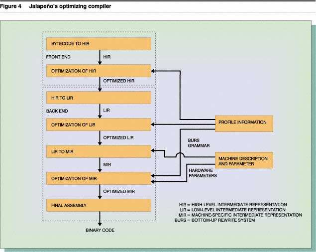
* Hotspot
   * 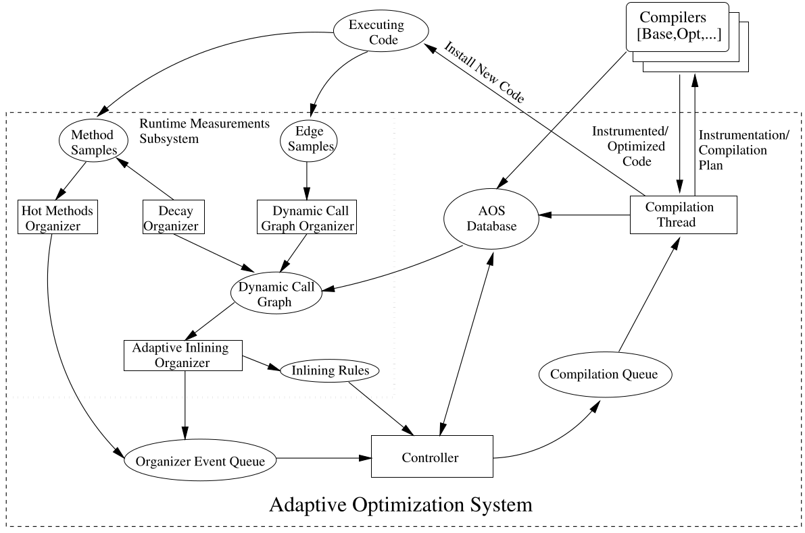
   * Messung von Anzahl Methoden- UND dynamischen Aufrufen zwischen Klassen (A.f() -> B.g())
   * Nach Schwellwertüberschreitung wird nativ übersetzt
   * Schwellwerte *heuristisch adaptiv*: Alte Werte verfaulen, Datenbank mit alten Messwerten
