# Formale Systeme
## Aussagenlogik
| Zeichen | Bedeutung |
|---|---|
|1                  | Wahr                            |
|0                  | Falsch                          |
|$$\neg$$           | Negation                        |
|$$\land$$          | Konjunktion                     |
|$$\lor$$           | Disjunktion                     |
|$$\rightarrow$$    | Implikation                     |
|$$\leftrightarrow$$| Beidseitige Implikation ("gdw") |
|(,)                | Klammerung (Präzedenz)          |

### Definitionen
#### Signatur Σ
* $$\Sigma = \lbrace P0, P1, \ldots\rbrace$$ :
   * Abzählbare Menge
   * von Symbolen (a.k.a. Atome, Aussagevariablen)

#### Formeln über Σ
$$For0_\Sigma$$ induktiv definiert:
* $$\lbrace 0, 1\rbrace \cup \Sigma \subseteq Form0_\Sigma$$
* $$A \in Form0_\Sigma \rightarrow \neg A \in Form0_\Sigma$$
* $$A, B \in Form0_\Sigma \rightarrow A op B \in Form0_\Sigma$$ wobei $$op \in \lbrace \land, \lor, \rightarrow, \leftrightarrow \rbrace$$ 

#### Interpretation über Σ, Auswertung, Modell
* Interpretation $$I: \Sigma \rightarrow \lbrace True, False \rbrace$$
* Auswertung $$val_I: For0_\Sigma \rightarrow \lbrace True, False\rbrace$$
* Modell: Interpretation einer Formel, die zu True auswertet
   * auch für Formelmengen definiert: Interpretation erfüllt alle Formeln
* Allgemeingültigkeit: Formel ist für alle Interpretationen wahr
* Erfüllbarkeit: Zu Formel existiert mindestens ein Modell
* $$A \models B$$: Jedes Modell für A ist ein Modell für B, "Aus A folgt B"
   * Logisch äquivalent: $$A \models B \land B \models A$$

### Beispiele
* Allgeingültige Formeln:  
   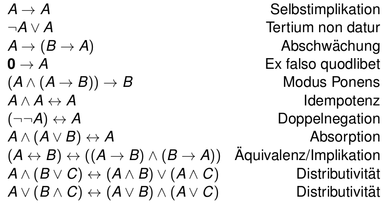
   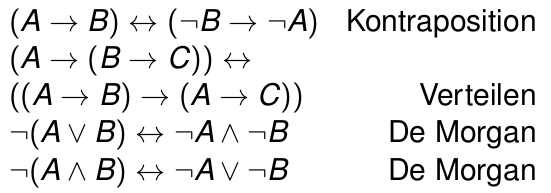
* Einfache Sätze:
   * $$A$$ erfüllbar $$\leftrightarrow \neg A$$ nicht allgemeingültig
   * $$\models A \leftrightarrow A$$ allgemeingültig
   * $$\models \neg A \leftrightarrow A$$ unerfüllbar
   * $$A \models B \leftrightarrow \models A \rightarrow B$$
   * $$M \cup \lbrace A \rbrace \models B \leftrightarrow M \models A \rightarrow B$$ 
   * $$A, B$$ logisch äquivalent gdw. $$A \leftrightarrow B$$
* Logische Umformung:
   * A, B logisch äquivalent
   * A Unterformel von C
   * C' ist C wobei A durch B ersetzt
   * $$\Rightarrow C' \leftrightarrow C$$

#### Boolesche Funktion
* n-stellig: $$\lbrace 0, 1\rbrace^n \rightarrow \lbrace 0, 1\rbrace$$
* Boolsche Funktion zu Formel $$A \in Form0_\Sigma$$
   * $$f_A(b) = val_I(A)$$
   * wobei $$b \in \lbrace 0, 1\rbrace^n$$ und $$I(P_i) = b_i$$
   * Darstellung z.B. über Wahrheitstabelle
* Satz: Zu jeder Booleschen Funktion f gibt es eine Formel A mit $$f_A = f$$
   * Beweis: Disjunktion aus Konjunktionen zu allen True-Fällen, die die dazugehörige Variablenbelegung genau darstellt
* Basis: Menge aus Konstanten und Operatoren, mit denen sich alle booleschen Funktionen darstellen lassen
   * Beispiele:
   * $$\lbrace 1, 0, \neg, \land, \lor, \rightarrow, \leftrightarrow \rbrace$$
   * $$\lbrace \neg, \land \rbrace$$
   * $$\lbrace 0, \rightarrow \rbrace$$
   * $$\lbrace \downarrow \rbrace$$ (NOR)
   * $$\lbrace 1, 0, sh \rbrace$$ (Shannon Operator: cond, onfalse, ontrue)

<!-- Lecture 2 -->
### Craigsches Interpolationslemma
* Seien A, B Formeln mit $$A \models B$$
* $$\Leftrightarrow \exists C:$$
   * $$\models A \rightarrow C$$
   * $$\models C \rightarrow B$$
   * $$atoms(C) = atoms(A) \cap atoms(B)$$
   
Konstruktion:
* Sei $$P_1, \ldots, P_n$$ alle Atome in A, die nicht in B vorkommen
* Sei $$A[c_1, \ldots, c_n]$$ A, wo alle $$P_i$$ durch $$c_i \ in \lbrace 0, 1\rbrace$$ ersetzt wurden
* $$C = \mathop{\Large \lor}\limits_{c_1, \ldots, c_n \in \lbrace 0, 1\rbrace} A[c_1, \ldots, c_n]$$

<!-- Lecture 3 -->
### Normalformen
* Disjunktive Normalform
* Konjunktive Normalform
* Existieren immer
* Lassen sich aus Wahrheitstabelle ablesen
* **Vollständig** wenn jedes $$P \in \Sigma$$ in jeder Klausel vorkommt
   * Vollständige Normalformen sind eindeutig
* Minimale Normalformen: Alle kürzeren Formeln sind nicht äquivalent
   * nicht eindeutig
* Erfüllbarkeit von DNF in Polynomialzeit überprüfbar
* Allgemeingültigkeit von KNF in Polynomialzeit überprüfbar
* Überführung DNF -> KNF: KNF wächst exponentiell

#### Kurze KNF
Konstruktion
1. Führe neue Kürzel für alle binären Operationen ein  
   * rekursiv, d.h. durch ein Kürzel abgekürzte Klausel ist immer selbst binär
1. Erhalte Äquvalenz $$Q \leftrightarrow A \land B$$ ( bzw. $$A \lor B$$ )
1. Löse Äquvalenz zu Teilformeln auf, z.B.:
   * $$Q \lor \neg(A \land B)$$ und
   * $$\neg Q \lor (A \land B)$$
1. "Ausmultiplizieren" in KNF, also z.B.
   * $$Q \lor \neg(A \land B) \Rightarrow Q \lor \neg A \lor \neg B$$
   * $$\neg Q \lor (A \land B) \Rightarrow (\neg Q \lor A) \land (\neg Q \lor B)$$
1. Konjunktion aller Klauseln + Top Level Kürzel ergibt KKNF

Eigenschaften
* Größe der KKNF gegenüber ursprünglicher Formel mit n Literalen ist c*n
* In polynomieller (linearer) Zeit konstruierbar

### Shannon Formeln
1. Shannon Operator `sh`
1. Konstanten 0,1
1. Aussagevariablen $$P1, \ldots$$

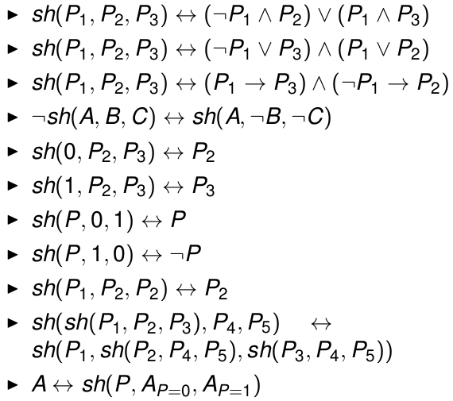

#### Normierte Shannonformeln
* Konstanten 0, 1 sind normiert
* $$sh(P_i, A, B)$$ sind normiert wenn
   * A und B normiert sind UND
   * für jede in A und B vorkommende Variable $$P_j$$ gilt $$i < j$$

Für jede Shannonformel existiert eine äquivalente Shannonformel

#### Shannon Graphen
* Genau ein Wurzelknoten
* Gerichtet
* Binär
   * $$\rightarrow$$ 2 Kanten 0/1
* Zusammenhängend
* Jeder innere Knoten hat einen Index `index(v)`
* Jeder Blattknoten hat einen *Wert* $$wert(v)$$ 0 oder 1 mit $$wert(0) = False, wert(1) = True$$

Reduziertheit von Shannongraphen (ordered binary decision diagram OBDD):
1. Wenn es keine zwei Knoten $$v, w$$ gibt, sodass die in v/w verwurzelten Teilgraphen isomorph sind
1. Wenn in keinem Knoten beide Ausgangskanten in den selben Nachfolgeknoten zeigen

Isomorphie $$H \cong G \Leftrightarrow $$ es existiert eine bijektive Abbildung $$\pi: V_1 \rightarrow V_2$$ mit:
1. $$index(k) = index(\pi(k))$$ für jeden Nichtterminalknoten
1. $$wert(k) = wert(\pi(k))$$ für jeden Terminalknoten
1. für Knoten $$k$$ mit $$0/1$$ Kanten zu $$k_0/k_1$$ führen Kanten von $$\pi(k)$$ zu $$\pi(k_0)/\pi(k_1)$$

Kriterium für Reduziertheit:
* Keine zwei Knoten $$x, y$$ mit $$x \neq y$$ haben die selben Nachfolger
* Anders: Wenn $$G_x \cong G_y \Rightarrow x = y$$

Theorem "Eindeutigkeit reduzierter Shannongraphen":
* Zu jeder booleschen Funktion gibt es genau einen reduzierten Shannongraphen

Größe des BDD hängt stark von Ordnung der Variablen ab

### SAT Solver
Teilklassen
* KNF ist NP-vollständig
* 3-KNF ist NP-vollständig
* 2-KNF ist polynomiell entscheidbar (Krom Formeln)
* DNF ist polynomiell entscheidbar in $$n log(n)$$
* Horn Formeln sind polynomiell entscheidbar in $$n^2$$

#### Horn-Formel
* KNF, wo in jeder Disjunktion max. 1 positives Literal vorkommt
* 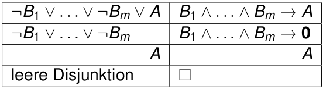
* Bezeichnungen:
   * $$B_1, \ldots, B_n$$: Rumpf
   * $$A$$: Kopf oder Fakt (bei leerem Rumpf)

Erfüllbarkeitstest:
* Vorbereitung:
   1. Wenn keine Fakten existieren: **erfüllbar**
   1. Andernfalls: Markiere alle Fakten
* Iteration:
   1. Wenn keine Klausel existiert, in deren Rumpf alle Literale markiert sind: **erfüllbar**
   1. Wenn eine Klausel $$B_0, \ldots B_n \rightarrow 0$$ existiert, in der alle $$B_i$$ markiert sind: **unerfüllbar**
   1. Wenn $$B_0, \ldots B_n \rightarrow A$$ existiert, wo alle $$B_i$$ markiert sind, $$A$$ aber nicht: markiere $$A$$
   1. Ansonsten: **erfüllbar**

#### DPLL
* $$\square$$ für die leere Klausel
* $$\emptyset$$ für die leere Klauselmenge

```
if S = ∅ then return 1;
if □ ∈ S then return 0;
if S enthält Einerklausel
then
   choose Einerklausel {L} ∈ S;
   return DPLL(red {L} (S));
else
   choose P ∈ atom(S)
   return max{DPLL(S P ), DPLL(S ¬P )};
```
mit
* $$atom(S)$$ bzw. $$atom(C)$$
* $$red_{\lbrace L\rbrace}(S)$$ bzw. $$red_{\lbrace L\rbrace}(C)$$ (entfernt $$\neg L$$ aus $$S$$ bzw $$C$$)
* $$S_P$$ bzw $$S_{\neg P}$$ (ergänzt $$S$$ um $$P$$ bzw $$\neg P$$)

Korrektheitstheorem:
1. Terminiert für jede Eingabe
1. Korrekt und vollständig:  
   * $$DPLL(S) = 1 \Leftrightarrow S$$ ist erfüllbar

## Prädikatenlogik
| Zeichen | Bedeutung |
|---|---|
|1                  | Wahr                            |
|0                  | Falsch                          |
|$$\neg$$           | Negation                        |
|$$\land$$          | Konjunktion                     |
|$$\lor$$           | Disjunktion                     |
|$$\rightarrow$$    | Implikation                     |
|$$\leftrightarrow$$| Beidseitige Implikation ("gdw") |
|(,)                | Klammerung (Präzedenz)          |
|$$\forall$$        | Allquantor                      |
|$$\exists$$        | Existenzquantor                 |
|$$v_i$$            | Individuenvariablen             |
|$$\doteq$$         | objektspr. Gleichheitssymbol    |
|,                  | Komma                           |
|$$Var$$            | Zur Verfügung stehende Variablen|

### Signatur
$$\Sigma = (F_\Sigma, P_\Sigma, \alpha_\Sigma)$$
* $$F$$: Funktionssymbole
* $$P$$: Prädikatsymbole
* $$\alpha$$: Aritäten

Sonderfälle:
* nullstelliges Funktionssymbol: Konstante
* nullstelliges Prädikatsymbol: aussagenlogisches Atom

### Terme
* Variablen
* Mit korrekter Arität parametrisierte Funktionssymbole

### Atomare Formeln
* $$At_\Sigma$$
* Vergleich von Termen mit $$\doteq$$
* Mit korrekter Arität mit Termen parametrisierte Prädikate
   * insbesondere NICHT Prädikate mit Prädikaten parametrisierbar

### Formeln
* $$\lbrace 0, 1\rbrace \cup At_\Sigma \subset For_\Sigma$$
* Mit $$x \in Var$$ und $$A, B \in For_\Sigma$$ sind auch  
   ¬A, (A ∧ B), (A ∨ B), (A → B), (A ↔ B), ∀xA, ∃xA in $$For_\Sigma$$

### Variablenbindung
* frei vs. gebunden
* Wirkungsbereich

Notation:
* Bd(A): Gebundene Variablen in A
* Frei(A): Freie Variablen in A
* Var(A): $$Bd(A) \cup Frei(A)$$
* Var(t): $$\lbrace x \in Var \mid\ x\ kommt\ in\ t\ vor\rbrace$$
* A heißt geschlossen gdw. A enthält keine freien Variablen
   * Seien $$v_1, \ldots, v_n$$ freie Variablen in A
   * Allabschluss $$Cl_\forall(A): \forall v_1 \ldots \forall v_n A$$
   * Existenzabschluss $$Cl_\exists(A): \exists v_1 \ldots \exists v_n A$$

### Substitutionen
* $$\sigma: Var \rightarrow Term_\Sigma$$
* Notation: $$\lbrace x_1/s_1, \ldots, x_m/s_m\rbrace$$
* Grundsubstitution: Alle $$s_i$$ sind Grundterme
* identische Substitution $$id(x)$$
* Kollisionsfreiheit: An der Stelle einer Ersetzung $$x/y$$ ist $$y$$ nicht durch einen Quantor gebunden
* Komposition: $$(\tau \circ \sigma)(x) = \tau(\sigma(x))$$
* Eigenschaft: Gilt $$\sigma(t) = \tau(t)$$ so ist $$\sigma(x) = \tau(x)$$ für alle Teilterme x von t
* Eigenschaft: Gilt $$\sigma(t) = t$$ so ist $$\sigma(x) = x$$ für alle Teilterme x von t
* Eigenschaft: Wenn $$\tau \circ \sigma = id$$, dann $$\forall v: \sigma(v) = t \rightarrow t \in Var$$ ($$\sigma$$ ist Variablenersetzung)

### Unifikatoren
* Eine Substitution $$\sigma$$ wird auf alle Terme in einer Termmenge T angewandt
* Wenn die Terme in T nach Substitution gleich sind (#$$\sigma(T) = 1$$), dann ist $$\sigma$$ ein **Unifikator**

Eigenschaften:
* Jeder Term ist mit sich selbst mit $$id$$ unifizierbar
* $$f(\ldots)$$ und $$g(\ldots)$$ sind **nicht** unifizierbar
* $$f(s_1, \ldots, s_n)$$ und $$f(t_1, \ldots, t_n)$$ sind unifizierbar gdw. alle $$s_i$$ mit $$t_i$$ unifizierbar sind
* $$x \in Var, t \in Term_\Sigma, x \neq t$$: $$x$$ und $$t$$ unifizierbar gdw $$x \notin Var(t)$$ 

Allgemeinster Unifikator:
* Alle anderen Unifikatoren lassen sich durch Erweiterung des allgemeinsten Unifikators durch Komposition erhalten
* Er ist eindeutig (bis auf Variablenumbenennung)
   * !!!BEWEIS!!!

#### Unifikationsalgorithmus nach Robinson:
* Notation: $$t^{(i)}$$: Der bei i beginnende Teilterm von t falls dort Variable oder Funktionssymbol
* Differenz $$D(T) := \lbrace t^{(j)}\mid t \in T\rbrace$$ mit j kleinster Zahl, an der sich zwei Terme aus T unterscheiden
* 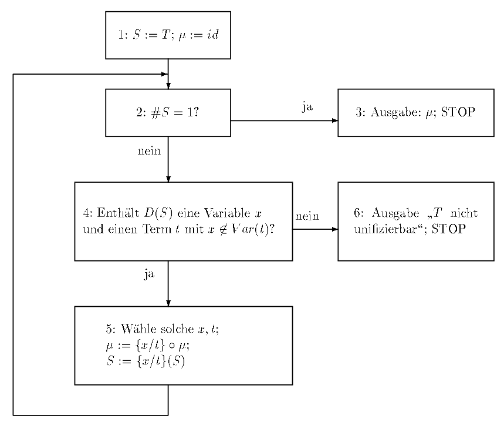
* Eigenschaften:
   * Terminiert
   * Falls unifizierbar: Liefert allgemeinsten Unifikator
   * Sonst: Ausgabe "nicht unifizierbar"
* !!!BEWEIS!!!

### Semantik
#### Interpretation
Beinhaltet Mengen (D, I), wobei
* D: Wertemenge
* I: Zuordnungen von
   * Konstanten zu Elementen in D
   * n-stelligen Funktionen zu Abbildungen $$D^n \rightarrow D$$
   * 0-stelligen Prädikatsymbole zu 0 oder 1
   * n-stelligen Prädikatsymbole zu n-stelligen Relationen über D

#### Variablenbelegung
$$\beta: Var \rightarrow D$$

* Modifikation von $$\beta$$ an der Stelle x zu d:

$$
\beta^d_x(y) =
\begin{cases}
   d & y = x \\
   \beta(y) & sonst
\end{cases}
$$

* **Auswertungsfunktion** $$val_{D, I, \beta}$$
   * Bildet Terme auf Elemente in D ab
   * Bildet Formeln auf {W, F} ab

**Koinzidenzlemma**:  
Seien β, γ Variablenbelegungen. Dann:
* 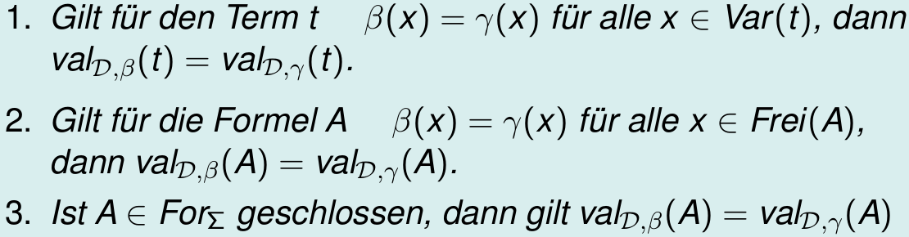

**Substitutionslemma für Terme**:
* Auswertung nach Substitution ist das selbe wie mit einer Belegung auszuwerten, die auf Auswertung der Substituenden abbildet
* Als Formel: $$val_{D, \beta}(\sigma(t)) = val_{D, \beta'}(t)$$ mit $$\beta'(x) = val_{D, \beta}(\sigma(x))$$
* !!!BEWEIS!!!

**Substitutionslemma für Formeln**:
* Wie für Terme, aber $$\sigma$$ muss *kollisionsfrei* sein
* !!!BEWEIS!!!

#### Hoare Kalkül
???

* Definition **Modell** auf Formeln wie bei Aussagenlogik  
* Definition $$\models$$ wie bei Aussagenlogik  
* Allgemeingüligkeit $$\models A$$ wie bei Aussagenlogik

Anschließend Beweisbeispiele

### Normalformen
#### Negationsnormalform
* $$\neg$$ steht nur dierkt vor atomaren Teilformeln, insbesondere kommt $$\neg\neg$$ nicht vor
* Es gibt keine Implikationen in der Formel

#### Bereinigt
* Gebundene Variablen haben andere Namen als freie Variablen ($$Frei(A) \cap Bd(A) = \emptyset$$)
* Jeder Quantor bindet eine andere Variable ("hinter Quantoren stehende Vars sind paarweise verschieden")

Zu jeder Formel gibt es logisch äquivalente Negationsnormalformen und bereinigte Formeln

#### Pränexe Normalform
* $$Q_1x_1 \ldots Q_nx_n B$$, $$B$$ ist quantorenfrei
* $$B$$ heißt *Matrix*
* Existiert für jede Formel
* Zu erhalten mittels   
  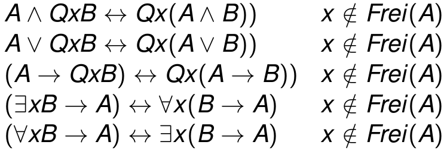
* Nicht unbedingt eindeutig

**Darstellung von Existenzquantoren über Funktionszeichen**:
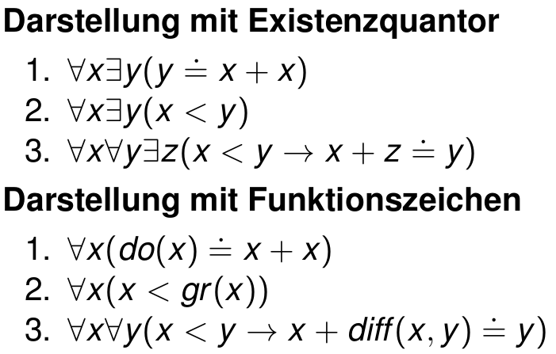

#### Skolem-Normalform
* Formel ist *geschlossen*
* In Pränexe-Normalform, aber NUR Allquantoren: $$A = \forall  \ldots x_1\forall x_n B$$
* B ist in KNF
* Existiert für jede Formel wenn man Signatur erweitert
* Algoritmisch herleitbar:

1. Allabschluss freier Variablen
1. Skolemisierung:
   * Von links nach rechts für Existenzquantoren Funktionszeichen einführen, die duch links vorkommende allquantifizierte Variablen parametrisiert sind.
   * Anschließend Existenzquantor+Variable entfernen und restliche Vorkommen der Variable durch Funktionszeichen ersetzen
1. Matrix in KNF überführen

* **Grundinstanzen**: Matrix einer Allquantor-PNF, auf die beliebige Grundtermsubstitutionen angewendet wurden
* $$Grundinstanzen(M)$$: Menge aller Grundinstanzen aller Formeln in $$M$$

#### Herbrand-Strukturen
* Besondere Art von Interpretationen $$I$$
* $$D$$ ist Menge aller Grundterme $$Term^0_\Sigma$$
* $$I(f)(t_1, \ldots, t_i) = f(t_1, \ldots, t_i$$ für alle $$f$$ und beliebige $$t_1, \ldots, t_i$$
* Insbesondere $$val_{D,I}(t) = t$$

**Satz von Herbrand:**

Es enthalte $$\Sigma$$ mindestens eine Konstante, und es sei M eine Menge geschlossener, universell quantifizierter Formeln.
Ferner enthalte keine Formel in M das Gleichheitssymbol $$\doteq$$.
Dann sind äquivalente Aussagen
1. M hat ein Modell
2. M hat ein Herbrand-Modell
3. Grundinstanzen(M) hat ein Modell
4. Grundinstanzen(M) hat ein Herbrand-Modell.

!!!BEWEIS!!!

**Endlichkeitssatz (Kompaktheitssatz)**
* U unendliche aussagenlogische Formelmenge
* U unerfüllbar gdw. es gibt eine *endliche* Teilmenge $$E\subset U$$ die unerfüllbar ist

**Satz von Herbrand (2)**:

Sei $$\phi$$ eine quantorenfreie Formel ohne Gleichheit mit (nur) einer freien Variablen $$x$$. Dann gilt

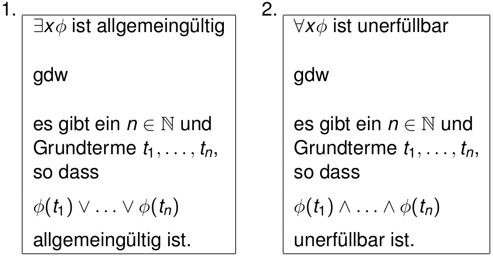
!!!BEWEIS!!!

## Beweiskalküle Aussagenlogik
### Hilbertkalkül
* 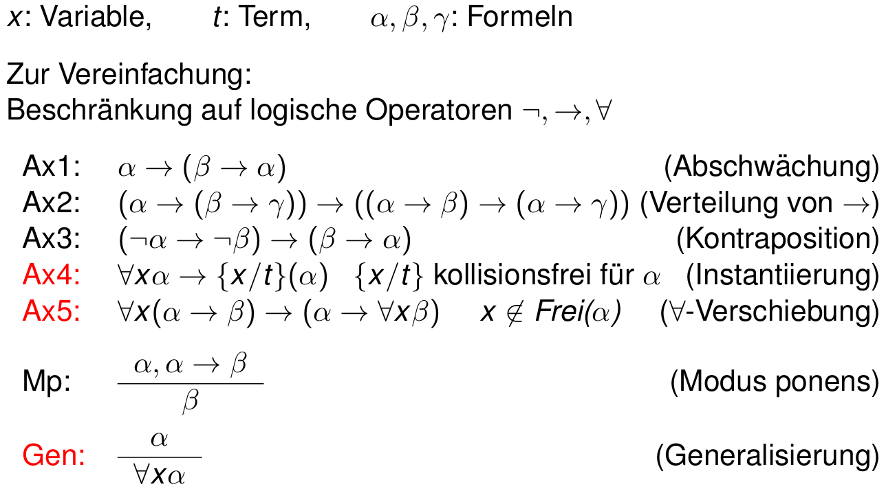 
* Vollständigkeit: Wenn aus einer PL1 Formelmenge M eine Aussage A abgeleitet werden kann, so kann diese auch mit Hilberkalkül abgeleitet werden **und umgekehrt**
* $$M \models A \Leftrightarrow M \vdash_H A$$

**Kompakheitssatz**: Kann eine Aussage aus einer (unendlichen) Formelmenge M geschlossen werden, so gibt es eine **endliche** Teilmenge von M, aus der sie auch geschlossen werden kann
* $$M \subset For_\Sigma \models A \Rightarrow \exists E \subseteq M, E endlich: E \models A$$


### Resolutionskalkül
* Arbeitet auf Formeln in **KNF**
* Dargestellt als Klauselmenge $$\lbrace \lbrace P_1, \ldots, P_n \rbrace, \ldots \rbrace \equiv ((P_1 \lor \ldots \lor P_n) \land \ldots)$$
* $$val_I(\lbrace \square \rbrace) = F$$
* $$val_I(\emptyset) = W$$
* Einzige Regel: Reosultionsregel
$$\frac{C_1 \cup \lbrace P\rbrace, C_2 \cup \lbrace \neg P\rbrace}{C_1 \cup C_2}$$
* $$C_1 \cup C_2$$ heißt *Resolvente* der Eingabeklauseln 

* Theorem Korrektheit und Vollständigkeit: M unerfüllbar gdw. $$M \vdash_{R_0} \square$$
   * !!!BEWEIS!!!
* Notwendigkeit der Mengenschreibweise: Mengen haben die uniquing-Eigenschaft, mit der die Disjunktionen automatisch vereinfacht werden

Sonderfall: **1-Resolution**
* Sonderfälle der Resolutionsregel: $$\frac{\lbrace P\rbrace, \lbrace \neg P\rbrace \cup C}{C}, \frac{\lbrace \neg P\rbrace, \lbrace P\rbrace \cup C}{C}$$
   * Unit-Propagation in DPLL
* 1-Resolutionskalkül ist **nicht vollsändig**

**Geordnete Resoltion**:
* $$\frac{C_1 \cup \lbrace P_j\rbrace, C_2 \cup \lbrace \neg P_j\rbrace}{C_1 \cup C_2}$$ nur anwendbar, wenn füë alle $$P_i$$ in $$C_1, C_2$$ gilt $$i < j$$

### Tableaukalkül
* Testet auf Unerfüllbarkeit
* $$M \models A \Leftrightarrow M \cup \lbrace \neg A\rbrace \models_{T0} 0$$
* Beweis durch Fallunterscheidung
* Top-Down Analyse der gegebenen Formeln
* Formeln müssen nicht in Normalform sein
* Konstruiert "nebenbei" eine erfüllende Interpretation

**Vorzeichenformeln**:
* $$0A$$ oder $$1A$$, $$A \in For0$$

*Uniforme Notation*
* 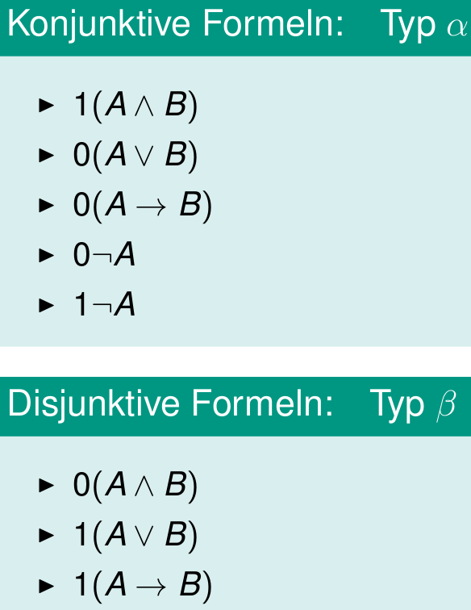
* 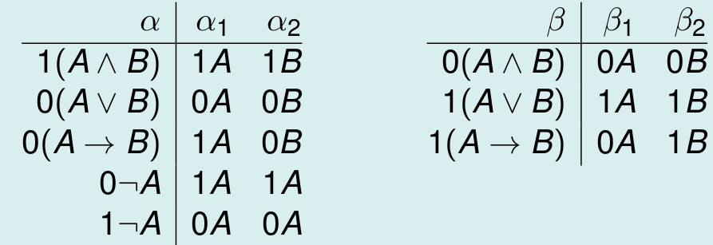
* 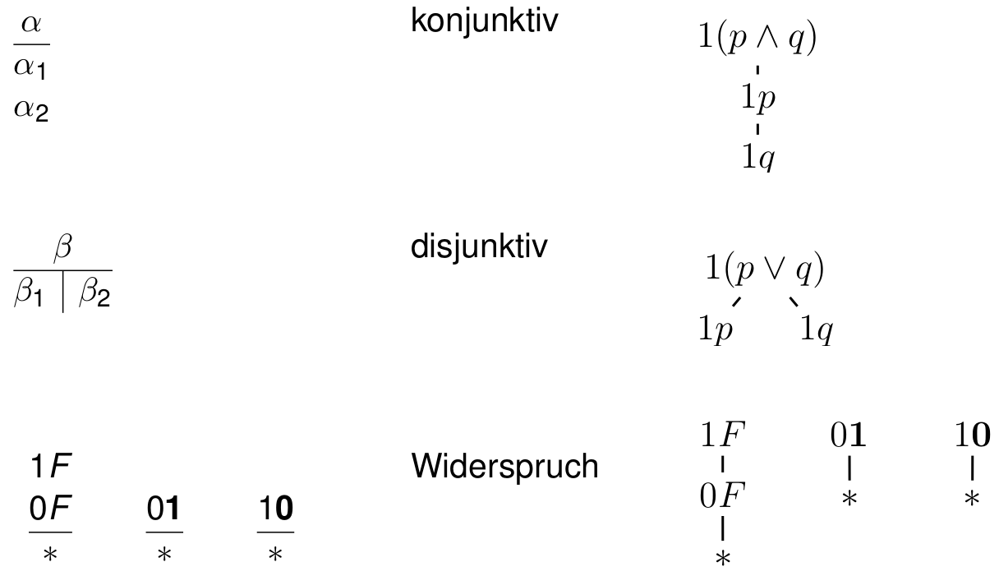
* 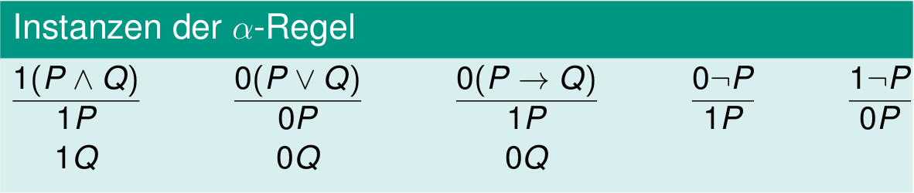
* 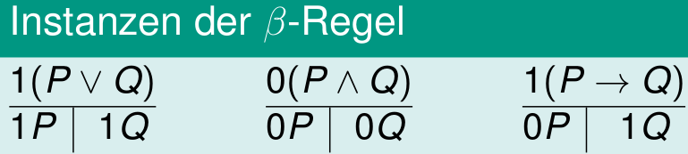

* Heuristik: Nicht verzweigende Regeln zuerst anwenden ($$\alpha$$ vor $$\beta$$)
* "Nota Bene": Selbe Regel mehrfach anwenden ist auch sinnvoll

**Definition des Kalküls**:
* Tableau: Binärbaum mit Vorzeichenformeln in Knoten
* Tableauast: Pfad von Wurzel zu Blatt
* Erweiterung: Wende Regel auf Tableau zu Formel A an -> Baum ist weiterhin ein Tableau zu A 
* Vorraussetzungsregel: Formeln $$F$$ aus $$M$$ lassen sich als $$1F$$ in einen Pfad aufnehmen
   * Folien lassen hier wohl aus, dass man als Basisfall noch $$\neg A$$ in $$M$$ aufnehmen will -> ganz oben steht $$1(\neg A) \Leftrightarrow 0A$$
* Geschlossener Ast B: $$1F \text{und } 0F \in B$$ oder $$10 \in B$$ oder $$01 \in B$$
* Geschlossenes Tableau: Jeder Ast ist geschlossen
* Tableaubeweis: Geschlossenes Tableau zu $$A$$ über $$M$$ $$\Rightarrow M \cup \lbrace \neg A \rbrace \vdash_{T0} 0 \Leftrightarrow M \models A$$
* Tableaukalkül ist vollständig und korrekt
!!!BEWEIS!!! 2x

## Beweiskalküle Prädikatenlogik
### Unentscheidbarkeit der Prädikatenlogik
Die folgenden Probleme sind unentscheidbar:
1. Ist eine prädikatenlogische Formel $$F \in For_\Sigma$$ allgemeingültig? Triviale Signaturen $$\Sigma$$ ausgenommen.
2. Was ist die maximale Anzahl von $$\gamma$$-Regelanwendungen in einem Tableaubeweis einer prädikatenlogische Formel $$F \in For_\Sigma$$ ?

1. Die Menge der allgemeingültigen Formeln der Prädikatenlogik ist rekursiv aufzählbar.
2. Die Menge der erfüllbaren Formeln der Prädikatenlogik ist nicht rekursiv aufzählbar.

### Resolutionskalkül
* Arbeitet auf Formeln in *Skolemnormalform*, als Klauselmenge dargestellt
* Notation:

$$
\sim L =
\begin{cases}
   \neg L & \text{L ist atom} \\
   L' & \text{wenn } L = \neg L'
\end{cases}
$$

* $$\frac{C_1 \cup \lbrace K_1\rbrace, C_2 \cup \lbrace K_2\rbrace}{\mu(C_1 \cup C_2)}$$, wobei $$\mu$$ allgemeinster Unifikator von $$K_1, \sim K_2$$

### Tableaukalkül
* 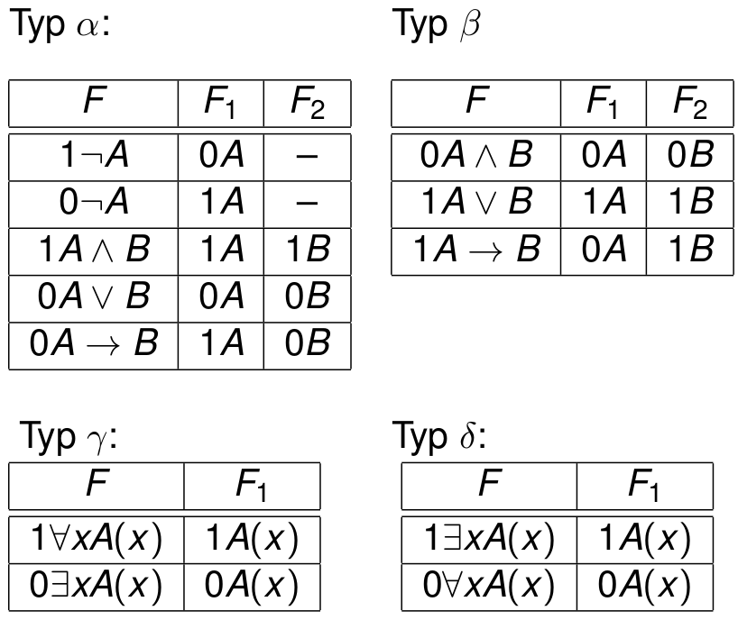
* 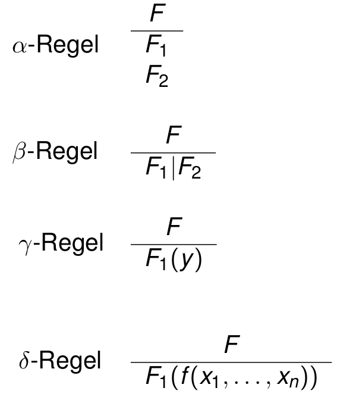
* 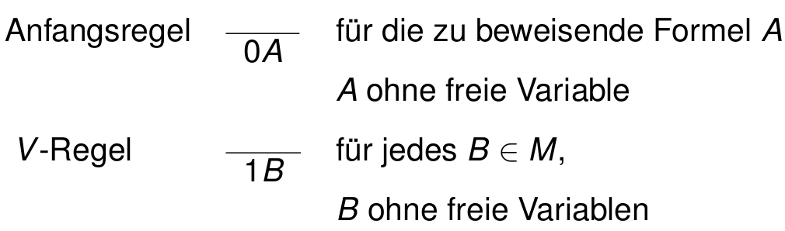
* Abschlussregel (C-Regel): Wenn eine Substitution $$\sigma$$ einen Pfad $$\mu$$ schließt, erzeuge neues Tableau mit $$\sigma$$ auf das ganze Tableau angewandt

**Modellbegriff für Tableaus**:  
$$D$$ ist Modell für Tableau $$T$$ über $$M$$ gdw.
* $$D$$ ist ein Modell über $$M$$
* Für jede Variablenbelegung $$\beta$$ gibt es einen Pfad $$\pi$$ in $$T$$, sodass alle Formeln auf $$\pi$$ zu Wahr auswerten

!!!BEWEIS!!! KORREKTHEIT und VOLLSTÄNDIGKEIT
* 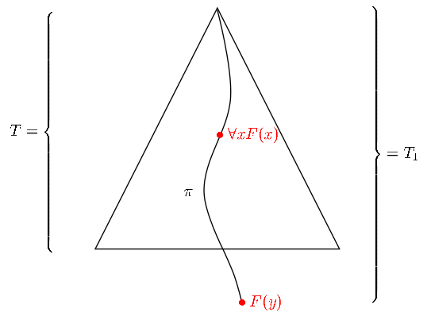

#### Hintikka Formeln
* 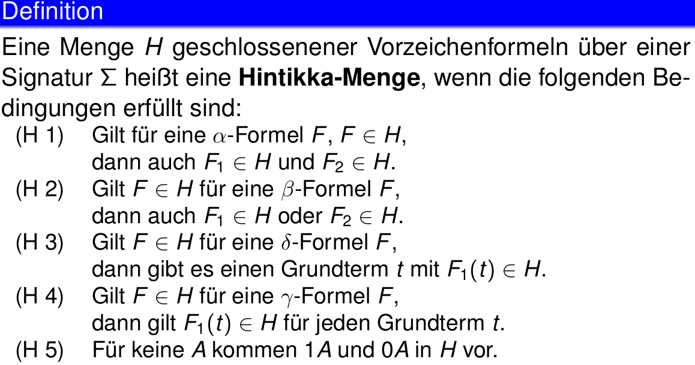
* Jede Hintikka-Menge H besitzt ein Modell.
* 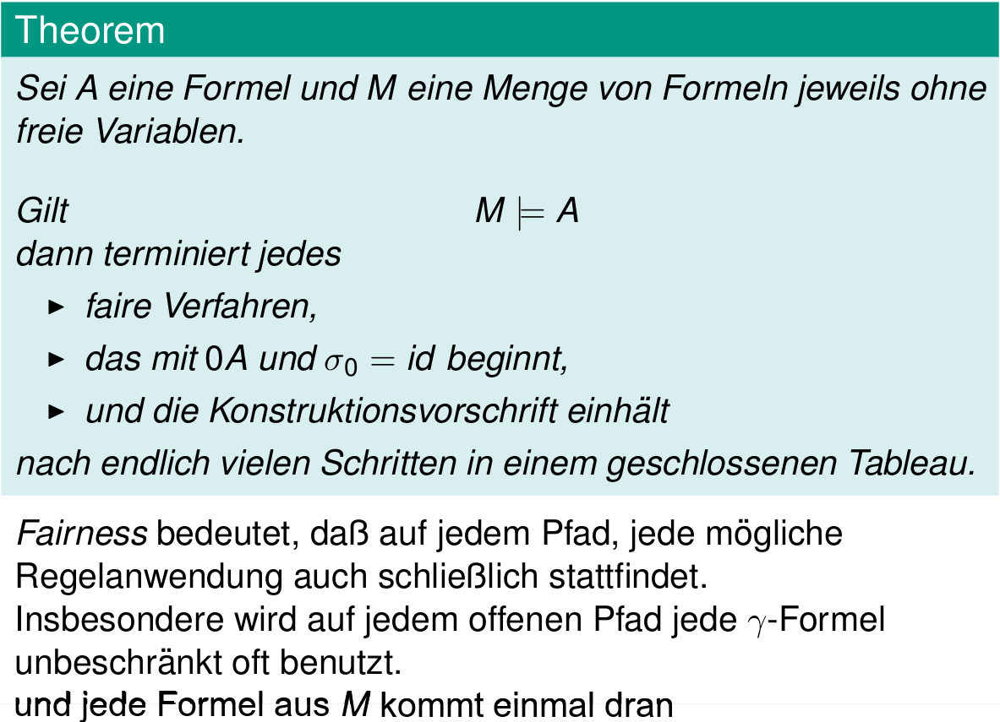
* Königs Lemma: In jedem unendlichen, endlich verzweigenden Baum existiert ein unendlicher Pfad.

### Sequenzkalkül
* Paar endlicher Formelmengen $$\Gamma \Rightarrow \Delta$$
* $$\Gamma$$: Antezendent
* $$\Delta$$: Sukzedent
* $$val_{D, \beta}(\Gamma \Rightarrow \Delta) = val_{D, \beta}({\large \land} \Gamma \rightarrow {\large \lor} \Delta)$$
* Aussagenlogische Axiome und Regeln:  
   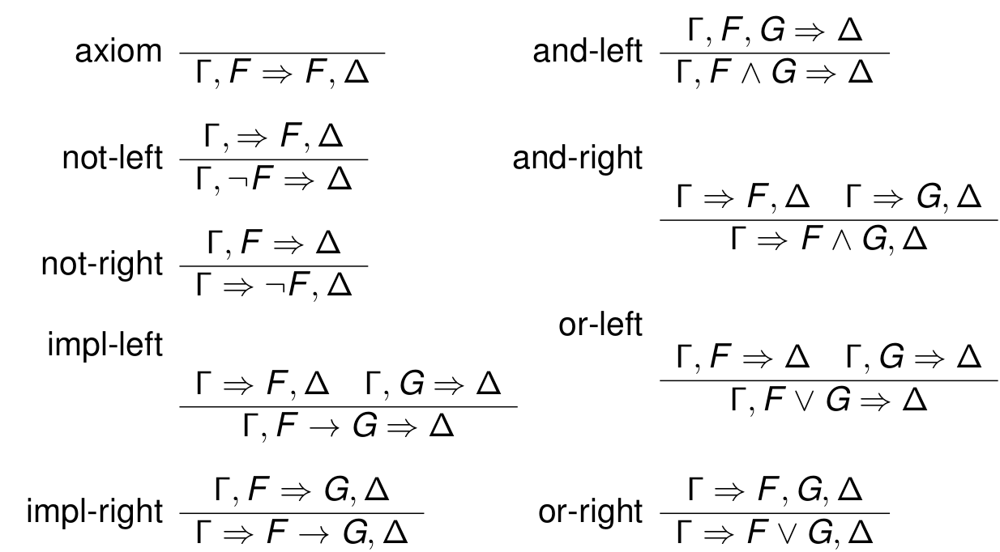
* Prädikatenlogische Regeln  
   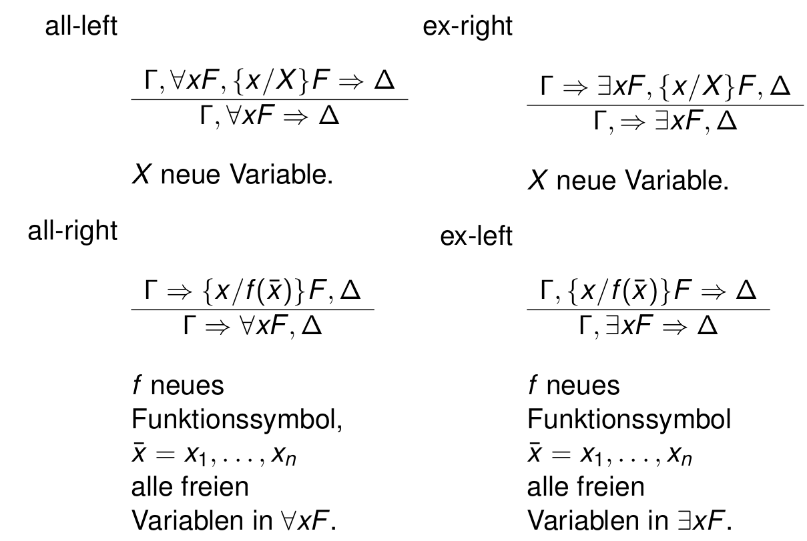
* Axiome und Regeln für Gleichheit  
   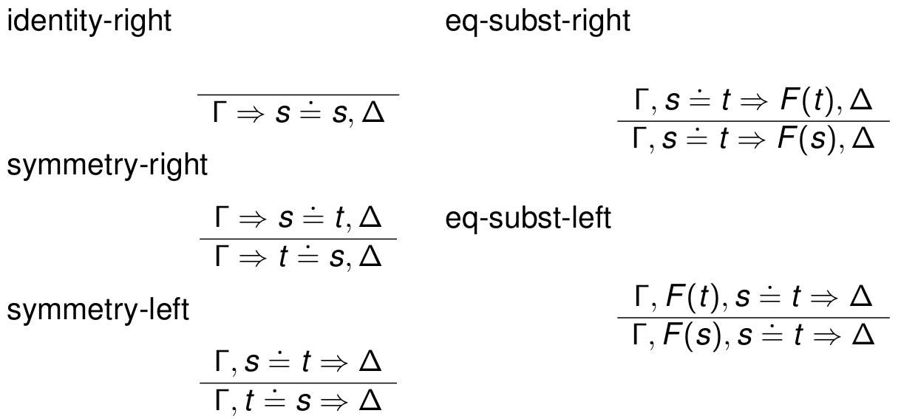

**Ableitungsbaum**
1. Knoten $$n$$ mit Markierung $$\Gamma \Rightarrow \Delta$$ hat nur einen Nachfolger $$n_1$$ mit Markierung $$\Gamma_1 \Rightarrow \Delta_1$$: Es gibt eine Regel $$\frac{\Gamma_1 \Rightarrow \Delta_1}{\Gamma \Rightarrow \Delta}$$
1. Knoten $$n$$ mit Markierung $$\Gamma \Rightarrow \Delta$$ hat zwei Nachfolger $$n_1$$ mit Markierung $$\Gamma_1 \Rightarrow \Delta_1$$ und $$n_2$$ mit Markierung $$\Gamma_2 \Rightarrow \Delta_2$$: Es gibt eine Regel $$\frac{\Gamma_1 \Rightarrow \Delta_1, \Gamma_2 \Rightarrow \Delta_2}{\Gamma \Rightarrow \Delta}$$
1. Beweisbaum geschlossen: Es gibt eine Substitution $$\sigma$$, sodass für alle Blätter mit Markierung $$A$$ gilt $$\sigma(A)$$ ist Axiom

**Korrektheit und Vollständigkeit**:
* $$M \models A \Leftrightarrow M \models_{S} A$$

## Peano-Arithmetik
* Elemente in $$\Sigma_{PA}$$:
   * 0, 1
   * +
   * *
* 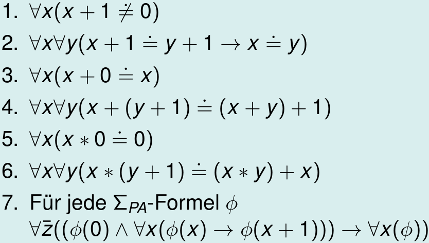
* Basics schon gar nicht so einfach herzuleiten: Benötigt bereits Induktionsaxiom (7)
* Gödelscher Unvollständigkeitssatz: $$N = \langle \mathbb{N}, +, *, 0, 1, \rangle$$ nicht rekursiv aufzählbar / axiomatisierbar / entscheidbar
* Daher nicht alle Formeln über $$N$$ in Peanoarithmetik enthalten
* Praktisch aber wenig relevant
* Presburger Arithmetik ($$N = \langle \mathbb{N}, +, 0, 1, \rangle$$, keine Multiplikation) rekursiv aufzählbar und entscheidbar
* Satz von Tennenbaum: In allen Nichtstandardmodellen von PA sind Addition und Multiplikation nicht-berechenbare Funktionen.

## Gleichungslogik

$$
\begin{aligned}
s \rightarrow^1_E t   & \text{Durch Gleichheitsersetzung auf s wird s zu t in einem Schritt} \\
t \rightarrow_E r     & \text{Durch Gleichheitsersetzung auf t wird t zu r durch wiederholte Anwendung von }\rightarrow^1_E \\
t \leftrightarrow_E r & \text{Durch Gleichheitsersetzung auf t und r werden beide Terme gleich}
\end{aligned}
$$

**Satz von Birkhoff**:  
$$E \models s \doteq t \Leftrightarrow s \leftrightarrow_E t$$

* Problem: $$s \doteq t$$ schwer entscheidbar
* Daher: Normalformen

### Reduktionssysteme
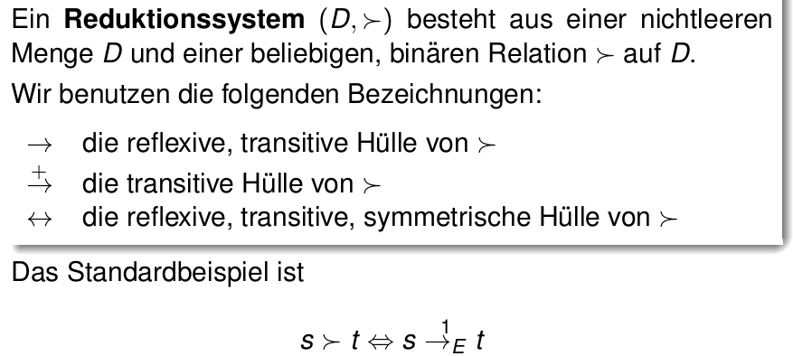

**Begriffe:**
* *konfluent*: $$\forall s, s_1, s_2: ((s \rightarrow s_1) \land (s \rightarrow s_2) \rightarrow \exists t: ((s_1 \rightarrow t) \land (s_2 \rightarrow t)))$$
* *lokal konfluent*: $$\forall s, s_1, s_2: ((s \succ s_1) \land (s \succ s_2) \rightarrow \exists t: ((s_1 \rightarrow t) \land (s_2 \rightarrow t)))$$
* *noethersch* (wohlfundiert, terminierend): Es gibt keine unendliche Folge $$s_0 \succ s_1 \succ \ldots \succ s_i \succ \ldots$$
* *kanonisch*: konfluent + noethersch
* *irreduzibel* (in Normalform): Für ein Element $$s$$ gilt $$\neg\exists t: s \succ t$$
* *Normalform*: $$s_0$$ ist Normalform für $$s$$ wenn $$s \rightarrow s_0$$ und $$s_0$$ irreduzibel

Eigenschaften von **kanoninischen Reduktionssystemen**
1. Zu jedem $$s$$ gibt es eine *eindeutige* Normalform: $$irr(s)$$
1. $$s \leftrightarrow t$$ gdw. $$irr(s) = irr(t)$$
1. System heißt *berechenbar*: Es gibt einen Algorithmus, der zu $$t$$ entweder eine Ableitung $$t'$$ ausgibt wenn sie existiert, und ansonsten "nicht reduzibel". Dann ist "$$\leftrightarrow$$" entscheidbar

!!!BEWEIS!!!

#### Noethersche Induktion
Annahme: $$(D, \succ)$$ noethersch

Prinzip:

Es sei $$X \subseteq D$$, so dass für alle $$a \in D$$ gilt
$$\lbrace b \mid a \succ b\rbrace \subseteq X \Rightarrow a \in X$$.
Dann ist $$X = D$$.

**Theorem**:
* $$noethersch \land lokal\ konfluent \Rightarrow \text{konfluent d.h. kanonisch}$$
* !!!BEWEIS!!!

### Termersetzungssysteme
* Reduktionssystem auf Formeln über Signatur $$\Sigma$$
* Besteht aus endlicher Menge Gleichungen $$E$$ über $$\Sigma$$: $$(Term_\Sigma, \rightarrow^1_E)$$
* Geschrieben als $$(\Sigma, E)$$
* *Kanonisch*: Wie bei Reduktionssystemen

**Kritische Paare**:
* $$(t_1, t_2)$$ kritisches Paar wenn gilt:
* Es existieren $$I_1 \doteq r_1, I_2 \doteq r_2$$ Varianten von Glg. in E
* Term $$u$$ und Substitution $$\mu$$ sodass:
   * *u* Unterterm von $$I_1$$, keine Variable
   * *u* mit $$I_2$$ unifizierbar, $$\mu$$ mgu von $$(u, I_2)$$
   * $$t_1 = \mu(r_1)$$ ($$I_1 \doteq r_1$$)
   * $$t_2$$ entsteht aus $$\mu(I_1)$$ mit genau einem Vorkommen von $$\mu(I_2)$$ durch $$\mu(r_2)$$ ersetzt ($$I_2 \doteq r_2$$)
* $$\mu(I_1)$$ heißt Überlagerung von $$I_1$$ mit $$I_2$$

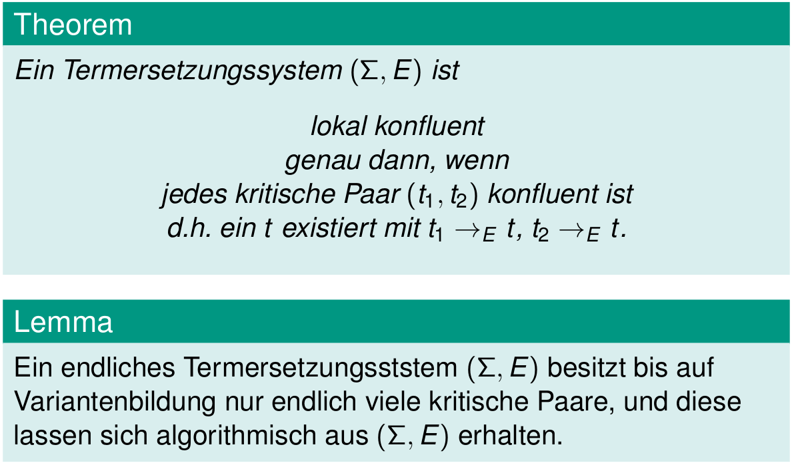

* Beispiel Gruppentheorie
* Knuth-Bendix Verfahren 

## Modallogik
* $$\square A$$: Box A, "notwendig A"
* $$\Diamond A$$: Diamond A, "möglich A"
* Auswertung:
   * $$(K, A) \models P$$: In A gilt P
   * $$(K, A) \models \square P$$: In allen Nachfolgern, zu denen Übergänge bestehen, gilt A
   * $$(K, A) \models \Diamond P$$: In mindestens einem Nachfolger, zu dem ein Übergang besteht, gilt A
* Tautologien:  
   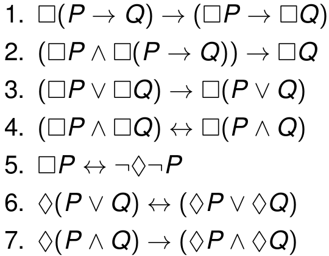

**Charakterisierungstheorie**
* Eine Modalformel F *charakterisiert* eine Klasse von Kripke-Rahmen **R** bedeutet:
* $$(S, R, I) \models F \Leftrightarrow (S, R) \in$$**R** für alle Interpretationen I
* Grenzen: ...

### Kripke Struktur
* $$K = (S, R, I)$$
* S: Menge aller Zustände
* $$R \subseteq S \times S$$: Zugänglichkeitsrelation
* $$I: (\Sigma \times S) \rightarrow \lbrace W, F \rbrace$$: Interpretation der AL-Variablen
* S+R = Kripke-Rahmen

## Lineare Temporale Logik LTL
* 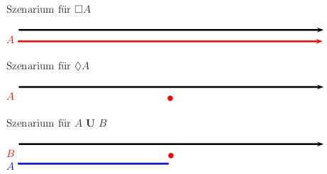
* 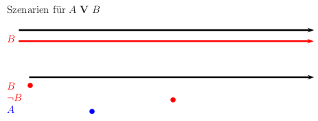

**Äquivalenzen**:
1. $$A U B \leftrightarrow (A U_w B) \land \Diamond B$$
2. $$A U_w B \leftrightarrow A U B \lor \square(A \land \neg B)$$
3. $$A V B \leftrightarrow \neg(\neg A U \neg B)$$
4. $$A U B \leftrightarrow (B \lor (A \land X (A U B)))$$
5. $$A V B \leftrightarrow (B \land A) \lor (B \land X (A V B))$$


## Kalkülvergleich
|Kalkül    |Pro|Con|
|---|---|---|
|Hilbert   |Nur 2 Ableitungsregeln:<br> Generalisierung + Modus Ponens|Viele Axiome <br> Beschränkung auf $$\neg, \rightarrow, \forall$$|
|Tableau   |Gut auf Papier <br> keine NF benötigt|Viele Regeln|
|Sequenz   |Gut interaktiv|Sehr viele Regeln <br> schlecht auf Papier|
|Resolution|Nur eine Regel|Benötigt KNF|
