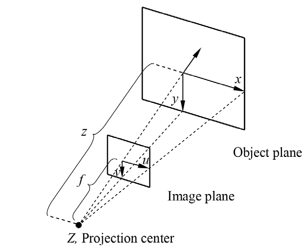
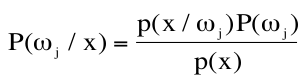

# Kognitive Systeme
## Einführung
* Kognitives System: System, das versteht und lernt: „Künstliche Intelligenz“
   * Kenntnis über Dinge haben
   * Umgebung wahrnehmen
   * Aus Kenntnissen schlußfolgern
   * vorhandenes Wissen erweitern

* Kognition
   * Aufmerksamkeit
   * Wahrnehmungsfähigkeit
   * Schlußfolgerung
   * Urteilsfähigkeit
   * Erinnerung / Merkfähigkeit
   * Lernfähigkeit
   * Abstraktionsvermögen
   * Rationalität

## Digitale Signalerfassung
* Vorteile:
   * Qualität (Bits sind Bits, verlustfreie Übertragung)
   * Kompression
   * Mehrfacher Nutzen von Kommunikationskanälen (Time Division Multiple Access)
* Aliasing
   * Bandbegrenzung (Tiefpassfilter)
   * Samplingrate erhöhen
* Quantisierung
   * Dynamische Abtastung
      * Starke Übergänge: Fein rastern - grob quantisieren
      * Schwache Übergänge: Grob rastern - fein quantisieren
* Diracfunktion
   * 
   <!-- * $$ A\delta(x - x_0) $$ -->
* Faltung
   * 
   * Vorgehen für g*h:
      * g "flippen", also links und rechts vertauschen
      * g von links über h schieben (Koordinatensystem von h!)
      * Interessant sind eigentlich nur die Stellen, wo sich Funktionswerte von g oder h ändern
* Fouriertransformation
   * 
   * 
   * 
   * Magnitude: `Mag = sqrt(Real(F)^2 + Imaginary(F)^2)`
   * Phase: `Phase = arctan(Imaginary(F)/Real(F))`
   * Impulsantwort
      * Wenn Eingabesignal u(t), Ausgabesignal y(t)
      * U und Y sind deren Laplace-Transformierte 
      * `H(w) = Y(w) / U(w)`
* Abtasttheorem (auch Nyquist-Shannon-Theorem): Samplingfrequenz muss echt größer sein als 2 mal höchste vorkommende Frequenz (cutoff-frequency)
   * Nichteinhaltung führt zu Alisasing

## Wissen und Planung
* Wissensdatenbank
   * Sätze
   * Wissensrepräsentationssprache
* Logik
   * Bestandteile
      * Symbolmenge
      * Belegungsmenge
      * Syntax
      * Semantik
      * Folgerungsoperator
   * Prüfung der Ableitbarkeit
   * Algorithmus korrekt: Leitet nur Sätze ab, die aus der Wissensbasis folgen
   * Algorithmus vollständig: Leitet alle Sätze ab, die aus Wissensbasis folgen
### Aussagenlogik
* Literal
* Disjunktion
* Konjunktion
* Konjunktive Normalform KNF
* Disjunktive Normalform DNF
* 
* Deduktionsalgorithmen
   * Resolution
   * Horn-Klauseln
      * Disjunktion von Literalen, von denen höchstens eins positiv ist
      * 
      * Keine negativen Literale: Fakt, Axiom
      * Genau ein positives Literal: Definition
      * Kein positives Literal: Integritätseinschränkung
      * Und-Oder-Graph 
      * Vorwärtsverkettung für finden aller Ableitungen
      * Rückwärtsverkettung für Wahrheitsgehalt einer Aussage finden
   * DPLL
      * Prüft erfüllbarkeit
      * Davis-Putnam-Logemann-Loveland
      * Rein vs. Unrein: Kommt ein Literal sowohl negiert als auch nicht-negiert vor, ist es unrein
      * 
* Klassische Deduktionsregeln
   1. Modus Ponens: Aus a folgt b und b gilt, daher gilt auch b
   2. Und-Elimination: a & b gilt => a gilt und b gilt
   3. Einheits-Resolutionsregel: Wenn n Prädikate P1...Pn verodert wahr sind, und Pi ist falsch, dann ist die veroderung der restlichen Prädikate ohne Pi immer noch wahr
* Allgemeine Resoultion
   * Seien A, B Disjunktionen. P € A, !P € B. Dann Gilt A || B \ {P, !P}
   * Erklärung: Wenn P gilt, dann existiert in B ein anderes Prädikat, welches es zu wahr auswerten lässt. Mit diesem Prädikat wiederum gilt A || B
   * Es darf aber nur einmal angewandt (resolviert) werden! (z.B. c = false, Rest false: `(a || !b || c) || (!a || b) => c` ist falsch)
   * Wissensbasis muss in KNF vorliegen
* Widerspruchsbeweis
   * Wissensbasis in KNF
   * !a zu Wissensbasis hizufügen
   * systematisch Resolutionsregeln anwenden
   * Wenn leere Klausel entsteht ist die Klauselmenge unerfüllbar

### Prädikatenlogik
* Mächtiger als Aussagenlogik
* Semientscheidbar

### Planungssprachen
* STRIPS
   * STanford Research Institute Problem Solver
   * Literale + Literale erster Ordnung (L1)
   * Geschlossene Welt Annahme: Alle Zustände sind bekannt. Nicht angegebene Zustände implizit falsch
   * Aktionen werden angegeben durch
      1. Aktionsname
      1. Parameter
      1. Vorbedingungen
      1. Effekte
      * $$A = (N_A, P_A, V_A, E_A)$$
   * Anwendbarkeit von A auf Belegung M: Wenn M in Zustand S alle Vorbedingungen V_A erfüllt
   * STRIPS sehr alt, STRIPS-Aussagen oft lang und unübersichtlich
* ADL
   * offene Welt: Nicht angegebene Literale gelten als unbekannt
* Suche im Zustandsraum
   * Suchraum = Ableitungs*baum* aus dem Anfangszustand
   * Bis zu 2^n Zustände bei n Zustandsvariablen
   * Heuristiken zur Suche: Dürfen Distanz zum Ziel unter- aber nicht überschätzen
   * Greedy
   * A*
   * Allgemeine Heuristik für Planungsprobleme existiert nicht (unter- nicht überschätz-Regel nicht einhaltbar)

### Partial-Order-Planning
* PO-Plan besteht aus
   * Aktionen
   * Ordnungsbedingungen
   * Abhängigkeiten
   * offenen Vorbedingungen
   * Zustände am Anfang "Start" und "Ziel"

### Planungsgraphen
* löst Vereinfachung des Planungsproblems
* in polynomieller Zeit
* Erledigt vereinfachte Aufgabe mit weniger oder gleich vielen Aktionen, als für die tatsächliche Aufgabe nötig
   * => Gültige Heuristik
* Mutex-Links
   * Literale schließen sich gegenseitig aus wenn
      * Sie komplementär sind (P und ~P)
      * Sie nur durch sich ausschließende Aktionen resultieren können
   * Aktionen schließen sich gegnenseitig aus wenn
      * die Effekte sich ausschließende Literale enthalten
      * Effekt von einer eine Vorbedingung der anderen zerstört wird
      * die Vorbedingungen der einen ein Literal enthalten, das ein Literal aus den Vorbedingungen der anderen ausschließt
* Vorgehen: Abwechselnd aktuelle Belegung und mögliche Aktionen schichtenweise bis zu einem Ziel fortsetzen

### Umweltmodell
* Logisch-semantische Beziehungen genügen nicht für Aktorik
* Zusätzlich Objektmodellierung + Umgebungskarte
* 
* 
* Statisch vs. dynamisch (veränderlich)
* Bekannte Umwelt (alles eingespeichert) vs. unbekannte (selbst kartographieren)
* Reale Welt darstellen:
   * Kantenmodelle
   * Oberflächenmodelle
   * Volumentmodelle
   * Kantenmodelle nicht zur Abstandsbrecehnung geeignet

#### Kantenmodelle
* Markante Punkte finden
* Ggf. vorhandene Kanten zwischen Punkten eintragen

#### Oberflächenmodelle
* Polygone
* Grundgeometrie (Zylinder, Kegel, Torus)
* Bezierflächen
* näherungsweise "Freiformflächen" (Patches)

#### Volumentmodelle
* Repräsentationsmöglichkeiten
   * Begrenzungsflächenmethode
      * Flächennormale gibt "innen" an, also wo das Volumen liegt
   * Grundkörperdarstellung (Constructive Solid Geometry (CSG))
      * Mit booleschen Operationen   ,  ,  
      * Sehr Berechnungsaufwändig
   * Zellzerlegung (Oct-tree)
   * Volumenapproximation
   * Einhüllende Quader
   * Geradensegmente

### Hindernisse, Bahnplanungsmethoden
* Freiraum vs. Hindernisraum
* Konfigurationsraum
   * z.B. Gelenkwinkelraum
* Bahnplanung
   * Polygonzerlegung
      * 
   * Sichtgraphen
      * Auch in 3D möglich, aber i.A. nicht mehr kürzeste Wege
   * Gitter 
   * Quad-trees
   * Voronoi-Diagramme
      * 
      * 
   * Potentialfeldmethode
      * 1. Potentialfeld mit Ziel als minimalem Punkt, linear in alle Richtungen ansteigend
      * 2. Potentialfeld mit extrem hohen Potentialen auf Hindernissen
      * Beide Potentialfelder addieren
      * Dem Gradienten durch die "Täler" folgen
      * Probleme: Lokale Minima und keine Garantie, dass existierende Wege gefunden werden
      * Besser: Wellenausbreitung (künstliches Potentialfeld)
      * 

## Bildverarbeitung
* Sensoren
### Kameras
* Bildqualität
* Graustufen vs. Farbe
* Anzahl Bit pro Farbkanal (Quantisierung)
* Bildrate vs. Auflösung
* Mono vs. Stereo
* Farbräume
   * RGB
   * HSI
   * CIE
   * CMYK
   * YIQ
* Transformation: RGB24 Farb nach Graustufen
   * g = 0.299·R + 0.587·G + 0.114·B (Faktoren ergeben sich aus Augenempfindlichkeit für Kanal)
* RGB to HSI
   * 
* Bayer-Pattern
   * Eine Zeile RG + Eine Zeile GB abwechselnd
   * Bei Farbe Empfindlichkeit um Faktor 3 niefriger als bei Graustufe
* Lochkameramodell
   * 
   * 

### Erweitertes Kameramodell
* Bildhauptpunkt C
* Koordinatensysteme:
   * Bildkoordinatensystem:
   * Kamerakoordinatensystem
   * Weltkoordinatensystem
* Intrinsische vs. extrinische Parameter (extrinsisch = Beziehung Welt zu Kamera)
* 
* Kamerakalibrierung
   * 

### Transformationen
* Homogene Punktoperatoren
   * Img'́(u,v) = f(Img(u,v))
   * Unabhängig von Pixelposition
   * Implementierbar über Hardware (Lookup Table)
   * Affine Punktoperationen: $$I'(u,v) = clamp(round(a * I(u,v) + b))$$
      * Kontrasterhöhung
      * Kontrastverminderung
      * Helligkeitserhöhung
      * Helligkeitsverminderung
      * Invertierung
   * Spreizung
      * Dehnung der genutzten Farbwerte auf das gesamte verfügbare Spektrum (minus minumum, geteilt durch bisherigen Umfang, mal maximalen Farbwert)
      * Nicht robust in der Praxis
      * Deswegen Histrogrammdehnung oder Histogrammausgleich
* Akkumuliertes Histogramm H_a: Für Eintrag i im Histogramm ergibt sich der Wert aus H(i) plus alle H(j) wo j < i
* `H_n = q * H_a / H_a(q)` wobei q = 255 für Graustufenbilder
* Histogrammdehnung
   * Entferne äußere Quantile
   * Spreize verbleibende Farbwerte auf das verfügbare Spektrum
   * Erhöht Kontrast der Graustufen zwischen den Quantilen
* Histogrammausgleich
   * $$ I'(u, v) = \frac{q * H_a(I(u, v))}{H_a(q)}$$
   * Erhöht Kontrast in stark vertretenen Bereichen, verringert in schwach vertretenen
   * Homogen aber nicht affin
   
* Filterung
* Geometrische Operationen
* Dilatation: 
   * z.B. mit Invertiernung => Erosion => Invertierung

### Signaltheorie
* 
* 
* 
* Spektrum: Darstellung von Zeitsignal als Summe mehrerer komplexer Exponentialschwingungen mit versch. Frequenz
* Sprektrogramm: Sequenz von aufeinanderfolgenden Kurzzeitspektren eines Signals
* Stimmhaft vs. stimmlos: Stimmhaft hat Grundfrequenz, sieht in Spektrogramm nach wiederholendem Streifenmuster aus
* TiefpassfilterL Glättung, Rauschelimination
   * Mittelwert
   * Gauß
      * 
      * 
      * Je größer σ, umso stärker die Glättung
      * $$ n = \left \lfloor{2\sigma} \right \rfloor \times 2 + 1 $$
* Hochpassfilter: Kantendetektion
   * Prewitt
      *  
      * 
   * Sobel
      *  
      * 
   * Laplace
      * 
   * Roberts
      * 
* Kombiniert
   * Laplacian of Gaussian
      * Laplace gegen Rauschen sehr empfindlich => Zuerst mit Gauß glätten
      * 
* Canny-Kantendetektor
   1. Gauß Filter gegen Rauschen
   1. Gradienten finden mittels Sobel oder Prewitt
   1. Richtung berechnen mit φ = atan(g_y / g_x)
   1. Aufteilung in 4 Quadranten: -45°, 0°, 45°, 90° (und jeweils 22.5° drumherum natürlich)
   1. Non-maximum suppression: Kantendicke auf 1px reduzieren
   1. Hysterese
      * 2 Schwellwerte T1, T2
      * Finde ein Pixel > T2
      * Folge allen angrenzenden Pixeln die > T1

### Segmentierung
* Aussagen über Bild treffen
* Reduktion der Datenmenge
* Merkmalsverfolgung über Zeit hinweg
   * Kanten, Ecken, Textur, Farbe

* Multilevel Otsu Verfahren
   * Inter-Klassen Varianz σ²_b
   * Intra-Klassen Varianz σ²_w
* Segmentierung über Farbe
   * Histrogrammbasiert
   * Mahalanobis-Distanz
      * 
   * Neuronale Netze
   * Intervallschranken im HSI Farbraum

### Morphologische Operatoren
* Veränderung von Flächen mit Strukturelementen
* Dilatation: Objekte vergrößern (Beispiel: verodere mit Wert rechts daneben)
* Erosion: Objekte verkleinern (Beispiel: verunde mit Wert rechts daneben)
* Opening: Entfernen von dünnen Verbindungen
* Closing: Schließen von kleinen Öffnungen

* Bewegungserkennung
   * Differenzbilder
* Region Growing
   * Füge nur die angrenzenden Pixel hinzu, deren Differenz zum **Anfangs**pixel <= Epsilon
* Beispiel: Fingerspitzen erkennen
   * Kontur => konvexe Hülle => Konvexitätsdefekte

* Iterative Endpoint Fit: Pixel zu Linien (Kanten)
   1. Initialisiere Linienmenge L mit Linie zwischen am weitesten entfernten Punkten L0
   1. Für jede Linie in L
      1. Finde am weitesten entfernten Punkt P
      1. Wenn Punkt näher an Linie als Schwellwert => integrieren
      1. Sonst Linie entfernen und 2 neue Linien Start->P und P->Ende in L aufnehmen
   1. Entferne Linien mit zu wenigen Punkten

* Hough-Transformation
   * Dualer Parameterraum
   * Linien über Polarkoordinaten der Normale darstellen
      * $$r = x cos(\theta) + y sin(\theta)$$
   * Punkte sind Sinosoide im Parameterraum
   * Realisierung über Akkumulatoren pro Sinosoid => Maximum der Akkumulatoren ergibt Gerade
   * Übertragbar auf Kreise (mit oder ohne festem Radius)

* Regressionsgerade über Normalengleichung
   * 
* Punktmerkmale
   * (2n + 1)² Pixel-Block mit hoher Wiedererkennbarkeit (hoher Gradient in mehrere Richtungen)
   * Harris Corner:
      
   * Wiedererkennung:
      * SSD (Sum of Squared Differences)
         * minimal bei guter Übereinstimmung
         * 
      * SAD (Sum of Absolute Differences)
      * Kreuzkorrelation
      * Erweiterungen: Zero Mean Normalized Cross-Correlation (ZNCC)
         * maximal bei guter Übereinstimmung
         * 
         * Eigenschaften: Resistent gegen konstante multiplikative oder additive Helligkeitsunterschiede
   * Objektmerkmale
      * SIFT (Scale Invariant Feature Transform)
      * SURF (Speeded Up Robust Features)
      * MSER (Maximally Stable Extremal Regions)
      * Repräsentation eines Bildausschnittes über eine Vielzahl (100-200) synthetisch generierter Ansichten, Matching über PCA (Principal Component Analysis)

### 2D Transformationen
* Translation
* Rotation
* Homogene Koordinaten
   * Normal zu homogen: Vektor um 1 am Ende ergänzen
   * Homogen zu normal: Alle Einträge durch letzte Koordinate teilen und diese droppen
* Homogene 2D Transformation: Dargestellt durch Matrixmultiplikation addiert mit Translationsvektor

### 3D Transformationen
* Rotationen
   * Euler
      * 
      * Rotation um mitgedrehte Achsen
      * Rotation um raumfeste Achsen
      * 
      * Hoch redundant
      * Rechenaufwendig
      * Interpolation schwierig
      * Probleme mit Euler-Winkeln
      * Singularitäten
   * Quaternionen
      * 
      * Realteil q_w, Imaginärteil q_v = (q_x, q_y, q_z)
      * Multiplikation assoziativ, nicht kommutativ
      * Konjugierte Quaternionen: Negativer Imaginärteil
      * Norm, Einheitsquaternionen
      * Multiplikative $$q^{-1} = \frac{!q}{N^2(q)}$$ (also konjugiert und durch das Quadrat der Norm geteilt)
      * 
      * Interpolation (SLERP)
         * $$ SLERP(q, r, t) = q (rq^{-1})^t $$
         * Berechnet auf der 4D-Einheitssphäre den kürzesten Kreisboge zwischen zwei Quaternionen
      * Umwandlung von Matrix zu Quaternionen und zurück
		* $$s = 1/2 \sqrt{1 + \sum_{i=1} ^{3} m_{ii}}$$
		* $$x = \frac{m_{32} - m_{23}}{4s}$$
		* $$y = \frac{m_{13} - m_{31}}{4s}$$
		* $$z = \frac{m_{21} - m_{12}}{4s}$$
      * Vorteile:
         * Rotation direkt um gewünschte Drehachse
         * Interpolation möglich
         * Weniger Rechenaufwand
         * Weniger Redundanz => Stabiler / keine Singularitäten
      * Nachteil: Nur für Rotationen => Umwandlung nach Matrizen notwendig

### Stereorekonstruktion
* Epipole, Epipolarebene
   * Nutzen: Korrespondenzen zu einem Punkt x in Kamera 1 müssen nur auf dieser Linie auf dem Bild von Kamera 2 gesucht werden
* Fundamentalmatrix:
   * 3x3 Matrix
   * Rang 2
   * Beschreibt Epipolargeometrie
   * Kern: Epipole
   * Sei x' Korrespondenz von x, dann ist x'Fx = 0
* Essentialmatrix
   * 
* Rektifizierung über Fundamentalmatrix
   * Bewirkt, dass Epipolarlinien horizontal verlaufen => Korrespondenzen nur noch in eine Richtung suchen

## Klassifikation
* Schablonenanpassung (Template Matching)
* 
* Supervised vs. unsupervised
* Parametric vs. Non-parametric
* Satz von Bayes
   * 
* Bayes Klassifizierer: Produkt aus Wahrscheinlichkeit des Auftretens der Features und Wahrscheinlichkeit der Klasse
* A priori, A posteriori
* Fehler 1./2. Art
* 
* Gaussian Classifier
   * 
* Classifier Design
   * limited training data
   * limited computation
   * class-labelling potentially costly and errorful
   * classes may not be known
   * good features not known
   * What and how many features should be selected?
   * If additional features not useful (same mean and covariance), classifier will automatically ignore them?
   * Select features carefully
   * reduce dimensionality
   * Principle Component Analysis
   * Learn Intermediate/Hidden Representations
* Fluch der Dimensionalität
   * Mehr Dimensionen bedeuten mehr zu schätzende Parameter
   * Daher werden mehr Trainingsdaten erhöht bzw. Anzahl Dimensionen sollte zu vorhandenen Trainingsdaten passen
* Principle Component Analysis
   * Achse mit größter Varianz finden
   * Raum auf diese Achse rotieren
   * Niedrig-Varianz Dimensionen entfernen
* Risiko: Kosten von Entscheidungen minimieren
   * Minimum Error Rate Classification
* Parzen Windows
* K-Nearest Neighbors (KNN): Entscheide Klasse nach den Klassen von k nächsten Nachbarn mehrheitlich
* Parametrisch vs. Nichtparametrisch
   * Parametric:
      * assume underlying probability distribution;
      * estimate the parameters of this distribution.
      * Example: "Gaussian Classifier"
   * Non-parametric:
      * Don't assume distribution.
      * Estimate probability of error or error citerion directly from training data.
      * Examples: Parzen Window, k-nearest neighbor, perceptron...
* Linear Discriminant Functions
   * Eine Ebene finden, Datenpunkte auf die Ebene projezieren, wenn gut getrennt: Orthogonale ist Trenner
* Fisher-Linear Discriminant

### Unsupervised
* Mixture Densities
* Clustering
* Hierarchical clustering

## Maschinelles Lernen
* Vector Quantization
   * Prototype Vector
   * Codebook
   * Linde, Buzo, Grey (LBG) Algorithm
      1. 1-vector codebook generieren
      1. erweitern durch Splitting in U_n+ und U_n-
      1. K-means anwenden um beste Centroids zu erhalten
      1. U_n+ und U_n- vereinigen
      1. Wiederhole 2-4
* Learning Vector Quantization LVQ (Kohonen)
* Überwacht
   * Neuronale Netze
   * K-Nearest Neighbor
* Unüberwacht
   * K-means
* Overfitting
   * Zu häufiges Training mit selben Daten: Klassifikator lernt Trainingsdaten auswendig. Versagt bei neuen Daten

### Neuronale Netze
* Begriffe
   * Artificial Neural Networks
   * Connectionist Models
   * Parallel Distributed Processing (PDP)
   * Massive Parallel Processing
   * Multi-layer Perceptron (MLP)
   * Deep Learning (DNNs)

|          | Von-Neumann Computer | Neuronales Netz |
|---|---|---|
| Processing    | Sequential      | Parallel     |
| Processors    | One             | Many         |
| Interaction   | None            | A lot        |
| Communication | Poor            | Rich         |
| Processors    | Fast, Accurate  | Slow, Sloppy |
| Knowledge     | Local           | Distributed  |
| Hardware      | General Purpose | Dedicated    |
| Design        | Programmed      | Learned      |

* Perzeptron
   * Ist ein statischer, überwachter, nicht-parametrischer und linearer Klassifikator
   * Gewichtsvektor w und Schwellenwert b
   * Merkmalsvektoren werden mit w skalarmultipliziert und nochmal mit b addiert
   * Differenziere Klassen (z.B.?) nach Vorzeichen des Ergebnisses
   * Problems: Nonseparable data, Non-Linearly Separable
* Error Back-propagation Training
   * Random initial weights
   * Apply input, get output
   * Compare with *desired* output
   * Backpropagate error and compute contribution to error per node
   * Adjust weights, reduce error
* Design Criteria
   * Recognition Error Rate
   * Training Time
   * Recognition Time
   * Memory Requirements
   * Training Complexity
   * Ease of Implementation
   * Ease of Adaptation
* Design parameters
   * Net Topology
   * Node Characteristics
   * Learning Rule
   * Objective Function
   * (Initial) Weights
   * Learning Parameters

* Neuronen: Feuern, wenn Reiz hoch genug
   * Übung: Kanten geben Reizstärke an. Wenn Neuron feuert, wird Kante aktiv
   * Nichtlinear möglich wegen Aktivierungsfunktion
      * Schrittfunktion, THershold-Logik, logistische/sigmoid Funktion, tanh, Softmax
      * Wünschenswert sind Monotonie und Ableitbarkeit

## Speech Recognition, Human Computer Interaction
* Motivation
* Problemaspekte
* Anatomie
   * 
* Spektogramme
* Vokale vs. Konsonanten
* Akustische Probleme
   * Noise – Environmental, Channel, Reverberation
   * Speaker – Male, Female, Children, Elderly
   * Acoustic Similarity – Letters, Digits,...
   * Vocabulary Size – 10 à 100,000 words
   * Speaking Style – Isolated, Continuous Read Speech,
   * Spontaneous, Conversational Speech
* Aufbau
   * Frontend
      * Ungewollte Signale filtern
      * Datenmenge verringern
      * Spektrum: Mel-Scale FilerBank, LPC, Cepstral
      * Vorgehen:
         * Anti-Aliasing Filter
         * AD Conversion
         * Windowing
         * FFT
         * Compute Power-Spectrum
         * Mel-Scale Filter Bank Coefficients
### Akustisches Modell
* Techniken:
    1. Gaussian Mixture Model (GMM)
    1. Deep Neural Network (DNN)
* Alignment:
   * Nicht-linear, wenn man auch variierende Geschwindigkeiten zulassen will
   * Dynamic-Time-Warping
* 
* Hidden Markov Models (HMM)
   * Markov Annahme: Übergangswahrscheinlichkeit hängt nur von aktuellem Zustand ab
   * Evaluation
      * Gesucht: Probability of observation sequence given a model
      * Lösung: Forward Algorithm and Viterbi Algorithm
   * Decoding
      * Gesucht: state sequence which maximizes probability of observation sequence
      * Lösung: Viterbi Algorithmus
   * Training
      * Gesucht: model parameters to maximize probability of observed sequences
      * Lösung: Forward-Backward Algorithm
* Forward Algorithmus
* Backward Algorithmus
* Viterbi Algorithmus
* Baum-Welch Reestimation
* Topologien
   * Erodic: 
   * Left to Right: 
* Context-Problem: Hidden Markov nicht gut für vielfältige mögliche Kontexte

### Dictionaries
* Word dictionaries
* Phonetic dictionaries
* Tree-structured dictionaries

### Language Models
* Grammatikbasiert
* N-Gramme
   * $$P(w_i) = P(w_i | w_{i-2}, w_{i-1})$$
* Objektive Qualitätsschätzung

* Fundamentalformel der Spracherkennung:
   * `argmax P(W|X) über alle W`
   * `= argmax P(X|W) * P(W) / P(X) über alle W`
   * `= argmax P(X|W) über alle W`
   * Also "finde die Klasse, zu der X am besten passt"
   * Weiterführen mit Bayes (also P(W|X) aufdröseln)
* Korrelationen:
   * Sprachmodell <-> P(W)
   * Akustisches Modell <-> P(X|W)
   * Aussprachewörterbuch <-> w in argmax w
* Erkennungsgenauigkeit
   * Accuracy ACC = 1 - Word Error  WER
   * WER = (N_substitutions + N_deletions + N_insertions) / N_words
   * N_words aus Referenz

### Decoding
* 
* Speed (Real-time-factor) vs. Wortfehler-/Erkennungsrate

## Natural Language Processing
* Anwendungsgebiete
   * Question Answering
   * Information Retrieval, Information Access
   * Interactive Assistance
   * Natural Command Interpreters
   * Error Checking in Text Processing
   * Speech Recognition
   * Text Generation
   * Dialog Processing
   * Discourse Processing
   * Summarization, Gisting
   * Named Entity Detection
   * Machine Translation

### Maschinelle Übersetzung
* Ansätze
   * Interlingua based
   * Transfer based
   * Direct
      * Example based
      * Statistical
   * 
* Interlingua: Eingabesprachen, Zwischenschicht, Ausgabesprachen
   * n-to-n, rapid addition of new languages
* Alignment: Wie Wörter zwischen Sprachen aufeinander abgebildet werden
* Wortsequenz-Wahrscheinlichkeiten
   * Problem: Zu viele mögliche Wortsequenzen. Unmöglich, diese vorzuberechnen
   * Lösung 1: On-the-fly Berechnung. Teuer, selten verwendet
   * Lösung 2: Wörter in Sequenz/Historie auf Klassen abbilden
      * Grammatikalischer Inhalt
      * Part-of-Speech
      * Semantische Bedeutung vorheriger Wörter
      * Kontext-Ähnlichkeit, also ob Wörter häufig zusammen auftreten
      * Automatisches Clustering
      * N-Gram, Bigram, Trigram, Unigram
   * Evaluation von X-Grammen
   * Bi- vs. Trigramme
* Trainigsproblem: N-Gramme, die gar nicht vorkommen
