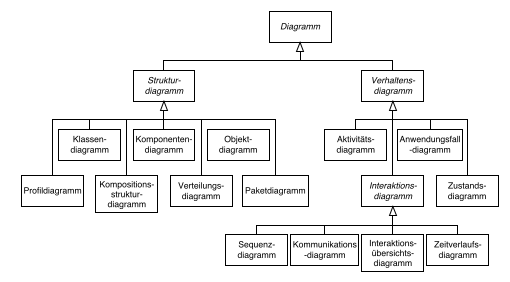
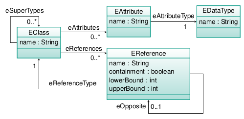
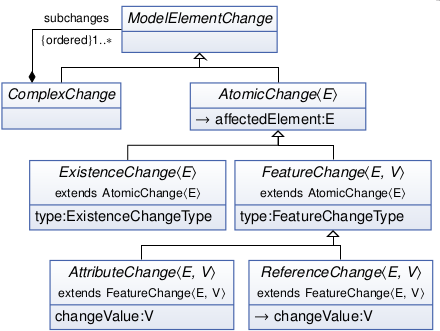
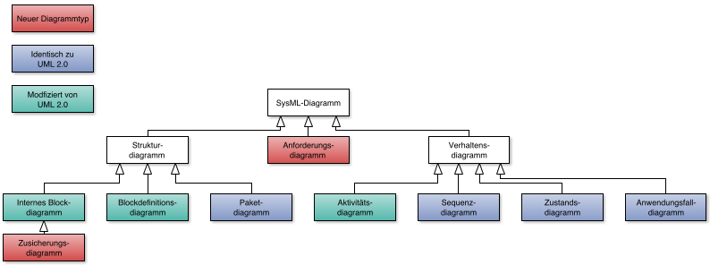
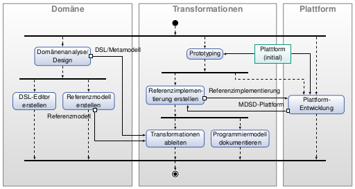
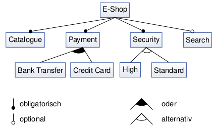
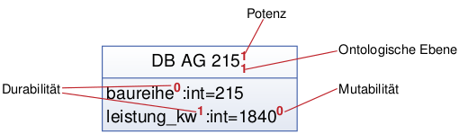
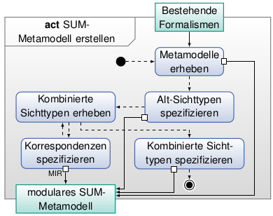
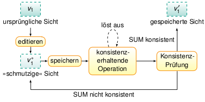

# Modellgetriebene Softwareentwicklung
* Modelle sind intrinsisch in Natur-/Ingenieurswissenschaften, auch Informatik
* Code ist auch nur ein Modell.
* Modell kann Vorbild oder Nachbild sein, aber auch synchronisiert. (Praeskriptiv/Deskriptiv)

### Allgemeine Modelltheorie
* **Abildungsmerkmal**: Modell stets (Abbildung, Repraesentation) *VON* etwas natuerlichem/kuenstlichem => kann selbst Modell sein
* **Verkuerzungsmerkmal**: Umfasst nicht alle Attribute, nur was fuer Ntzer/Modellierer relevant
* **Pragmatisches Merkmal**: 
  1. fuer *bestimmte Subjekte* (erkennende/handelnde/nutzende Menschen)
  1. fuer *bestimmte Zeit(raeume)*
  1. Unter Einschraenkung auf *gedankliche oder tatsaechliche Operationen*

### Model Driven Engineering (MDE)
* Domaenenspezifische Modellierungssprache (DSML) + Transformation Engines/Generatoren
* Automatisierung von Aspekten der Produktion/Wartung/Betrieb

### MDSD
* MDE fuer Softwaredevelopment

### MDA
* OMG-Warenzeichen
* Vorgehen fuer MDSD
* Nutzt OMG Standards
* Modelltypen CIM, PIM, PSM

|Modellbasiert                           |Modellgetrieben                                   |
|----------------------------------------|--------------------------------------------------|
|einige Modelle sind sekundaere Artefakte|Modelle sind primaere Artefakte                   |
|zur Dokumentation                       |sind integraler Teil des Systems                  |
|zur Kommunikation                       |Koennen nicht weggelassen werden                  |
|manueller Umgang                        |Explizite Entwicklung/Spezifizierung/Versionierung|
|                                        |Transformationen zw. Modellen                     |

Ziele:
1. Steigerung der Entwicklungsgeschwindigkeit
1. Steigerung der Softwarequalität
1. Trennung von Verantwortlichkeiten (Separation of Concerns)
  1. Redundanzvermeidung
  1. Wartbarkeit
  1. Handhabbarkeit von Technologiewandel
1. höherer Grad der Wiederverwendung
1. Verbreitung von Expertenwissen
1. Handhabbarkeit von Komplexität durch Abstraktion
1. produktives Umfeld
1. Interoperabilität
1. Portabilität

## Model-Driven Architecture (MDA)
1. UML *nicht* vorgeschrieben, aber **MOF** (wegen Automatisierbarkeit)
1. Spezifikationen sollen maschinenlesbar definiert werden
1. Modelle dienen nicht ausschließlich der Dokumentation
1. Modelle sollen durch Transformationen in andere Modelle überführt werden

|Computation Independent Model (CIM)         |Platform Independent Model (PIM)|Platform Specific Model (PSM)     |
|---|
|Anforderungen an das System und die Umgebung|Betrieb des Systems             |plattformspezifische Informationen|
|Struktur verborgen                          |Plattformdetails verborgen      |                                  |
|Bsp: Anwendungsfalldiagramm                 |Bsp: Komponentenmodell          |Bsp: Klassendiagramm              |

Neue Rollenaufteilung in Software Development:
1. Programmierer: nicht mehr noetig
2. Domaenenexperte: Kennt Umgebung, erstellt Modelle, definiert Metamodelle
3. Tech-Experte: Entwickelt Modellierungsplattformen, Transformationen, Metamodelle

## Metamodelle
1. Abstrakte Syntax
  > Konstrukte, aus denen Modelle bestehen, sowie deren Eigenschaften und Beziehungen
2. Konkrete Syntax
  > Darstellung der Konstrukte, Eigenschaften und Beziehungen
3. Statische Semantik
  > beschreibt Modellierungsregeln und Einschränkungen, die nicht durch die abstrakte Syntax ausgedrückt werden  
  
  Bsp: OCL  
  Soll entscheidbar sein
4. Dynamische Semantik
  > Bedeutung der Konstrukte. Spezifizierung durch natuerliche Sprache (Text)

### Meta Object Facility (MOF)
* Ist meta-Metamodell
* Aufgeteilt in **EssentialMOF** und **CompleteMOF**
* Zyklische Abhaengigkeit CMOF <-> UML
1. M3 Meta-Meta (MOF, ECORE)
2. M2 Meta (KVV, Klassendiagramm)
3. M1 Modelle (Instanziierungen aus M2)
4. M0 Originale

## UML2
* 3 Teile:
  1. Infrastructure
  2. Superstructure (merged with Infrastructure in 2.5)
  3. OCL
* Diagrammtypenhaeufigkeiten:  
  Class > UseCase > Interaction > Activity > Component > Structure > Action > Deployment > Info Flows > State Machines
* Klassendiagramme: 1. Domaenenmodelle 2. Objektorientierte Entwuerfe
* Weitere Diagrammtypen:
  * Package Import
  * Package Merge
* Entwurfsprinzipien:
  1. **Modularitaet**: Konstrukte in Paketen, Eigenschaften in Metaklassen
  1. **Schichtung**: Paketstruktur und Modellierungsebenen geschichtet
  1. **Partitionierung**: Gruppierung von Elementen auf selber Modellierungsebene nach Konzepten => Flexibilitaet
  1. **Erweiterbarkeit**: Profilbildung => Neue Dialekte
  1. **Wiederverwendung**: Feingranulare Bibliothek
  

### Profile
* UML-Profile: Mittelweg "Reines" UML <-> Eigenes Metamodell
* *Paket*, das Referenz-Metamodell erweitert/anpasst fuer Domaene/Plattform/Methode
* Erweitert *Metaclass* und fuegt Constraints hinzu
* *Stereotypen* wichtigste Erweiterungselemente
  * Klasse, die Erweiterung des Ref. Metamodells definiert
  * Bildet *Extensions*, dargestellt durch -->>
  * KEINE Erweiterbarkeit durch andere Stereotypen
  * Attribute = *Tags*
  * Werte von instanziierten Tags = *tagged values*
  * Bsp: Datenbank ist Metaklasse + Port
* Nutzung ueber Paket-Import
* Erweiterung von existierenden Modellen (auf M2 Ebene)
* Constraints: ? Angewendet, wenn Paket importiert wird. "Wohlgeformtheit"

|Profil                                 | Metamodell                 |
|---|
|+ Wiederverwendung                     |+ Voellige Freiheit         |
|+ immer gültiges UML                   |- Geringe Wiederverwendung  |
|+ viele vorgefertiget Domaenenprofile  |
|- geringe Flexibilitaet                |
|- UML komplett geerbt                  |

### Infrastruktur-Bibliothek
* Meta-Sprachkern

Core  
|-Primitive Types: Integer, Boolean, String...  
|-Basic: Grundbegriffe Klasse, Attribut, Operation, Paket  
|-Abstractions: Generalisierung, Instanz, Einschränkung, Kardinalität...  
\\-Constructs: Grundkonzept Assoziation  

### Generalization Sets
* Vererbung = *Generalisierung*
* Generalisierungsmengen = Partitionen der Beziehungen:
  * **overlapping**: Weitere Subklassen moeglich mit Mehrfachvererbung
  * **disjoint**: *KEINE* Subklassenbildung mit Mehrfachvererbung
  * **complete**: Alle Subklassen wurden spezifiziert
  * **incomplete**: Einige Subklassen wurden spezifiziert, weitere sind möglich.
* Beispiel: Lokomotive mit *Antrieb {disjoint, complete}* zu Dampf- und Motorlokomotive

### Power Types
* Typ für Generalisierungsmenge
* Dimension der Erweiterung, z.B. Lokomotiv-Generalisierung über Antrieb

## OCL
* Stark typisiert 
  * Boolean, Integer, Real, String
  * Collection -> Set (unique), OrderedSet, Bag (unordered, not unique), Sequence
  * Klassen mit Attributen/Referenzen/Operationen, Enumerations
  * *KEINE* Sichtbarkeiten
* Seiteneffektfrei
  * keine Kontrollflusskonstrukte
  * keinemProgrammaufrufe
  * keine Modellveränderbarkeit
* *Constraints* für Klassen bzw. deren Instanzen
* *Instanzen*: Constraint für ganze Objektlebenszeit
* Vor- und Nachbedingungen von Operationen (*pre* und *post* statt *inv*)
* Nutzung in *Query/View/Transform* (*QVT*) Transformationssprache
* oclIsTypeOf (*genauer* Typ), oclIsKindOf (Generalisierung)
* allInstances: Eklig! (Speicherverbrauch)
* Navigation: self.idcard.validityEnd, self.lectures->size()
* Mengenops: 
  * Vergleich: =, <>
  * Transforms: asBag() ...
  * Contains Test: includes(), excludes()
  * Modifikation: including(), excluding()
  * Flatten
  * union(), intersection(), minus(), first(), last(), indexOf()
* Iteratoren
  * select(x|x>2)
  * reject(x|x>2)
  * any(x|x>2) (z.B. select().first())
  * collect(firstName): Sammelt firstName Attribute
  * isUnique(i|i*i): ist Func bijektiv
  * sortedBy(i|-i)
  * exists(x|x>10)
  * one(x|x>4): genau 1 Element erfüllt
  * forAll(x|x>0): Gilt Func für alle?
  * includes/excludes/includesAll/excludesAll
  * iterate{Element, Akk, Startwert | Prädikat}
* Logik: not, and, or, xor, implies, if...then...else...endif
* Initialwerte: *init*
* Abgeleitete Werte: `context: Student::passedExams`, `derive: self.avgGrade -> sum() / self.passedExams->size()`
* Queries: `context: ..., body: self.attendedLecture.lecturer -> select(l|l.oclIsKindOf(Professor))`
* `let bla : typ = xyz in ausdruck`
* Guter Stil:
  * Komplexitaet vermeiden
  * Richtige Kontext
  * nicht allInstances nutzen
  * `and` Verknuepfungen aufspalten in einzelne constraints
  * Kurzschreibweise fuer `collect()` (Ich glaube, es ist `.` oder `->` gemeint)
  * Rollen statt Assoziationsnamen
* Entscheidbarkeit: Unentscheidbar

## Modelltransformationen
* Bestandteile:
  * Eingabe: Modell A, basierend auf Metamodell A
  * Ausgabe: Modell B, auf Metamodell B
  * Transformationsregeln, geschrieben in Transformationssprache
  * Transformationsengine
* Def. Fachbegriffe: Transformation, Transformation definition, Transformation rule
* Maschinelle Nutzbarkeit von Modellen:
  * Kostenersparnis
  * Produktivitätsgewinn
  * Qualitätssteigerung
  * Verringerte Wartungskosten
* Trennung Domäne/Technologie
  * angewandt im MDA-Prozess
  * bessere Wartbarkeit
  * Trennung Domänen-Experte/Technologie-Experte
* Wiederverwendung
  * der Transformationen selbst oder von Teilen (inter)
  * innerhalb einer Transformation z.B. von generiertem Code (intra)
* Klassifizierung
  * Technischer Raum: XML/MOF
  * Endogen: Innerhalb selbes Metamodell, Exogen: Verschiedene Metamodelle
  * Horizontal: Selbe Abstraktionniveaus der Modelle, Vertikal: Unterschiedliche Abstraktionsniveaus
  * Syntaktisch: Reine Transformation von Syntaxen, Semantisch: z.B. Refactorings, Optimierung
* Characterisiken:
  * Automationsgrad
  * Komplexitaet
  * Eigenschaften-Erhaltung
  
### Transformationssprachen:
* Anforderungen:
  * Nutzbarkeit/Nuetzlichkeit
  * Verbosity/Praegnanz
  * Performance/Skalierbarkeit
  * Erweiterbarkeit
  * Interoperabilitaet
  * Standardisierung
* imperativ: (Wie-Aspekt)
  * QVT-O
  * XSLT
  * Java
  * Xtend
  * Kermeta
* Hybrid:
  * NTL
  * VIATRA
  * ATL
  * MIR
  * RubyTL
* deklarativ: (Was-Aspekt)
  * QVT-R
  * TGG
* Vorteile Deklarativ:
  * Modell-Traversierung/Navigation
  * Grundlagen Trace-Verwaltung
  * Bidirektionalität
  * implizit ausrückbar:
    * Navigation des Quellmodells
    * Erstellung des Zielmodells
    * Reihenfolge der Regelausführung
  * "Funktional"/Zustandslos (aber auch Nachteil)
* Logische Programmiersprachen (Prolog, Mercury)
  * Backtracking
  * Constraint-Propagierung (bei Constraint-Programmiersprachen)
  * Unifikation (partiell/vollständig)
  * Anfrage-Mechanismus
* Imperativ:
  * Wenn alles andere versagt
  * Weil z.B. Reihenfolge wichtig
  * Andere Programme aufrufbar
  * Einfacher fuer Entwickler

### Formalisierung von Transformationen
* Modelle = Graphen
* Transformationen => Graphtransformationen
* Abstrahierung von konkreter Sprache/Engine
* Nachweis von Eigenschaften möglich
* Graphdefinition:  
  * C = <Cv, Ce> Markierungsalphabete
  * Gerichteter markierter Graph (V,E,s,t,l,m)
  * s,t: E -> V (Quell- und Zielzuweisung für Kanten)
  * l: V -> Cv, m: E -> Ce (weisen Knoten/Kanten Markierungen zu)
* Graphersetzungssystem: G = <C,R> (Markierung, Regeln)
* Graphgrammatik: <C,R,N,S>
  * Graphersetzungssystem
  * N = <Nv,Ne> Teilmenge C
  * S = Graph über C
* Metamodell = attributierter Typgraph, Modell = Instanzgraph
* Graphersetzungssystem r = (L,K,R) 
  * L,K,R sind Graphen
  * L > K < R, K: Klebegraph
* Anwendung:
  * Finde Instanz von L in G
  * Prüfe Identifikationsbedingungen
  * Lösche aus der Instanz L\K (K bleibt also)
  * Füge R\K hinzu
* Bs: Eclipse Henshin

### QVT
* OMG: EMOF + OCL
* Beziehungsüberprúfung, Transformationen, Modellaktualisierungen
* Architektur? Operational Mappings, Relations, Core, Black Box
* *QVT-R*: Transformationen = Relationen
  * Engines: 
    * ModelMorf
    * MediniQVT
    * Eclipse MTT
  * Bidirektional (nicht zwangsläufig bijektiv)
  * Bedingungen `check` & `enforce`
  * `domain`: Startpunkt für Mustersuche, Navigation über OCL
  * `checkonly`, `enforce`, `when`, `where`
* *QVT-O*: Imperatives QVT
  * Kopf
  * Main-Methode
  * Mapping-Regeln
  * Queries (optional)
* ImperativeOCL:
  * Funktionsaufrufe: `map`
  * Variablen: `var`, `:=`
  * Kontrollfluss: `switch/case`, `while/break`, `for/continue`, `if/else`, `return`
  * Instanziierung: `object`, `new`
  * Exceptions: `assert`, `try`, `raise`, `catch`
* QVTr, QVTc, QVTu, QVTm, QVTi, QVTo

### ATL
* Atlas Transformation Language
* Von: OBEO, INRIA
* Teil von EMF => Eclipse Public License
* Enwicklung: OBEO, AtlanMod
* Konzepte:
  * Quell- und Zielmodell unterschieden
  * Quelle readonly, Ziel writeonly
  * Hybride Sprache (Deklarativ + Imperativ)
  * Ausführungsreihenfolge nicht spezifiziert, aber egal (read/write only)
  * KM3 eigenes Meta-Metamodell: Kernel Meta-Metamodell

## EMF (Eclipse Modeling Framework)
* Eclipse: Nicht erweiterbar, sondern *erweiterungsbasiert*
* Zugriff auf MOF von Java mit JMI (Metadate Interface)
* Eclipse-Features mit EMF:
  * Codegen
  * Task Automatisierung
  * Erweiterbarkeit
  * UI
* Features:
  * Unterstützt Java, UML, XML
  * Ecore Meta-Metamodell
  * Tools: UI, headless, Ant, Standalone, Editors
  * Reflektive API, dyn. Modelldefinition ("im Speicher")
  * Persistenz: XML/XMI (XML Metadata Interchange), (De-)Serialisierung
* Runtime:
  * Autosave
  * Change Notifications
  * Dynamic Object Zugriff über Reflection API
  * Integration in Eclipse IDE, Eclipse RCP, Standalone Java
* Workflow:
  1. Metamodell erstellen
  1. Code und Editoren generieren
  1. Modellinstanzen mit gen. EMF-Editor erstellen
  1. Modell verfeinern
  1. angepasstes UI mit EMF.Edit erstellen
* Import:
  * UML
  * Annotierter Java Code
  * XML Schema
  * `.ecore` Datei
* Alternativ zu Java Metadata Interface nutzbar

### Ecore
* EMOF kompatibel
* Klassen (+abstract), Interfaces: `EClass`
* Attribute/Funktionen/Methoden: `EAttribute` -> `EDataType`
* Referenzen (Assoziationen, Aggregationen, Kompositionen): `EReference`  
  
* Datentypen: EBoolean, EChar, EFloatObject (java.lang.FLoat), EJavaObject...
* Eigenschaften von Features:
  * Default Value
  * Ordered
  * Many
  * Required
  * Changeable
  * Transient
  * Volatile
  * Derived
  * Unsettable
* Reflection: `.eINSTANCE`, `.eClass()`, `getEStructuralFeature`, `EcoreUtil.create(class)`
* Serialisierung: Siehe Persistenz
* Benachrichtigungen: Alles ist ein `Notifier`, Listener = `Adapter`

* Codegen:
  * Modell-Impls
  * UI unabh. Editor-Unterstützung
  * Editoren und Sichten für Eclipse
  * JUnit-Test-Stubs
  * Manifest, Plugin-Klassen, Eigenschaften, Icon usw.
  * Vorteile: Auto-Merge, Editorkompatibel, Import
  * Nachteile: Geringe Flexibilität, nur Java
* ALternativ: Modell-zu-Text
* Kombination mit selbstgeschriebenem Code:
  * @generated muss entfernt werden

## DSL Engineering
|Allzwecksprache         |Domänenspezifische Sprachen|
|---|
|weite Verbreitung       |jeder hat eigene DSL     |
|allgemein/Ausdrucksstark|weniger allgemein        |
|weniger knapp/präzise   |präziser                 |
|                        |weil auf Domäne optimiert|

### Human-Usable Textual Notation (HUTN)
* OMG Standard
* nach XMI konvertierbar
* selten benutzt

Nachteile von Diagrammen:
* Konkrete Syntax kann nur Teilmenge von Abstrakter Syntax -> Rest ist Fließtext
* Layout für Verständnis wichtig, hat aber nix mit Modell zu tun. Außerdem Version Control
* Für große Projekte sind Diagramme unübersichtlich

Vorteile Textsprachen:
* Editoren: Copy/Paste/Syntax Higlighting
* Versionskontrolle, Diff, Patches...
* Syntaxcheck (Fehlerhervorhebung)
* Autovervollständigung

Schritte:
* Abstrakte Syntax definieren (Metamodell)
* Konkrete Syntax(en) definieren

Ansätze:
* Grammatik-basiert: AS kommt aus KS
* Mapping-basiert: Beziehungen AS <-> KS manuell spezifizieren

"Erweiterte Backus-Naur-Form", (Nicht)-Terminalsymbole

### Xtext
* Grammatik, Parser/Compiler/Linker, Editor, AST alles in einem Rutsch
* Benutzt ANTLR
* Basis: .ecore Metamodell
* `import`, `grammar ... with ...`
* Grammatikbau
  * `terminal XY: $regex$`, `terminal XY returns ecore::EInt: $regex$`
  * Keywords als 'Strings'
  * `enum Degree: Master = 'master' | Student = 'student'
  * `fragment`

### Modell-zu-Text
* Meist nur Teile der Modellinformationen werden transformiert
* Codegen mit *Templates*, Inhalt aus *Queries*
  * Template-Engines
* **Xtend**
  * Allzwecksprache (nach Java kompiliert)
  * Reduktion der Verbosity
* **Xpand**
  * Template-Engine fuer Xtend
  * Eclipse-Projekt
  * Beispiel: Xpand nach Mediawiki
* Zusammenfassung:
  * Code + Xpand => Modell (.xmi)
  * Modell instanceof Metamodell (.ecore)
  * .ecore => Xtext (DSL)
  * .xmi => DSL-Instanz

### Best Practices
* Mischung eigener Code/generierter Code vermeiden
  * Inkonsistenzen
  * Versionsverwaltung
  * Wartbarkeit
* Deswegen: Geschuetzte Bereiche (Xpand) mit `PROTECT`
  Nachteile:
  * Komplexerer Generator
  * Komplexe Erhaltung von manueller Bearbeitung
  * Entwickler koennen geschuetzte Bereiche beschaedigen
  * Versionierung
* Desweiteren:
  * Verschiedene Dateien fuer generierten und manuellen Code
  * Gen. Code nicht modifizieren
  * Huebschen Code generieren (Beautify)
  * Kommentare aus Modellinfos
  * "Location Strings" -> Inline Source maps
* 3 Schichtige Impl:
  1. Plattformschicht (nur manueller Code)
  1. Modellschicht (generierter Code)
  1. Applikationsschicht (manuelle, nicht-abstrakte Klassen)
  
## Metamodell Qualitaet
### Ecore
* Nutze Mehrfachvererbung fuer Mixins/Code Sharing
* Eindeutiges Wurzelelement
* Containments: Jede Klasse ist irgendwie in Wurzel (= Gesamtsystem) enthalten
* Navigierbarkeit ueber Referenzen sicherstellen (ggf. `EOpposite`)
* Korrektheit: Kardianalitaeten, Instanziierbarkeit

Entwurfsalternativen:
* Modellierung <-> Constraints
* Klassen <-> Rollen
* Vererbung <-> Instanziierung
* Enums <-> Klassen
* Attribute <-> Referenz + neue Klasse

Sonstige Entscheidungen:
* Modelle einfach erstell-, analysier- und transformierbar
* Enums statt Strings
* Einfachste Alternative waehlen, z.B. meherer Bool-Switches nur, wenn alle Kombinationen moeglich
* Benannte Referenzen als Rollen fuer Klassen
* Gleiche Dinge gleich modellieren
* keine Operationen um Struktur zu modellieren

### Qualitaet in OO Entwurf
* Modelleigenschaften korrellieren mit Zielmetriken:
  * Größe, Anzahl, Verschachtelungstiefe... <=> Wartbarkeit, Verständlichkeit, Transformierbarkeit
* Objekt X = <x, p(x)> mit x = Individuum und p(x) = Attribute, Mx = Methoden, Ix = Instanzvariablen
* Aehnlichkeit sigma(M1,M2) = I1 Schnitt I2
  * Aehnlichkeit bestimmt Kohaesion
* Weighted Methods per Class: Anzahl + Komplezitaet
* Vererbungstiefe/Vererbungsbaum: Baeume gut, Rauten schlecht
* Viele Subklassen schlecht wegen modifizierbarkeit der Elternklasse
* Coupling: Klasse Y benutzt viel aus Klasse X
* Response sets: Methoden + aufgerufene Routinen in den Methoden
* Methodenkohaesion: Schnitt der zugegriffenen Member. Leere Schnitte -> Klasse koennte aufgespalten werden

### Metamodellqualitaet
1. manuell: teuer, subjektiv
1. musterbasiert
1. metrikbasiert

Antipatterns:
* Isolierte Klasse/ isoliertes Paket
* Zyklen in Vererbungsgraph

Zielmetriken und Groessenmetriken:
* Komplexität
  * Depth of Inheritance
  * Number of Indirect Superclasses per Class
  * Depth of Containment
  * Number of Containers per Concrete Class
* Verständlichkeit
  * Depth of Packaging
  * Total Number of Disjoint Roots
* Modularität
  * Number of Direct Elements per Package
  * Depth of Packaging
  * Maximal Inheritance Cycle Length
* Präzision
  * Total Number of Classifiers
  * Total Number of Elements
* Vollständigkeit
* Korrektheit
  * Maximal Inheritance Cycle Length
  * Total Number of Disjoint Roots
* Änderbarkeit
* Nutzbarkeit (Instanzen)
  * Total Number of Isolated Classifiers/Packages
* Nutzbarkeit (Transformationen)

Probleme:
* Abstraktion nicht messbar/domaenenspezifiesch
* Modularisierung messbar (Kohaesion, #Pakete), aber nicht zwangslaeufig groesser = besser

## Metamodell-Repositories/Query-Sprachen
1. Verwaltung von großen Modellen
1. Abfrage von Elementen
1. Generierung von Sichten

### OCL
* skaliert schlecht  

### EMF-Query:
* SQL-artig
* Hat API
* Indexer
* *dirty state*

### EMF IncQuery:
* Graph Anfragesprache (deklarativ)
* Musterbasiert
* Features:
  * Muster-Komposition
  * Rekursion/Negation
  * Abfragen: Generisch oder parametrisiert
  * Bidirektionale Navigierbarkeit
  * Inkrementelle Ausfuehrung

### CDO (Connected Data Objects):
* Verteiltes Arbeiten
* Transaktionen
* Versionierung
* Repository-**Sichten**
* 3-Schichten-Architektur
  1. Clients
  1. Server
  1. RelationalDB/Object Oriented DB/...

### EMFStore
* Metadate Repository
* Versionierung: Diff/Merge
* Offline-faehig

### ModelJoin
Motivation
* Verschiedene Metamodelle mit semantischen Ueberlappungen
  * Informationen muessen einander zugeordnet werden
* Verschiedene Speicherorte der Infos (1 Ort je Metamodell)
* => Sichten (wie Rel. DBs) fuer versch. Informationsbeduerfnisse
* Aehnliche Ansaetze:
  * GlueMM: Verbinde Metamodelle ueber Klebemodell
  * TargetMM: Vereine Metamodelle in groesserem
  
Ziele:
* SQL-aehnlich von Menschen lesbar
* deklarativ
* heterogene Metamodelle zu Sichten verscmelzen
* Nicht-Invasiv (ohne Modifikationen)
* schnell geschrieben und ausgefuehrt
* kein (manuell definiertes) Ziel-Metamodell noetig

|relationale DB|Ecore|
|---|
|Schema|Metamodell|
|Tabelle|Modell|
|Zeile/Tupel|Objekt/Instanz|
|Spalte|Feature (Attr, Ref)|
|Anfrage|Modelltransformation|

Operationen:
* JOIN
* KEEP (Projektion)
* WHERE (Selektion)

**Mengen-Notation von Ecore**
Foliensatz 9, Folie 28

|||
|---|
|Class|Klassenname, Generalisierung <|
|...||

Mapping:
* Mapping-Relation: auf Metamodell-Ebene definiert
* Instanz-Mapping-Relation

Operatoren:
* Join
  * Join-Konformitaet ~=Att: "Aehnliche" Attribute, die vereinigt werden koennen
  * Join-bare Attribute: Attribute einer Klasse mit Join-Konformitaet
  * Instanz-Konformitaet ~=I : Instanzen koennen vereinigt werden, wenn alle Attribute join-bar sind
  * Join Operator ><, natural Join: <class source1, class source 2, class target>
* Outer Join: Normaler Join + nicht-join-bare Attribute
* Theta-Join: Mit Filterfunktion
* Keep-Attributes ?
* Keep-References ?

Zusammenfassung:
* Keine Transformationssprache
* Modellverschmelzung, Fokus Sichtbasierte Entwicklung
* Kein Framework fuer Datenintegration
* Keine Heuristiken fuer "aehnliche Element"-Verschmelzung
* vs. SQL: Konstruktiver Ansatz

Moegliche Erweiterungen
* Sichten Editieren (Ruecktransformation in Quellmodelle)
* Generierung des Ziel-Metamodells
* Anbindung an Repositories

Open Source, Prototyp

## Metamodell-Evolution
* Lehman's Law I: Programm, das andere Realitaet abbildet, wird veraendert und zerfaellt, bis neu machen billiger ist.
* Aenderungen
  * Atomar: CRUD
  * Komplex: Refactorings, Elementverschiebung...
* Aenderungssequenz D = (d1, d2, d3...)
* Auswerungsfunktion evalD: Model -> Model
* Sequenz**Aequivalenz**
* Sequenz**Minimalitaet** (es existiert keine kuerzere Aequivalente Sequenz)
* Aenderungsmetamodell (Burger2014)
  

*Deltabasiert* vs *Zustandsbasiert*

|Delta|Zustand|
|---|
|Absicht wird besser erfasst|Kann mit generierten Modellen verwendet werden|
|Aenderungssequenz muss nicht berechnet werden|minimal (fuer Atomare Aenderungen)|
|---contra---|---contra---|
|nur bei manuellem Bearbeiten anwendbar|Aenderungssequenz muss ermittelt werden|
|nich minimal|Komplexe Aenderungen nur durch Heuristiken|
|braucht Werkzeugunterstuetzung||
Bsp: EMFCompare
  
### Ko-Evolution von Instanzen (Migrations)
Verschiedene Schweregrade:
|2011|Burger 2010|
|---|
|model preserving|non-breaking|
|safe model migration|breaking resolvable|
|unsafe model migration|breking not resolvable|

Aenderungstypen:
* Refactoring: Bijektive Abb ex.
* Konstruktor: Injektive Abb ex.
* Destruktor: Surjektive Abb.ex.

**Modellerhaltung**  
M -> M'
_M_ -> _M'_
* Model-preserving: _M'_ ist immer noch gueltige Instanz von M
* Model-migrating
  * safely: Injektiv
  * unsafely: Nicht injektiv

Bidirektionalitaet:
* self-inverse
* inverse: Sequenz+Inverses ergibt ein Refactoring
* safe inverse: Sequenz+Inverses ist model-preserving

Aenderungskatalog:
* Strukturprimitiven
  * Erstellen Pakete, Klassen, Attribute, Referenzen
  * Loeschen
* Nicht-Struktur-Primitiven
  * Umbenennung
  * Vererbung
  * Abstraktheit
  * Komposition
* Spezialisierung/Generalisierung
  * Verschiebung von Attrs und Refs entlang Verebungshierarchie
  * Aenderung von Oberklassen entlanf Vererbungshierarchie
* Vererbung
  * Pull up/push down feature (Attr, Ref)
  * Extract/Inline super class
  * Fold/unfold superclass
  * Extract/inline subclass
* Delegation
  * wie Vererbung, nur ohne super/sub class
  * Move feature over reference
  * Collect feature over reference
* Ersetzung
  * Enum 2 subclass, subclass 2 enum
  * Reference to class, class to reference
  * Inheritance to delegation, delegation to inheritance
  * identifier 2 reference, reference 2 identifier
* Zusammenfuehren/Aufteilen
  * Merge features
  * Split reference by type
  * Merge/split class
  * Merge enumerations
  
## Automotive Bereich
* IT in Autos größter Innovationsfaktor

### Probleme, Domänenprofil
* Proprietäre Lösungen
  * OS, Protokolle, Tools, Architektur...
* Lebenszyklus Management
  * 90% Neuentwicklung zwischen Modellen
* Traditionell unabhängige Systeme, jetzt mit Interaktion:
* Montage wird zu System-Integration
* Software als treibender Kostenfaktor
* Potential:
  * Anforderungen aufteilen in funktional/nicht-funktional
  * Abhängigkeiten modellieren
  * Qualitätseigenschaftren modellieren
  * Dekomposition des Systems
  * Integriertes Hardware-Software Modell

### SysML
* Anforderungen
* Verhalten: Funktionales Modell/Verhaltensmodell
* Struktur: Strukturmodell/Komponentenmodell
* Parameter: Performance-Modell
* ...
* UML-2 Profil

Ziele:
* Gemeinsames Verständnis von Anforderungen und Entwurf
* Komplexe Systeme: Trennung nach Belangen und Sichten
* Qualität des Entwurfs

* SysML verwendet die meisten UML-Diagrammtypen
* SysML modifiziert
  * Aktivitätsdiagramm
  * Blockdiagramme
* SysML fügt hinzu
  * Zusicherungsdiagramm
  * Anforderungsdiagramm
  * Diagrammrahmen
* Aktivitaetsdiagramm: Erweiterung um Ports (Zustands- In/Output)

### Weitere Sprachen
* AutoSar
* East-ADL
* EATOP
* Amalthea
* Ascet
* Matlab/Simulink

## Prozesse
* MDSD **Prozess-agnostisch**
  * Keine Pflichtmodelle
  * Kein vorgegebenes Abstraktionsniveau
  * Keine Modellverknuepfung
* Kein Allheilmittel, kann scheitern
* Gruende:
  * Organisatorisch, Management, Sozial (nicht Technisch)
* Tipps:
  * Kleines Projekt als Start
  * Management muss unterstuetzen
  * Berater
  * **Problemfelder kennen**
* Neue Rollen

### Agiles MDSD?
* Modellierung nach Manifest ueberfluessig
  * Nicht ausfuehrbar
  * nicht testbar
  * reine Doku
  * Mehraufwand bei Updates
* DDD aehnlich zu MDSD (DSLs!)
* Test Driven Development: Tests aus Modellen ableitbar

### Architecture-Centric (AC) MDSD

* Erstellung der Domänenarchitektur
  * Domaene
    * DSL entwerfen, Editor entwerfen, Demo fuer DSL
  * Transformation
    * Basieren auf DSL
    * Abgeleitet von Referenzimpl.
  * Referenzimplementierung
    * Verstehe Entwurfsalternativen
    * Infrastruktur muss feststehen
    * Vollstaendig bzgl.
    
### Generative Programmierung

#### Feature-Modelle

## Deep Modeling
### Strikte Metamodellierung
* Genau 1 Typ pro Element
* Instanz-Von zur Ebenendefinition
* Feste Anzahl an Ebenen

### Deep Characterization, Deep Instantiation
* Clabjects

Traits:  

* ECore
* Level-Agnostic Modeling Language (LML)
* Tool: Melanee

## Gastvorlesung CORE
* Werbung

## Sichtbasiert Entwicklung
* Verschiedene Ansichten: Viewpoints
* Terminologie:
  * Standpunkt (viewpoint)
    * Perspektive eines Concerns
  * Sichttyp (view type)
    * Klassen, die in SIcht enthalten sein koennen
  * Sicht (view)
    * Anwendung von Sichttyp auf System
    * Menge von Instanzen in konkrteter Syntax + Layout 

### Orthographic Software Modeling
#### Single Underlying Model (SUM)
* Das grosse ALLES
* WIe konstruiert man das?
* Versionierung?

### Vitruvius
* View-cenTRic engineering Using a VIrtual Underlying Single model
* SUM-Konstruktion ueber bestehendem Projekt (Java + UML)  
  
* Projektionen auf Sichten
* Editierbarkeit  
  
* MIR-Sprache
* Synchronisation
* Ko-Evolutions-Ansatz
  * Alte Modelle refactorn oder atomares erstellen "simulieren|

### JaMoPP
* Java to EMF-Modell
* Fuer Java 5
