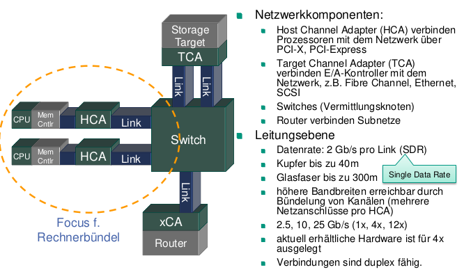
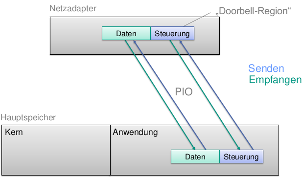

# Multikernrechner und Rechnerbuendel
CRAY Vektorrechner

## Einfuehrung
Warum Parallelverarbeitung?
* Mehr Leistung als Single-Core
* Single-Core Leistung waechst nicht mehr
* "Grand Challenges" (Chemie, Astronomie, Simulationen)

Vorteile Parallelverarbeitung:

* Durchsatz steigern
  * `m` Instanzen eines sequentiellen Programms mit unterschiedlichen Datensätzen auf `n` > 1 Prozessoren
* Antwortzeit reduzieren (Beschleunigung)
  * einzelne Instanz eines parallelen Programms auf `n` > 1 Prozessoren: CPUs dazu die Aufgabe gemeinsam schneller zu lösen
  * Probleme: Paralleles Programm, hohe Kommunikationsanforderungen
* Problemgröße steigern
  * einzelne Instanz eines parallelen Programms auf n > 1 Prozessoren: Summe der lokalen Speicher dazu, größere Probleme zu speichern und zu berechnen
  * Probleme: Paralleles Programm, geringe/mittlere Kommunikationsanforderungen

### Schranken
Moore's Law ended in 2002. Verlustleistungsminimierung => Spezialprozessoren (heterogen)
* Power Wall (Hitze)
* Memory Wall (Speicherlatenz)
* ILP Wall (Instruction Level Parallelism ausgeschöpft)

### Loesungsansaetze
* Multicore
* 3D Transistoren

### Parallelität im Prozessor
* Maechtigerer Instruktionssatz
* VLIW
* Pipeline
* Superskalar (Hyperthreading)

### Flynn
* Daten- und Steuerungsflüsse
* SISD, MISD (unwichtig), SIMD, MIMD

### Memory
* Shared Memory Machine (SMM)
* Distributed Memory Model (DMM)
* Global Address Space (GAS)
* (Non-) Uniform Memory Access (UMA/NUMA): Speicherzugriffe lokal/remote sind (nicht) gleich schnell
  * (Cache Coherent) CC-NUMA
* Symmetric Multiprocessor (SMP) mit Caches (Konsistenzmodelle))
* Cache-Only Memory Access (COMA)
* Verteilter Speicher

### Rechnerbündel (Cluster)
* Verteilter Speicher + Verbindungsnetz
* Normale PCs (Massenproduktion, Commodity of the Shelf)

### Top500
* Linpack (Gleichungsloeser fuer dichte Matrizen)
* 2 mal jaehrlich aktualisiert
* Green500 fuer MFLOPS/W
* Beispiele:
  * Tianhe-2: 33.9 PFlops
  * Titan: 27.1 PFlops
  * Sequoia: 17.2 PFlops

## OpenMP
* Spracherweiterung
  * Liefert ohne OpenMP-Support selbes Ergebnis
* Portabel
* Standardisiert
* Architektur:
  * Fork-Join Modell
  * Master Thread
  * Gemeinsamer Speicher, ausser Stack
* Implementierungen:
  * Thread-Pooling
  * Nicht unbedingt unterstuetzt:
    * Verschachtelung
    * Dynamische Anzahl Threads
* Benutzung
  * `#pragma omp construct [clause [clause]...]`
  * `parallel` und `for` direktiven kombinieren
  * Umgebungsvariable `set OMP_NUM_THREADS=4`
* Sichtbarkeiten
  * Bsp: `#pragma omp parallel for private(x,y)`
  * `private` (uninitialisiert)
  * `shared`
  * `threadprivate`: Threads behalten Wert zwischen Abschnitten. Initialisiere mit `copyin`
  * `firstprivate`: wird aus Umgebungswert initialisiert
  * `lastprivate`: hat am Ende Wert aus letztem Iterationsblock
* Reduktionen
  * `#pragma omp parallel for reduction(+:sum)`
  * Kopien von Variable `sum` in z.B. `parallel for` werden am Ende ueber `+` zusammengefuehrt
  * Beachte Initialwerte der Akkumulatoren
* Scheduling
  * `schedule(<policy> [,chunk])`
  * Policies: `static`, `dynamic`, `guided`  
* 
* Synchronisation
  * `#pragma omp critical`
  * nach `parallel`, `single`, `for` implizite Barrieren
  * Implizite Barriere kann mit `nowait` unterdrueckt werden
  * `#pragma omp barrier` in `parallel` wenn alle an Barriere warten sollen
  * `#pragma omp atomic`: naechste Instruktion ist atomar
* Bibliotheksfkt.
  * `#include <omp.h>`
  * `omp_get_num_threads`
  * `omp_get_thread_num`
  * `omp_get_num_procs`
* Task-Parallelismus
  * `#pragma omp task`
  * Gebunden an ausfuehrenden Thread, ausser `schedule(untied)`
  * `taskwait`, `barrier`

## Java
Programmiermodell: Kontrollfäden mit gemeinsam genutztem Speicher  
`Runnable` und `Thread`  
Atomarität bei atomaren Datentypen  
Koordination:

* Wechselseitiger Ausschluss
* Warten auf Ereignisse/Benachrichtigung
* Unterbrechungen

Def. Kritischer Abschnitt:
> Bereich, in dem ein Zugriff auf einen gemeinsam genutzten Zustand stattfindet

### Monitore
* Jedes Objekt in Java kann Monitor sein
* `enter` und `exit` => Immer gemeinsam (Bytecode Verifier)
* Gleicher Thread kann mehrfach betreten
* `synchronized` und `synchronized(obj)`: Immer an Objekt gebunden

### wait/notify
* innerhalb von `synchronized` (sonst Compiler-Fehler oder `IllegalMonitorStateException`)
* Wait-Menge
* `wait`: Monitor wird während des Wartens freigegeben, geweckt nach Zeit oder `notify`, danach wieder Konkurenz um Monitor
* `notify(All)` erreicht nur 1 Aktivitaet

* **spurious wakeups**
* In einem robusten Programm können alle `notify()`-Aufrufe durch `notifyAll()` ersetzt werden.
  * einige VMs machen keinen Unterschied
* **Unterbrechnungen** `InterruptedException`, `t.interrupt()`
  * leite mit `throws` weiter, wenn nicht sinnvoll abfangbar

### Verklemmungen
* Beispiel: Dynamische Monitore "Konten" bei Ueberweisungen
* Semaphore
  * `acquire` und `release`
  * `java.util.concurrent`

### Java 7
* `TransferQueue`: Erzeuger/Verbraucher
  * `tryTransfer`: non-blocking
  * `transfer`: blocking
  * `hasWaitingConsumer`
  * `getWaitingConsumerCount`
  * `take`
  * `poll([time])`
* `Phaser`: (Zyklische) Barriere (vgl. `CyclicBarrier`) mit Moeglichkeit, Faeden an- und abzumelden
  * `register`
  * `arrive`: Ankommen und ohne warten weitermachen
  * `arriveAndDeregister`: Ankommen und abmelden
  * `arriveAndAwaitAdvance`: Ankommen und warten
* `ForkJoinPool`: Divide/Conquer + Work Stealing
  * Kombiniere mit `RecursiveTask` (`fork` -ruft auf-> `compute` -Ergebnis ueber-> `join`)
  * `execute` (async)
  * `invoke` (sync)
  * `submit` (return `Future`)
* `ThreadLocalRandom`
  * **kein** `setSeed` erlaubt
  * `ThreadLocalRandom.current()` Methode

### Compare and Swap
* `sun.misc.Unsafe` `compareAndSwap{Int|Long|Object}`
* `compareAndSet`, `weakCompareAndSet` (May fail spuriously, no ordering guarantees, rarely appropriate)
* `volatile` wichtig
* Bsp. `AtomicInteger`

## GPGPU/CUDA
SIMD

### Kerne
* Streaming Multiprocessors (SMX)
* 32 bit (64k)
* max 255 Register/Thread

### Speicher
* 64 KB SMX-Speicher
* 512 KB Thread-Speicher

### Verwaltungseinheiten
* 32 Special Function units (SFU)
* 32 Load/Store Units (LD/ST)
* 64 Gleitkommaeinheiten (DP Unit)
* 16 Textureinheiten (TEX)

### Abstraktionsstufen
* kernel
* Gitter
* Block -> SMX
* Threads -> SMX
* Warp
  * 4 Ablaufplaner fuer Gruppen (warp scheduler)
  * 2^5 Threads

### Sprache
* CUDA > C

| Qualifier | Ausgefuehrt auf | Gestartet durch |  
| --- | --- | --- |  
|\_\_device\_\_|GPU|GPU|  
|\_\_global\_\_|GPU|CPU|  
|\_\_host\_\_|CPU|CPU|  
 
* Anforderungen an \_\_global\_\_
  * Keine Rekursion
  * Keine statischen Variablendeklarationen innerhalb der Funktion
  * Keine variable Anzahl an Argumenten
  * Berechnung erfolgt asynchron
  * Schließt die Verwendung von \_\_host\_\_-Variablen aus
  * Rückgabetyp: void
  
### Run-Configuration:
* Blockgröße
* Gittergröße
  
```
__global__ void KernelFunc(...);
dim3 DimGrid(2, 3);
dim3 DimBlock(3, 5);
KernelFunc<<<DimGrid, DimBlock>>>(...);
```


### Speicher
* Thread-local
* Block-local
* Global: CPU-GPU Kommunikation, von allen Threads sichtbar
* `cudaMalloc`, `cudaFree`, `cudaMemcpy(src*, dest*, count, direction)` fuer globalen Speicher
* **Unified Memory**: `cudaMallocManaged`

### MatMul
1. Allocate A & B
1. Copy A & B to GPU
1. Kernel
1. Copy result to CPU
1. Free A & B

Kernel:  

```
__shared__: Gemeinsamer Speicher
__syncthreads: Barriere fuer alle Block-Threads
```

## Speichermodell
Interaktionen von Kontrollfäden mit
* Hauptspeicher
* anderen Threads

=> Semantik paralleler Programme
* Schreibend, Lesend
* Synchronisiert oder wettlaufend
* bzgl. Cache-Duplikaten

Benoetigt fuer Sicherheitsgarantien! (u.a. plattformuebergreifend)

### Sequentielle Konsistenz
* "Beliebiges Ineinadner-Mischen von Ops der Threads"
  1. Alle Programmaktionen total geordnet +
  1. Ordnung stimmt mit Operationsreihenfolge im Programm ueberein +
  1. Alle Operationen atomar und unmittelbar sichtbar
* Problem: Verbietet viele Optimierungen

### Umordnen von Befehlen
  
Double checked locking is broken

### Zugriffskonflikt
Zwei Zugriffe auf gemeinsamen Zustand stehen in Konflikt, wenn mindestens ein Zugriff eine Schreiboperation ist.

### Happens-Before-Beziehung
* Beispiele:
  * Instruktionen in selbem Thread nach "vor" geordnet
  * Monitorfreigabe vor Monitor-Eintritt
  * `volatile` Schreiben vor folgendem Lesen
  * `Thread.start` vor jeder Instruktion in dem Thread
  * Alles in Thread passiert vor `.join()` Aufruf
* Transitivitaet: a vor b, b vor c => a vor c

=> Wenn Konflikt vorhanden aber keine Happens-Before-Beziehung, ist eine Wettlaufsituation moeglich  
=> Keine Wettlaufsituationen => Korrekt synchronisiert

### Sichtbarkeit
* `volatile` Variablen
  * Bei Zugriffen auf als volatil deklarierte Variablen ist die Geschieht-vor-Beziehung automatisch gegeben.
* Double checked locking erst seit Java 5 realisierbar (neue `volatile` Semantik)

## Software Transactional Memory (STM)
* `atomic` Bloecke
* ACID: Atomicity, Consitency, Isolation (+ Durability, aber hier nicht relevant)
* Ergebnis: Serialisierbarkeit
* Eigenschaften Synchronisiermechanismen:
  * Obstruction-free: Threads, die lange genug laufen, machen Fortschritt
  * Lock-free: Irgendein Thread macht immer Fortschritt
  * Wait-free: Jeder Thread macht Fortschritt, auch wenn Verzoegerung oder Abbruch (> Lock-free)
* Optimistisches Grundprinzip: nicht im voraus verhindern, sondern nachtraeglich detektieren
* `abort`: Alle Effekte rueckgaengig machen (z.B. Output-Commit Problem)
* Granularitaet: Bloecke oder Cache-Zeilen. Optimalerweise objektorientiert zur Aufwandsminimierung
* `open()`, `commit()`, `acquire()` (meistens Teil von `open` oder `commit`)
  * Frühzeitige Besitznahme: + Fruehe Detektion, - kann unnoetig abbrechen
  * Späte Besitznahme: - laesst lange laufen, + keine unnoetigen Abbrueche
* Transaktions-Deskriptor


### Beispiel-Impl
* `TMThread`
  * `beginTransaction`
  * `open(READ/WRITE)`
  * `release`
  * `commit`
  * `abort`
  * `checkStatus`
* `TMObject`
  * `clone`

Vorgehen:
1. Lege Transaktionsdeskriptor (TD) an
  * Status active
1. Fuer jeden zugegriffenen Wert, lege Lokator an mit
  * Deskriptor
  * Neuer Wert
  * Alter Wert aus zuletzt gemachter Transaktion (Fallunterscheidung Committed/Aborted)
1. CAS alten Lokator auf neuen Lokator
1. CAS TD Status von `ACTIVE` auf `COMMITTED` (Wenn das nicht klappt ist es schon `ABORTED`)

## Netzwerke: Kenngroessen und Topologien
### Netzwerktopologie
* Geometrische Anordnung der Leitungen und Schalter, die Prozessoren und Speichermodule verbinden.
* Statisches Netz vs. dynamisches Netz (mit Schaltern)

### Theoretische Bewertungskriterien
* Grad: max. Kantenzahl/KnotenW
* Durchmesser: max. kuerzester Weg
* Kantenkonnektivitaet: zerteile in 2 Teile
* Bisektionsbreite: zerteile in 2 **gleich grosse** Teile

### Praktische Bewertungskriterien
* Latenzzeit `L`
  * Zeit zwischen Absenden und Ankunft
  * Messung: (ping-pong)/2 (Viele Iterationen, Aufwaermbotschaften)
* Bandbreite `B`
  * Daten/Zeit
  * Messung: Burst (schnell viele max. grosse Pakete) wenn feste Paketgroesse vorgegeben
* Verzoegerung/Uebertragungszeit `V(G)`
  * `G`: Groesse
  * `V(G) = L + (G - Gmin)/B`
  * `Gmin`: `V(Gmin) = L`
* Durchsatz D(G)
  * `D(G) = G / V(G)`
  * Half-Power Point: `D(Gh) = B/2`
  * `B = D(Gmax)`

### Topologien
* Bus
* Clique (vollstaendiger Graph)
* Ring
* d-dimensionales Gitter / Torus  
  
* Kreuzschienenverteiler
* Hyperwuerfel
  * 2^d Knoten
  * Grad: d
  * Durchmesser: d
  * Kantenkonn: d
  * Bisektionsbreite: 2^(d-1)
* Omega-Netz
  * log2(n) Stufen
  * *shuffle Bausteine*
  * Routing (auf Stufe k)
    * Wenn k-tes Bit = 0: Oberer Ausgang
    * Wenn k-tes Bit = 1: Unterer Ausgang
  * Einstufig: De-Bruijn
  * Grad: 2
  * Durchmesser: log2(n)
  * Kantenkonnektiviatet: 2
  * Bisektionsbreite: n/2  
  
* Butterfly-Netz
  * Routing: Wie in Omega  
  
* Clos-Netz
  * 3 Schichten Kreuzschienenverteiler
  * Nicht blockierend, wenn m >= 2n - 1  
  
* Fat-Tree  
  
* Constant Bisectional Bandwith (CBB)
  * Genauso viele Anschluesse nach unten wie nach oben
  * 2-Stufig: 3n Anschluesse fuer n Knoten  
  

### Vermittlungstechnik
* Wie lange und ueber welchen Pfad.
* Spezielle Prozessoren oder Knoten selber?
* Routing: Wegwahl
* Switching: Datentransfer innerhalb von Vermittlungsknoten

#### Leitungsvermittlung
* Verbindungsauf-/abbau
* Nachdem Verbindung steht, folgen Nutzerdaten

#### Paketvermittlung
* Jedes Paket hat Kopf mit Adressen
* **Store-and-Forward**
  * Paket vollstaendig in Knoten (Pufferkapazitaet!)  
  => Paket immer auf hoechstens 2 Knoten verteilt  
* **Wormhole**
  * Paketkopf reicht zur Weiterleitung
  * Wenn Ausgang frei: Direktes Durchleiten der Daten  
  => Paket ggf. verstreut, ggf. auch Stau wenn Ausgang belegt
* **Virtual Cut-Through**
  * *Store*d Paket wenn Ausgang belegt

#### Routing
1. **Tabellenbasiert**  
  Fuer alle Ziele ist Route vorberechnet (Speicherplatz waechst proportional)
1. **Source Routing**  
  Pfad wird von Sender bestimmt

### Gigabit Ethernet
* IEEE 802.3 Standard
* 1.25 mrd. Bits/s
* Kupfer (100m) oder Glasfaser (10km)
* Latenz ab 10 usec
* 40GbE und 100GbE in den Startloechern
* Stern-Topologie
* Vollduplex, daher CSMA/CD ueberfluessig. Stattdessen Flusskontrolle
* PCIe Karten

### Infiniband Architecture (IBA)
* Paketvermittlung
* bis zu 290 Gb/s 2014
* geringe Latenz (0.5 usec)
* Zero Copy
* RDMA
* 
* geschaltetes Netz Topologie, 64k Knoten/Subnetz, ueber Router verbindbar

#### Zuverlaessigkeit
* redundante Verbindungen unterstuetzt
* automatische Neukonfiguration im Fehlerfall
* QoS
* 16 virtuelle Verbindungen/Verknuepfung mit zugesicherter Flusskontrolle

#### Software
* Viele APIs
* Teilweise im Kernel-Mode
* erlaubt RDMA
* Verbs-API
  * Getrennte Queues fuer Sende- und Empfangsauftraege
  * RDMA auch ohne Auftrag auf anderer Seite
* PCI-Express-Karten

#### RoadRunner
* 5-stufiges Fattree Verbindungsnetz
* 17 Compute-Units


### Myrinet-19G
* ANSI/VITA Standard
* Weniger Protokoll-Overhead (als Ethernet)
* 2 usec Latenz auf MPI-Ebene
* Topologie beliebig, CBB bevorzugt
* Paketvermittlung (Wormhole, Source Routing), keine Laengenbeschraenkung, reihenfolgetreu

## Hochgeschwindigkeitsoptimierung
* Nachteil klassisches Ethernet: Viele Kern-Userspace Kontextwechsel
* Umgehung des normalen Protokollstacks  
  
* Contra: Alles muss selber gemacht werden

### Optimierungstechniken
* Vereinfachte Protokolle
  * optimistisch
  * Fehlerbehandlung
  * auf Hardware angepasst (Adressierung, Datenaustausch, Reihenfolge, Verbindungen)
* Vermeidung von Systemaufrufen
* Abfrage statt Unterbrechung
  * Polling (=> ekliges busy-waiting?, => schlechtere Reaktion?)
  * Doorbell-Region
* Vermeidung von Kopieroperationen

#### Programmed IO
  
Pro:
* Kein Kopieren
* Synchron
* Keine Kontextwechsel

Contra:
* Starke CPU-Auslastung
* Unakzeptable Empfangsleistung
  * Polling auf Langsamem Netzadapter-Speicher
  * Dann erst Daten lesen von Adapter

#### DMA
Arten:
* Kopier-DMA
  * Kernel kopiert
  * Pro:
    * Einfach
    * Synchron ("definierte Semantik")
    * Speicher schneller als PCI
  * Contra:
    * Kopieren
    * Verwaltung in Kernel-Space
  * 
* Direktes DMA
  * Pro:
    * Wenig kopieren
    * Wenig CPU
  * Contra
    * Asynchron
    * Buffer statisch (zur Startzeit festgelegt)
    * Buffer Anzahl beschraenkt
  * 
* V2P (virtual to physical)
  * Pro:
    * Wenig CPU
    * Wenig Kopieren
    * Dynamische Bufferdefinition moeglich
  * Contra:
    * Asynchron
    * Netzadapter muss Empfangsende signalisieren
    * Zum Empfang muss Buffer bereit sein. Was, wenn nicht?
    * Macht Speicherverwaltung kaputt und muss in Kernel gepatcht werden
  * 
* PEX (page exchange)
  * Pro:
    * Wenig CPU
    * Kein Kopieren
    * Synchron
  * Contra:
    * Daten muessen auf Seitengrenzen ausgerichtet sein
    * Macht Speicherverwaltung kaputt und muss in Kernel gepatcht werden
  * 

## Verteilter Speicher
### Klassisch: Send/Receive
* Synchron oder asynchron
* Barrieren implementierbar
* Ablauf:
  * Sendewunsch (laenge)
  * empfangsbereit
  * Daten
  * Bestaetigungen

### Erweitertes Send/Recieve
* Operationen:
  * Broadcast
  * Synchronisation
  * Scatter
  * Gather
  * Reduce

### Remote Procedure Call (RPC)
* Transparent bei Programmierung
* Sync oder Async
* Aufrufpaket:
  * Objekt/Methodenidentitaet, Parameter
* Problem: Pointer (Transitivitaet etc)
* Details:
  * Thread Pools bei Remote Execution und ggf. lokal zum Weiterfuehren nach 
  * Proxy-Objekte
  * Serialisierung
  * Thread-Identity kann Probleme mit Synchronisierung machen

#### Java Party
* `remote` als Klassen-Annotation (`public remote class`)
* Verschieben von Objekten zwischen Knoten
* Replikation & Synchronisation von Objekten
* Globale Thread-ID (`synchronized` funktioniert also)
* Generiert normalen Bytecode

### Distributed Shared Memory (DSM)
* Nutze paging fuer "remote" Pages
* Konsistenz
  * Strikte Konsistenz: Read immer aktuell
  * Schwache Konsistenz: Konsistenz nur zu bestimmten Zeitpunkten (Kritischer Abschnitt: entry, release)
  * Keine Konsistenz: Manuelle Synchronisation
* Migration?
* Replikation?
* Aktualisierung:
  * Geaenderte Datenworte sofort rumschicken
* Invalidierung
  * Owner Prinzip
  
#### MESI (`M`odified, `E`xclusive, `S`hared, `I`nvalid)

#### False Sharing Problem
* Auf der selben Speicherseite arbeiten 2 Prozessoren (aber nicht an selben Daten)

### Bulk Synchronous Parallelism (BSP)
* supersteps
* Synchronisationsbarriere am Ende des Schrittes (Empfang wird erst 1 Schritt spaeter garantiert)

## MPI
* SPMD
* Informationen:
  * src_rank
  * src*
  * type
  * Anzahl
  * dest_rank
  * dest
  * Groesse Empfangsbereich

### Kommunikator
* Prozessgruppe + Kontext
* `MPI_COMM_WORLD`
* benoetigt **Prozessgruppe** und **Virtuelle Topologien**

### API
* `MPI_Comm_size(MPI_Comm, int retVal*)`
* `MPI_Comm_rank(MPI_Comm, int retVal*)`
* `MPI_Comm_create`
* `MPI_Comm_split(MPI_Comm, int color, MPI_Comm retVal*)`
* `MPI_Comm_free`
* `MPI_Comm_group` (extrahiert Gruppe aus Komm.)
* `MPI_Group_size`
* `MPI_Group_rank`
* `MPI_Group_union`
* `MPI_Group_intersection`
* `MPI_Group_difference`
* `MPI_Group_incl`
* `MPI_Group_excl`
* `MPI_Cart_create(oldComm, ndims, dims[], periods[], reorder, newComm*)`
* `MPI_Cart_coords`: Rank -> Coords
* `MPI_Cart_rank`: Coords -> Rank
* `MPI_Cart_shift`: Nachbar-Rank entlang von Dimension berechnen

### Terminologie
* Blockierend: Return bedeutet alles fertig, Resourcen koennen benutzt werden
* Non-Blocking: Resourcen koennen noch von MPI gelesen oder veraendert werden
* Synchron: Beide muessen gleichzeitig senden bzw. empfangen
* Asynchron: Send und receive muss nicht gleichzeitig passieren
* Lokal vs. nicht-lokal: Ist die Abarbeitung abhaengig von anderen Prozessen?

### Send/Recv Typen
* Standard
* Buffered `bsend`: Nachricht wird zwischengespeichert (`buf_attach`)
* Synchronous `ssend`: Receiver muss vor Rueckkehr Empfang bestaetigen
* Ready Send `rsend`: Ueberspringe Test, ob es Empfaenger gibt
* Zusaetzlicher Modifier `immediate`: Kehrt sofort zurueck  
  => `isend`, `ibsend`, `irsend`, `issend`
  * `MPI_Test` zum Pollen oder `MPI_Wait`

Receive:
* Nur eine Sorte (aber mit/ohne `i` Modifier)
* Kann getestet werden: `MPI_Probe` (wartet, bis was kommt), `MPI_Iprobe` (testet, ob was da ist)

Ausserdem: `MPI_Sendrecv`

### Eigene Datentypen
* Typemap: Menge von Typ + Displacement
* Typesig: Menge von Typen
* `MPI_Type_contiguous`
* `MPI_Type_vector`  
  
  
### Kollektive Operationen
* `MPI_Barrier`
* `MPI_Broadcast`  
  
* `MPI_Scatter`  
  
* `MPI_Gather`  
  
* `MPI_Allgather`  
  
* `MPI_Alltoall`  
  
* `MPI_Reduce(src, dest, count,type, operator, root, comm)`
* `MPI_Put` und `MPI_Get` auf `MPI_Win_create`: gemeinsamer Speicher


## Parallele Algorithmen
* speed_up(A) = sequentielle Laufzeit(A) / parallele Laufzeit(A)
* **Kosten** C(n) = T(n)*P(n) (Zeit mal Prozessoren)
* **Effizienz** E(n) = speed_up / Prozessoren
* **kostenoptimal**: O(Cost) = O(seq. Laufzeit)  
  => E = konstant

### Parallel Random Access Machine (PRAM)
* Synchrone MIMD Maschine (lockstep)
* Unbeschraenkter globaler Speicher
* Speicherzugriffsvarianten:
  * EREW: Exclusive Read, Exclusive Write
  * ERCW: Exclusive Read, Concurrent Write
  * CREW: ...
  * CRCW: ...
* Probleme:
  * Nicht praktisch umsetzbar
  * Kommunikation = 1 Zeiteinheit (keine Modellierung fuer Speicherhierarchie)
* Sprachkonstrukte:
  * `FORALL x : Xs IN PARALLEL`
  * `FORALL x : Xs IN SYNC`
  * `L := R`: Synchrone Zuweisung
* Assoziative Aufgaben on O(log2(n))

### Reduktion
* Baumartig  
  
  * In log2(n)
  * Bsp:
    * Parallele Summe
* Praefix/Postfix  
  
* Broadcast  
  
* Polynomauswertung  
  

## PRAM zu MPI
* Prozessorvirtualisierung
* Verteilter Speicher -> gemeinsamer Adressraum

### Datenverteilung  
* Eindimensional  
  
  * + Random Verteilung
  * + Blockzuklisch (zyklisch und block beide darstellbar)
* Mehrdimensionale Verteilung
  * 2D Spaltenweise
  * 2D Zeilenweise
  * 2D Quadrantenweise (bei 4 Prozessoren)
* Komplezitaet des Programms stark von sinnvoller Datenverteilung abhaenging

### Prozessverteilung
* Owner Computes

## Parallele Algorithmen
* Systolischer MatMul Algorithmus  
  
* Cannon Matmul Algorithmus  
  
  * Tkomm = 4(p-1)(Tstart + m^2 Tdata)
  * Trech = O(p * m^3) = O(m^2 * n)
* Transitive Huelle Adjazenzmatrix: A^n (Boolesch, weil nur 0 und 1)  
* Zusammenhangskomponente
  *. Adjazenzmatrix berechnen
  *. 1-Eintraege durch Spaletenindex ersetzen, 0 durch unendlich
  *. nicht-unendlich zeilenweise durch Minimum ersetzen ("Repraesentant")
  
  * Laufzeit: O(N*log(N) + log(N))
* Kuerzeste Pfade
  * Gewichtsmatrix W
  * Berechne W^n mit
  * Matrixmultiplikation, wo `min` statt `+` und `+` statt `*`
  * D(s+1) = D(s) * W
* Loesung linearer GLS
  * Gauss Jordan:  
    
  * Jakobi Iteration  
    
  * Tridiagonale Matrizen
    * Klassisch: Kommunikationsintensiv
    * Zyklische Reduktion  
      
      * O(log(n))
      * Kosten C(n,n) = 2n log n = O(n log(n))
      * C(n, n log(n)) = O(n)
  * LU Zerlegung  
    
    * Zeit O(log n) mit dem Aufwand O(n)
    * I.A. geringfuegig besser als zykl. Reduktion
* Minimal Spanning Tree
  * Prim: Die kuerzeste in Knoten eingehende Kante gehoert zu einem MST
* Odd-Even Transportation Sort
  * O(n) Laufzeit
  * Kosten O(n^2)
* Sortieren mit Stichproben
  * Bestimme durch zufaellige Stichproben Partitionierungspunkte
  * Erhofft wird, dass die Punkte den Sortiervektor in gleich grosse Teile partitionieren
  * Die Teile werden dann verschickt und nach der Sortierung wieder zusammengefuegt
  * Laufzeit: O(n/p * log(n\p))
