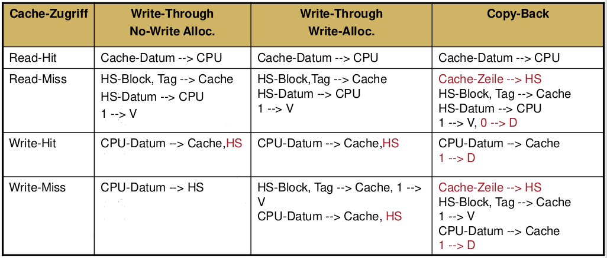

# Rechnerstrukturen
Wort:
* Strukturlehre + Hilfsmittel
* Rechenanlagen entwerfen, beschreiben, vergleichen, bewerten, verbesser
* Betrachtet Ganzes (Anlage), Teile (Komponenten), Verbindungen (Globalstruktur, Infrastruktur)

Rechner architektur nach Amdahl, Blaauw, Brooks:
* Aus Sicht des Programmierers: ISA, OpCodes,...
* Keine Harwaredetails, nur Konzepte

|Software|Rechnerarchitektur|Hardware|
|---|---|---|
|Apps, Libs, OS|ISA, Rechnerorga|Schaltkreise (Boolsch), Halbleiter-E-Tech|

## Einführung

### Zielsetzungen, Herstellungskosten
* Leistung (z.B. bei Floatingpoint-Arithmetik)
* Preis
* Effizienz
* Programmierbarkeit (z.B. Echtzeit)
* Zuverlässigkeit  
  Bewertung mittels stochastischer Verfahren
  * Fehlerwahrscheinlichkeit
  * Überlebenswahrscheinlichkeit
  * Mittlere Lebensdauer
  * Ausfallrate
* Verfügbarkeit
* Verfügbare Technologie

* α: Maß für die Komplexität des Herstellungsprozesses
  * 2006 Näherungswert für α = 4,0 (CMOS, mehrere Metalllagen)
* **ACHTUNG**: In der Übung ist `Die-Yield = Wafer-Yield * (1 + (Die-Fläche * Defekte pro Fläche) / α)`
* Gründe gegen größere Wafer: Längere Abkühlungszeit, längere Fertigungsdauer, Gewicht des Silizium-Kristalls...

### Entwurf von eingebetteten Systemen

* Top-Down
* Bottom-Up
* Automatische Synthese

#### VHDL
Workflow:
* Verhaltensverfeinerung
* Strukturverfeinerung
* Datenverfeinerung

* Interfaces: `ENTITY`
* Implementierung: `ARCHITECTURE`
  * `architecture <name> of <entity name> is`
* Blöcke zur konkreten Beschreibung eines Verhaltens: `PROCESS`
  `name : process(params)`
* Wertzuweisung durch `<=`
* `BEGIN ... END <(PROCESS?) name>`
* `IF ... END IF`

#### Physikalische Charakteristiken von ICs

*   
* 
* P_leakage: Bei Integrationsdichte kleiner als 100 nm nicht vernachlässigbar

Unter idealen Bedingungen:
* P ~ f
* P ~ V²_dd

Aber: Versorgungsspannung und Taktfrequenz sind keine voneinander unabhängige Größen: je geringer die Versorgungsspannung desto geringer die maximale Frequenz
* f ~ V_dd

Daher:
* **Kubus Regel: P ~ V³_dd oder P ~ f³**  
* **Übung: P ~ V²_dd * f**

Idealerweise ist auch E ~ f (Energie zu Takt).
Aber wegen p_static steigt der Energieverbraucht für eine Aufgabe bei sinkender Taktfrequenz

Frage: Warum erhöht man die Spannung zum Übertakten?  
Antwort:
* Taktflanken schneller steigen lassen
* Schnelleres Aufladen von Kondesator-Kapazität
* Nachteil: Spannung fließt quadratisch in Leistung ein
  * `P_switching = C_eff ∗ U² ∗ f`

#### Schaltverhalten
Schaltwahrscheinlichkeit:
* WS, dass sich die Ausgabe einer Schaltung bei Wechsel der Eingangssignale ändert
* `P_Schalt = 2 * P(1) ∗ P(0)`

### Bewertung der Leistungsfähigkeit
* Antwortzeit (response time) bzw Ausführungszeit (execution time)
  * Braucht weniger Zeit für einen Job
* Speedup B gegenüber A (B ist n mal schneller als A): t(A)/t(B)
* Durchsatz (throughput)
  * Erledigt mehr Jobs pro Zeit
* CPU-Zeit
  * User vs. System CPU Zeit

**Verfahren**
* Benchmarken
* Hardwareparameter
* Theoretische Verfahren
  * Vergleichbar mit O-Kalkül für Algorithmen
* Feldtests

**Maßzahlen**
* CPI (clock cycles per instruction): Mittlere Anzahl der Taktzyklen pro Befehl
  
* IPC (instructions per cycle): IPC = 1 / CPI
* MIPS (Mega Instructions per Second), MFLOPS (Mega Floating Ops per Second)
  * Probleme:
    * Variiert je nach Benchmark
    * Abhängigkeit von ISA und ausgeführter Befehlssequenz
    * Dedizierte Beschleuniger verfälschen Ergebnisse
    * oft nur best-case-Annahme: theoretische Maximalleistung
* MFLOPS: Mega Floatingpoint Operations Per Second
* SPECratio: siehe Benchmarks
* T_exe: CPU-Zeit der Ausführung

**Festplatten**
* Bedienzeit: Zugriffszeit + Übertragungszeit
* Maximaler Durchsatz: D_max = 1 / Bedienzeit
* Auslastung: D / D_max. In der Übung ist D = Anzahl von außen eingehender Aufträge/Sekunde
* Wartezeit: W = Q / D nach Gesetz von Little (Q = W * D)
* Reaktionszeit: Wartezeit + Bedienzeit

#### Benchmarks
* Standardisierung
* Gute Portierbarkeit
* Repräsentativ für typische Nutzung der Rechner
* Regelmäßige Aktualisierungen (CPU92, CPU95, CPU2000)
  * Laufzeiten werden zu kurz
  * Caches werden größer: größere Datensätze
  * Mehr Praxisnähe: Programme mit schlechterer Datenlokalität

SPEC (Standard Performance Evaluation Corporation):
* 3 Gruppen
  * Open Systems Group (OSG)
    * CPU: SPECmarks CPU Benchmarks
  * High Performance Group (HPG)
    * symmetrische Multiprozessorsysteme, Workstation Cluster, Parallelrechner mit verteiltem Speicher, Vektorrechner
  * Graphics and Workstation Performance Group (GWPG)
    * graphics and workstation performance benchmarks and reporting procedures
* SPEC CPU 2006
  * Referenzmaschine: "Ultra Enterprise 2 mit einem 296 MHz UltraSPARC II Prozessor
  * 
  * 

#### Hardwareparameter
**Monitore**
* Hardware
* Software
* Aufzeichnungstechniken:
  * Kontinuierlich oder sporadisch
  * Gesamtdatenaufzeichnung (Tracing)
  * Realzeitauswertung
  * Unabhängiger Auswertungslauf (Post Processing)
* Performance Counter
  * Beispiel Intel
    * Core:
      * Ausgeführte Befehle
      * Ausführungszeit in Takten,
      * Cache Treffer und Fehlzugriffe,
    * Uncore:
      * Anzahl der gelesenen Bytes vom
      * Speicher-Controller
      * Anzahl der geschriebenen Bytes in den Speicher-Controller
      * Datenverkehr über QPI Verbindungskanäle
  * Beispiel PAPI
    * API für den Zugriff auf Performance Counter
    * Herstellerunabhängig
    * Grundlage für eine Reihe von Werkzeugen für die Leistungsanalyse und Bewertung für Multiprozessoren

#### Modelltheoretische Verfahren
* oft nur minimaler Aufwand, aber dafür weniger aussagekräftig
* Warteschlangenmodelle
  * Leistungsanalyse von Rechensystemen
  * 
* Petrinetze
  * theoretische Untersuchungen
* Diagnosegraphen
  * Zuverlässigkeitsanalysen
* Netzwerkflussmodelle
  * Kapazitätsüberlegungen
* Simulation
  * Kompromiss bezgl. Genauigkeit, Kosten, Flexibilität, Kompexität
  * Simulatoren & Benchmarks
  * Simulatoren:
    * User-Level: Prozessorarchitektur wird simuliert, nicht Systemresourcen  
      
    * Full-System: CPU, IO, Disk, Netzwerk. Simulieren OS etc.  
      
    * Functional: Nur Funktionalität. Ausgangspunkt für komplexere Sims  
      
    * Zyklenakkurat: Details der Microarch. Blöcke => Parametrisierbar  
      
  * Prozessorsimulator: ISA auf anderem System simulieren für Benchmarkausführung
    * Trace-Driven: Zeichne alle Befehle auf einer ISA-kompatiblen CPU/Sim auf, evaluiere auf Cycle-accurate Sim
    * Execution-Driven: Alles muss genauestens simuliert werden. Ergebnisse dann besser

### Fehlertoleranz
* Zuverlässigkeit (Dependability):
  * Fähigkeit (Wahrscheinlichkeit) in bestimmter Dauer Funktion erbringen zu können
  * Ziel
* Fehlertoleranz (Fault Tolerance)
  * Fähigkeit mit fehlerhaften Subsystemen trotzdem Funktion erbringen zu können
  * Technik
* Sicherheit (Safety)
  * Gefahr für Menschen und Sachwerte
* Vertraulichkeit (Security)
  * Datenschutz, Zugangssicherheit
* Zuverlässigkeitskenngrößen
* Nutzeranforderungen
* Ausfall
* Sicherheitsrelevante Anwendung
* Nutzungsdauer

Fehler:
* Funktionsausfälle
* Fehlzustand (unzulässiger Zustand)
* Wirkungskette: Fehler -> Fehlzustand -> Ausfall
* Folgefehler

#### Klassifizierung
* Ursachen
  * Fehler beim Entwurf
  * Herstellungsfehler
  * Betriebsfehler
    * Störungsbedingte Fehler
    * Verschleißfehler
    * Störungsbedingte Fehler
    * Bedienfehler
    * Wartungsfehler
* Fehlerentstehungsort
  * Hardwarefehler
  * Softwarefehler
* Fehlerdauer
  * Temporäre Fehler
  * Permanente Fehler

#### Struktur-Funktions-Modell
* Gerichteter Graph: Knoten Funktionen, Kanten "benutzt"-Beziehung
* System = Komponentenmenge mit spezifizierten Interface nach außen
  * Subsystem = Systemteilmengen
* Schichtenmodell: Halbordnung "benutzt" von höheren nach niedrigeren Schichten. Disjunkte Schichten

#### Fehlermodell
* Binäre Fehlermodelle:
  * Fehlerzustandsfunktion: Z: S -> {wahr, falsch}
  * mit Zeitbegriff: Z(S, t) <=> Für alle t' <= t gilt Z(S, t')
  * Nichtredundantes System: Z(S) <=> Für alle Komponenten K € S gilt Z(K)
  * **Systemfunktion**: Wie sich Syztemzustand aus Komponenten ableitet
    * Nichtredundantes System: S = K1 /\ ... /\ Kn
  * Zuverlässigkeitsblockdiagramm
    * Eingangsknoten, Ausgangsknoten, dazwischen Systemfunktion (UND = Reihe, ODER = Parallel)
  * Fehlerbaum
    * Invertierte Systemfunktion
    * Blätter: Komponenten, Interne Knoten: Boolsche Operatoren
  * Fehlerbereich: Eine Komponententeilmenge, die gleichzeitig fehlerhaft sein kann ohne dass S fehlerhaft ist
    * Einzelfehlerbereich: Komponenten, die immer zusammen in einem Fehlerbereich liegen
    * Perfektionskern: Komponenten, die in keinem Fehlerbereich liegen

#### Ausfallverhalten
* Teilausfall
* Unterlassungsausfall
* Anhalteausfall
* Haftausfall
* Binärstellenausfall

Systemklassifizierung:
* Fail-stop-System: Nur Angalteausfälle
* Fail-silent-System: Nur Unterlassungsausfälle
* Fail-safe-System: Nur unkritische Ausfälle

#### Fehlereingrenzung
* Vertikal, hoch -> niedrig: Niedrige Schicht testet, meldet Fehler nach oben
* Vertikal, niedrig -> hoch: Hohe Schicht testet auf Plausibilität und Konsistenz. Erkennt nicht alles
* Vertikal, Hardware -> hoch: Fehlerkorrekturcode im Arbeitsspeicher
* Horizontal, lokale Schicht: Isolierung von Komponenten
* Horizontal, globale Schicht: Hauptproblem der Fehleringranzung. Komplizierte Verfahren notwendig

#### Anforderungen
* Hohe Überlebenswahrscheinlichkeit
* Hohe mittlere Lebensdauer
* Hohe Verfügbarkeit
* Hohe Sicherheitswahrscheinlichkeit
* Hohe Sicherheitsdauer

Erfüllung:
* Fehlervermeidung
* Fehlertoleranz

#### Gesichtspunkte bei Konstruktion
* Fehlervorgabe
* Menge der zu tolerierenden Fehler
  * Fehlerbereichsannahme
* Zeitredundanz
  * Garantierte Zeit ohne Neufehler nach Fehlerfall
* Fehlerbehandlungsdauer
  * muss kleiner als Zeitredundanz sein
* Zusätzlich:
  * **Nachweise** zur Fehlertoleranzfähigkeit
  * Geringer Betriebsmittelbedarf (Ersatzteil**kosten**)
  * Unverminderte **Leistung** durch Fehlertoleranzverfahren
  * **Transparenz** für Anwendungssoftware
  * Portabilität

#### Zuverlässigkeitskenngrößen / Stochastische Modelle
* Lebensdauer L
* Fehlerbehandlungsdauer B
* Sicherheitsdauer D

* MTTF – Mean Time to Failure
  * 
* MTBF – Mean Time between Failures
* MTTR – Mean Time to Repair/Recove
* Punktverfügbarkeit V  
  
  

  
  
  
  
Klar: Fehlerwahrscheinlichkeit geht gegen 1 für große t, Überlebenswahrscheinlichkeit gegen 0  
  
Ausfallrate hat "Badewannenkurve": Am Anfang viel, gegen Ende der Lebensdauer auch wieder viel  
  
  
Wobei L = Lebensdauer und B = Behandlungsdauer
  
  
  
  

* Dynamische Redundanz (dynamic redundancy)
  * Ungenutzte Redundanz: Inaktiv bis benötigt
  * Fremdgenutzte Redundanz: Übernehmen Aufgaben in anderem Subsystem bis benötigt
  * Gegenseitige Redundanz: Stehen sich gegenseitig zur Verfügung. Ermöglicht graceful degradation
* Statische Redundanz (static redundancy)
  * Beispiel: n-von-m Systeme (Ergebnis mehrheitlich entscheiden)
  * 

### Grundlagen der Parallelverarbeitung
* Nebenläufigkeit vs Pipelining
  * Pipelining: Überlappende abarbeitung von Objekten
* Ebenen
  * Programmebene
    * Ohne gemeinsame Daten
    * Wenig Kommunikation/Synchronisation
    * Vom OS organisiert
  * Prozessebene
    * Programm in Prozesse zerlegt
    * Mit eigenen Daten und vielen sequentiellen Befehlen
    * Synchronisation und Kommunikation
    * OS stellt Primitive zur Prozessverwaltung, Prozess-Synchronisation, Prozesskommunikation
  * Blockebene
    * Threads oder Ausführungsblöcke
  * Anweisungs- oder Befehlsebene
    * VLIW, Superskalar
    * Analysieren, Umordnen, Parallelisieren
  * Suboperationsebene
    * Durch Compiler
    * Vectorinstruktionen
* Granularität
  * Suboperationsebene: Fein, Programmebene: Grob
* 

#### Klassifizierung
* Flynn
  * SISD
  * SIMD
  * MISD
  * MIMD
* Prinzip der Virtualität
  * Weitgehend Transparente Architektur

## Parallelismus auf Maschinenbefehlsebene
### Pipelining
* Aufteilen von Instruktionen in Resourcennutzungsphasen
* RISC
* Logische Phasen:
  * IF: Befehl holen
  * ID: Befehl dekodieren
  * (Dispatch: Zuweisung an Ausführungseinheit)
  * EX: Befehl ausführen
  * MA: Speicherzugriff
  * WB: Zurückschreiben
    * (Alternativ: Complete + Retire)
* Beschleunigung: S = n * k / (k + n - 1)
* Pipeline-Konflikte (Pipeline Hazards, Pipeline-Hemmnisse)
  * Strukturkonflikte
  * Datenkonflikte
  * Steuerkonflikte
* Auflösungen von Konflikten:
  * Pipeline stall
  * Pipeline bubble
* Einschränkungen skalarer Pipelines
  * Obere Grenze des Durchsatzes => parallele Pipelines
  * Ineffiziente Pipeline => spezialisieren und diversifizieren
  * Pipeline Stall Strategie => Out of order
* In-Order und Out-of-Order Abschnitte
  * In-Order: Fetch, Decode, Dispatch, Retire
  * Out of order: Exe

### Nebenläufigkeit / Superskalarität
Statische Nebenläufigkeit: VLIW, EPIC
  * VLIW: Mehrere Instructions pro Befehl/auf einmal anstoßen

Dynamische Nebenläufigkeit:
* Sequentielle Befehle auf mehrere Verarbeitungseinheiten zugeordnet und ausgeführt
* Komponenten:
  * Befehlsholeinheit
  * Dekodiereinheit mit Register Renaming
  * Zuordnungseinheit
  * Verarbeitungseinheiten
  * Rückordnungseinheit
  * Register: Allzweck, Spezial & Multimedia
* Fetch-Phase:
  * Befehlsholpuffer
  * Befehlsbereitstellung: Laden Befehle in den Befehlsholpuffer je nach Sprungvorhersage
  * Verzweigungseinheit: Überwachung von Sprüngen. Spekulatives Holen. Roll-back
  * Jeder 5.- 7. Befehl ist bedingter Sprungbefehl

#### Brinkschulte / Ungerer

#### Fetch Phase: Branch Prediction
* Statisch:
  * Für Superskalar zu unflexibel und nicht geeignet
* Dynamisch:
  * Berücksichtigt Vorgeschichte, Programmverhalten
  * Während Verzögerungsphasen spekulativ Befehlen auffüllen
  * Sehr aufwändig
  * Prediktoren:
    * Branch Target Address Cache (BTAC)
    * Branch Target Buffer (BTB)
    * Branch History Table (BHT)
      * 2 Bit für:
        1. Strongly taken
        1. Weakly taken
        1. Weakly not taken
        1. Strongly not taken
      * Übergänge:
        * Saturation Scheme (Pfad vor und zurück)
        * Hysteresis Scheme: Von weak direkt ins "strong" Gegenteil (Vermeidet "Flattern" zwischen Weakly-Zuständen)
    * Unterscheidung: Sprungeigene Prediktoren oder globale Prediktoren
* Befehlsbereitstellungsbandbreite ~ Zuordnungsbandbreite
* CISC/IA32:
  * Grenzen der geholten Befehle bestimmen
  * Dekodierung
  * Generiere RISC-ähnlichen Operationen dynamisch

#### Decode Phase: Registerumbenennung
* Namensabhängigkeiten
  * Anti dependence: Lesen nach Schreiben (RAW)
  * Output dependence: 2 mal gleichen Ort schreiben
* Befehle in instruction window schreiben
  * Frei von Steuerflussabhängigkeiten (Sprungvorhersage)
  * Frei von Namensabhängigkeiten (Registerumbenennung)
* Dynamische Auflösung der Konflikte
* **Umordnungspuffer (Reservierungstabellen, reservation stations)**
* **Rückordnungspuffer (reorder buffer)**

#### Completion Phase
* Wenn Ergebnis bereitgestellt wird (Forwarding, Puffer)
* Bereinigung der Reservierungstabellen
* Zustand des Rückordnungspuffers updaten

#### Rückordnungsstufe (Retire)
* **Commitment:** Ergebnisse in Programmreihenfolge gültig machen / Rückschreiben aus Schattenregistern
  * Die Befehlsausführung ist vollständig
  * Alle vorausgehenden Befehle haben Bearbeitung beendet oder beenden ihre Bearbeitung im selben Takt.
  * Der Befehl hängt von keiner Spekulation ab.
  * Keine Unterbrechung ist vor oder während der Ausführung aufgetreten
* Forderung nach **Precise Interrupts**: Bei auftreten eines Interrupts flushen

#### Beispiel: Tomasulo (IBM 360/91)
* Reservation Stations
* Befehlsfenster
* Registerstatustabelle
* Rückordnungspuffer

**Aufgaben lösen**
* Wie viele Takte benötigen Aufgaben zur Ausführung?
* Wie viele Aufgaben können pro Takt zugeteilt werden?
* Welche Ausführungseinheiten hat der Prozessor?
* Wie viele Slots besitzt die jeweilige Queue pro Einheit?
* Wie viele Slots hat der Ergebnisbus?

### VLIW
* Compileraufgaben:
  * Frontend:
    * Lexikalische, syntaktische und semantische Analyse
  * Code-Generierung / Parallelisierung
    * Kontrollflussanalyse
    * Datenflussanalyse
    * Datenabhängigkeitsanalyse
  * Schleifenparallelisierung
    * Loop Unrolling
    * Software-Pipelining
  * Scheduling
    * Packen der voneinander unabhängigen Befehle in breite Befehlswörter
* Fallstudie TI TMS320C6400

### Multithreading
* Cycle-by-cycle Interleaving
  * Zwischen jedem Befehl wird nächster auszuführender Thread gewählt
  * Möglicherweise starke Verlangsamung von Threads
* Block Interleaving
  * Wechsel wenn Thread in Wartezustand verfällt
  * Nachteil Pipeline-Flush
* Simultaneous Multithreading
  * Mehrfache Kopien des Registersatzes (Mehrfach superskalarer Prozessor?)
  * Mehrere Befehlspuffern
  * Einzelgeschwindigkeit vs. Durchsatz

### Maßzahlen (Rechenaufgaben)
* Zykluszeit
  * Summe aller Stufen
  * Pipelining: Längste Stufe + Latenz des Pipelineregisters
* Ausführungszeit (in Takten): CPI * Zykluszeit
* Speed-Up: t_alt / t_neu
* Effizienz
* Parallele Ausführungszeit
* Parallelindex

## Multiprozessoren
* Modelle
  * UMA: Uniform Memory Access
    * Symmetrischer Multiprozessor (SMP)
  * NORMA No Remote Memory Access
    * z.B. Cluster
  * NUMA: Non-Uniform Memory Access
    * + CC-NUMA (Cache Coherent NUMA)
* Programmierung:
  * Modell, Spracherweiterung
  * Aufteilung und Synchronisation
* Parallelismus
  * Datenparallelismus
  * Funktionsparallelismus

### Nachrichtenorientiertes Programmiermodell (MPI)
* CREATE
* SEND
* RECEIVE
* BARRIER

### Shared-Memory-Programmiermodell
* CREATE
* G_MALLOC
* LOCK
* UNLOCK
* BARRIER
* WAIT_FOR_END
* WAIT_FOR_FLAG
* SET_FLAG

### Maßzahlen
* Parallelitätsprofil, Parallelitätsgrad: Wie viele Recheneinheiten gleichzeitig arbeiten über der Zeit
* Parallelindex I(n): Mittlerer Grad des Parallelismus
  * 
* P(n): Anzahl Einheitsoperationen zur Programmausführung auf n Kernen
* T(n): Ausführungszeit auf n Prozessoren in Schritten/Takten
* Speedup S(n) = T(1) / T(n)
* Effizienz: E(n) = S(n) / n
* Mehraufwand R(n) = P(1) / P(n)
* Auslastung U(n) = I(n) / n = R(n) * E(n) = P(n) / (n * T(n))

#### Gesetz von Amdahl

Speedup geht gegen 1/a für n -> unendlich

Superlinearer Speedup: Theoretisch nicht möglich, aber bei mehreren Knoten kann lokaler Cache plötzlich groß genug werden um drastische Vorteile zu erzielen.

**Weitere Probleme**:
* Overhead
* Deadlocks
* Bottlenecks

### Verbindungsstrukturen
**Latenz**
* Übertragungszeit: T_msg = Startzeit + Transferzeit
* Kanalverzögerung: 
* Schaltverzögerung, Routing-Verzögerung:
* Blockierungszeit (contention time): Delay durch andere Nachrichten.
  * Blockierung (contention): Blockierungsfrei gdw. 

**Kenngrößen**
* Durchsatz (bandwidth)
* Bisektionsbandbreite (bisection bandwidth)
* Durchmesser (diameter)
* Knoten-Verbindungsgrad (connectivity, node degree)
* Mittlere Distanz d_a (average distance)
* Komplexität oder Kosten
* Erweiterbarkeit
* Ausfallstoleranz oder Redundanz

PHIT (physical transfer unit): Einheit für übertragene Information per Link Zyklus
FLIT (flow control unit): Teil des Pakets, der der bei Blockierung aufgehalten wird

**Definition Verbindungsnetzwerk**
* Knoten
* Schaltelemente
* Link
* Nachricht
  * Adressierung:
    * Unicast
    * Multicast
    * Broadcast
  * Aufteilung in Pakete fester Länge
  * Aufbau:
    * Header
    * Error Code
    * Payload
* Datentransfer, Switching strategy
  * Durchschalte- oder Leitungsvermittlung (circuit switching): 1 Leitung für gesamte Kommunikationsdauer
  * Paketvermittlung (packet switching): Pakete mit Adresse und Daten durch das Netz
* Routing Algorithmus

#### Latenz- und Bandbreitenmodelle
* N_P: Bits im Payload
* N_E: Bits für Verwaltung im Paket
* L = Anzahl Schaltelemente
* R = Anzahl Netzwerkzyklen für Routingentscheidung
* Transmission time = Zykluszeit * Anzahl Phits
* Effektive Bandbreite: Paketgröße / max(Sender OH, Recv OH, Übertragungszeit)
* End-to-end packet latency model
  * Sender overhead
  * \+ Time of flight
  * \+ Transmission time
  * \+ Routing time
  * \+ Receiver overhead
  * (Switching time)?
  * (Channel delay)?
  * (Blocking time)?
* Circuit Switching
  * Routing time: L * R + time of flight = L * R + L
  * End-to-end Latency: Sender OH + ToF + transmission + routing + Recv OH
* Paketvermittlung (packet switching)
  * Store-and-forward-Modus
    * N: Zyklen die jedes Paket in einem Schaltelement verbringt
    * End-to-end packet latency: sender OH + L * N + N + L * R + recv OH
  * Cut-through switching-Modus
    * End-to-end packet latency: Sender OH + L + N + L * R + recv OH
  * Wormhole-routing-Modus

#### Topologie
* Statische Verbindungsnetze
  * Vollständige Verbindung: Kosten steigen quadratisch mit jedem Knoten
  * Gitter: 1D = Kette, Torus
  * Ring, unidirektional, bidirektional
    * Chordal: Extra Sehnen. Über Knotengrad parametrisierbar
  * Tree
    * Fat Tree
  * Hypercubes
* Dynamische Verbindungsnetzwerke
  * Bus
    * Busbandbreite = w * f (Anzahl Leitungen * Frequenz)
    * Split-Phase Busprotokollen
  * Kreuzschienen/Crossbars
  * Permutationsnetze
    * Einstufig
    * Mehrstufig
    * regulär
    * irregulär
    * Mischpermutation: Perfect Shuffle
      * Ergibt sich durch links-shiften der Adressen
    * Kreuzpermutation: Butterfly
    * Tauschpermutation: Butterfly
  * Omega Netzwerk
    * Konstruktion: Obere Hälfte der Leitungen geht auf obere Eingänge der nächsten Schicht
    Untere Hälfte der Leitungen auf auf untere Eingänge der nächsten Schicht  
    Also zwischen Leitungen aus der selben Hälfte wird immer ein Eingang der nächsten Verbindungsschicht geskippt
    * Routing: Bitweise von rechts nach links lesend, bei 0 nach oben, bei 1 nach unten

### Speicher

**Cache**
* Cache-Controller
* Inklusionseigenschaft
* Bestandteile
  * Cache-Line
  * Address Tag
  * Status Bit: Valid, Dirty
* Fehlzugriffe
  * read-miss
  * write-miss
  * Conflict-, Capacity-, Compulsory-Misses
* Organisation
  * Direct Mapped
  * Vollassoziativ
  8 k-fach satzassoziativ
* Befehls- vs. Datencache

* Probleme mit DMA (CPU lies altes aus dem Cache, DMA liest altes aus dem Hauptspeicher)
  * Lösung: Markiere Bereiche bei SPeicherverwaltung als nicht cacheable
  * Oder Cache Flush vor Lesezugriffen (mit write-back)
* Kohärenz:
  * definiert, welcher Wert bei einem Lesezugriff geliefert wird
  * Write Serialization: Speichermodifikationen werden immer in selber Reihenfolge gesehen
  * Migration
  * Replikation
  * Write-Invalidate Protokoll: Modifikationen *invalidieren* Kopien in anderen Caches
  * Write-Update Protokoll: Modifikationen *updaten* Kopien in anderen Caches
  * Hardware-seitig:
    * Tabellen-basierte Protokolle
    * Snooping-Protokolle (Bus überwachen)
* Konsistenz:
  * bestimmt, wann ein geschriebener Wert bei einem Lesezugriff geliefert wird
  * Konsistenzmodell

Warum lässt sich Cache schlecht skalieren?
* Mehr Fläche => geringere Ausbeute

#### MESI
ist ein Write-Invalidate Protokoll (im Gegensatz zu Write-Update Protokollen)

Für Kohärenz
* Modified
  * Bei Snoop-Hit (andere CPU liest Wert) muss der Wert in den gemeinsamen Hauptspeicher zurückgeschrieben werden
* Exclusive
  * Durch Write einfach nur nach M
* Shared
  * Schreiben führt zu M und sendet I-Signal an andere Kopien
* Invalid
  * Lesen und Schreiben ungültig
  * Übergang nach E oder S

=> 2 Bit pro Cache-Zeile

* Multiprozessor mit gemeinsamem Speicher: MESI
* Multiprozessor mit verteiltem gemeinsamem Speicher:
  * Keine Möglichkeit, die Broadcast-Eigenschaft des Busses zu nutzen
  * Verzeichnistabelle (directory tables)
  * SCI, SGI Origin, DASH

#### Konsistenz
Sequentielle Konsistenz
* Programmierer geht von sequentieller Konsistenz aus
* Führt aber zu sehr starken Einbußen bzgl. Implementierung und damit der Leistung
* Verbietet vorgezogene Ladeoperationen, nichtblockierende Caches

Schwache Konsistenz:
* Konsistenz wird nur an von Programmierer Spezifizierten Synchronisationspunkten gewährleistet
* Test and Set (TaS)

### Multiprozessor mit verteiltem Speicher
Messasge Passing
* Synchron
* Asynchron
  * Blockierend
  * Nicht-blockierend
  * Probe
* Sender-initiiert
* Empfänger-initiiert
* Hardware-support (Interrupt, DMA)

#### Fallstudie IBM Blue Gene/L
* 65536 Knoten
  * 9 DDR SDRAM chips
* 64 Racks
* 5 Netzwerke
  * 3D Torus
  * Collective Network
  * Low Latency Global Barrier and Interrupt
  * 10GBit Ethernet
  * Control Network
* Ausführungsmodi
  * Quad
  * Dual
  * SMP

#### SuperMUC
* Distributed Memory Architecture
* 18 Partitions ("Islands") mit je 512 Nodes
  * 2 Sandy Bridge-EP Intel Xeon E5-2680 8C pro Node
  * 2.7-3.5 GHz
  * 32GB RAM
* Inifiband
* 53 Mio€ + 19Mio€ für Hardware (32 + 29 Betrieb), 49 Mio€ für Gebäude

## Vektorverarbeitung
* Laden mit Stride (Stride Capability)
  * Stride aus General Purpose Register

### MMX
* Ersetzen meistens Schleifen
* Beispiel Chroma-Keying (Bluebox)
* Convoy: Sequenz von Vektorinstruktionen die unterschiedliche Ausführungseinheiten belegen und die deswegen parallel ausgeführt werden können
* Chime: Ausführungszeit für 1 Convoy
* Ausführungszeit:
  * Startup-Zeit S
  * Erstes Ergebnis bei t + S => n-tes Egebnis bei t + S + n - 1
* Memory Interleaving: Bei n Speicherbänken wird der Speicher virtuell abwechselnd über die Speicherbänke verteilt
  * Bei Stride von 1 Speedup von n, da von n angeforderten Werten jeder über eine eigene Bank bereitsgestellt wird 
* Verkettung (chaining): Da nach dem Startup pro Takt 1 Ergebnis fertig wird kann jedes davon direkt in die die Pipeline zur Ausführung der nächsten Vektorinstruktion geforwwarded werden
