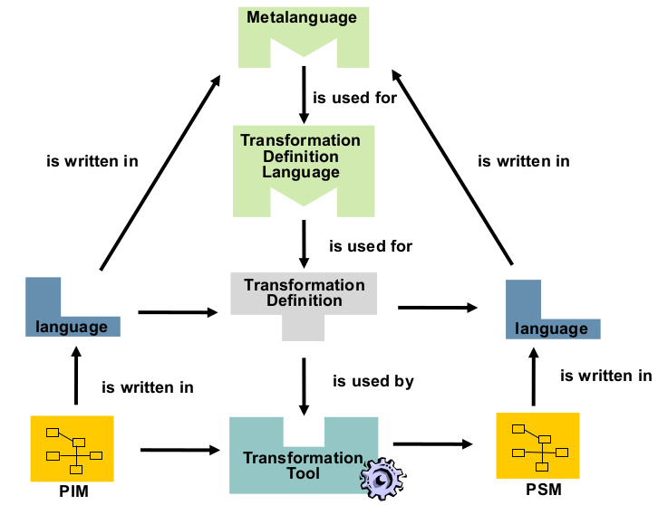

# SWT II

## Einleitung
Softwaretechnik (engl. software engineering) ist die Lehre von der Softwarekonstruktion: der systematischen Entwicklung und Pflege von Softwaresystemen

* Anforderungsermittlung
* Spezifikationen
  * Planung, Kostenschätzung
* Entwurf
* Pflege/Restauration/Reengineering
* Qualitätssicherung/Tests
* Prozessmanagement
  * Organisation von kleinen und großen Entwicklerteams

### Brook's law
> Adding manpower to a late software project makes it later (im Sinne der Verzögerung)

### Boehm's 1st law
> Errors more frequent during requirements and design (and more difficult to fix)

### Dijkstra's law
> Testing shows the presence, not the absence of bugs

### Lehman's 1st Law
> A system that is used will be changed

### Lehman's 2nd Law
> An evolving system increases its complexity unless work is done to reduce it

### Parnas' Law
> Only what is hidden can be changed without risk

Module sollen alles verstecken (vorher nur "klein und feste API")

### Boehm's Hypothese
> Project risks can be resolved or mitigated by addressing them early.

### Conway's law
> A system (usually) reflects the organizational structure that built it

### Law of Demeter
> Don't talk to strangers (auf module bezogen)

## Software Development Processes
### Code and Fix
* badly structured code
* non-systematic improvements
* no real team work, as tasks can not be planned
* missing design and documentation
* complications in maintenance
* => Development Processes!

### Components of a Process Model
* activities
* roles
* products/artifacts
* (sometimes) techniques and tools

### Waterfall (Wasserfall)
1. Planung
1. Definition
1. Entwurf
1. Implementierung
1. Test
1. Einsatz/Wartung

Problem (Frederick Brooks): Systeme nicht im voraus planbar.


### V-Model
Wasserfall + Tests für jede Phase  


### Iterativer Prozess
* Wasserfall mit Rücksprüngen (je nach Sprungziel)
  * Inkrementell (zu bestimmter Phase)
  * Evolutionär (ganz zurück)

### Spiral Model
Inkrementel und Evolutionär????


### Unified Process Model (UP)
* Soll sein:
  * iterative und incremental
  * risk-driven
  * client-driven
  * architecture-centric
* Nutzt vorige 3 Modelle als Bausteine
* 9 Disziplinen
* 
* 4 Phasen
  * Inception (Anfangsphase)
  * Elaboration (Ausarbeitung)
  * Construction (Konstruktion)
  * Transition (Übergabe)

### Rational Unified Process
* Konkrete Implementierung von UP bzgl.
  * Roles
  * Activities/Tasks
  * Artifacts/work products
* 6 best practices
  * Entwickle iterativ
  * Nutze Anforderungsmanagement (manage requirements)
  * Component-based Architecture
  * Modelliere visuell
  * Stell Qualität sicher
  * Kontrolliere Änderungen
* Sehr komplex

## Agile Development
### Motivation
Probleme traditionell:
* Too "heavyweight" processes
* Goßes Design im Vorfeld
* Unflexibel
* Zu viele Artefakte (Noise)

#### Manifest

|Agil|Sonst|
|---|---|
|Individuals/Interactions|Processes/Tools|
|Working Software|Comprehensive Docs|
|Customer Collaboration|Contract Negotiation|
|Responding to change|Following a Plan|

### XP
  
  
Nachteile:
* Kann nicht wiederholt werden
* Skaliert nicht: nicht anwendbar bei großen Projekten
* Keine Docs
* Kunde muss mitarbeiten
* Praktiken teils nicht empirisch belegt:
  * Pair Programming
* Schwer zu lernen
* Qualität wirklich besser?

### Scrum
"Agiles Framework"
* 3 Rollen
  * Product owner
    * represents the customer's interest
    * helps team to clarify questions (and quickly)
    * is responsible for the Team working on the right features
    * changes features and priorities before each sprint (if required)
    * accepts / declines the results
    * release management
    * return on investment (ROI) management
  * Scrum Master
    * removes impediments, buffers conflicts
    * secures that the Team can work productively
    * supports the communication between all stakeholders
    * protects the Team from outside world
    * secures the commitment to Scrum principles and values
  * Team member
    * estimates and commits itself to deliver the features
    * clarifies the sprint goal with the Product Owner and commits itself to it
    * supports the product owner in coarse-grained estimation of Product
    * Backlog items
* 4 Zeremonien
  * Sprint Planning Meeting
  * Daily Scrum
  * Sprint Review Meeting
  * Retrospective Meeting
* 3 Artefakte
  * Product Backlog
    * A high-level collection of all features, etc. prioritized by business value
    * A living document that can be changed any time
    * Priorisierte Feature List/User Stories
  * Sprint Backlog
    * contains requirements taken from product backlog (die mit denen das Team arbeiten will)
    * Priorisierte Burn-down Chart (TODO, IN PROGESS, FINISHED)
    * updated on a daily basis
  * Product Increment
* 3 Planungstypen:
  * Release-Planung, basierend auf Product Backlog
  * Sprint-Planung
    * Each activity must not take longer than roughly 16 hours
    * Only add activities as long as 85% of the net capacity of the team is not reached
  * Arbeitstag-Planung
* 30-Tage Iterationen
* Chicken roles:
  * Kunden
  * Manager

#### Große Projekte
* Brook's Law -> Späte Neuankömmlinge verringern Geschwindigkeit
* Klein Anfangen, natürlich wachsen (Teams splitten und Neulinge einführen)
* Minimiere Abhängigkeiten zwischen Teams
* "Scrum of Scrums": Daily Scrum mit Repräsentanten der Teams

#### Verteilte Projekte
* Am besten vermeiden
* Scrum Master nicht von Team trennen
* Am Anfang zusammen, danach erst Trennen
* Teams mischen von Zeit zu Zeit

#### Zusammenfassung
* No Silver Bullet
* Architektur/Design und Dokumentation schwach

## Requirements Engineering
Probleme:
* Requirements are missing
* Requirements are wrong or misunderstood
* Stakeholders are not involved

3 biggest risks: requirements are wrong, missing or changing

Probleme später beheben teurer: Faktor 10x pro Entwicklungsphase

### Definition Requirement
1. Zustand oder Fähigkeit, die ein Nutzer braucht, um ein Problem zu lösen/Ziel zu erreichen (*needed*)
1. Zustand oder Fähigkeit, die ein System braucht, um Vertrag, Standard, Spec oder andere Verträge zu erfüllen
1. ein Dokument, das 1. oder 2. festhält

Eigenschaften:
* Konsistent
* Eindeutig
* Verständlich
* Vollständig
* Passend / adequat
* Verifizierbar
* Umfang passt zum Risiko

Typen:
* Funktional
* Qualitativ
* Einschränkungen

### Prozess
* Gewinnung
* Dokumentation
* Übereinstimmung (Agreement)
* Validieren und verwalten

### Definition Stakeholder
* Person oder Organisation, die direkt oder indirekt die System-Requirements beeinflussen
  * Nutzer
  * Betreiber
  * Käufer/Sponsor/Auftraggeber
  * Devs oder SW-Architekten
  * Tester
* Müssen sehr genau identifiziert werden (fehlende Stakeholder kann zu fehlenden RE führen)

### Definition Requirements Engineer
* Vermittler zwischen Benutzern und Devs
* Muss ein Diplomat sein (Empathie, kommunikativ, konfliktlösend...)

### Requirement-Gewinnung
* Befragungstechniken
  * Interview
  * Fragebogen
  * On-Site Kunde
* Kreative Techniken
  * Brainstorming
  * Perspektivwechsel
  * Analogie
* Retrospektive Techniken
  * System-Archeologie
  * Wiederbenutzung (bzw. verwendung)
  * Konkurrenzprodukte
* Beobachtende Techniken
  * Feldbeobachtung
  * Anlernen
* Unterstützende und andere Techniken
  * Mind Maps
  * Workshops
  * Audio/Video Aufzeichnung
  * Use-Case Modellierung
  * User Stories
  * Personas
  * Prototypen

### Requirement Klassifikation
#### Concerns: Funktionale vs. nicht-funktionale Requirements
Concern: A concern is a matter of interest in a system.

  
  
  

|Form|Definition|Type of verification|
|---|---|---|
|Operational|Specification of operations or data|Review, test, formal verification|
|Quantitative|Specification of measurable qualities|Measurement|
|Qualitative|Specification of goals|Not directly possible: Stakeholder judgement or derived metrics|
|Declarative|Description of required feature|Review|

Achtung: Beachte Concerns wie in Baum-Grafik um Funktional/Nichtfunktional zu unterscheiden

#### Tips zum Schreiben
* Kurz, 1 Requirement pro Satz
* Kein passiv: Klar, wer was macht
* Schwache Wörter vermeiden (sollte, könnte...)
* Glossar
* Satztemplates

### Gewinnung
* Feature List
* User Stories
* Use cases

### Requirement Validation
> Am I building the right system?

VS.
> Am I building the system right (=> Verification)

* Inspections, Reviews, Walkthroughs
* Simulation
* Prototypen
* System Test Cases
* Model Checking (Formal?)


## Model driven Development
* Goals
  * better platform independence and interoperability
  * increased development speed with code generation
  * better software quality through working and analysing models
  * reuse MDSD infrastructure in SPL
  * optimized separation of concerns using different models (views)
  * better maintainability as redundancy avoided & technological change managed
  * manage complexity through abstraction
* Expected benefits
  * cost reduction
  * shorter time-to-market
  * variability through the use of software product lines
  * use of domain knowledge in models

### Idealized MDSD
* Programmierer werden nicht mehr benötigt
* Domain expert:
  * entwickelt Software
  * kennt die Geschäftsprozesse
  * benutzt "domain-specific modeling languages" (DSLs)
    * Software wird daraus generiert
  * hilft Bedingungen des Meta-Models festzulegen
* Technology expert:
  * bereitet "umgebung" (environment) vo
    * modeling platforms
    * transformations
    * meta-models

### Why use Models?
* increase analysability
* better cope with complexity
* be usable by domain experts
* increase communication efficiency
* provide an always consistent 

### Model-Based vs. Model-Driven
* Model-Based
  * models used as “secondary” or additional artefacts for –
    * documentation or communication
    * manual analyses and reasoning
* Model-Driven
  * models used as “primary” artefacts
  * inherent part of the developed system
  * cannot be omitted
  * explicitly specified, developed, versioned, etc.
  * adhere to strict specifications or metamodels

=> models werden automatisch verarbeitet (code generation, analysis)

### CIM, PIM, PSM
* Computation independent models
  * requirements for the system and its environment
* Platform Independent Models
* Platform Specific Models

=> Wird immer spezifischer / beinhaltet mehr Plattform-Details




### Meta-Model - Definition
 

### Object Constraint Language (OCL) - siehe SWT1
* Erweiterung von UML
* Ansatz: "design by contract"
  * invariants (1..* --- 0..*)
  * pre- and post-conditions
    * pre : -- none
    * post: result = 0
  * initial values
  * derivation
  * body definition
  * context ProgramPartner
  * guards

=> especially useful for meta-modelling

### Weitere Themen
* UML 2.0 4-Ebenen Hierarchie
* Domain Specific Languages (high level language, compiled to executable code)
* Transformationen
  * Model-2-Text
  * Model-2-Model
  * QVT (Query/View/Transformation)

TDOD: Eventuell nochmal genauer aufschreiben

### Tools
* Eclipse Modeling Framework
  * EMOF -> Ecore
* OCL
* XText
  * Xtend als Generator-Engine (Model-2-Text)
  * Templates

## Modellbasierte Anforderungsermittlung
* Beschreibt Anforderungen mit verschiedenen Modellen
* Beinhaltet:
  * Use Case Text
  * Use Case Diagram (Illustration)

### Blackbox-User Use Cases
* Systemgrenze / Scope
* System-Kontext
  * Relevante Umgebungsdetails
* Context-Grenze
  * Ab wo wird die Umgebung/Außenwelt irrelevant

### Scopes
* Business
* System
* Komponente

Unterscheidung nach black- und whitebox

### Elementary Business Process (EBP)
Zusammengesetzt aus:
* Aufgabe
* Person (ausführend)
* Zeit und Ort
* Motiviert durch Geschäftsereignis
* Welches messbaren Geschäftswert hat
* und Daten konsistent belässt

### Bewertung von User Goal Usecases
1. Boss-Test
  * Wie glücklich wäre Chef mit was ganzen Tag gemacht wurde?
1. Kaffeepausen-Test
  * Wann könnte man etwas für eine Kaffeepause unterbrechen?
1. Größen-Test

### Usecase-Ebenen
* Zusammenfassung (Summary)
* User Goal (= EBP)
* Subfunktion

  

`SUD`: System under Discussion
* Stakeholder
* Actor: Person außerhalb des Systems
* Primary Actor: Initiiert die Interaktion
* Use Case Model: Menge aller Use-Cases und Diagramme

### Finde Use Cases - Vorgehen:
1. Systemgrenze auswählen
1. Akteure bestimmen
1. Ziele der Akteure bestimmen
1. Usecases bestimmen, die Akteure befriedigen

Tipps: 
* Keine UI-Elemente in Usecases, 
* Präzision:
  1. Datenfeldname
  1. Name und Feldtyp
  1. Name, Typ und Validierung

### Iterative Verfeinerung
* Breite (z.b. zuerst brainstormin dann verfeinern)
* Zerteilen, Vereinigen (sub use cases)

### Fully dressed
1. Preface
  * Scope
  * Level
  * Primary Actor
1. Stakeholders und Interessen
1. Vorbedingungen
1. Nachbedingungen
1. Erfolgsszenario ("happy path" normaler erwarteter Fluss -> kein Branching)
1. Erweiterungen/Alternative Vorgehen
1. Sonderanforderungen
  * z.B. Touchscreen, i18n...
1. Technologie- und Datenvariationen

Außerdem in den Folien: Dokumentstruktur

### Anforderungs-Management
* Zentrales Repo
* Requirements verknüpfen
* Taggen für bessere Durchsuchbarkeit

=> Tolle Spezialtools

### Analyse
Analysis
* Emphasises an investigation of the problem and requirements
* Rather than a solution
* Do the right thing
* E.g. requirements analysis (investigation of the requirements)
* E.g. object-oriented analysis (investigation of the domain objects)

Design
* Emphasises a conceptual solution (in software and hardware )
* Rather than its implementation
* Do the thing right
* E.g. object-oriented design (designing the software objects)
* E.g. database design (designing the database schema)

### System Sequence Diagrams (SSD)
__TODO:__ Nicht direkt in den Folien aber wichtig da SSD vorkommt.. Neuschreiben? 
* System Boundary wieder wichtig
* System Events: external events that directly stimulate the software system
* System Operations: operations that the system as a black box offers
  * Definieren gemeinsam `public system interface`
* Descr:
  * List events to be handled by system
  * Define system interface as starting point for design


### Operation Contracts
* Beschreiben Systemoperationen im Detail
* Schema:
  * 
  * Postconditions:
    * Instanziierung und Löschung
    * Auf- und abgebaute Beziehungen/Verbindungen
    * Attributveraenderungen bzgl. Domain-Model Objekte
    * Deklarativ anstatt imperativ
    * Past-tense
    * Komische Theater-Metapher (Vorhang auf/zu quatsch...)
* Contracts vs. Use Cases: Use Cases sind sehr wichtig, aber Contracts koennen mit post-conditions mehr Komplexitaet beherrschen (contracts are useful when there is complexity)
* Vorgehen:
  * System Operationen identifizieren (von SSD)
  * Fuer solche, die komplex und subtil sind, mache Contract
  * Schreibe Post-Conditions wie oben beschrieben
* Descr:
  * If required state change of domain model is complex
  * More precise than trying to express this in use cases
  * Helps to uncover additional domain model attributes
  * Also useful for unexperienced team members


## Software Architektur
Problemstellungen:
* Wie wird dokumentiert?
* Was muss eingekauft werden?
* Wie wird mit bestehender Software umgegangen? (Einbindung, Anbindung)
* Wie wird mit bestehenden Daten umgegangen?
* Wie passt die SW in das Portfolio?
* Was wird wiederbenutzt?
* Was soll wiederbenutzbar werden?
* Ist eine Produktlinie angemessen für eine Plattform?

### Definition
* Ergebnis von Design-Entscheidungen
* Beinhaltet die Systemstruktur
  * Komponenten
  * Beziehungen
  * Abbildung auf Ausfuehrungsumgebung

### Structures, Views, and View Points
* View:
  * Architekturelemente und Relationen
  * Geschrieben und gelesen von Stakeholdern
  * SW Architelktur Dokumentation
* Structure:
  * SW-Elemente, die als SW oder HW existieren
  * = SW Architektur
* Viewpoint:
  * Gruppen von Views je nach Concern

=> SW-Architektur immer vorhanden, aber nicht immer dokumentiert und up-to-date

#### Views nach Kruchten
* Logical view
  * Funktionalitaet fuer Endnutzer
  * Class diagram, Communication diagram, Sequence diagram
* Development view (implementation view)
  * Programmierer-Perspektive
  * UML Component diagram, Package diagram, andere UML Diagramme
* Process view
  * runtime behaviour of the system
  * concurrency, distribution, integrators, performance, and scalability
  * Aktivitaetsdiagramm
* Physical view (deployment view)
  * system engineer's point of view
  * topology of software components on physical layer + connections
  * Deployment diagram
* Scenarios (use case view)
  * small set of use cases or scenarios
  * identify architectural elements
  * illustrate and validate the architecture design
  * starting point for tests of an architecture prototype

#### Palladio View-Points
* Structural: Statische Eigenschaften des Systems
  * `repository` view Type
  * `assembly` view Type
* Behavioral: Funktionale und extrafunktionale Systemsemantik, User behavior
  * Sequenzdiagramme
  * SEFF (?)
  * Usage models
* Deployment:
  * `allocation`
  * `environment`
  * `resource environment`

#### Views aus UP
* Logical
* Process
* Deployment
* Data
* Security
* Implementation
* Development
* Use Case

### Vorteile explizite Architektur
* Stakeholder communication
* System analysis
* Large-scale reuse
* Project Planning

Außerdem:
* come to a common vision

### Entscheidungen dokumentieren
* Record 
  * Influential factors
  * Decisions and why chosen
  * Alternative solutions and why not chosen
* Vor allem WARUM eine Entscheidung getroffen wurde
  * So that others can understand later
  * So that you can understand later
  * Be able to quickly recall reasoning later
    * During later design
    * During evolution
    * Do not loose time re-inventing the solution or even understanding the reasoning!

### Einfluesse auf die Architektur
* Anforderungen
  * __Quality Requirements__ wie z.B.
    * Performance
    * Security
    * Safety (z.b. Ausfallsicherheit)
    * Availability
    * Maintainability
    * Scalability
  * Koennen gegengerichtet sein: Balance!
* Wiederverwendbarkeit
  * Komponenten
  * Pattern
  * Architectural Pattern: crosses the boundaries of architectural elements (Domain Model, MVC)
    * domain/business logic
    * data sources and O/R mapping
    * (web) presentation and session handling
    * distribution and concurrency
  * Architectural Style (z.B. OO, modular)
    * eases system understanding, maintenance and evolution
    * Kommunikation (Service-Orientiert)
    * Struktur (OOP)
    * Deployment (z.B. Client/Server)
  * Reference Architecture
    * derived from a study of the application domain
* Organisation (Conway's law)

### The Logical Architecture
* large-scale organization of classes into packages and subsystems
* Haeufig in Ebenen unterteilt

### Architektur-Zeugs
#### Prinzipien
* Separation of concerns
* Single Reponsibility
* Information Hiding
* Priciple of least knowledge (don't talk to strangers)
* Don't repeat yourself
* Minimize upfront design

#### Layered (Reference) Architecture
Benefits:
* reduces "accidental" complexity
* improves modifiability
* clear separation of concerns
* independent exchangeability
* compatible to SOAs (Service-Oriented-Architecture)
* simplified testing

Drawbacks:
* usually increases the amount of classes
* through facades or data transfer objects
* however, these are patterns in their own right that help to better deal with complexity

Ebenen:
* UI (View)
* Application (Controller)
* Domain (Model)
  * Buendelt Applikations-spezifisches => Macht den Rest universeller
* Business Infrastructure
* Technical services
* Foundation

#### Package Diagrams
#### Facades
Viele Klassen in einem Paket/Ebene durch gemeinsames Interface buendeln/zentral organisieren

#### Observer


## Software Components (Component Based Software Engineering CBSE)
Definition:
* unit of composition
* contractually specified interfaces
* explicit context dependencies
* can be deployed independently
* subject to composition by third parties
 * without understanding its internals (often black box)

Warum sind Objekte keine Components?  
**=> Inheritance**

### Component Model
Wie mappt man das Componenten-Prinzip auf eine Programmiersprache?
* Was ist eine Komponente?
* Wie werden Dienste angeboten?
* Wie werden Componenten verknuepft/zusammengesetzt?
* Wie kommunizieren Componenten?
* Wie werden Componenten aufgefunden/gelistet?

Wichtige Teile:
* Plattform
* Framework
* Hilfswerkzeuge
* Repository
* Componenten

### Bestehende Standards
* CORBA, CCM, OMA, Java, JavaBeans, EJB, COM, OLE/ActiveX, COM+, .NET CLR
* Aehnlich: Late binding, encapsulation, interface inheritance
* Unterschiedlich: Memory management, evolution and versioning, ...

### OSGi (Open Service Gateway Initiative)
* basically JAR files defining a public interface via a manifest
* consumer bundles need to explicitly require services
* Eclipse integration

### Web Services
* self-contained (has api, hides information)
* self-describing (machine readable description)
* modular (composable to higher-level functionality)
* published (registered in registry)
* located (has global unique location)
* invoked (can be used using standard internet protocol)

#### Service-Oriented Architecture (SOA)
* 3 Rollen
  * service requestor
  * service provider
  * service broker (repository)
  


#### Core Web Service Technologies
* Simple Object Access Protocol `SOAP`
* Web Service Description Language `WSDL`
* Universal Description, Discovery and Integration `UDDI`


### Research-based Component Models
* SOFA
* ROBOCOP
* KobrA
* Palladio
  * performance prediction at design time
  * support of CBSE role model
  * mapping to EJB possible

#### Palladio Component Model (PCM)
* DSL
* early performance predictions
  * Alle Einfluesse werden explizit aufgefuehrt (Hardware, Nutzerzahl, Perf. von externen Abhaengigkeiten)
* Ganz dolle component-orientiert

### Palladio
* Designed to support independent developer roles

Modellierung ist wichtig fuer 
* Erweiterung von bestehenden Systemen
* Performance Predictions
* Analyse von Systemeigenschaften
* Simulation


Input:
* Usage
* Hardware
* External Dependencies
* Code

Output:
* Antwortzeit
* Durchsatz
* Resourcenausnutzung

#### Service Effect Specification (SEFF)
* Beschreibt nach aussen sichtbare Aktionen eines Komponenten-Dienstes
* Abstraktion des internen Verhaltens
* Beschreibt Relation zwischen angebotenen und angeforderten Koponenten
* Kann parametrisiert werden (nachtraegliches Variablenaendern)

#### Parametrisierung von
* Resourcen Umgebung
* Nutzungsverhalten

#### Aufgaben von Componenten-Entwicklern
PCM:
* Specifies components & interfaces
* Specifies data types
* Builds composite components
* Creates parameterised service effect specifications
* Stores modelling & implementation artefacts in repositories

Allgemein:
* Implements components
* Tests components
* Maintains components

#### System-Modell
* Modelliert die komponentenbasierte Architektur
* Benutzt Componenten von verschiedenen Repos
* Bietet eine Nutzerschnittstelle
* Verbindet und vereinfacht Dienste (z.B. durch weglassen)
* Ist Vorbedingung fuer den System-Deployer

#### Aufgaben von Software Architekten
* Spezifiziert die Architektur anhand von bestehenden Componenten/Schnittstellen
* Spezifiziert neue Componenten/Schnittstellen
* Benutzt Styles und Patterns
* Analysiert die Spezifikation und macht Design-Entscheidungen
* Macht Performance-Prediction
* Delegiert Implementierungsarbeit an Entwickler
* Leitet den Entwicklungsprozess

#### System Deployer
Resourcenbeschreibung:
* CPU, Netzwerk, HDD, RAM

Aufgaben:
* PCM:
  * Modelliert die Resourcenumgebung
  * Setzt sie auf

* Allgemein:
  * Modelliert Allokation von Componenten auf Umgebung
  * Deployt Componenten
  * Pflegt das laufende System

#### Nutzungsmodell -> Domaenenexperte
* Models user behaviour (z.B. Anzahl)

#### Abhaengigkeiten aufloesen


## Enterprise Application Architecture
Enterprise:
* software that supports businesses
* mainly about display, manipulation, storage of data
  * Persistent data
  * Large amount of data
  * Gleichzeitiger Datenzugriff
  * Verschiedene Anzeige-Bildschirme
  * An andere Systeme angebunden
  * "Conceptual dissonance" - Versdchiedenes Verständnis fuer gleiche Terme
  * Business "illogic"

Business Information Systems:
* support of business processes
* process business transactions and data

Beispiele:
* Web shop
  * Scalability, Performance
* Leasing Management System
  * Complexity, Maintainability
* Expense Tracking
  * Time to Market, Extensibility

### Ebenen der EA
* Presentation (front-end)
* Domain (Middle, Business)
* Data Source

### Domain Logic Patterns
#### Transaction Script
* Eigene Prozedur fuer jede Art von Request/Transaktion

Advantages:
* Simple procedures that developers understand
* Easy to connect to simple data sources
* Transaction boundaries are easy to determine
Problems:
* Does not scale well with complex logic
* Tends to have duplicate code then

#### Domain Model
Mischt Daten und Verhalten in einem OO-Modell

Advantages
* Better organizes complex domain logic

Problems
* Steeper learning curve if not familiar with OO
* Mapping to data source more complex

#### Table Module
Ein Modul (ein Objekt), dass alle Daten einer Tabelle verwaltet

Advantages
* Straightforward mapping to data

* Separates logic for different concepts
* Useful if used technology supports it (COM, .NET)

Problems
* No object instances: can be bad for complex logic

### Data Source Architectural Patterns
Wie bekommt man die Datenbank mit dem (OO-) Code kombiniert?

#### Record set (JDBC ResultSet)
* "in-memory representation of tabular data"
  * In-memory object that looks like the result of an SQL query, but
    * can be easily generated
    * and manipulated
  * by all other parts of the system
* Data Transaction Object (`DTO`)

Strongly typed record sets

#### Table Data Gateway
Gateway: "An object acts as a gateway to a database table. One instance
handles all the rows in the table."

Gateway vs. Facade:
Fac*ade:
* Facade simplifies a more complex API
* Usually done by the writer of the service for general use
Gateway: “An object that encapsulates access to an external system or resource”
* Idea similar to Façade
* But: Gateway is written by client for its particular use

#### Active Record
* "wraps one row in a database table or view, encapsulates the database access, and adds domain logic on that data"
* OO: Bringt Daten und Funktionalitaet zusammen
* "Active Record is a domain model object in which the classes match the database schema very closely"
* Good choice for very simple domain logic

Probleme:
* Vererbung
* Objekt-Relationen

#### Row Data Gateway
* Wie Active Record, aber Duplikate werden mittels Identity Map verhindert
* Code-Gen möglich (attraktiv)
* Nachteil: Bis zu 3 Datenrepraesentationen: Domain Model + Row Data Gateway + DB

#### Identity Map
"Ensure that each object gets loaded only once by keeping every loaded object in a map. Look up objects using the map when referring to them."

#### Data Mapper
> moves data between objects and database while keeping them independent of each other

* Herausforderung: Aggregationen und Vererbung mit relationalen DBs
  * => Object Schema + DB Schema
* Metadaten-Mapping (z.B. Annotationen) statt explizitem Code
* Nicht selber bauen


### Object-Relational structural Patterns
#### Single Table Inheritance
Bildet alles auf einzelne Tabelle ab

Pros
* simple database schema: only one table
* no joins required
* refactoring that moves fields up or down does not require database changes

Cons
* direct use of tables can be confusing because of unused fields
* tables can get very large
* many indexes & frequent locking => loss of performance
  * solution: introduce additional index tables
* only one namespace for all fields exists (Konventionen: z.B. CLASSNAME_FIELDNAME)

#### Class Table Inheritance
Eine Tabelle pro Klasse und Vererbungsklasse

Pros
* all columns are relevant for every row
  * tables are easier to understand
  * tables do not waste space
* easier to map a legacy, pre-existing schema using this strategy
* straightforward relationship between domain model and database schema

Cons
* loading an object in most cases means touching multiple tables
  * Joining multiple tables, multiple queries => Performance decreases
* refactoring: Moving fields up and down in the hierarchy implies changing the database schema
* supertypes can become bottlenecks
  * has to be accessed frequently
* high normalisation makes schema harder to understand

#### Concrete Table Inheritance
Nur nicht-abstrakte Klassen bekommen eigene Tabelle

Pros
* each table is self-contained; no irrelevant fields
  * useful, if applications directly access the database
* no joins required when reading from concrete mappers
  * concrete subclasses
* only local access to tables can increase performance
  * Each table is usually accessed by one domain object only

Cons
* refactoring: Pushing fields up / down required database schema changes
* changes of field of supertypes influence all subtype tables
* a find on the superclass forces to check all subclasses (subtables) or a complex join


## Software Design
* Wie wird Funktionalitaet auf Objekte gemappt?

### Responsibility Driven Design
* Echtwelt-Aufgaben auf die modellierten Instanzen uebertragen
* `doing` vs. `knowing` Responsibilities

Vorgehen:
* Beginne mit Operation Contracts um Objektinteraktionen zu bestimmen

### Agile Modeling
* Whiteboard (Interaktion mit anderen)

### Dynamic Design Model
* Interaction diagrams
* Kombiniere system operations/contracts + domain model + architectural guidelines

#### Design Class Diagram
* Typen von SW klassifizierbar
* specifications for software classes and interfaces in an application
* Beinhaltet
  * classes, associations and attributes
  * interfaces with their operations and constants
  * methods
  * attribute type information
  * navigability
  * dependencies

Vorgehen:
1. Teilnehmende Klassen identifizieren
1. Klassendiagramm malen
1. Adding Method Names
  * Durch analyse des Interaktionsdiagramms
  * Bennenung:
    * Create Operation?
    * Accessor/Mutator?
    * Collections?
    * Avoid Language-dependent Syntax
    
### Static Design Model
Kann von Dynamic Design Model abgeleitet werden

### General Responsibility Assignment Software Patterns (GRASP)
* (Information) Expert
  * Look for the object that has the information to do something
  * Wenn existent: Zuerst betrachten
  * Danach: Bestehendes erweitern
  * Sonst: Pure Fabrication oder Controller
* Creator: Choose an object C, such that –
  * C contains or aggregates X  
     i.e. X is a part of C
  * C closely uses X  
     i.e. C calls a lot of operations of X
  * C has the initializing data for X
* Controller
  * Behandelt System Event Nachrichten
  * Implementierung: Subsystem Facade oder pro Usecase 
* Low Coupling + High Cohesion
  * Verringere den Effekt, den Aenderungen auf System haben
  * High Coupling: Viele interagierende Klassen
  * Low Cohesion: Klasse macht viel zusammenhangsloses
* Polymorphism
  * Alternativen auf Typen basierend auswaehlen
  * ABER: Composition ueber Vererbung!(Verebung = whitebox)
* Pure Fabrication
  * Sich etwas kuenstlich aus den Fingern saugen, um fehlenden Verantwortlichen zu erschaffen
* Indirection
  * Wenn eine weitere Responsibility bei einem Expert zu Low Cohesion fuehrt, baue Mediator-Objekt ein
* Protected Variations (open/closed principle)
  * Basierend auf Parna's Law
  * information hiding
  * Polymorphismus
  * Interfaces
  * Law of Demeter: Don't talk to strangers
  * service lookup
  * use of reflection
  * use of standards such as SQL

## Clean Code
* elegant and efficient
* straightforward logic
* minimal dependencies
* does one thing well
* simple and direct
* reads like well-written prose
* never obscures the designer‘s intent
* easily enhancible by others
* code that has been taken care of

### Object-Oriented Design
=> siehe GRASP letztes Kapitel

### SOLID Principles
* `S`ingle Responsibility
  * each responsibility deals with one core concern
* `O`pen Closed
  * open for extension, but closed for modification
* `L`iskov Substitution Principle
  * Man muss mit abgeleiteten Klassen-Instanzen genauso gut klarkommen wie mit den original Super-Klassen
  * Verwandt: Design by Contract
* `I`nterface Segregation
  * Clients should not be forced to depend upon interfaces that they do not use
* `D`ependency Inversion
  * "Don't call us, we call you" (Observer Pattern)
  * Oder allgemeiner: Nicht direkt Referenzieren, sondern Interface bereitstellen, um den Referenzierten zu abstrahieren

Verschiedenes:
* Command-Query-Separation
  * Basic Bsp.: Getter und Setter
* Law of Demeter: Clean Apis, keine Innereien
* Boy Scout Rule
  * "Leave the campground cleaner than you found it"
  * Nicht am Code rumhacken, sondern clean erweitern
* Principle Of Least Surprise
  * Keine unerwarteten Seiteneffekte

### Code Conventions
* Naming
* Commenting
  * Erklaerend
  * Warnend
  * Informativ (z.B. TODO)
* Auskommentierten Code direkt löschen (Version Control)
* Formatting

### Don't Repeat Yourself
### Keep It Simple, Stupid (KISS)
### You Ain't Gonna Need It (YAGNI)
* Nichts Programmieren, was nicht in absehbarer Zeit notwendig ist
* Featurism

### Single Level of Abstraction (SLA)
* z.B.: Nicht in selber Methode wild zwischen Assembly und Dependency-Injection wechseln

### Clean Architecture Patterns
* Hexagonal Architecture
  * Ports and Adapterss
* Onion Architecture
* Boundary/Control/Entity (BCE)
  * Abwandlung von MVC

=> Allgemeines Ziel: Aufgabenaufteilung auf verschiedene Ebenen (Layer)

### The "Clean Architecture"


“The Dependency Rule”
  * Source code dependencies always point inwards
  * That rule applies even for Functions, Classes, Variables, Data formats

TODO: eventuell genauere erklärung der Schichten

### Refactoring
> If it stinks, change it.
> Refacor with tests only!

Bad smell: TODO: Lösungen eventuell hinzufügen (pdf 12 p. 48)
* __Long method__: having code blocks lead by comments
* __Duplicated code__
* __Feature envy__: class excessively calls another class’s methods
* __Data class__: class merely holds data
* __Large/God class__: class tries to do too much
* __Inappropriate intimacy__: class has dependencies on implementation details of another class
* ...

When to refactor?
*  when you find yourself looking up details frequently
    * what was the order of the method parameters again?
    * where was this method again and what does it do?
* when you feel the need to write a comment

## Real-time Development & Patterns
* Resultat nur korrekt, wenn funktionale und zeitliche Anforderungen eingehalten werden

Soft vs Hard real-time
* Soft: Degraded wenn nicht in korrekter Zeit
* Hard: Inkorrekt wenn nicht in korrekter Zeit

=> Definiert durch
* possible stimuli
  * periodic stimuli - occur at predictable intervals
  * aperiodoic stimuli - occur at unpredictable times
* expected responses
* timing constraints

* Interrupts vs. Periodische Prozesse
* Monitoring Systems vs. Control Systems vs. Data Acquisition Systems
* Sensor-Aktuator Schema

### RT-OS
Benoetigt
* real-time clock
* interrupt handler
* scheduler
* resource manager
* dispatcher (process execution)

Prozessmanagement:
* Interrupt level priority: Wer zuerst auf Event reagieren soll
* Clock level priority: Wer die meiste Rechenzeit bekommt

### Scheduling Strategien
Grobe Kategorisierungen:
* static vs dynamic
* non-preemptive vs pre-emptive
* mit/ohne statische/dynamische Priorities


Strategien:
* FIFO - dynamic, non pre-emptive, without priorities
* Fixed Priorities - dynamic, static priorities
* Earliest-Deadline First (EDF) - dynamic, dynamic priorities
* Least-Laxity-First (LLF) - dynamic, dynamic priorities
  * Laxity = deadline - now - remaining required CPU-time
* Time Slice Scheduling - dynamic, pre-emptive, without priorities


### JamaicaVM: Real-Time JVM
Java Probleme:
* Indeterministisches Thread starting -> Hard Real-time Execution
* garbage collection -> Real-time Garbage Collection
* JIT
* Sandboxing der Hardware

### System Design
* hardware software co-design
* simulation and prototyping

Prozess:
* Stimuli identifizieren
* Timing constraints
* Plattform waehlen
* Concurrent Processes
* Stimulus Processing entwerfen (State machines)
* Scheduling System entwerfen

### Thread vs. Process
* Hier gleichbedeutend benutzt - basic unit of concurrency in UML
* Arrival Pattern: Periodisch/Aperiodisch
* Ausfuehrungszeit: Worst case oder average

#### Kommunikation
* Shared Memory
  * hat Konistenzprobleme
* Messageing
  * Blocking vs. non-blocking send
  * Sync/Async receive

##### Petrinetze

##### UML Concurrency Modeling


### Dependability
* Verfuegbarkeit
* Verlaesslichkeit
* Versagens-Sicherheit (safety)
* Angreifer-Sicherheit (security)

Safety != Reliability: TODO: passt safety übersetung oben?
* Safety: Absence of danger for humans and environment
* Reliability: probability or duration of failure-free operation
* A fail-safe state is a state of the system where danger (for the
environment) can be excluded

Fehlerstufen
* Fault
  * defect in a system
  * Systematic vs. Random
  * Random: Transient (einfach nochmal probieren) vs. Persistent (Eingreifen noetig)
* Error
  * discrepancy between the intended behaviour of a system and its actual behaviour inside the system boundary
* Failure
  * instance in time when a system displays behaviour that is contrary to its specification

* Mit oder ohne Fail-Safe State

### Channel TODO: Channel bilder rausholen?
* A channel can be thought of as a pipe * that sequentially transforms data from an input value to an output value.
* Multiple channels to improve quality
  * __Performance__: throughput capacity can be increased by adding multiple homogeneous (identical) channels.
  * __Reliability__: multiple channels can operate in a variety of ways to achieve fault tolerance.
  * __Safety__: multiple channels can improve safety by adding fault identification and safety measures.

#### Protected Single Channel
* Mit Data Validation Unit koennen Fehler erkannt werden

#### Homogenous Redundancy (Switch to Backup)
* Faellt ein Channel aus, wird der andere benutzt

#### Triple Modular Redundancy
* Comparator der nach der Mehrheit entscheidet

#### Heterogeneous Redundancy
* independent design and implementation of versions

#### Monitor-Actuator
* Actuator Monitor Sensor um Aktuator-Zustand mit gegebenem Befehl zu vergleichen

#### Sanity Check
* Wie Monitor-Actuator, plus Ueberpruefung, ob Systemzustand sinnvoll

#### Watchdog
* Heartbeats von verschiedenen Komponenten

#### Safety Executive Pattern
* Watchdog + Safety-Coordinator + Safety-Measures + Safety-Policy
* Optional: Fail-Safe Processing Channel


## Reliability and Statistical Testing
* when to stop testing - possible criteria
  * time / budget - finish when nothing is left
  * coverage of code or usage model - how much coverage do you need?
  * all test cases are passed - resp. the number of known bugs is low enough
* Nach uebergabe durchschnittl. 3 bugs per 1000 LOC
* ~50% haben noch nichttriviale Fehler
* 7% von Fixes bringen neue Bugs
* Reliability = probability of failure-free operation
* Probability of failure on demand (`POFOD`)
* Rate of occurrence of failures (`ROCOF`)
* Mean time between failures (`MTBF`)
* Mission time: Zeit, in der System bereit fuer Eingaben sein sollte
* Availability = (MTBF/(MTBF+MTTR))

### Typen von Tests
* Functional testing
* Coverage testing
* Random testing
* Partition testing
* Statistical testing

### Testing is Sampling
Test-Modell
* Model for the expected operational use
* Test environment that simulates the operational environment
* Protocol for analysing the test data


k Fehler in n Tests
ß : confidence level
```
R = (n - k) / n    // Sampling reliability
p = 1 - n-th-root(1 - beta) = 1 - R // upper bound for the failure probability
```

* `k` Fehler in `n` Wiederholungen = `(n ueber k) R^(n-k) (1-R)^k` (Binomialverteilung)
* Konfidenz: Abstand zwischen 1 und 10 erfolgreichen Tests

### Voraussetzungen fuer statistische Tests
* Tests generated according to a probabilistic model
* any test run is statistically independent
* Outcome des Tests muss klar als "korrekt" oder "Fehlschlag" feststellbar sein

### Statistical Usage Model
* Markov-Kette

## Software Security
Goals
* Confidentiality
* Availability and integrity
* User authentication
* Traceability & auditing
* Monitoring
* Anonymity

Attacks
* network sniffers and proxies
* viruses and worms, Trojan horses, hacked download
* rootkits, port scanner
* insider attacks
* theft
* burglary
* social engineering attacks

### Security during Development Lifecycle
* Security is a quality requirement
  * consider security requirements as early as possible
  * software security management = risk management
    * typical trade-off decisions with
      * functionality
      * performance
      * usability
      * time-to-market and development costs
* Design for security
  * do not consider security as an afterthought
  * consider security in each phase of development
  * also secure your development environment!
* Security management at run-time: resiliance

### How to find Security Requirements
* Consider security goals (as listed before on slide 6)
* Try to find potential „Misuse Cases“ (based on use cases)
* Consider the system context
  * e.g. credit card data in the Internet vs. an Intranet
* Threat modelling with checklists


### Formulating Security Requirements
* identify what needs to be protected
* Generische Aussagen vermeiden ("es muss sicher sein")

### Prinzipien
* Secure the weakest link
* Practice defence in depth: Mehrere Sicherheitsmassnahmen hintereinander
* Fail Securly
* Secure by Default
* Least Privilege ("Need to Know" - Prinzip)
* No Security by Obscurity (Kerkhoff's Prinzip)
* Minimize Attack Surface
* Privileged Core - isolate code with security privileges
* Input Validation und Output Encoding
* Don't Mix Data and Code

### Pattern
* Federated Identity Management (LDAP)
* Falls doch passwoerter: Stark! Salted! Nicht bei Client validieren!
* Session handling bei Webapps

### Implementierung:
* Sich gut um kritischen Code kuemmern (dokumentieren, hohe Awareness, sicher Coden)

### Security Testing
* Focus on identified risks
* Code coverage metric
* Perform Code and system reviews
* Evaluate security in each phase resp. iteration
* Various sources for test cases
* Standard security testing environment to check basics (Port Scanner etc)
* Security experts check your system as black box or white box
* Fehlerdatenbanken fuer Dependencies ueberwachen
* Fuzzing

### Issues
* Race Conditions
  * Z.B. Abfrage, ob Partner abgesichert, dann schnell "entsichern", ungesichert arbeiten
* Buffer Overflows
  * Stack
  * Heap
* SQL Injection

### Kryptografie
* Confidentiality
* Integrity
* Authenticity
* Non-repudiability

### Encryption Types


### Pseudo Randomness
* cryptographically secure: Naechste Zahl nicht in polynomieller Zeit erratbar
* Sehr gute Seeds verwenden

## Continuous Integration (CI)
Probleme ohne CI:
* Software defects can pile up due to conflicting changes
* Large overhead, worst case: Roll back large set of changes
* Magical Machine: "It works on my machine!"

Def:
> team integrate their work frequently. Verified by automated build

### Prozess
Manual
1. Change code/development artefacts
1. Test locally
1. Commit change

Automated
1. Materialisation of dependencies
1. Compilation
1. Testing
  1. Functional testing
  1. Quality tests (performance, documentation/code coverage)
1. Bundling of deployment entities (e.g. WAR files for Java EE)
1. Provide meaningful developer feedback

Manual
* Fix broken builds immediately

Vorteile:
* Reduces risks
* Reduces repetitive manual processes
* Enables rapid deployment of software: Continuous Delivery
* Enables productive communication in development team

### Repo
* Version all relevant development artefacts
  * Code
  * Tests
  * Build-Automatisierung
  * Build Job Description
    * Fail early
  * Deployment Description
* Vermeide Duplikate => Parametrisierte Builds
* Aufteilen in kleinere Deployment Units fuer bessere Build-Performance
* Build für alle Environments
    * Private Build: Run by developer on local machine, used for local testing
    * Integration Build: Run on centralized server for integration testing
    * Release Build: Build deployed for internal testing or to production
* Continuous Feedback: Lavalampe

### Studie
Effect of CI on productivity
* Teams using CI are significantly more effective at merging pull requests of
  * core members
  * external contributors

Effect of CI on code quality
* Core developers discover significantly more bugs
* External contributors do not encounter more defects => CI does not negatively impact software quality

## Reviews
Reviews are meetings where a software artifact is examined

* Forms:
  * Inspection
  * Team Review
  * Walkthrough
  * Pair Programming
  * Pass-around, Ad-hoc review
* Reviews are almost a Silver Bullet
* But not often used:
  * consultants cannot make money out of it
  * increase of up-front costs
  * requires consideration of psychological factors

### Dangers
#### Dangers OF Reviews
* Testing is omitted
* Authors are frustrated or even feel violated

#### Dangers FOR Reviews
* Managers cut time if deadline approaches
* People are not well prepared (waste of time)
* Obfuscation: Authors tend to protect themselves by tricky code or documents that are difficult to understand

### Benefits
* Quality, correctness
* Improved understanding on project
* Teaching of style and experience to novices
* Better readability

### Phases
1. Planning
1. Overview
1. Preparation
1. Meeting
1. Rework
1. Follow-Up
1. Causal Analysis

<!--### Patterns
* alcoholic
* „now-I-have-got-you“
* „see-what-you-made-to-me“-->

## Cloud Computing & Cloud Architecture
### Multi-Tenancy and Partitioning
* Isolation of workloads
* Separation of customers
* Customers gain administrative privileges

### Virtualization
* Abstract view rather than physical view on infrastructure
* Hypervisor = control program
* Partitioning: Multiple OS on single server
* Isolation: No side effects between

__Paravirtualization__: No emulated HW layer, but guest OS use hyper call (hypervisor interface calls)

Advantages Virtualization:
* Consolidation: Improved energy efficiency
* Availability
* Quality of Service (QoS)
  * Service Level Agreements (SLA)
* Overbooking of resources (Thin provisioning)
* Logical view on resource pools improves management
  * Capacity management rather than infrastructure management
  * Automation of infrastructure operation and service delivery
* Almost no performance penalty with current technology

### Conceptual View


* Delivery Models:
  * Infrastructure as a Service (IaaS)
  * Platform as a Service (PaaS)
  * Software as a Service (SaaS)
* Deployment Models
  * __Private cloud__: Customer and provider belong to the same organization
  * __Public cloud__: Customer and provider belong to different organizations
  * __Hybrid cloud__: Combination of private and public cloud
  * (Community cloud: Stakeholders share resources to achieve common goal)

### Tenancy


### MapReduce


### Principles of Cloud Architecture - TODO: kürzen
* __Decentralization__: Use fully decentralized techniques to remove scaling bottlenecks and single points of failure.
* __Asynchrony__: The system makes progress under all circumstances.
* __Autonomy__: components make decisions based on local information.
* __Local responsibility__: Each individual component is responsible for achieving its consistency
* __Controlled concurrency__: Operations are designed such that no or limited concurrency control is required.
* __Failure tolerant__: The system considers the failure of components to be a normal mode of operation, and continues operation with no or minimal interruption.
* __Controlled parallelism__: Abstractions used in the system are of such granularity that parallelism can be used to improve performance and robustness of recovery or the introduction of new nodes.
* Decompose into small well-understood __building blocks__
* __Symmetry__: Nodes in the system are identical in terms of functionality, and require no or minimal node-specific configuration to function.
* __Simplicity__: The system should be made as simple as possible (but no simpler).

## Software Evolution
### Software change
* Corrective - 65%
  * Implement new / changed requirements
* Adaptive change - 18%
  * Switch platform (hardware + software)
  * Replace external libraries
* Corrective change - 17%

Factors:
* Internal factors
* Technological factors
* External factors

#### Declining Quality:
"Repeated changes inevitably degrade original design unless additional effort is invested to prevent this"

Symptoms:
* Limited understanding of the system
* Outdated documentation
* Longer development cycles
* Higher frequency of bugs and longer fix times
* Design and code fragility
* Code smells
* Longer build times
* Missing code documentation
* Missing or incomplete tests

### Software evolution
* Software maintenance is the process of changing a system after it has been delivered
* Evolution = development + maintenance

Maintenance Costs:
* Understanding - 47%
* Testing - 28%
* Coding -  19%
* Documenting - 6%

Factors:
* Software age
* Developer skills and experience
* Maintenance team stability

#### Legacy Systems
"A legacy system is a valuable piece of software, maintained over a long period of time, typically not by the original developers"

#### Process
Iterative:
* Change management
* Change impact analysis
* Reengineering
* Software modernization
* Software quality assurance
* Quality impact analysis

#### QUaöity Assurance
"Software quality assurance is the process of detecting and correcting design problems preventing the cost-effective maintenance of the system"

### Evolution supporting design
"Software design is the process of planning a software solution for a problem in a given context, in order to manage system complexity and facilitate reuse"

#### Modularity
Meyer's five criteria:
* Decomposability of the problem into sub-problems
* Composability of modules to produce new systems
* Understandability of a module in isolation
* Continuity - small changes have localized effects
* Protection - fault isolation

Meyer's Rules for Modularity:
* Direct Mapping - Structure of the solution should mirror the structure of the problem
* Few Interfaces - Modules should communicate with as few others as possible
* Small Interfaces (weak coupling) - Modules should exchange as little information as possible
* Explicit Interfaces - Modules should use only obvious means of communication
* Information Hiding - Modules should expose only a subset of their properties to client modules

TODO: Überarbeiten und letzte folien hinzufügen