# Textindizierung
## Suffix Array
* Suffixe werden durch Position im Text markiert ($ ist also letzte Stelle)

## Trie
Baum, wo Aeste ein konkretes Suffix/Praefix repraesentieren

## FM-Index
* BWT
* right-to-left matching
* Existence und Count Queries in O(m log sigma)

## Backward Search
* C-Array
* BWT (bzw. WT ueber BWT)
* Prinzip:
  1. Finde SA-Intervall fuer letztes Zeichen via C
  1. Finde mittels BWT, wie viele Elemente des Intervalls das "korrekte" naechste Zeichen haben
  1. Schaue ausserdem, wie viele "korrekte" naechste Zeichen ausserhalb des Intervalls vorkommen. Diese bilden lexikografisch kleinere Suffixe
  1. Mit den Informationen aus 2. und 3. verschiebe das Intervall auf C\[naechstes Zeichen\] + rank(naechstes Zeichen ausserhalb Intervall) bis Anzahl Vorkommen
  1. Mache weiter bei 2. so lange es noch weitere naechste Zeichen gibt
* |query| * Zeit(LF) Komplexitaet

## BWT
* Der Buchstabe, mit dem ein Suffix weiter gehen wuerde im Text

## Rank mit Wavelet Trees
* 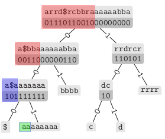
* Zeit: log(n)
* Benoetigt aber konstanten `rank` ueber Bitvektoren
  * Zerteile in `log(n) * log(n) ` Superblocks
  * Speichere zu jedem Superblock die Summe aller 1en bis zum Blockanfang (in `log n` Bits)
  * Zerteile Superblocks in Bloecke der Groesse `1/2 log(n)`
    * Klein genug, um fuer jeden Wert rank-Wert vorzuspeichern (Four Russioans Trick)
  * Speichere zu jedem Block die Summe aller 1en bis zum Blockanfang (in `log(log(n) * log(n)) = 2log(log(n))` Bits) in Superblock
  * => Konstanter Zugriff ueber Superblock-Prevbits + Block-Prevbits + In-Block-Prevbits
  * => n / log(n) + n log(log(n)) / log(n) + sqrt(n)log(n)log(log(n)) Bits = o(n) Bits

### Self-Index / LF Funktion
* Self Index: Text kann wieder hergestellt werden
* LF-Funktion: Gibt vorheriges Suffix (Position) im Text zurueck fuer Element in SA
* => Zusammen mit BWT kann Text wiederhergestellt werden

## Weitere Funktionen
* Psi: Naechstes Suffix in Text zu SA-Position
* F: Erster Buchstabe des Suffixes
* ISA: SA-Position -> Textposition
* LF und Psi mit SA und ISA ausdrueckbar

## Elias Fano Coding
* Fuer aufsteigenede Folgen
* Zugriff in konstanter Zeit
* Z.B. zum Komprimieren von allgemeinen Bitvektoren (speichere n, Anzahl 1-Bits undkomprimierte Folge, wo 1en stehen) (`sd_vector`)
* Low Part und High part
* 2*n + n * log(sigma/n) + o(n) Bits
* Gap-Encode 
* 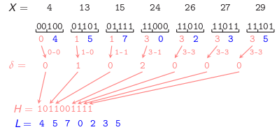
* Gute Eigenschaften beweisbar ueber maximale Anzahl von Anstiegen im High-Part

## Komprimierter Index
* Psi-basiertes CSA
  * Psi besteht aus mehreren Teilsequenzen, die jeweils aufsteigend sind

## H0-komprimierte Bitvektoren
* `rrr_vector`
* Bloecke mit 1/2 log(n) Bits
* Identifieziere Block ueber Anzahl gesetzter Bits und Identifier fuer genaue Permutation

### On-the-Fly Block Dekodierung
* Kombinatorisches Zahlensystem (Pascal'sches Dreieck)


## Inverted Index
* Mehrere Dokumente
* Ziel: Queries mit Term, die Tupel zurueckliefert (Dokument, Anzahl Vorkommen)
* Teile:
  * Dokumente zusammenkonkateniert (#)
  * Elias-Fano Bitvektor mit Dokument-Ids

### Greedy Framework
* Single-Term Queries
* Space: O(n log n)
* Optimale Anfrage-Zeit
* Finde Vorkommen-Intervall ueber Backward Search
* WT ueber Dokument-Array
* Suche nach Top-K Dokumenten ueber Priority Queue beim Absteigen des Baums
* 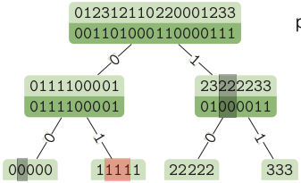
* WICHTIG: Expand laeuft in konstanter Zeit

#### Document Frequency, Repetition Array
* 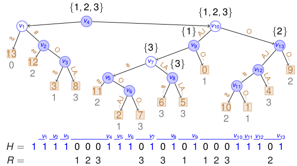
* ID: index of the rightmost leaf in the subtree of v's leftmost child plus one
* 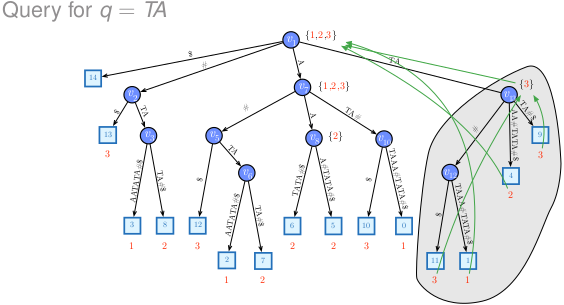
* (x,y): 
  * x = Pointer werden von links nach rechts durchnummeriert
  * y = Tiefe der Ziel-Node
* 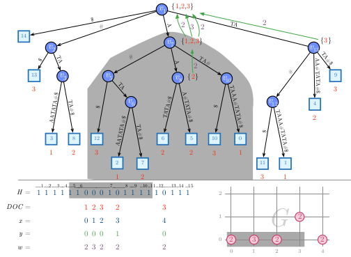

#### K2 Treap
* 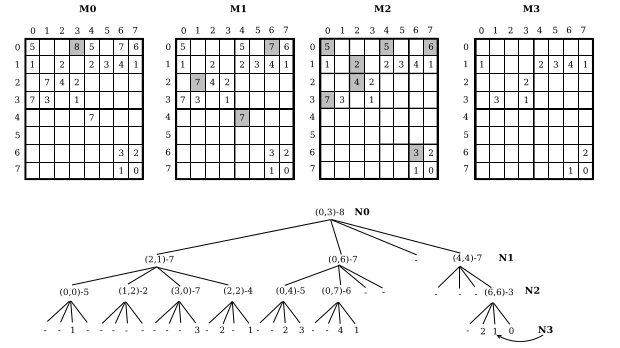

## Range counting using WT
* Probleme: Report query und count query
* Count: O(log n) Zeit, n log n + o(n log n) Bits
* Report: O(log n + occurrences * log n) Zeit
* Operationen: `expand`, `y_range(node)`

### WT ueber grossen Alphabeten
* Pointer schlecht
* 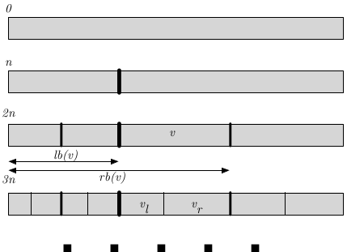

### Anwendungen
* Position restricted substring searching
* Substring rank and select
* Pattern matching with a fixed length gap

## Top-k Range Report Queries
* Suche k Punkte in 2D-Bereich (x0,x1)(y0,y1), sortiert nach Gewicht
* 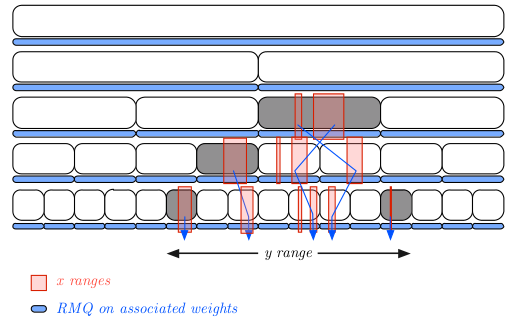

## Suffix Trees
* Suffix Array
* LCP Array
* Baum-Topologie

### LCP Array
* Linear Time Calculation:
  * Nutze SA \[ISA\[i\]\]
  * Irgendwie nicht wirklich linear?
```
LCP [ 0 ] ← 0
LCP [ n ] ← -1
l ← 0
for i ← 0 to n − 1 do
  j ← SA [( ISA [ i ] − 1 ) mod n ]
  while T [ i + l] = T [ j + l] do
    l ← l + 1
  LCP [ ISA [ i ]] ← l
  l ← max ( 0 , l - 1 )
```

* Platzsparende Darstellung
  * Permutiertes LCP (LCP in Text-Order)
    * PLCP\[i+1\] >= PLCP\[i\] - 1
  * CSA

## LCP Interval Tree
* 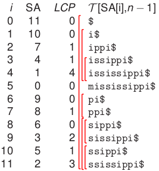
* Previous smaller value `psv`, next smaller value `nsv`

## Balanced Parentheses Sequence
* 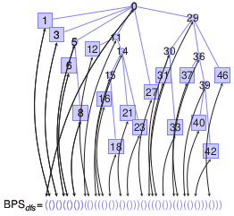
* Ops:
  * `excess(i)`: Wie viele noch nicht geschlossene Klammern links existieren (rank(0) - rank(1))
  * `find_close(i)`
  * `find_open(i)`
  * `enclose(i)`: Die umschliessende oeffnende Klammer
  * `double_enclose(i, j)`: Das i und j gemeinsam umschliessende Klammerpaar (common ancestor)
* Konstante Zeit `find_close`
  * 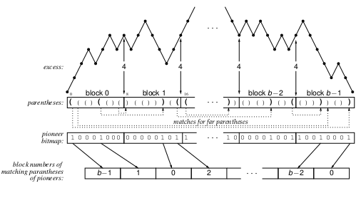
  * Bloecke: log(sqrt(n)) = 1/2 log(n)
  * Pioneer: Far (schliesst nicht in selbem Block) und kein anderer in selbem Open-Block, der in selbem Close-Block schliesst
  * Alle Komponenten:
    * Pioneer-Bitvektor mit rank/select
    * Mapping Pioneer -> Ziel-Block
    * 
  * Sparse uniform Bitvector: O(n log(log(n))/log(n)) = o(n)

## Super-Cartesian Tree
* Fuer jedes Feld eine aufgehende Klammer
* Fuer jedes mal, wenn der Wert absteigt, eine schliessende Klammer
* Zum Schluss schliessende Klammern auffuellen, bis balanciert

## LZ Factorization
* Darstellung: Tupel (char, 0) (neuer Buchstabe) oder (position, length) von vorherigem Vorkommen von fehlendem Text
* Longest previous String (`LPS`) und previous Occurrence (`prevOcc`)
* 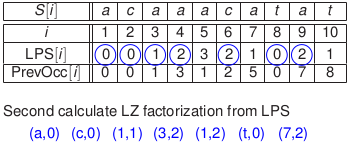
* Berechnung LPS (1)
  * Ist Permutation von `LCP`
  * Mit `NSV` und `PSV` kann man die im SA am naechsten liegenden *vorausgegangenen* Suffixe finden
  * Eins von den beiden Suffixen hat dann die *maximalere*  gemeinsame Prefix-Laenge
* Berechnung LPS (2)
  * Peak Elimination:
  * 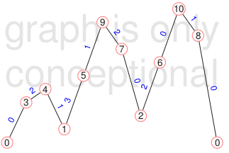
  * Schnell: Abwechselnd Topologie aufbauen (`set`) und Peaks eliminieren (`permute`)

## SA-Aufbau
### LS: Larsson, Sadakane
* Sortiere Buchstaben fuer Buchstaben immer in Buckets ein, bis die Buckets nur noch 1 klein sind.
* Irgendwie wird da noch ISA mit aufgebaut bei?

### DC3: Kaerkaeinen, Sanders
* Difference Cover von N: Menge, wo immer 2 Elemente subtrahiert mod N den ganzen Zahlenbereich bis N darstellen
  * Bsp: D(3) = {1,2}, denn 0 = 1-1, 1 = 2-1, 2 = -1 % 3 = 1-2

Vorgehen:
1. In Tripel teilen, sowohl fuer i%3 = 1 und 2
2. Tripel sortieren
3. Auf sortierter Folge equal-Folge erstellen (0 fuer gleich, 1 ungleich)
4. Prefix Summen-Folge ueber equal-Folge erstellen
5. Prefix-Summenfolge wieder auf Tripel-Ordnung umpermutieren => R Folge
6. SA(R) ist das Suffix Array von R (logischerweise), dazu noch ISA(R)

### Induzieren
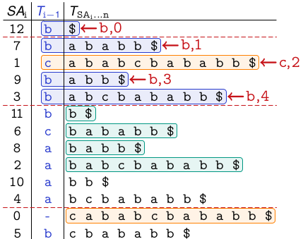

### SAIS

## External Memory Model
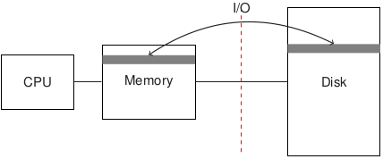  
Cost model: Only I/Os (block moves between main memory and disk) are counted.

### String B Tree
* combination of B-trees and Patrica tries
* 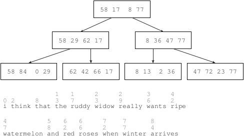
